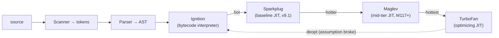

> Format note: this chapter is the worked example of the teaching style in
> `PROJECT_INSTRUCTIONS.md`. Every later chapter copies this shape.

---

## Learning Objectives

By the end of this chapter you should be able to reason from first principles about:

1. **Why** a runtime needs an *execution context* at all — what breaks without it.
2. Why memory is split into a **call stack** and a **heap**, and what lives where.
3. The difference between **primitive (by-value)** and **reference (by-reference)** bindings,
   at the memory level — not as a rule, but as a consequence of the two-region model.
4. The **scope chain** as a lookup mechanism the engine builds, not magic.
5. **Closures** as a memory-lifetime consequence: why an inner function keeps a variable
   alive after its outer function has already returned and its stack frame is gone.

These five models are the foundation. Chapter 2 (event loop) assumes all of them.

---

## Key Mental Models

- **An execution context is a bookkeeping record.** The engine cannot "just run code" — it
  needs to know *which variables are visible, what `this` is, and where to return to*. That
  record is the execution context.
- **Stack = ordered, short-lived, known-size frames. Heap = unordered, long-lived, dynamic
  objects.** Their lifetimes differ, so they live in different regions.
- **Variables hold either a value or an address.** Primitives hold the value directly;
  objects hold an address pointing into the heap. Every "copy" question reduces to: *did we
  copy the value or the address?*
- **The scope chain is a chain of references to parent contexts**, fixed at definition time
  (lexical), resolved at lookup time.
- **A closure is just a function plus a live reference to a scope that would otherwise have
  been garbage-collected.** Nothing more mysterious than that.

---

## Introduction

You already write JavaScript daily. This chapter is not about syntax. It is about building
the *machine model* in your head — the model the V8/JavaScriptCore engineers actually
implemented — so that closures, `this`, async, hoisting, and (later) React's hook system
stop being a list of rules and become *predictions you can derive*.

We build strictly bottom-up. Every later chapter (event loop, Fiber, hooks, stale closures)
is a re-application of the models below. Get these right and the rest is downhill.

---

## Problem

Start with the problem, never the definition.

**Problem 1 — running nested function calls.**
Consider what the engine must physically do here:

```js
function a() { return b() + 1; }
function b() { return c() + 1; }
function c() { return 1; }
a();
```

When `a` calls `b`, the engine must *pause* `a`, remember "when `b` finishes, come back to
the `+ 1` in `a`", run `b`, and so on. It needs somewhere to store:

- where to resume each paused function (the **return address**),
- each call's own local variables (`a`'s locals must not clobber `b`'s).

It needs a **last-in, first-out** structure: the most recently called function is the first
to finish. That structure is the **call stack**. The per-call record pushed onto it is an
**execution context** (a.k.a. stack frame).

> Why existing solutions failed: a flat, single set of variables (like early BASIC) can't
> support recursion or re-entrancy — `c`'s locals would overwrite `a`'s. The stack-of-
> contexts model exists specifically to give every call its own private slot of memory and
> its own return address.

**Problem 2 — objects outlive the call that created them.**

```js
function makeUser() {
  const u = { name: "Ada" };
  return u;
}
const user = makeUser();
```

`makeUser`'s stack frame is destroyed the instant it returns. But `user` must survive. So
the object **cannot** live in the stack frame — it would be wiped. It must live somewhere
whose lifetime is independent of any single call. That somewhere is the **heap**.

This is the entire reason for the two-region split. It is not an arbitrary implementation
detail; it falls directly out of *"some data outlives the call that made it, some doesn't."*

---

## Mental Model

```
            JavaScript Engine memory
 ┌───────────────────────────┬───────────────────────────────┐
 │          CALL STACK       │             HEAP              │
 │  (ordered, LIFO, small)   │   (unordered, dynamic, large) │
 ├───────────────────────────┼───────────────────────────────┤
 │  frame: c()               │   { name: "Ada" }   ← objects │
 │  frame: b()               │   [1, 2, 3]                   │
 │  frame: a()               │   function bodies, closures   │
 │  frame: global()          │                               │
 └───────────────────────────┴───────────────────────────────┘
   holds primitives + addresses     holds the actual objects
```

**Rules that fall out of this picture:**

- A variable binding lives in a **frame** on the stack.
- If its value is a **primitive** (`number`, `string`, `boolean`, `null`, `undefined`,
  `symbol`, `bigint`), the value sits *directly* in the frame slot.
- If its value is an **object** (`{}`, `[]`, function), the frame slot holds an **address**;
  the object itself sits in the heap.
- When a frame pops, its slots vanish. Heap objects only vanish later, when the garbage
  collector proves nothing references them anymore.

**Execution context, precisely.** Each context carries three things:
1. **Variable Environment** — its local bindings (`var`/`let`/`const`, params, function
   declarations).
2. **Scope chain reference** — a pointer to the *outer* (lexical) environment, for lookups.
3. **`this` binding** — determined by how the function was called.

---

## Visualization

Trace `a() → b() → c()` step by step. Watch the stack grow then unwind.

```
1) Global context created, a() called
   STACK:                      2) a calls b              3) b calls c
   ┌──────────┐                ┌──────────┐               ┌──────────┐
   │  a()     │ ◀ top          │  b()     │ ◀ top         │  c()     │ ◀ top
   ├──────────┤                ├──────────┤               ├──────────┤
   │ global   │                │  a()     │               │  b()     │
   └──────────┘                ├──────────┤               ├──────────┤
                               │ global   │               │  a()     │
                               └──────────┘               ├──────────┤
                                                          │ global   │
                                                          └──────────┘

4) c returns 1 → c popped   5) b returns 2 → b popped   6) a returns 3 → a popped
   ┌──────────┐                ┌──────────┐               ┌──────────┐
   │  b()     │ ◀ top          │  a()     │ ◀ top         │ global   │ ◀ top
   ├──────────┤                ├──────────┤               └──────────┘
   │  a()     │                │ global   │
   ├──────────┤                └──────────┘
   │ global   │
   └──────────┘
```

The "stack" in *stack overflow* and in a stack trace is literally this structure. A runaway
recursion never pops, frames pile up, and the engine aborts: `Maximum call stack size
exceeded`.

---

## Engine Simulation

Now the real payoff. Walk the engine through code that touches **all five models**:
primitive vs reference, scope chain, and a closure that outlives its frame.

```js
const tax = 0.2;                    // (A) global primitive

function makeAccount(name) {        // (B)
  let balance = 100;                // (C) primitive, local to this call
  const owner = { name };           // (D) object → heap

  function deposit(amount) {        // (E) closes over balance + owner
    balance = balance + amount;
    return balance;
  }

  return deposit;                   // (F) return the inner function
}

const d = makeAccount("Ada");       // (G)
d(50);                              // (H) → 150
d(25);                              // (I) → 175
```

### Step G — `makeAccount("Ada")` is called

A new execution context for `makeAccount` is pushed. Its Variable Environment holds
`name`, `balance`, `owner`, `deposit`. The object `{ name: "Ada" }` is allocated in the
**heap**; `owner` holds its address.

```
STACK                                  HEAP
┌────────────────────────────┐         ┌───────────────────────┐
│ makeAccount("Ada")         │         │ #h1 { name: "Ada" }   │◀┐
│   name    = "Ada"          │         │                       │ │
│   balance = 100            │         │ #h2 <fn deposit>      │◀┼┐
│   owner   = ──────────────────────────▶ (addr #h1)          │ ││
│   deposit = ──────────────────────────▶ (addr #h2)          │ ││
├────────────────────────────┤         └───────────────────────┘ ││
│ global                     │                                    ││
│   tax = 0.2                │   deposit's [[Scope]] ─────────────┘│
│   makeAccount = <fn>       │   points back to makeAccount's env ─┘
│   d = <uninitialized>      │
└────────────────────────────┘
```

Key point: when the engine *creates* the `deposit` function object (#h2), it stamps onto it
a hidden reference — `[[Scope]]` / `[[Environment]]` — to the environment it was **defined**
in (makeAccount's). This stamping happens at definition time. That is **lexical scope**: the
chain is fixed by *where the function is written*, not where it is later called.

### Step F/G — `makeAccount` returns; its frame pops

`makeAccount` returns the address of `deposit` (#h2). `d` (in global) now holds #h2. The
`makeAccount` frame is popped off the stack.

**Here is the crucial moment.** Normally, when a frame pops, its locals (`balance`, `owner`)
are gone. But `deposit` (#h2) still holds a reference to makeAccount's environment. So the
garbage collector **cannot** reclaim that environment — something live still points at it.
The environment is detached from the stack but kept alive on the heap.

```
STACK                          HEAP
┌──────────────────────┐       ┌──────────────────────────────────────┐
│ global               │       │ #h1 { name: "Ada" }                  │
│   tax = 0.2          │       │ #h2 <fn deposit>                     │
│   makeAccount = <fn> │       │ #h3 [closed-over env]  ◀──────────┐  │
│   d = ───────────────────────▶ (addr #h2)                        │  │
└──────────────────────┘       │       balance = 100              │  │
                               │       owner   = #h1              │  │
   d's frame is gone, but      │   #h2.[[Scope]] ─────────────────┘  │
   #h3 survives because #h2    └──────────────────────────────────────┘
   still references it = CLOSURE
```

That surviving box (#h3) **is the closure**. A closure is not a special language feature
bolted on top; it is the *natural consequence* of two facts already established:
(1) functions carry a reference to their defining environment, and (2) the GC keeps alive
anything still referenced. The environment simply migrates from stack-managed to
heap-managed lifetime.

### Step H — `d(50)`

A new frame for `deposit` is pushed. It needs `balance`. `balance` is **not** in deposit's
own environment, so the engine walks the **scope chain**: deposit's env → (via `[[Scope]]`)
→ the closed-over env (#h3), where it finds `balance = 100`. Updates it to `150`. Returns.
Frame pops — but #h3 persists, so the new `balance` of 150 is remembered.

```
deposit(50) frame                lookup walk for `balance`:
┌──────────────────┐             deposit.env  →  miss
│ amount = 50      │             #h3 (closure) →  HIT (balance = 100 → 150)
│ [[Scope]] ─────────────────────────────────────────┘
└──────────────────┘
```

### Step I — `d(25)`

Same walk. `balance` is now `150` (the closure persisted it), becomes `175`. This is why two
calls to the *same* returned function accumulate state — they share one closed-over `balance`
cell, not a fresh one each time.

> **This single simulation is the seed of much later material.** A React `useState` hook
> closes over its setter and value the same way; a "stale closure" bug (Chapter 5) is exactly
> a `deposit` that captured an *old* environment cell. You now have the model to derive that
> instead of memorizing it.

---

## Primitive vs Reference — derived, not memorized

People memorize "primitives are copied by value, objects by reference." Derive it instead
from the stack/heap picture:

```js
let x = 10;
let y = x;        // copy the VALUE 10 into y's slot
y = 20;
// x is still 10 — separate slots, separate values

let a = { n: 1 };
let b = a;        // copy the ADDRESS into b's slot
b.n = 2;
// a.n is now 2 — both slots hold the SAME address → same heap object
```

```
PRIMITIVE                         REFERENCE
STACK                             STACK            HEAP
┌───────────┐                     ┌───────────┐    ┌──────────┐
│ x = 10    │                     │ a = #h9 ─────────▶ {n: 2} │
│ y = 20    │ (independent)       │ b = #h9 ─────────▶ (same) │
└───────────┘                     └───────────┘    └──────────┘
```

"Pass by value vs reference" dissolves: JavaScript is *always* pass-by-value — but for
objects, the *value being passed is an address*. Reassigning the parameter doesn't affect
the caller; mutating the pointed-to object does.

---

## React Internals (forward link)

You don't know Fiber yet, so just plant the hooks (pun intended):

- React's `useState` returns a value and a setter that **close over** the current Fiber and
  hook slot — same closure mechanism simulated above.
- A **stale closure** bug (an event handler that reads an old `count`) is a `deposit` holding
  an old environment cell. Chapter 5 derives it from this exact model.
- Reference identity (`{}` !== `{}`) is *why* `useMemo`/`useCallback` and dependency arrays
  exist — they exist to keep an **address stable across renders** so referential-equality
  checks don't see "a new object every time." That's the primitive-vs-reference model again.

We will return to each of these and *derive* them, never assert them.

---

## Interview Discussion (force-reasoning mode)

> Use this section as a drill. Read the question, answer **out loud before reading on**,
> then compare against the correction.

**Q1. "Where does the object `{ name: 'Ada' }` live, and when is it freed?"**

*Plausible-but-wrong student answer:* "It lives in the `makeAccount` function and is freed
when `makeAccount` returns."

*Correction:* Half right, half wrong. The **binding** `owner` lives in makeAccount's frame,
yes — but the **object itself** lives in the heap. It is freed *not* when makeAccount returns
but when the GC proves nothing references it. Here, the closure still references it, so it
survives long after the frame is gone. The misconception comes from conflating *the variable*
(stack, short-lived) with *the object* (heap, lifetime = reachability).

**Model answer:** "The binding lives in the call's stack frame; the object lives in the heap.
The frame dies on return, but the object is only collected once it's unreachable. Here the
returned closure keeps the environment — and therefore the object — reachable, so it persists
across calls."

---

**Q2. "Why does calling `d(50)` then `d(25)` give 175 and not 125?"**

*Plausible-but-wrong:* "Because `balance` is a global variable."

*Correction:* `balance` is **not** global — it's local to a *single invocation* of
`makeAccount`. The reason both calls accumulate is that both `deposit` invocations resolve
`balance` through the **same** closed-over environment cell (#h3), created by that one
`makeAccount("Ada")` call. Call `makeAccount` again and you'd get a *fresh, independent*
balance. The misconception is assuming shared state implies global state; here it's
*per-closure* state.

**Model answer:** "Each `makeAccount` call creates one environment. The returned `deposit`
closes over it. Repeated calls to that same `deposit` mutate the same `balance` cell, so they
accumulate. A second `makeAccount` call would produce a separate cell."

---

**Q3. "Is JavaScript pass-by-value or pass-by-reference?"**

*Plausible-but-wrong:* "Pass-by-reference for objects, pass-by-value for primitives."

*Correction:* It's **always pass-by-value** — the value passed for an object just happens to
be a *reference (address)*. Test: reassigning the parameter inside the function never affects
the caller's variable (that would require true pass-by-reference). Mutating the object does,
because both names hold the same address. Sloppy phrasing causes the misconception.

**Model answer:** "Always by value. For objects the value is an address, so mutation is
visible to the caller but reassignment is not. There is no true pass-by-reference in JS."

*Scoring guide:* full marks = names stack/heap, distinguishes binding from object, and gives
the reassign-vs-mutate test. Partial = correct conclusion, hand-wavy mechanism. Fail = "by
reference for objects" with no test.

---

## Common Mistakes

- **Conflating the variable with the object.** The variable is a slot; the object is heap
  data. "Freed when the function returns" is true of the slot, false of the object.
- **Thinking closures *copy* variables.** They don't copy — they keep a **live reference** to
  the environment. Mutations are seen by all closures over that environment.
- **Believing each `setTimeout`/loop iteration gets its own `var`.** With `var` there's one
  shared binding (classic loop-closure bug); `let` creates a fresh binding per iteration.
  Derivable from "how many environment cells exist?"
- **Assuming `{} === {}`**. Two object literals are two heap allocations → two addresses →
  not equal. The root cause of countless React re-render bugs.
- **Saying "pass by reference."** Use the reassign-vs-mutate test to stay precise.

---

## Interview Questions

1. Draw the stack and heap for `makeAccount` after it returns. Where is `balance`? Why isn't
   it garbage-collected?
2. Explain a closure to a junior **without using the word "closure"**, in terms of memory
   lifetime.
3. Why does `for (var i...) setTimeout(() => console.log(i))` print the final value N times,
   but `let` prints 0,1,2,…? Answer in terms of environment cells.
4. `a = {n:1}; b = a; b = {n:2};` — what is `a.n`? Now `b.n = 3` after `b = a` instead —
   what is `a.n`? Explain via addresses.
5. What exactly causes `Maximum call stack size exceeded`, and why is it a *stack* error and
   not a *heap* error?
6. Two `useState`-like counters made by the same factory share or don't share state? Tie it
   to Q2 above.

---

## Homework

1. **Hand-trace** (on paper, ASCII) the stack+heap for:
   ```js
   function counter() { let c = 0; return () => ++c; }
   const x = counter(), y = counter();
   x(); x(); y();
   ```
   Predict the three return values, then explain *why* `x` and `y` don't interfere — in terms
   of how many environment cells exist.
2. **Break it on purpose.** Write a `var` loop-closure bug, predict the output, run it,
   then fix it two ways (with `let`, and with an IIFE) and explain each fix as "how many cells
   now exist."
3. **Reachability.** Write a small object graph (objects referencing each other) and identify
   which objects become collectable after you null one root. Draw the heap before/after.
4. Write the one-sentence definition of a closure **you** will use in interviews, grounded in
   the memory model from this chapter. Put it in `NOTES.md`.

---

## Summary

- The engine can't "just run" — it keeps a **call stack** of **execution contexts** (frames),
  each holding local bindings, a scope-chain reference, and `this`. This exists to support
  nested/recursive calls with isolated locals and return addresses.
- Memory splits into **stack** (ordered, short-lived frames; primitives + addresses) and
  **heap** (long-lived objects; freed by reachability). The split exists because some data
  outlives the call that created it.
- **Primitives** sit in the frame by value; **objects** sit in the heap, referenced by an
  address in the frame. Every copy/equality/pass question reduces to "value or address?".
- The **scope chain** is fixed at definition (lexical) via each function's hidden
  `[[Scope]]` reference, and walked at lookup time.
- A **closure** is a function plus a live reference to its defining environment, which the GC
  therefore keeps alive after the defining frame pops. It's a *consequence* of the model, not
  a separate feature. This is the seed of React's hooks and stale-closure bugs.

**Next → Chapter 02, Event Loop:** the stack can only do *synchronous* work. What happens to
`setTimeout`, a `fetch`, a Promise? We'll add the event loop, the task/microtask queues, and
derive why `Promise.then` beats `setTimeout(…,0)` — all on top of the stack model from here.

---

---

# ═══ Internals Deep-Dive (source-verified) ═══

> Everything above is the *mental model*. This section is the *machinery* — how V8 and the
> ECMAScript spec actually implement it. Verified against V8 docs/blog (engine state ≈ V8 v12 /
> Chrome M117+, the four-tier pipeline) and ECMA-262 (tc39.es/ecma262). Citations inline. The
> model above is what you reason with; this is what's true underneath.

## A. The spec's real model of "execution context" (ECMA-262 §9)

What this chapter called a "frame's variable environment" the spec splits precisely. A running
**execution context** has these fields (§9.4):

- **LexicalEnvironment** — resolves identifier references; holds `let`/`const`/`class` and block
  scope.
- **VariableEnvironment** — holds **`var`** bindings and the formal parameters. (Yes — `var` and
  `let` live in *different* environment fields of the same context. That's the spec-level reason
  `var` hoists to the function scope while `let` is block-scoped.)
- **PrivateEnvironment** (for `#private` names), plus Function, Realm, ScriptOrModule.

Each of those points at an **Environment Record** (§9.1) — the spec's name for "a scope." The
concrete subtypes:

| Record type | Holds |
|---|---|
| **Declarative** | `let`/`const`/`class`/function decls |
| **Object** | bindings = properties of a binding object (the global object; legacy `with`) |
| **Function** | a Declarative subtype per call; adds `this`/`super`/`new.target` |
| **Global** | composite: an Object record (`var` + builtins) **+** a Declarative record (top-level `let`/`const`) |
| **Module** | a Declarative subtype; supports immutable indirect bindings for imports (Ch 02) |

**The scope chain is literally a field.** Every Environment Record has **`[[OuterEnv]]`**, a
pointer to the enclosing record (null at the global record). Identifier lookup is the abstract
operation **GetIdentifierReference(env, name)** (§9.1.2.1): check `env` via `HasBinding`; if
missing, recurse into `env.[[OuterEnv]]`; if `env` is null → unresolvable → `ReferenceError`.
That recursion *is* the scope chain from the diagram above — not a metaphor, an algorithm.

**Closures, spec-precise.** When a function is created, its function object's **`[[Environment]]`**
internal slot captures the *current* LexicalEnvironment. On each call, **NewFunctionEnvironment**
makes a Function Environment Record whose `[[OuterEnv]]` = the function's `[[Environment]]`. Because
the returned inner function keeps `[[Environment]]`, that captured record stays reachable → not
GC'd → the closure persists. (This is the Ch-01 simulation, in spec terms.)

**`this` is a field, not a variable** (§9.1.1.3). A Function Environment Record has
`[[ThisValue]]` and `[[ThisBindingStatus]]` ∈ {`lexical`, `initialized`, `uninitialized`}:
- **Arrow functions** are `lexical` — they hold **no** `this`; reads walk `[[OuterEnv]]` (which is
  why arrows "inherit" `this` and ignore `call`/`apply` `thisArg`).
- A derived-class `this` before `super()` is `uninitialized` → reading throws `ReferenceError`.
- Method call `obj.m()` sets `this` to the **reference base** (the object you called it *on*, at
  the call site) — not where `m` was defined. That's the entire "lost `this`" bug class.

## B. How V8 actually runs your code (the compilation pipeline)

This chapter said "the engine runs it." V8 actually runs it through **four tiers**, trading
startup speed for peak speed (v8.dev/blog/maglev, /sparkplug):



- **Scanner → Parser → AST.** The scanner makes tokens; the parser builds the AST
  (v8.dev/blog/scanner). **Lazy parsing:** top-level code is parsed eagerly; inner functions are
  *pre-parsed* (a lightweight pass that validates syntax + records variable allocation but builds
  no full AST) and only fully parsed when first called (v8.dev/blog/preparser). Wrapping a startup
  function in parens — `(function(){…})()` — is a **PIFE** hint that makes V8 compile it eagerly.
- **Ignition** compiles the AST to **bytecode** (a *register* machine with an implicit
  **accumulator**), ~25–50% the size of equivalent machine code, and interprets it — while
  collecting runtime type **feedback** (v8.dev/blog/ignition-interpreter).
- **Sparkplug** (V8 v9.1) compiles bytecode→machine code in a single linear pass with **no IR**
  ("the whole compiler is a switch inside a for loop") → near-instant baseline JIT
  (v8.dev/blog/sparkplug).
- **Maglev** (Chrome M117) is a fast SSA/CFG optimizing JIT — "good enough code, fast enough,"
  ~10× slower than Sparkplug, ~10× faster than TurboFan (v8.dev/blog/maglev).
- **TurboFan** is the peak optimizer, using collected feedback for **speculative** optimization.

> Version flags: Maglev is M117+ (late 2023); older diagrams show only Ignition+TurboFan
> (+Sparkplug). TurboFan's "sea of nodes" IR is being phased out
> (v8.dev/blog/leaving-the-sea-of-nodes) — don't state it as permanent.

## C. Hidden Classes ("Maps"), Inline Caches, Deopt — why shape stability matters

This is the deep reason behind the Ch-01 "objects live in the heap, referenced by address."

- **Hidden class = a "Map" (V8's official term;** Shapes/Structures/Types in other engines —
  v8.dev/docs/hidden-classes, mathiasbynens.be/notes/shapes-ics). A Map is the first pointer in an
  object. Objects with the **same shape** share one Map; the Map's `DescriptorArray` stores each
  property's name + **offset** once, so instances store only their values.
- **Transitions form a tree.** Adding a property moves the object to a new Map via a
  `TransitionArray` edge labeled by property name: `{} → {x} → {x,y}`. **Property *order*
  matters** — `{x,y}` and `{y,x}` produce *different* shapes. Constructing objects with the same
  properties in the same order keeps shapes stable.
- **Inline Caches (ICs).** At a site like `o.x`, V8 caches (shape, offset) in the **feedback
  vector**; next time, if the shape matches, it loads from the offset directly — O(1) instead of a
  dictionary lookup. IC states: **Uninitialized → Monomorphic** (1 shape, fastest) **→ Polymorphic**
  (a few) **→ Megamorphic** (too many → gives up, generic lookup). Stable shapes keep ICs
  monomorphic.
- **Deoptimization.** TurboFan code is *speculative* — it assumes the types seen so far. When an
  assumption breaks (e.g. a value expected to be a Smi isn't), the **Deoptimizer** aborts the
  optimized code and falls back to Ignition bytecode (benediktmeurer.de). Feedback only moves
  "down" the type lattice and never back, so **type-unstable code can thrash** (optimize→deopt
  repeatedly) and never reach peak speed. Practical upshot: keep object shapes and value types
  stable in hot code.

## D. Stack vs heap, Smis & tagged values (what a "value slot" really is)

The chapter's "primitive in the slot vs address to the heap" is, precisely (v8.dev/blog/pointer-compression):

- Every value slot is a **tagged value**: the **low bit is a tag**. Tag `0` → a **Smi** (Small
  Integer): a **31-bit signed int stored inline**, left-shifted by one — no heap allocation. Tag
  `1` → a **pointer** to a heap object (further bits mark strong/weak).
- So `let x = 10` really does sit *in the slot* (as a Smi); `let o = {}` sits in the slot as a
  tagged pointer into the heap — exactly the primitive-vs-reference model, at the bit level.
- **Pointer compression** (default since V8 v8.0): on 64-bit, the heap lives in a 4-GB "cage" and
  pointers are stored as **32-bit offsets** from a base, cutting heap size ~40%.

## E. Garbage collection — Orinoco (how the heap is actually reclaimed)

The chapter said "the GC frees objects once unreachable." V8's GC is **Orinoco**, generational
(v8.dev/blog/trash-talk, /orinoco-parallel-scavenger, /concurrent-marking):

- **Generational hypothesis: most objects die young.** Heap = **young generation** (small, ≤16
  MiB) + **old generation**.
- **Minor GC = Scavenger** on the young gen: **semi-space copying**. Young gen is split From/To;
  live objects are copied From→To; survivors of a prior GC are **promoted** to old gen. Default is
  a **parallel** scavenger (since v6.2) using work-stealing (~20–50% less main-thread GC time).
- **Major GC = Mark-Compact** on the whole heap: **mark** reachable → **sweep** (dead gaps go to
  free-lists) → **compact** (defragment).
- **Tri-color marking:** objects are **white** (undiscovered) / **grey** (found, on the worklist,
  fields not scanned) / **black** (fully scanned). Marking ends when no grey remain; leftover white
  is garbage. Invariant: *no black points to white*.
- **Incremental + concurrent + parallel marking** spread the work and run helper threads while JS
  runs, using **write barriers** (a Dijkstra-style barrier on each field write maintains the
  invariant and a remembered set of old→new pointers). This minimizes — but can't fully eliminate
  — **stop-the-world** pauses. *This is why allocating tons of short-lived objects in a hot path
  (or on every render) hurts: it feeds the Scavenger and can trigger pauses* (connects to Ch 08).

## Go deeper
Primary sources: V8 blog (v8.dev/blog — ignition, sparkplug, maglev, trash-talk, concurrent-marking,
pointer-compression), V8 docs (v8.dev/docs/hidden-classes), Mathias Bynens "JavaScript engine
fundamentals: Shapes and Inline Caches," and ECMA-262 §9 (Execution Contexts & Environment
Records). The deep-dive above is faithful to these as of the cited versions.
