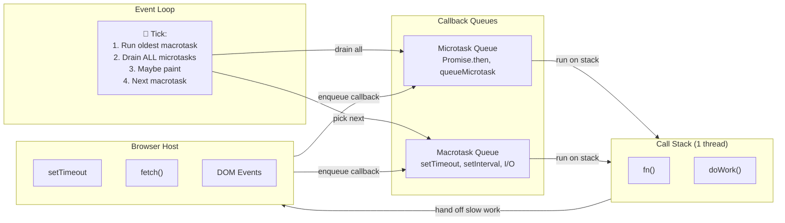
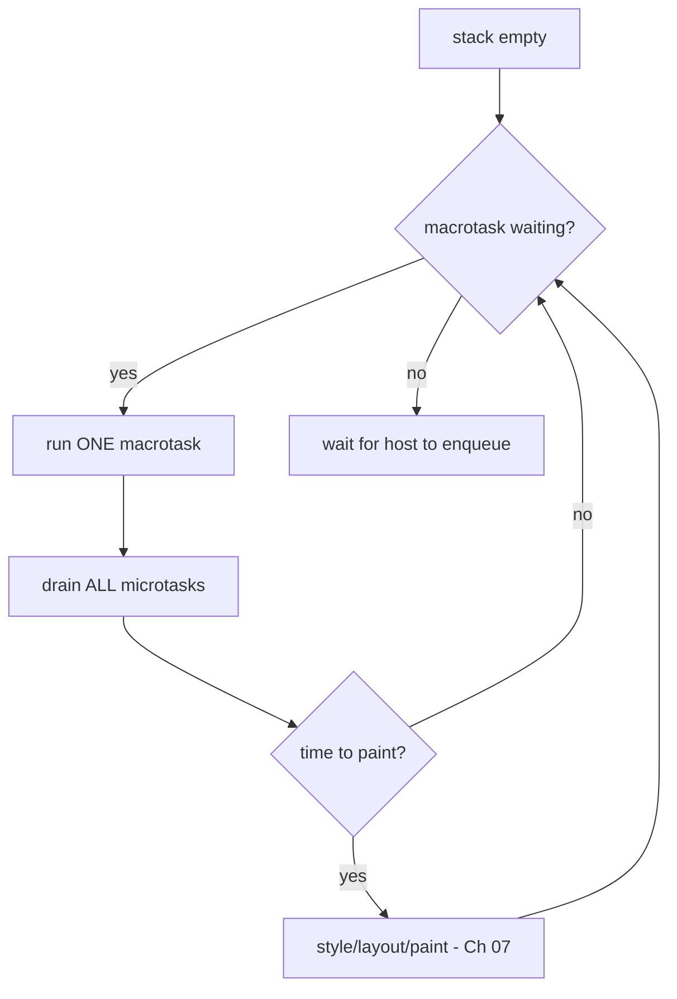
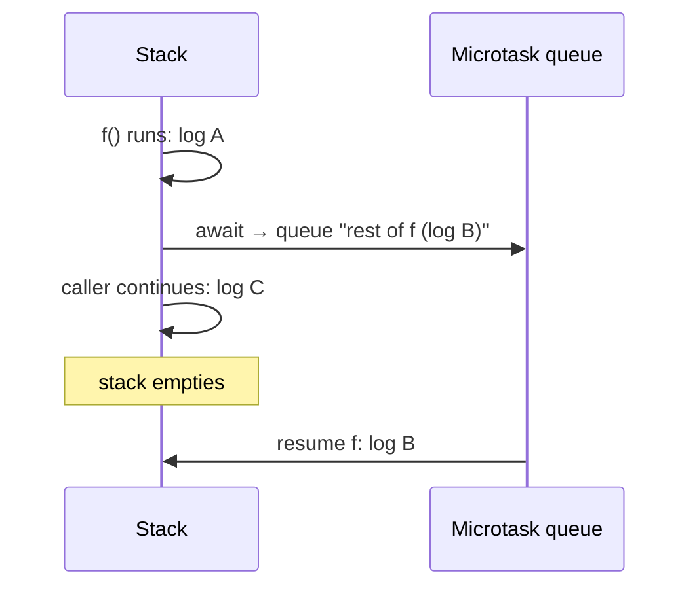

> Builds directly on Ch 01 (call stack / heap). The stack only does synchronous work; this
> chapter adds *how JavaScript does anything that takes time* without a second thread.

---

## The one mental model

> **JavaScript runs on ONE thread with ONE call stack. It cannot "wait" for anything. So slow
> things (timers, network, DOM events) are handed to the host (browser), which later drops a
> callback into a queue. The event loop has exactly one job: when the call stack is EMPTY, take
> the next callback and run it. There are two queues — microtasks (Promises) and macrotasks
> (timers, events) — and the rule is: after each macrotask, drain ALL microtasks before the
> next macrotask or a repaint.**

From this single picture you derive every async-ordering puzzle: why `Promise.then` runs before
`setTimeout(…, 0)`, why a `while(true)` freezes the tab, why `await` "pauses" without blocking,
and why a heavy loop blocks rendering. No memorizing output orders — you simulate the queues.



---

## Learning Objectives

1. Explain why a single-threaded language needs an event loop at all.
2. Predict the output of mixed `setTimeout` / `Promise.then` / sync code by simulating queues.
3. Explain `async/await` as syntax over the microtask queue (not a new threading model).
4. Connect "long synchronous task = frozen UI" to React's need for Fiber (Ch 04).

---

## Key Mental Models

- **One stack, one thread.** Only one thing runs at a time. "Async" ≠ parallel.
- **The host does the waiting**, not JS. Web APIs (timer, fetch) run outside the stack and
  enqueue a callback when done.
- **Loop rule:** run a task → empty the stack → **drain all microtasks** → (maybe paint) →
  next task.
- **Microtasks (Promises, queueMicrotask) jump the queue** ahead of macrotasks (timers, events).

---

## Introduction

You write `fetch(...).then(...)` and `setTimeout(...)` daily. This chapter is the model that
lets you *predict* what runs when — the single most common JS interview puzzle ("what does this
log?"). It's also the foundation for React's scheduler: once you see that a long synchronous
function blocks the one thread (no paint, no clicks), Fiber's "break work into yieldable units"
(Ch 04) becomes obvious instead of mysterious.

---

## Problem

The call stack (Ch 01) runs functions to completion, one at a time. So what happens here?

```js
const data = fetchFromNetwork();   // takes 200ms
console.log(data);
```

If JS literally waited 200ms on the stack, the **entire page** would freeze — no scrolling, no
clicks, no painting — because there's one thread and the stack is busy. Unacceptable. The
language designers' problem: *let slow operations happen without blocking the one thread.*

Their solution: don't block. Hand the slow work to the host (the browser has other threads for
timers/network), keep running synchronous code, and when the slow work finishes, the host puts a
**callback** into a queue. A loop picks it up *later*, once the stack is free. That's the event
loop — the same "queue it, drain when free" instinct that React's batching (Ch 03) reuses.

---

## Mental Model

```
   ┌─────────────┐     web APIs run OFF the stack (host threads):
   │  CALL STACK │     setTimeout timer, fetch, DOM events, etc.
   │  (one!)     │                       │ when done, enqueue callback
   └──────┬──────┘                       ▼
          │ empty?            ┌────────────────────────┐
          │                   │  MACROTASK queue        │  (timers, I/O, events)
   ┌──────▼───────┐           │  [ cb , cb , ... ]      │
   │  EVENT LOOP  │◀──────────┴────────────────────────┘
   │  while true: │           ┌────────────────────────┐
   │   if stack   │◀──────────│  MICROTASK queue        │  (Promise.then, await,
   │   empty →    │  DRAIN    │  [ cb , cb , ... ]      │   queueMicrotask)
   │   run tasks  │  FULLY    └────────────────────────┘
   └──────────────┘
```



**The asymmetry is the whole exam:** one macrotask per loop turn, but *all* microtasks drain
before the next macrotask. So Promises always beat timers queued at the same moment.

---

## Engine Simulation — the classic ordering puzzle

```js
console.log("1");
setTimeout(() => console.log("2"), 0);
Promise.resolve().then(() => console.log("3"));
console.log("4");
```

Simulate. Sync code runs first (it's on the stack). The timer callback goes to the **macrotask**
queue; the `.then` goes to the **microtask** queue.

```
stack runs synchronously:
  log("1")          → prints 1
  setTimeout(...,0) → host schedules timer; cb → MACROTASK queue
  Promise.then(...) → cb → MICROTASK queue
  log("4")          → prints 4
stack now EMPTY → event loop:
  drain ALL microtasks first:  run cb → prints 3
  microtasks empty → take one macrotask: run cb → prints 2
```

Output: **1, 4, 3, 2.** Not 1,4,2,3. The `setTimeout(…, 0)` is *not* "run now" — it's "run on a
future loop turn, after all microtasks." Derive it; never memorize the order.

### `await` is microtask sugar

```js
async function f() {
  console.log("A");
  await null;             // pause point
  console.log("B");       // everything after await = a microtask
}
f();
console.log("C");
```

`await` runs synchronously up to the `await`, then **schedules the rest of the function as a
microtask** and returns control. So: `A` (sync), `C` (sync, caller continues), then the
microtask resumes → `B`. Output: **A, C, B.** `await` doesn't block the thread — it splits the
function at the `await` and queues the continuation. It's the Ch 01 closure that remembers where
to resume.



---

## Why a heavy loop freezes the tab (and needs Fiber)

```js
for (let i = 0; i < 5e9; i++) {}   // 3 seconds of synchronous work
```

While this runs, the stack is never empty, so the event loop never gets a turn — no clicks, no
microtasks, **no repaint**. The tab is frozen for 3s. This is *exactly* the problem React's
Fiber (Ch 04) solves for large renders: a long synchronous task starves the loop. The cures are
the same family — break work into chunks and yield (`setTimeout`/`scheduler`/`requestIdleCallback`),
or move it off-thread (Web Workers, Ch 17).

---

## Interview Discussion (reason first)

**Q1. "`setTimeout(fn, 0)` — does `fn` run immediately?"**

*Plausible-but-wrong:* "Yes, after 0ms it runs right away."

*Correction:* No. It's queued as a **macrotask** and runs only when the stack is empty *and*
all microtasks have drained — and never before the 0ms minimum, which is also clamped (~4ms for
nested timers). Synchronous code and all pending Promises run first.

*Model answer:* "It schedules a macrotask for a future loop turn. Sync code finishes, the entire
microtask queue drains, then the timer callback runs. `0` is a minimum delay, not 'now'."

**Q2. "Why does `Promise.then` run before `setTimeout(…,0)`?"**

*Model answer:* "`.then` is a microtask; the loop drains *all* microtasks after each macrotask
and before the next one. The timer is a macrotask waiting behind that drain. So microtasks win."

**Q3. "Is `async/await` multithreaded?"**

*Model answer:* "No. One thread. `await` runs synchronously to the pause point, schedules the
rest of the function as a microtask, and yields. The 'waiting' is the host doing the slow work
off-thread; the JS continuation is just a queued microtask."

*Scoring:* full = two queues + drain-all-micro rule + await-as-continuation. Fail = "async is
parallel / runs on another thread."

---

## Common Mistakes

- **Thinking `setTimeout(0)` is immediate** or that timers are precise (clamped + queued).
- **Assuming async = parallel.** It's interleaving on one thread.
- **A microtask that schedules a microtask that schedules…** can starve macrotasks/rendering
  (infinite microtask loop freezes paint just like a `while(true)`).
- **Blocking the thread with heavy compute** and wondering why the spinner doesn't spin — the
  spinner can't paint while the stack is busy (Ch 07).
- **Mixing up `process.nextTick`/queueMicrotask vs setImmediate** (Node has extra queues) — for
  the browser, the model above suffices.

---

## Interview Questions

1. Predict the output: a mix of two `setTimeout`s, two `Promise.then`s, and sync logs. Simulate
   both queues to justify.
2. Explain `await` purely in terms of the microtask queue and Ch 01 closures.
3. Why can an infinite chain of microtasks freeze the page even though each is tiny?
4. You have a 200ms computation that janks the UI. Give two thread-friendly fixes and tie them
   to "the stack must be empty for the loop to run."
5. How does this chapter explain *why* React needed Fiber?

---

## Homework

1. Write the 1-4-3-2 puzzle, predict before running, then add an `async/await` and a nested
   `setTimeout` and re-predict. Confirm by running.
2. Build a button that, on click, runs a 2-second `for` loop; observe the UI freeze. Then chunk
   the work with `setTimeout` per chunk and watch responsiveness return.
3. In `NOTES.md`, write the loop rule in one line ("empty stack → drain all micro → one macro →
   repeat") — you'll reuse it for React batching and rendering.

---

## Summary

- **One thread, one stack.** JS never waits; the **host** does slow work off-thread and enqueues
  a callback.
- The **event loop** runs the next queued callback only when the stack is empty.
- **Two queues:** microtasks (Promises/`await`/`queueMicrotask`) and macrotasks (timers/events).
  After each macrotask, **all** microtasks drain before the next macrotask or a repaint — so
  Promises beat `setTimeout(0)`.
- **`async/await`** is microtask sugar: run to the `await`, queue the continuation, yield.
- **Long synchronous work starves the loop** → frozen UI. That's the exact problem React's Fiber
  (Ch 04) and Web Workers (Ch 17) address.

---

# ═══ Internals Deep-Dive (source-verified) ═══

> Verified against the HTML Standard (html.spec.whatwg.org §8.1.7 Event loops) and ECMA-262
> (tc39.es/ecma262 §27 Promises, §9.5 Jobs). The model above is the spec, simplified; here are
> the exact algorithms and names.

## A. The HTML event loop, precisely

The chapter said "two queues." The spec is sharper:

- An event loop has **zero or more *task queues*** — and each task queue is a **set, not a FIFO**
  ("task queues are sets, not queues"), so the loop can pick the first *runnable* task of any
  **task source**. Sources include the **timer**, **DOM manipulation**, **user interaction**,
  **networking**, and **navigation** task sources — grouped so the agent can prioritize per source.
- An event loop has **exactly one *microtask queue*** — and *that* one is a true FIFO.

**Processing model** (§8.1.7.3), the verified cycle:
1. **Select a task** from a task queue with a runnable task; remove it.
2. **Run** it to completion.
3. **Perform a microtask checkpoint.**
4. **Update the rendering** — *only at a rendering opportunity* (tied to display refresh).
5. Repeat.

**"Perform a microtask checkpoint"** (§8.1.7.3.1) is the real algorithm name. It has a re-entrancy
flag, then **`while` the microtask queue is not empty**: dequeue and run the oldest microtask —
*including microtasks queued during the checkpoint*. So the queue is **fully drained** before
rendering or the next task. This is the spec-exact reason behind Ch-02's "drain ALL microtasks"
rule, and why an unbounded microtask chain starves rendering.

## B. Promises, spec-level (ECMA-262 §27.2)

A Promise instance has internal slots: **`[[PromiseState]]`** (`pending`/`fulfilled`/`rejected`),
**`[[PromiseResult]]`**, **`[[PromiseFulfillReactions]]`**, **`[[PromiseRejectReactions]]`**,
**`[[PromiseIsHandled]]`**.

- **`.then`** runs **PerformPromiseThen**: it builds **PromiseReaction Records** (fields
  `[[Capability]]`, `[[Type]]` = Fulfill/Reject, `[[Handler]]`). If the promise is still
  **pending**, the reactions are *stored* in the reaction lists. If already **settled**, a
  **job** is enqueued immediately via **HostEnqueuePromiseJob**.
- When a pending promise settles, **TriggerPromiseReactions** enqueues a job per stored reaction.
- `.then` returns the result capability's promise → that's what makes chains work, one
  **PromiseReactionJob** (one microtask) per link.
- **Resolving with a thenable** doesn't settle immediately: it schedules
  **NewPromiseResolveThenableJob** — an *extra* microtask tick — to adopt the thenable's state.
  (That's why `Promise.resolve(aPromise)` costs an extra tick.)

**The bridge between spec and browser:** ECMA-262 defines abstract **Jobs**; the host hook
**HostEnqueuePromiseJob(job)** must run them **FIFO**. In a browser, the HTML spec implements that
hook by **queuing a microtask**. So "Promise job" (ECMA-262) and "microtask" (HTML) are the same
thing — that's *why* `.then` callbacks are microtasks.

## C. `await` = PromiseResolve + PerformPromiseThen (§27.7.5.3)

An async function is a **resumable coroutine**: its execution context's "code evaluation state" is
saved on suspend and restored on resume (generator machinery). The **Await(value)** operation:
1. `promise = PromiseResolve(%Promise%, value)` — wrap the awaited value in a promise.
2. Build resume closures (fulfilled → resume with value; rejected → resume by throwing).
3. **PerformPromiseThen(promise, onFulfilled, onRejected)** — i.e. `await x` ≈
   `x.then(resume, throwIn)` internally.
4. **Suspend** and return to the caller.

Because resumption flows through PerformPromiseThen → a promise job → HostEnqueuePromiseJob, **the
code after every `await` runs as a microtask** — and `await` on a *non-promise* still wraps it via
`PromiseResolve`, so it **still costs one microtask tick** (the Ch-02 "A, C, B" result, spec-proven).

## D. Prototype chain & `[[Get]]` (§10.1) — the lookup algorithm

Property reads are **OrdinaryGet(O, P, Receiver)**: look up the own property; if absent, get
`O.[[GetPrototypeOf]]()` and **recurse** `parent.[[Get]](P, Receiver)` up the `[[Prototype]]`
chain until found or `null`. Accessors run with the original `Receiver` as `this`. `__proto__` is a
legacy accessor for the **`[[Prototype]]`** slot; a function's **`prototype`** property is a
different thing — it's what `new` assigns as the instance's `[[Prototype]]`.

## E. ES Modules: three phases + live bindings (§16)

A module goes through **Load** (async fetch+parse the graph via `HostLoadImportedModule`) →
**Link** (`Link()`/`InnerModuleLinking`: create each Module Environment Record; for each import
`CreateImportBinding` makes an **immutable indirect binding** into the *exporter's* environment via
`ResolveExport`) → **Evaluate** (`Evaluate()` runs each body **once**, bottom-up; returns a Promise
for top-level await). `[[Status]]`: `new → unlinked → linking → linked → evaluating →
evaluating-async → evaluated`.

Consequences (vs CommonJS):
- **Imports are live, read-only views** — reads reflect the exporter's *current* value; you cannot
  reassign an import (it's a `SyntaxError`). Only the exporting module can change it. (MDN: "The
  value can only be re-assigned by the module exporting it.")
- **Static structure** — imports are hoisted and statically analyzable → enables linking before
  evaluation, and tree-shaking (Ch 20). **CommonJS `require()`** is a runtime call returning a
  *value snapshot* of `module.exports`, resolved dynamically — no live bindings, no static graph.
- **Top-level await**: a module with TLA has `[[HasTLA]]` true and evaluates via
  `ExecuteAsyncModule`; it can block its *importers* but not sibling modules.

## Go deeper
Sources: HTML Standard §8.1.7 (event loop, "perform a microtask checkpoint"); ECMA-262 §27.2
(Promises), §27.7.5.3 (Await), §9.5 (Jobs / HostEnqueuePromiseJob), §10.1 (prototype), §16
(Modules). Jake Archibald's *In The Loop* animates the queues; the spec is the source of truth.
