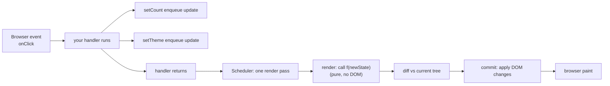
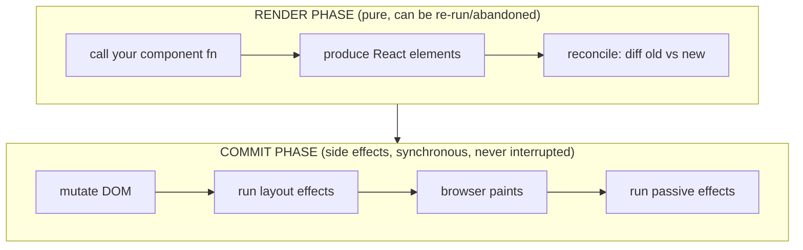
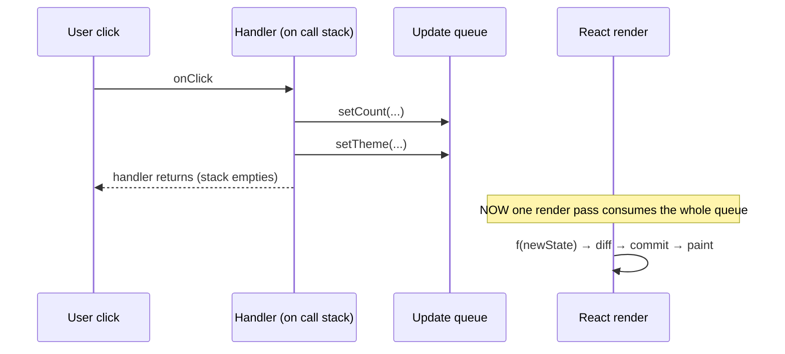

> Builds on Ch 01 (stack/heap/closures) and Ch 02 (event loop, microtasks). If you haven't
> internalized "a closure captures a *cell*, not a value," re-skim Ch 01 first — this whole
> chapter leans on it.

---

## The one mental model

> **`setState` does not change a variable. It files a request: "next time you render this
> component, use this value." Rendering is a pure function `UI = f(state)` that React calls
> *when it decides to*, not when you call the setter. A component's render is a snapshot —
> every value in it is frozen for that one render.**

Hold that sentence. Everything below — batching, "why is my state stale," functional
updaters, why two `setCount(count+1)` in a row only adds 1 — is *derived* from it. You will
not memorize a list of rules; you'll re-derive them from "setter = request, render = snapshot."

---

## Learning Objectives

1. Explain what physically happens between `onClick` firing and the DOM updating.
2. Derive **batching** from the event-loop model, not as a magic React feature.
3. Explain why state looks "stale" inside a handler — and fix it with the functional updater
   from first principles.
4. Know what "render" actually means (call the function) vs "commit" (touch the DOM).

---

## Key Mental Models

- **State is a snapshot per render.** `count` inside a render is a `const` captured by closure
  (Ch 01). It cannot change mid-render. A re-render makes a *new* closure with a *new* `count`.
- **Setter = enqueue + schedule.** It appends to an update queue on the component and asks the
  scheduler to do a render pass. It returns immediately; nothing has rendered yet.
- **Render is pure; commit has side effects.** React calls your component to compute elements
  (no DOM touched), diffs, then commits DOM changes in one batch, then the browser paints.

---

## Introduction

You know `useState`. This chapter is about what the line `setCount(count + 1)` *is*. The #1
React interview filter at SDE-2 is: "I click once, why did `count` not update on the next
line?" and "I called `setCount` twice, why did it only go up by one?" Both dissolve instantly
once you see state as a captured snapshot and the setter as a queued request. We derive both.

---

## Problem

Why doesn't React just mutate the variable synchronously when you call the setter? Imagine it
did:

```js
function handleClick() {
  setCount(count + 1);   // if this synchronously re-rendered...
  setTheme("dark");      // ...this would trigger a SECOND full re-render
  doMoreStuff();         // ...and the UI would be re-rendered mid-handler
}
```

Synchronous mutation means **every setter re-renders the whole subtree immediately** — three
setters = three renders, intermediate half-updated UIs, wasted work, and tearing. The language
designers' problem: *batch all the state changes triggered by one event into a single render,
and keep render a pure snapshot so it's predictable and (later, Ch 04) interruptible.*

Their solution: the setter doesn't mutate — it **enqueues an update** and **schedules** a
render. The current render's variables stay frozen. This is the same instinct as Ch 02's event
loop: don't do the work now, queue it and drain when the time is right.

---

## Mental Model



Two-phase split to burn in (it returns in Ch 04 and 07):



---

## Engine Simulation — the "double increment" classic

```js
function Counter() {
  const [count, setCount] = useState(0);
  function handleClick() {
    setCount(count + 1);
    setCount(count + 1);
  }
  return <button onClick={handleClick}>{count}</button>;
}
```

You click. What is `count` after? **1, not 2.** Derive it — do not memorize.

During *this* render, `count` is a closure-captured constant = `0` (snapshot). So:

```
setCount(count + 1)  →  setCount(0 + 1)  →  enqueue "set to 1"
setCount(count + 1)  →  setCount(0 + 1)  →  enqueue "set to 1"   (count is STILL 0 here!)
```

```
update queue for Counter:   [ set→1 , set→1 ]
                                        │
                  handler returns; scheduler runs ONE render
                                        │
                 React applies queue:  0 → 1 → 1   ⇒ final 1
```

`count` never became 1 mid-handler — it's frozen for the render. Both setters computed from
the same snapshot `0`. The fix is to stop reading the snapshot and instead describe a
*transformation*:

```js
setCount(c => c + 1);   // "whatever it currently is, add 1"
setCount(c => c + 1);
```

```
update queue:   [ (c)=>c+1 , (c)=>c+1 ]
apply:          0 ─(+1)→ 1 ─(+1)→ 2     ⇒ final 2
```

The functional updater isn't a trick to memorize — it's the answer to "I must not depend on
the frozen snapshot; let React feed me the latest value as it drains the queue."

---

## Batching — derived, not memorized

Why do `setCount` + `setTheme` in one handler cause only **one** render? Because the setter
only *schedules*; React waits until your handler (the current call-stack work) finishes before
it renders — exactly the Ch 02 rule "the stack must empty before the next task." All updates
enqueued during one event drain into one render pass.



> **React 18 detail (know this for interviews):** pre-18, batching only happened inside React
> event handlers; updates inside `setTimeout`/`fetch().then`/promises rendered separately.
> React 18's **automatic batching** batches those too, because it batches by the surrounding
> task, not by "are we in a synthetic event." Same mental model, wider net.

---

## React Internals

- Each component's Fiber (Ch 04) holds a **queue of pending updates**. The setter does
  `enqueueUpdate(fiber, update)` then `scheduleUpdateOnFiber`.
- "Render" = React calls your function component top-to-bottom to produce a tree of
  **elements** (plain objects: `{type, props}`) — *no DOM is touched*. This is why render must
  be **pure**: React may call it more than once or throw it away (Ch 04, StrictMode
  double-invokes in dev to smoke out impurity).
- "Commit" = React walks the diff and performs the minimal DOM mutations, synchronously, then
  the browser paints (Ch 07), then passive effects (`useEffect`) flush.
- Re-render ≠ DOM change. If `f(state)` produces the same elements, reconciliation (Ch 06)
  finds no diff and the DOM is untouched. "Wasted render" = ran `f` for nothing; perf work
  (Ch 08) is about cutting those.

---

## Interview Discussion (reason first, then read)

**Q1. "After `setCount(count+1)`, is `count` updated on the very next line?"**

*Plausible-but-wrong:* "Yes, state updates immediately."

*Correction:* No. `count` is a `const` captured for this render (snapshot). The setter queued
a request and scheduled a render; the variable in scope is unchanged until the *next* render
produces a new closure with the new value. The misconception comes from thinking of `useState`
as a normal mutable variable instead of "a value pinned to this render."

*Model answer:* "`count` is frozen for the current render — it's closed over. The setter
enqueues an update and schedules a re-render; I'll only see the new value in the next render's
`count`. If I need the updated value to compute the next, I use the functional updater."

**Q2. "Two `setCount(count+1)` → why +1 not +2, and how do you fix it?"**

*Model answer:* "Both read the same snapshot `count=0`, so both enqueue 'set to 1'. Fix:
`setCount(c => c + 1)` — React applies each updater against the running result, 0→1→2."

**Q3. "Does calling setState always re-render the DOM?"**

*Model answer:* "It always schedules a re-render (a call to my component), but not necessarily
a DOM change. If the produced elements diff to no change, reconciliation commits nothing. Also
if you set the same primitive value, React bails out early."

*Scoring:* full = snapshot + queue + render-vs-DOM distinction. Fail = "state is async, use a
callback like in class setState" without the snapshot reasoning.

---

## Common Mistakes

- **Reading state right after setting it** and expecting the new value. It's the old snapshot.
- **Chaining setters that depend on each other** without the functional form.
- **Putting side effects in render** (mutating refs, fetching, logging to a server). Render is
  pure and may run twice/be discarded — side effects belong in `useEffect`/event handlers.
- **Assuming re-render = slow.** Re-render is cheap-ish; *committing* and big subtrees are the
  cost. Measure before memoizing (Ch 08).
- **Thinking `setState` is synchronous in timeouts now "broke" in 18.** It became *batched* —
  that's automatic batching, not a bug.

---

## Interview Questions

1. Walk the queue for three `setX(x+1)` vs three `setX(v=>v+1)`. Final values?
2. Why must a component's render be pure? What does StrictMode do about it and why only in dev?
3. Distinguish "re-render" from "DOM update" from "repaint." Which does `setState` guarantee?
4. What changed about batching in React 18, and why is it the *same* mental model?
5. You read `count` in a `setTimeout` inside a handler and it's stale. Explain via closures
   (tie to Ch 01) and fix it two ways.

---

## Homework

1. Build the counter, log `count` immediately after both setters, and predict the logs before
   running. Then convert to functional updaters and re-predict.
2. Add `setTheme` next to `setCount` and prove (via a render-count log) only one render fires.
   Then move the setters into a `setTimeout` and observe React 18 still batches.
3. Write down, in one sentence each, "what is a render" and "what is a commit" — in `NOTES.md`.

---

## Summary

- **Setter = enqueue + schedule.** It never mutates the current render's variables.
- **A render is a snapshot:** every value is frozen (a closure capture from Ch 01). The next
  render is a *new* closure with new values.
- **Batching** falls out of the event-loop model: updates queued during one task drain into
  one render after the stack empties (React 18 = automatic, even in timeouts/promises).
- The **double-increment** and **stale-state** puzzles both reduce to "you read the frozen
  snapshot; use the functional updater to read the live value."
- **Render (pure, no DOM) ≠ commit (DOM mutation) ≠ paint.** Next chapter opens up *how* React
  performs the render pass interruptibly — Fiber.

---

# ═══ Internals Deep-Dive (source-verified) ═══

> Verified against `facebook/react` (18.2.0 / 19.x), react.dev, and reactwg/react-18. The
> "enqueue + schedule + snapshot" model above is right; here's the real scheduling mechanism.

## A. Automatic batching — the microtask flush (React 18)

Pre-18, batching only happened inside React's own (synthetic) event handlers: `batchedUpdates`
entered a `BatchedContext`, and anything async (a `setTimeout`/`fetch().then` callback) ran
*outside* that context → each `setState` rendered separately. React 18's **automatic batching**
(with `createRoot`) batches updates **regardless of origin**.

Mechanism (`ReactFiberWorkLoop.js`): `scheduleUpdateOnFiber` → `markRootUpdated` →
`ensureRootIsScheduled`, and sync work is deferred to a **microtask** (Ch 02):

```js
scheduleMicrotask(() => {
  if ((executionContext & (RenderContext | CommitContext)) === NoContext) flushSyncCallbacks();
});
```

That microtask flush is *why* updates in promises/timeouts now batch: all setters queued during
the current task (Ch 02 "stack must empty") drain together when the microtask runs.
`executionContext` is a bitmask (`NoContext`, `BatchedContext`, `RenderContext`, `CommitContext`).
**`flushSync(fn)`** opts out: it temporarily sets `BatchedContext` + discrete priority and flushes
synchronously in a `finally` (use sparingly — it can force Suspense fallbacks and run pending
effects). Requires `createRoot`; legacy `ReactDOM.render` keeps the old (event-handler-only)
batching.

## B. Transitions & useDeferredValue — lanes in practice (Ch 04)

`startTransition`/`useTransition` mark their updates with a **transition lane**:
`requestUpdateLane` checks the active transition (`ReactSharedInternals.T` in v19; was
`ReactCurrentBatchConfig.transition` in v18) and returns a transition lane instead of an event
lane. Because transition lanes are lower priority, an urgent update (a keystroke =
`DiscreteEventPriority` = `SyncLane`) **preempts** an in-progress transition render — concretely,
`getNextLanes` only interrupts when the new lane is strictly higher priority, and there's an
explicit rule that *default* updates must not interrupt transitions (only sync/continuous do). This
is the mechanism behind "typing stays responsive while a big filtered list renders in the
background."

`useDeferredValue` renders the urgent update with the **old** value, then schedules an
interruptible background re-render with the new value (a `DeferredLane` in v19; a plain transition
lane in v18). Note: a state update *after* an `await` inside `startTransition` is **not**
auto-marked as a transition.

> Version flag: `ReactCurrentBatchConfig.transition` (18) → `ReactSharedInternals.T` (19);
> `DeferredLane` is v19-only.

## C. StrictMode double-invoke — what and why (dev only)

In **development**, `<StrictMode>` deliberately:
- **double-renders** components (and re-runs `useState`/`useMemo`/`useReducer` updater functions
  and the component body) — to surface impure render logic (Ch 03's purity requirement). Since 16.3.
- **double-invokes effects as mount → unmount → mount** (run effect, run cleanup, run effect
  again) — to surface missing cleanup. **This effect double-invoke is NEW in React 18** (17 only
  double-rendered); it was added because the future "reusable state"/Offscreen feature can unmount
  and remount a component while preserving state, so effects must tolerate it.
- (React 19 adds ref-callback double-invocation too.)

All of this is **dev-only** — production runs once. The reason it can do this safely is the whole
point of the architecture: render is pure (Ch 03) and the WIP tree is throwaway (Ch 04), so React
is free to run components/effects twice to catch your impurities. (reactwg/react-18 #18/#19.)

## Go deeper
Source: `facebook/react` `ReactFiberWorkLoop.js` (scheduleUpdateOnFiber, microtask flush,
flushSync), `ReactFiberLane.js` / `ReactEventPriorities.js` (transition vs discrete lanes),
react.dev StrictMode, reactwg/react-18 #21 (automatic batching) & #18/#19 (StrictMode effects).
Ch 04 is the Fiber/lanes/scheduler substrate; Ch 06 the diff the commit applies.
