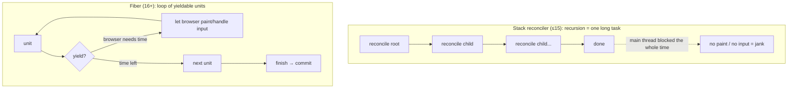
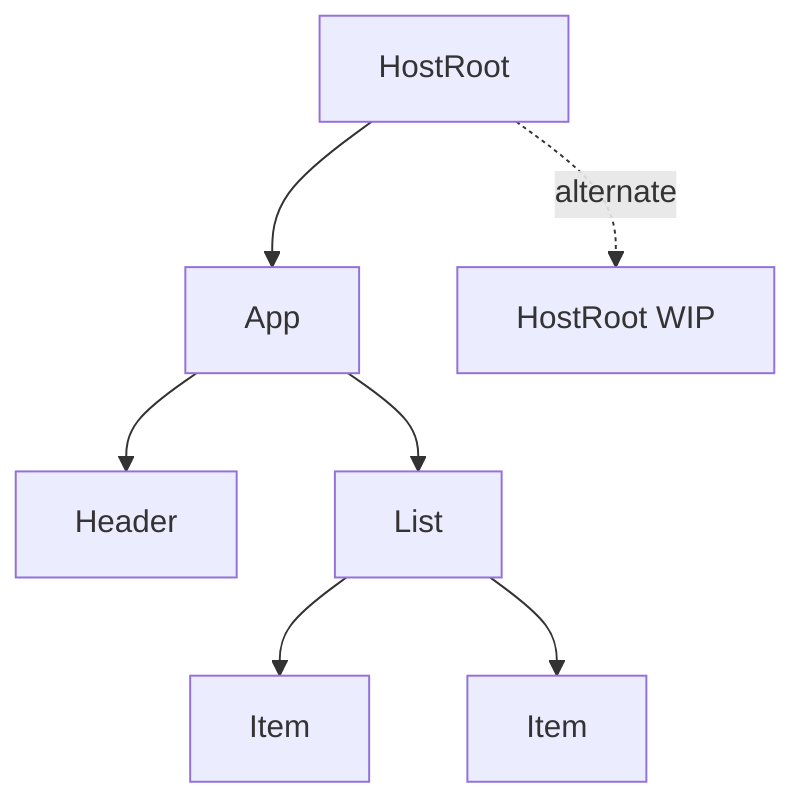
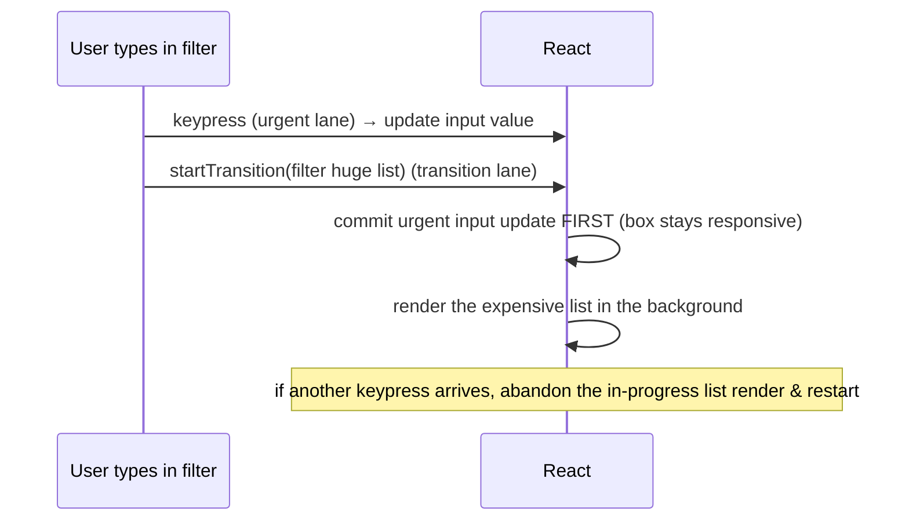

> Builds on Ch 03 (setState schedules a render pass) and Ch 02 (the main thread is one thread;
> long tasks block paint and input). Fiber is React's answer to "how do we run a render pass
> without freezing the page."

---

## The one mental model

> **Fiber turns rendering from one un-interruptible recursive function call into a list of
> small units of work that React can pause, abandon, or resume. A Fiber is a plain JS object —
> one per element — that is both (a) a node in a linked tree and (b) a unit of work with a
> priority. The render phase walks these units and can yield to the browser between them; the
> commit phase applies the result to the DOM in one synchronous, uninterruptible burst.**

From this you derive: why render must be pure (it may be thrown away), why there are two trees
(double buffering), what "lanes" are (priority labels on work), and what concurrent features
(`useTransition`, Suspense) actually buy. No memorizing a feature list.

---

## Learning Objectives

1. Explain *why* React rewrote the reconciler (the stack-recursion problem) — from Ch 02.
2. Describe a Fiber as a linked-tree node + unit of work, and the current/WIP double buffer.
3. Separate render phase (interruptible, pure) from commit phase (sync, effects) cleanly.
4. Explain lanes/priority and what `useTransition` / `useDeferredValue` do mechanically.

---

## Key Mental Models

- **Render = a loop over units of work that can yield.** Not a recursion you must finish.
- **Two trees: `current` (on screen) and `workInProgress` (being built).** Commit swaps them.
- **Commit is atomic and synchronous.** The user never sees a half-applied tree.
- **Lanes are priority bits.** Urgent (typing, click) preempts non-urgent (a transition).

---

## Introduction

Before Fiber (React ≤15, "the stack reconciler"), reconciliation was a synchronous recursive
walk: once it started on a big tree, it ran to completion on the main thread. On a large update
that meant tens of milliseconds where the page couldn't respond to input or paint — jank. From
Ch 02 you know exactly why: the call stack must empty before the event loop can handle the
click or repaint. A long synchronous recursion *is* a long task.

React's fix (16+): make the work **pausable**. Break the recursion into discrete steps over a
linked structure, do a chunk, check "should I yield to the browser?", and if so hand control
back, let the browser paint/handle input, then resume. That linked structure and its work unit
is the **Fiber**.

---

## Problem



The design problem: a recursive tree walk can't be paused — its progress lives in the JS call
stack, which you can't snapshot and resume. **Solution:** move the progress *out* of the call
stack into a data structure you control. Each Fiber stores links (`child`, `sibling`, `return`)
so React can walk the tree iteratively and remember where it was after yielding.

---

## Mental Model — the Fiber node

```
Fiber {
  type        : 'div' | FunctionComponent | ...
  key         : reconciliation identity (Ch 06)
  child       : ─▶ first child Fiber
  sibling     : ─▶ next sibling Fiber
  return      : ─▶ parent Fiber (where to go "up")
  pendingProps / memoizedProps
  memoizedState : ─▶ the hook linked-list (Ch 05!) for function components
  lanes       : priority bits for pending work
  alternate   : ─▶ the OTHER tree's matching Fiber (current ⇄ workInProgress)
}
```

The tree is a linked list you can traverse with a pointer (`beginWork` going down via `child`,
`completeWork` going up/over via `sibling`/`return`). That pointer is the resumable cursor.



---

## Engine Simulation — double buffering & a yield

Two trees exist. `current` is what's painted. On an update React builds `workInProgress` by
cloning Fibers from `current` (reusing untouched subtrees), applying changes:

```
RENDER PHASE (interruptible):
  cursor at App → beginWork → produce children → cursor to Header → ... 
  after each unit:  if (shouldYield()) { save cursor; return to browser }
                    browser paints / handles the click, then React resumes at saved cursor
  ... eventually whole workInProgress tree is built and "complete"

COMMIT PHASE (synchronous, NOT interruptible):
  1. mutation:  apply DOM ops from the diff
  2. swap:      root.current = workInProgress    ← the two-tree flip
  3. layout effects (useLayoutEffect) run, before paint
  4. browser paints
  5. passive effects (useEffect) flush
```

Two trees exist *so that* an interrupted, half-built `workInProgress` never touches the screen.
The screen always shows the consistent `current` tree until commit flips atomically. That's why
a render can be **abandoned** safely (e.g. a higher-priority update arrives) — and why your
render function **must be pure** (Ch 03): React may run it, throw away the WIP tree, and run it
again. Side effects there would fire on a render the user never sees (StrictMode double-invokes
in dev to expose exactly this).

---

## Lanes & priority — derived

Once render is interruptible, React can do work in priority order. **Lanes** are a bitmask
labelling each pending update's urgency. Urgent lanes (discrete input: click, keypress)
preempt transition lanes (marked via `startTransition`).



- `useTransition` / `startTransition`: "this update is non-urgent — render it in a low-priority
  lane, keep the UI interactive, and feel free to interrupt it." Mechanically: marks the update
  with a transition lane so urgent updates preempt it.
- `useDeferredValue`: hand a "lagging" copy of a value that updates at low priority.
- Concurrent rendering is *possible* precisely because the render phase is pausable/abandonable.
  It's the payoff of this whole architecture, not a separate feature.

---

## Interview Discussion (reason first)

**Q1. "Why did React introduce Fiber?"**

*Plausible-but-wrong:* "To make React faster."

*Correction:* Not raw speed — Fiber can do *more* total work. It's about **scheduling**:
breaking a synchronous, un-pausable recursive render into interruptible units so long renders
don't block input/paint (Ch 02's long-task problem). Perceived responsiveness, prioritization,
concurrency.

*Model answer:* "Pre-Fiber reconciliation was a synchronous recursion that ran to completion on
the main thread, janking large updates. Fiber moves render progress into a linked structure of
work units React can pause, abandon, and resume by priority — enabling concurrent features."

**Q2. "Why two trees?"**

*Model answer:* "Double buffering. `current` is what's on screen; `workInProgress` is built off
to the side and can be interrupted/abandoned without the user ever seeing a partial tree. Commit
swaps them atomically — so the UI is always consistent, and that's what lets a render be thrown
away."

**Q3. "Why must render be pure, mechanically?"**

*Model answer:* "Because React may run my component multiple times and discard the result (an
interrupted/abandoned WIP tree, or StrictMode's dev double-invoke). Side effects in render would
fire for renders that never commit. Effects belong in commit-phase `useEffect`."

*Scoring:* full = scheduling not speed + double buffer + purity-from-abandonment. Fail = "Fiber
is the virtual DOM."

---

## Common Mistakes

- **"Fiber = virtual DOM."** The element tree (`{type, props}`) is the VDOM-ish description;
  Fibers are the persistent work/instance nodes that *do* reconciliation. Different things.
- **Side effects in render**, assuming it runs once. It may run, be discarded, and re-run.
- **Thinking commit is interruptible.** It isn't — that's why it's kept minimal.
- **Believing `useTransition` makes things faster.** It makes them *interruptible/lower
  priority* so urgent input stays responsive; total work may be equal or more.

---

## Interview Questions

1. Draw the Fiber tree for a small component, labelling `child`/`sibling`/`return`/`alternate`.
2. Explain how React resumes a render after yielding — where does the "where was I" live, and
   why couldn't the old stack reconciler do this?
3. Why does double buffering make abandoning a render safe?
4. What's a lane? Walk a typing-while-filtering example with `startTransition`.
5. Render phase vs commit phase: which is interruptible, where do `useLayoutEffect` and
   `useEffect` fire, and why that order?

---

## Homework

1. In `NOTES.md`, write the Fiber struct from memory (the 6 fields that matter) and one line on
   what each enables.
2. Build a list filter over ~10k items; wrap the filtering state update in `startTransition` and
   observe input stays responsive. Remove it and feel the jank — connect to Ch 02 long tasks.
3. Explain, in two sentences, why "render must be pure" is a *consequence* of Fiber, not an
   arbitrary rule.

---

## Summary

- **Fiber = render as interruptible units of work** over a linked tree, moving progress off the
  call stack so long renders don't block paint/input (solves Ch 02's long-task jank).
- A **Fiber node** is both a tree node (`child`/`sibling`/`return`) and a unit of work with
  `lanes` and an `alternate` pointer to its twin in the other tree.
- **Two trees (double buffering):** `current` is painted; `workInProgress` is built aside and
  swapped in atomically at commit — so renders can be abandoned and **render must be pure**.
- **Render phase** (pure, interruptible) vs **commit phase** (DOM mutation + effects, sync).
- **Lanes** are priority labels; `useTransition`/`useDeferredValue` use low-priority lanes so
  urgent input preempts expensive background renders. Concurrency is the payoff of pausability.

---

# ═══ Internals Deep-Dive (source-verified) ═══

> Verified against `facebook/react` source at tag **v19.2.0** (React 19 merged the old
> `.old.js`/`.new.js` reconciler forks into single files). Identifiers and file paths are real;
> exact line numbers drift between versions. Version landmines flagged inline.

## A. The real `FiberNode` (`react-reconciler/src/ReactFiber.js`)

The fields, in source order, grouped by the source's own comments:

```
// Instance
  tag            // kind: FunctionComponent=0, ClassComponent=1, HostRoot=3, HostComponent=5… (ReactWorkTags.js)
  key            // reconciliation identity (Ch 06)
  elementType    // original type (before resolving lazy/memo)
  type           // resolved type (fn/class, or DOM tag string)
  stateNode      // DOM node (HostComponent) | class instance | FiberRoot (HostRoot) | null (function component)
// Tree links
  return         // parent (named 'return' = where control returns on complete)
  child          // first child
  sibling        // next sibling
  index, ref, refCleanup
// Props & State
  pendingProps   // incoming props this render
  memoizedProps  // props from last committed render
  updateQueue    // state updates; for function comps, a linked list of effects
  memoizedState  // last committed state; FOR FUNCTION COMPONENTS = head of the hooks linked list (Ch 05)
  dependencies   // context subscriptions
  mode           // TypeOfMode bitmask (ConcurrentMode, StrictMode…)
// Effects
  flags          // effect bitmask (was 'effectTag' pre-18): Placement, Update, ChildDeletion, Passive, Ref… (ReactFiberFlags.js)
  subtreeFlags   // OR of the whole subtree's flags — lets commit SKIP clean subtrees
  deletions      // child fibers to delete
  lanes          // pending work on this fiber (bitmask)
  childLanes     // pending work anywhere in the subtree
  alternate      // the twin fiber in the double buffer (current ⇄ workInProgress)
```

> Version flag: `effectTag` → `flags` (18+); the old linked **effect list**
> (`firstEffect`/`nextEffect`) was **removed in 18** in favor of `subtreeFlags` subtree walks.

## B. Double buffering — `createWorkInProgress(current, pendingProps)`

The source comment is verbatim: *"We use a double buffering pooling technique because we know
that we'll only ever need at most two versions of a tree. We pool the 'other' unused node."*
- First render of a fiber: `alternate` is null → allocate a new fiber, then wire the pair
  bidirectionally: `wip.alternate = current; current.alternate = wip`.
- Later: **reuse** the alternate, set `pendingProps`, and reset `flags`/`subtreeFlags`/`deletions`.

`root.current` points at the on-screen tree; the WIP tree is built from it. (This is the
Ch-04 "two trees" claim, in code — and why renders can be abandoned: the WIP is throwaway.)

## C. The work loop (`ReactFiberWorkLoop.js`) — verbatim shapes

```js
function workLoopSync()       { while (workInProgress !== null) performUnitOfWork(workInProgress); }
function workLoopConcurrent() { while (workInProgress !== null && !shouldYield()) performUnitOfWork(workInProgress); }
```
**The ONLY difference is the `!shouldYield()` guard** — that single clause is what makes
concurrent rendering interruptible. `performUnitOfWork`:
1. `const current = unitOfWork.alternate;`
2. `next = beginWork(current, unitOfWork, renderLanes);`
3. `unitOfWork.memoizedProps = unitOfWork.pendingProps;`
4. `next === null ? completeUnitOfWork(unitOfWork) : (workInProgress = next);`

Sync vs concurrent is chosen in `performWorkOnRoot` (v19; was
`performConcurrent/SyncWorkOnRoot` in 18): time-slice unless the lanes are blocking/expired.

- **`beginWork`** (`ReactFiberBeginWork.js`) — a `switch (tag)` → `updateFunctionComponent` /
  `updateClassComponent` / `updateHostComponent` / `updateMemoComponent` / `updateSuspenseComponent`…
  Descends, runs your component, reconciles children (Ch 06), returns the first child or null.
- **`completeWork`** (`ReactFiberCompleteWork.js`) — going back up: for a HostComponent on mount
  it `createInstance` (the real DOM node) + `appendAllChildren`; on update it `markUpdate`
  (sets `flags |= Update`). Every tag calls **`bubbleProperties`**, which ORs children's
  `subtreeFlags`/`flags` and merges `childLanes` upward — that's how the parent learns "something
  below me changed" without an effect list.

Note the loops are `while` loops, not recursion — progress lives in `workInProgress` (a module
variable), which is exactly why the render can pause and resume (Ch-04's core claim).

## D. Lanes (`ReactFiberLane.js`) — the priority bitmask, v19.2.0 constants

Lanes replaced React-16's numeric `expirationTime` with a **31-bit bitmask**; **lower bit =
higher priority**. Real v19.2.0 values:

```js
export const TotalLanes = 31;
export const SyncHydrationLane      = 0b0000000000000000000000000000001;
export const SyncLane               = 0b0000000000000000000000000000010;
export const InputContinuousLane    = 0b0000000000000000000000000001000;
export const DefaultLane            = 0b0000000000000000000000000100000;
const TransitionLanes               = 0b0000000001111111111111100000000; // 14 transition lanes
const RetryLanes                    = 0b0000011110000000000000000000000; // 4 retry lanes
export const IdleLane               = 0b0010000000000000000000000000000;
export const OffscreenLane          = 0b0100000000000000000000000000000;
export const DeferredLane           = 0b1000000000000000000000000000000;
```
Constant-time ops: `mergeLanes = a|b`, `getHighestPriorityLane = lanes & -lanes` (isolate lowest
set bit), `isSubsetOfLanes(set,sub) = (set&sub)===sub`. `markStarvedLanesAsExpired` promotes
long-pending lanes so low priority can't **starve** — it expires and is forced into a sync render.

> Version landmines: bit positions changed 18→19 (19 added a dedicated `SyncHydrationLane` at bit
> 0, shifting `SyncLane` to bit 1). **TransitionLanes = 14 in v19** (older write-ups say 16).
> Never hardcode bit positions.

## E. The Scheduler (`scheduler/src/forks/Scheduler.js`) — time-slicing for real

- A **min-heap** of tasks keyed by `expirationTime`. Priority timeouts: Immediate `-1` (already
  expired), UserBlocking **250ms**, Normal **5000ms**, Low **10000ms**, Idle = never.
- **`shouldYieldToHost`** (exported to the reconciler as `shouldYield`): yields if a paint is
  pending or `getCurrentTime() - startTime >= frameInterval`, where **`frameYieldMs = 5`** (the
  ~5ms slice). ⚠️ 5ms is the **OSS default only** — Meta's internal build uses 10, and
  `forceFrameRate()` can change it at runtime. Don't quote "5ms" as a guarantee.
- **Scheduling uses `MessageChannel`**, *not* `requestIdleCallback` and *not* `setTimeout`
  (avoids the ~4ms `setTimeout` clamp): `port.postMessage(null)` schedules
  `performWorkUntilDeadline`, which records `startTime` and runs the task `workLoop`, breaking
  when a non-expired task is reached and `shouldYieldToHost()` is true.

So Ch-04's "yield to the browser between units" is concretely: exit `workLoopConcurrent` when
`shouldYield()` (≈5ms elapsed), `postMessage` to schedule the continuation as a fresh macrotask,
let the browser paint/handle input (Ch 02/07), then resume.

## F. Higher-priority interrupt → restart from root

`ensureRootIsScheduled` keeps **one task per root**; if a higher-priority update arrives,
`prepareFreshStack(root, lanes)` **discards the in-progress WIP and rebuilds a fresh WIP from
`root.current`** — i.e. concurrent React *restarts the render from the root*, it doesn't resume
the abandoned one. This is *why* render must be pure/idempotent (Ch 03/04): React may run your
component, throw the result away, and run it again. The **commit** loop, by contrast, is the
non-yielding `workLoopSync`-style path and applies the DOM atomically — commit can't be
interrupted.

## Go deeper
Source: `facebook/react` v19.2.0 — `ReactFiber.js`, `ReactFiberWorkLoop.js`, `ReactFiberBeginWork.js`,
`ReactFiberCompleteWork.js`, `ReactFiberLane.js`, `scheduler/src/forks/Scheduler.js`. Jser.dev's
React source walkthroughs and Andrew Clark's *react-fiber-architecture* (note: it uses the old
name `cloneFiber` for `createWorkInProgress`) are good companions. Ch 06 details the `beginWork`
child diff; Ch 05 the hooks `memoizedState` holds.
