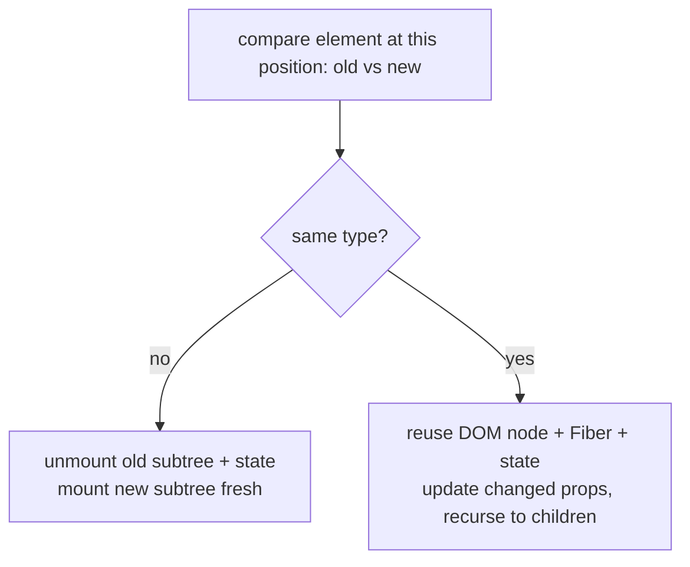
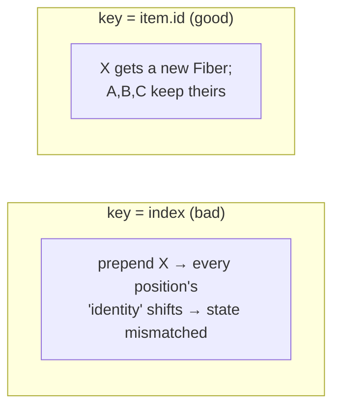
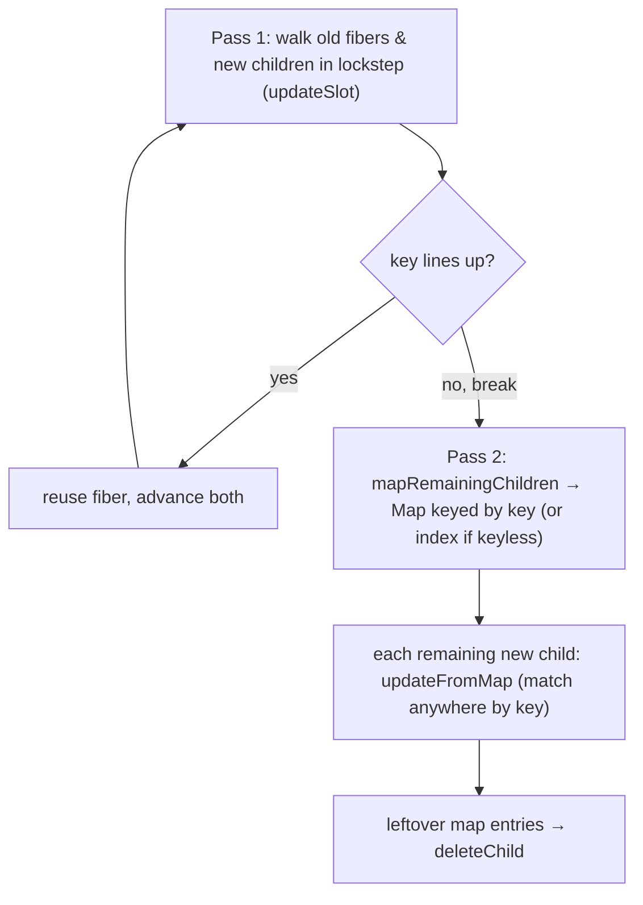

> Builds on Ch 04 (Fibers, the WIP tree) and Ch 03 (render produces an element tree). This is
> the diff that decides what the commit actually touches.

---

## The one mental model

> **React does NOT compare your new tree against the DOM. It compares the new element tree
> against the previous one, position by position. At each position it asks ONE question: "same
> type as before?" Same type → keep the DOM node and the Fiber (and its state), just update
> props. Different type → throw away that node and its entire subtree (and its state) and build
> fresh. `key` overrides "position" with "identity" so React can match items that moved.**

From this you derive: why changing a wrapper `<div>` to a `<section>` wipes child state, why
list state gets cross-wired without keys, why index-as-key corrupts on reorder/insert, and why
a full tree diff would be too slow. No memorizing "rules of keys."

---

## Learning Objectives

1. Explain React's O(n) diff heuristics and why it avoids the O(n³) general tree diff.
2. Derive "same type → update, different type → remount" and its effect on state.
3. Explain keys as identity, and predict the bugs from missing/index keys.

---

## Key Mental Models

- **Diff is per-position, type-first.** Type mismatch = unmount subtree + mount new.
- **State is tied to position-in-tree (a Fiber), not to your JSX variable.** Move/replace the
  position and the state goes with the Fiber — or dies.
- **`key` re-defines identity within a list**, so reorders reuse the right Fiber.

---

## Introduction

You've seen "add a key" warnings and maybe a bug where an input's value jumped to the wrong row.
Both come from one thing: how React matches *this* render's elements to *last* render's Fibers.
Get the matching model and you can predict exactly when state survives, resets, or migrates.

---

## Problem

A general optimal tree diff is **O(n³)** — far too slow for UI that re-renders constantly.
React's problem: get "good enough" diffing in **O(n)** using assumptions that hold for UIs.

Two heuristics make it linear:
1. **Different element types produce different trees.** So if the type changed at a position,
   don't bother diffing children — replace the whole subtree.
2. **Developers can mark stable identity with `key`.** So lists that reorder can be matched by
   key instead of position.



---

## Engine Simulation — type change wipes state

```jsx
{isEditing ? <input defaultValue={name} /> : <input defaultValue={name} />}  // same type
```
Same type at the position → React reuses the input Fiber; its internal state (cursor, uncontrolled
value) survives. Now:

```jsx
{isWide ? <div><Profile/></div> : <section><Profile/></section>}
```
`div` → `section` is a **type change** at that position. React unmounts the whole subtree —
`Profile` is destroyed and **remounted**, losing its state (and re-running its effects). Same
JSX `Profile`, but it sits under a position whose type flipped. State lives on the Fiber at that
position, and the position got rebuilt.

```
render A:  <div>      render B:  <section>
             └ Profile(state=X)     └ Profile(state= fresh!)   ← type changed → remount
```

---

## Engine Simulation — lists & the index-key bug

```jsx
{items.map((it, i) => <Row key={i} item={it} />)}   // ❌ index as key
```

You have rows A, B, C (keys 0,1,2), each `<Row>` holds local state (say an open/closed toggle).
Now you **prepend** X → list is X, A, B, C with keys 0,1,2,3:

```
before:  key0→A(stateA)  key1→B(stateB)  key2→C(stateC)
after :  key0→X          key1→A          key2→B          key3→C
match by key:
  key0: A→X  reuse Fiber → X now shows A's state!   (toggle bleaks)
  key1: B→A  reuse Fiber → A shows B's state
  ...
```

React matched by `key=0` and decided "row 0 is the same row, just new props," so it kept row 0's
**state** and handed it to X. Every row's state shifted to the wrong item. The fix is a key that
follows the *item*, not the slot:

```jsx
{items.map((it) => <Row key={it.id} item={it} />)}   // ✅ stable identity
```

Now `key=A.id` matches A's Fiber wherever A moves; prepending X just mounts one new Fiber and
reuses the rest correctly.



**When is index-as-key fine?** Static lists that never reorder, insert, or delete in the middle,
and whose rows hold no state. Otherwise use a stable id.

---

## React Internals

- During `beginWork` (Ch 04), React reconciles a Fiber's children: for single children it's
  type-compare; for arrays it builds a key→Fiber map from the current children and matches new
  children by key (falling back to index when no key).
- Match + same type → clone the Fiber as WIP, update props. No match / type change → flag for
  deletion (old) and placement (new). These flags drive the commit phase DOM ops.
- "Reset state on prop change" trick: give a component a `key` that changes when you *want* a
  remount (e.g. `<Editor key={docId} />` to reset editor state per document). That's keys used
  deliberately to force identity change.

---

## Interview Discussion (reason first)

**Q1. "Why does React need keys?"**

*Plausible-but-wrong:* "For performance, so it renders faster."

*Correction:* Primarily **correctness** of identity in dynamic lists, with perf as a bonus.
Without stable keys React matches by position, so reorders/inserts make it reuse the wrong
Fiber → state and DOM attach to the wrong item. Keys tell React "this element is *this* item,
wherever it moved."

*Model answer:* "Keys give list children stable identity so React matches by item, not slot.
Without them (or with index keys), inserting/reordering reuses Fibers for the wrong items,
leaking state and causing subtle bugs."

**Q2. "Changing a wrapper from div to section reset my form. Why?"**

*Model answer:* "Type change at that position → React unmounts the subtree and mounts fresh, so
descendant state and effects reset. State is tied to the Fiber at a position; the position was
rebuilt."

**Q3. "When is `key={index}` acceptable?"**

*Model answer:* "Static, never-reordered, stateless lists. Anything that reorders/inserts/deletes
or whose rows hold state needs a stable id."

*Scoring:* full = identity-not-perf + type-change-remount + index-key bug walk. Fail = "keys just
silence the warning."

---

## Common Mistakes

- **Index keys on dynamic/stateful lists** → state leaks to wrong rows.
- **Using a random key** (`key={Math.random()}`) → remounts every render, destroys state & perf.
- **Forgetting that a type change remounts** — losing animation/input state when restructuring.
- **Assuming React diffs against the DOM.** It diffs element tree vs previous element tree.

---

## Interview Questions

1. Walk the prepend-with-index-key bug, Fiber by Fiber. Then fix it.
2. Why is the general tree-diff O(n³) and what two assumptions make React's O(n)?
3. How would you *intentionally* force a subtree to reset its state? (key trick.)
4. Same-type vs different-type at a position: what happens to DOM, Fiber, state, effects?
5. Is `key` globally unique? (No — unique among siblings.)

---

## Homework

1. Build a list of rows each with a checkbox (local state). Use `key={index}`, prepend an item,
   watch the checks jump. Switch to `key={item.id}`, confirm fixed.
2. Wrap a stateful child in `div` vs `section` behind a toggle; observe the remount (log in an
   effect). Explain via "position type changed."
3. In `NOTES.md`: one sentence on what `key` actually identifies.

---

## Summary

- React diffs **new element tree vs previous**, **per position**, **type-first** — O(n) via two
  heuristics (different type ⇒ different tree; `key` marks identity).
- **Same type → reuse Fiber/DOM/state, update props. Different type → unmount subtree + remount**
  (state and effects reset).
- **State lives on the Fiber at a position**, not on your JSX. `key` redefines identity in lists
  so reorders match by item; index/random keys break this and leak or destroy state.
- Use a changing `key` deliberately to force a reset.

---

# ═══ Internals Deep-Dive (source-verified) ═══

> Verified against `facebook/react` v19.2.0 — `react-reconciler/src/ReactChildFiber.js`. The
> position/type/key model above is exactly what the code does; here are the real functions.

## A. Two reconcilers from one body

`createChildReconciler(shouldTrackSideEffects)` produces two functions from the same code:
- **`mountChildFibers`** (`shouldTrackSideEffects = false`) — initial mount; skips deletion
  tracking.
- **`reconcileChildFibers`** (`true`) — updates; tracks `Placement` and `ChildDeletion` flags
  (Ch 04) that drive the commit's DOM ops.

`reconcileChildFibersImpl` branches on the new child: single element
(`$$typeof === REACT_ELEMENT_TYPE`) → `reconcileSingleElement`; string/number → text node; array →
`reconcileChildrenArray`; iterable → iterator variant.

## B. Single element: the exact reuse rule

`reconcileSingleElement` / `updateElement`: reuse the existing fiber **iff `key` matches AND
`current.elementType === element.type`**; then `useFiber(current, props)` (= `createWorkInProgress`,
Ch 04) — **state preserved**. Otherwise `deleteChild` + create a fresh fiber with `Placement` —
**state lost**. (Note the compared field is **`elementType`**, not `type`; they differ only for
lazy components / dev hot-reload.) This *is* the Ch-06 "same type → reuse, different type →
remount" — at the line level.

## C. List diff: the real two passes (`reconcileChildrenArray`)

React deliberately does **no** two-ended diff: source comment — *"This algorithm can't optimize by
searching from both ends since we don't have backpointers on fibers."* Two passes:



1. **Pass 1** — loop old + new in index lockstep calling **`updateSlot`**, which returns `null` the
   moment a key doesn't line up → `break`. (If new children run out → delete the rest; if old run
   out → fast-path insert via `createChild`.)
2. **Pass 2** — **`mapRemainingChildren`** builds a `Map` keyed by **`fiber.key`, falling back to
   `fiber.index` when key is null**. Then **`updateFromMap`** matches each remaining new child by
   `newChild.key ?? newIdx`. Leftover map entries are deleted.

**`placeChild(newFiber, lastPlacedIndex, newIndex)`** decides moves: if a matched fiber's old index
< `lastPlacedIndex`, it marks `Placement` (a move); else advances `lastPlacedIndex`.

## D. Why index keys corrupt state — the exact mechanism

Keyless (or index-keyed) children are stored under their **index**, and `updateFromMap` looks up
`newChild.key === null ? newIdx : newChild.key`. So index keys make React match **by position**:
prepend/insert/reorder and position N now holds a *different logical item*, but its key (the index)
is unchanged → React reuses that position's fiber and hands it the new item → the old fiber's
**state and uncontrolled DOM (input text, focus, checkbox) attach to the wrong row**. A stable
`key={item.id}` makes the Map match the item wherever it moved — exactly the Ch-06 prepend bug, in
source terms. (`key={Math.random()}` is the opposite failure: every key is new every render → every
fiber is deleted and remade → all state lost + worst perf.)

## Go deeper
Source: `facebook/react` v19.2.0 `ReactChildFiber.js` (`reconcileChildrenArray`, `updateSlot`,
`updateElement`, `mapRemainingChildren`, `placeChild`). Ch 04 is the Fiber substrate; Ch 08 covers
list perf where keys matter most. React's *Preserving and Resetting State* doc is the prose pair.
