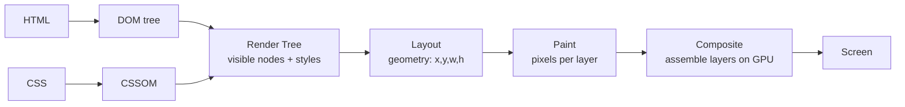
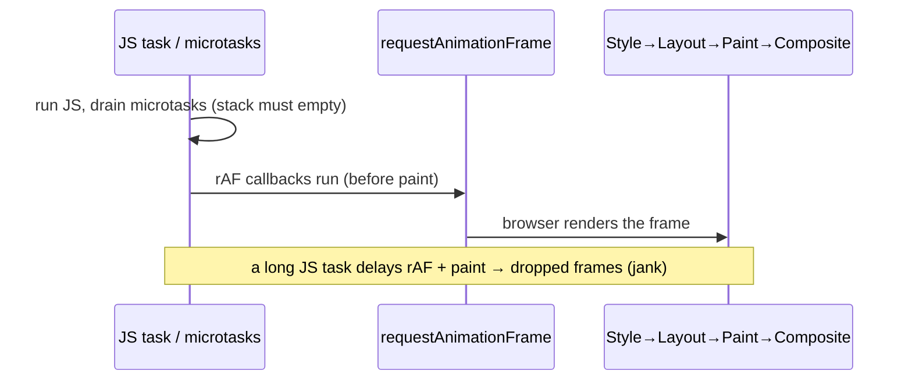

> Builds on Ch 02 (the main thread; paint happens between tasks) and pays off Ch 08 (why
> `transform` beats `top`). This is what happens *after* React commits to the DOM.

---

## The one mental model

> **The browser turns your DOM + CSS into pixels through a fixed pipeline:
> DOM + CSSOM → Render Tree → Layout (where/how big) → Paint (fill in pixels) → Composite
> (stack layers on the GPU). The golden rule: the LATER in the pipeline a change starts, the
> CHEAPER it is. Changing geometry (width/top) restarts at Layout (expensive). Changing colors
> restarts at Paint. Changing `transform`/`opacity` only re-composites (GPU, cheapest). All of
> this competes with JS for the ONE main thread (Ch 02).**

From this single ordering you derive: why `transform` animations are smooth and `top`
animations jank, what "layout thrashing" is and how to batch reads/writes, why `will-change`
helps, and why a long JS task blocks paint.

---

## Learning Objectives

1. Recite the pipeline and which stage each kind of change re-triggers.
2. Derive reflow (layout) vs repaint vs composite-only and their costs.
3. Explain layout thrashing and fix it by batching DOM reads then writes.
4. Connect "long task = no paint" back to Ch 02 and forward to Ch 08.

---

## Key Mental Models

- **Pipeline order = cost order.** Restart at Layout (worst) → Paint → Composite (best).
- **Reflow (layout)** recomputes geometry for the changed node *and often its neighbors/parents*.
- **`transform`/`opacity`** are handled by the compositor → skip layout & paint.
- **Layout is synchronous on the main thread.** Reading a layout property *forces* it to run now.

---

## Introduction

React's job ends at the DOM (Ch 03 commit). What turns that DOM into something you see — and why
some UI updates are buttery and others stutter — is this pipeline. It's the backbone of every
"make this animation/scroll smooth" and "why is my page janky" question, and it's the *why*
behind the virtualization `transform` trick in Ch 08.

---

## Problem

The browser must answer, for every element: what are you, how big are you, where do you go,
what color, and who's on top? It can't do that in one pass — size depends on CSS, position
depends on siblings, painting depends on position, stacking depends on paint. So it's staged.
And because there's one main thread (Ch 02), this work competes with your JS: a long task means
no frame gets painted, so the page freezes.



---

## Mental Model — what each change re-triggers

```
change a node's width / top / font-size / add-remove DOM
        └─▶ LAYOUT → PAINT → COMPOSITE        (reflow — most expensive)

change a node's color / background / box-shadow / visibility
        └─▶ PAINT → COMPOSITE                 (repaint — medium)

change a node's transform / opacity (on its own layer)
        └─▶ COMPOSITE only                    (cheapest — GPU)
```

This table is the whole chapter. Animate `transform: translateX()` not `left`. Animate
`opacity` not `visibility`/`display`. The smooth-vs-janky difference is which stage you restart.

---

## Engine Simulation — layout thrashing

The trap: interleaving DOM **reads** and **writes** forces layout to run repeatedly within one
frame.

```js
// ❌ thrashing: each read forces a synchronous layout because the previous write invalidated it
for (const box of boxes) {
  const w = box.offsetWidth;       // READ → forces layout (flush pending writes)
  box.style.width = w + 10 + "px"; // WRITE → invalidates layout
}                                  // next iteration's READ forces layout AGAIN → N layouts
```

```
write → invalidate → READ forces layout → write → invalidate → READ forces layout → ...
   (N elements ⇒ ~N synchronous layouts in one frame ⇒ jank)
```

Fix: **batch all reads, then all writes** (read phase / write phase):

```js
// ✅ one layout: read everything first, then write everything
const widths = boxes.map(b => b.offsetWidth);   // reads (one layout)
boxes.forEach((b, i) => b.style.width = widths[i] + 10 + "px"); // writes (one layout next frame)
```

Layout-forcing properties to know: `offsetTop/Width/Height`, `getBoundingClientRect()`,
`scrollTop`, `getComputedStyle()`. Reading any of these *flushes* pending style/layout work
synchronously — that's why reading them in a loop after writing thrashes.

---

## Where paint fits in the event loop (Ch 02 link)



`requestAnimationFrame` runs your callback right before the browser paints — the correct place
for visual updates (Ch 17). A 50ms JS task blows the ~16.7ms frame budget (60fps) → dropped
frames. Same lesson as Ch 02: keep main-thread tasks short or move work off-thread.

---

## Interview Discussion (reason first)

**Q1. "Why animate with `transform` instead of `top`/`left`?"**
> "`top`/`left` change geometry → restart at **Layout** every frame (then paint, composite) —
> expensive and janky. `transform` is handled by the **compositor** on the GPU → skips layout
> and paint, just re-composites. Same visual move, far cheaper. That's also why virtualized
> rows are positioned with `translateY` (Ch 08)."

**Q2. "What is layout thrashing and how do you fix it?"**
> "Forcing synchronous layout repeatedly by interleaving reads (`offsetWidth`,
> `getBoundingClientRect`) and writes in a loop — each read flushes the layout the previous
> write invalidated. Fix: batch all reads, then all writes, so layout runs once."

**Q3. "Why does a heavy JS loop freeze animations?"**
> "One main thread. Layout/paint happen between tasks; while JS runs, no frame is produced. A
> task over the ~16ms frame budget drops frames. Chunk the work or use a Web Worker (Ch 02/17)."

*Scoring:* full = pipeline-order-is-cost + transform-skips-layout + thrashing read/write batching.

---

## Common Mistakes

- **Animating `width`/`height`/`top`/`margin`** for smooth motion — use `transform`/`opacity`.
- **Reading layout props inside a write loop** → thrashing.
- **Overusing `will-change`/layer promotion** — too many GPU layers costs memory; use sparingly.
- **Blaming React for jank** that's actually layout/paint or a long task (profile — Ch 08).
- **Thinking `display:none`→`block` is cheap** — it's a reflow (and remounts in React subtrees).

---

## Interview Questions

1. For each: width change, color change, `transform` — which pipeline stages re-run?
2. Write thrashing code, then fix it; explain why the fix is one layout.
3. What's the frame budget at 60fps, and what happens to paint during a 40ms task?
4. Why is `transform` GPU-composited and `top` not?
5. Where does `requestAnimationFrame` fire relative to paint, and why use it for visual updates?

---

## Homework

1. Animate a box across the screen two ways (`left` vs `transform`); record both in the
   Performance panel and compare the green (paint)/purple (layout) bars.
2. Reproduce layout thrashing with `offsetWidth` in a loop; fix with read/write batching;
   measure the layout count.
3. In `NOTES.md`: the cost-ordered pipeline in one line, plus the three change→stage rules.

---

## Summary

- Pixels come from **DOM+CSSOM → Render Tree → Layout → Paint → Composite**, and **pipeline
  order = cost order** (later start = cheaper).
- **Geometry changes reflow (Layout); color changes repaint (Paint); `transform`/`opacity`
  only composite (GPU)** — animate the last kind.
- **Layout thrashing** = interleaved reads/writes forcing repeated synchronous layout; fix by
  batching reads then writes.
- It all runs on the **one main thread** (Ch 02): long tasks block paint → jank;
  `requestAnimationFrame` is the slot just before paint.

## Go deeper
Ch 08 turns these rules into perf wins (virtualization `transform`, profiling). Mariko Kosaka's
*Inside look at modern web browsers* illustrates the pipeline if you want visuals later.
