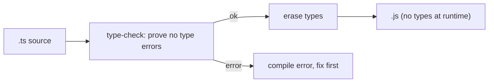

> JD-critical: TS is core stack. Builds on Ch 01 (values/references). This chapter is about the
> *type-level* program that runs alongside your JS at compile time.

---

## The one mental model

> **A type is a SET of possible values. `string` is the set of all strings; `42` is a set with
> one element; `"a" | "b"` is a two-element set; `boolean` is `true | false`. Assignability is
> just the subset question: `x: A` is assignable to `B` if A's set ⊆ B's set. Generics are
> FUNCTIONS at the type level — they take types in and return types out. The whole type system
> is set theory + functions over sets, checked at compile time and erased at runtime.**

From "types are sets" you derive: why unions widen and intersections narrow, why narrowing
works, why `any` is poison (the universal set that disables checking), what `unknown` vs `never`
are (the full set vs the empty set), and how utility types are computed. No memorizing utility
types — you'll derive them.

---

## Learning Objectives

1. Reason about assignability as subset relations; place `any`/`unknown`/`never` in the lattice.
2. Use unions + **narrowing** and **discriminated unions** to model state safely.
3. Read/write generics as type-level functions; understand inference and constraints.
4. Derive utility types (`Partial`/`Pick`/`Record`/`ReturnType`) from mapped/conditional types.

---

## Key Mental Models

- **Type = set of values; assignable = subset.**
- **Union `A | B` = set union** (wider, fewer guarantees). **Intersection `A & B` = must be
  both** (narrower, more guarantees).
- **`unknown` = the universal set** (everything; must narrow before use). **`never` = empty set**
  (nothing; the impossible/exhaustiveness type). **`any` = opt out of the system.**
- **Generics = functions from types to types.** `Array<T>` is a type-level function call.
- **Types are erased at runtime.** No type info exists in the running JS (Ch 01).

---

## Introduction

At SDE-2 you won't be asked "what's an interface." You'll be asked to model state so illegal
states are unrepresentable, type a reusable generic component/hook, and explain why some
assignment errors (or doesn't). All of it flows from "types are sets."

---

## Problem

JS has no compile-time guarantees: `user.adress` (typo) or `"5" - 1` blow up at runtime. The
designers' problem: add a *checker* that proves whole classes of bugs gone *before* running,
without changing the runtime. Solution: a structural type layer over JS values, fully erased
at compile time. "Structural" = a value fits a type if its *shape* matches (it has the right
members) — not by name/declaration. That's the set view again: the type is the set of all
shapes with those members.



---

## Engine Simulation — sets, narrowing, the lattice

```ts
type Status = "idle" | "loading" | "error" | "success";  // a 4-element set
let s: Status = "loading";  // ok: "loading" ⊆ Status
// s = "done";              // ✗ "done" ∉ the set

function f(x: string | number) {
  // here x ∈ (string ∪ number); .toUpperCase() needs string only
  if (typeof x === "string") {
    // NARROWED: in this branch x's set is reduced to string → string methods allowed
    return x.toUpperCase();
  }
  return x.toFixed(2);  // here x narrowed to number
}
```

The lattice (who is a subset of whom):

```
            unknown   (universal set — everything assignable TO it; nothing FROM it w/o narrowing)
           /   |   \
        string number boolean ...        each a subset of unknown
           \   |   /
             never     (empty set — assignable to EVERYTHING, nothing assignable to it)

   any  =  escape hatch: assignable both ways, turns checking OFF (avoid)
```

`never` as exhaustiveness check (a real interview favorite):

```ts
function render(s: Status) {
  switch (s) {
    case "idle": case "loading": case "error": case "success": return ...;
    default: const _exhaustive: never = s;  // if a new Status is added, this errors → safety
  }
}
```

---

## Discriminated unions — make illegal states impossible

The single most useful React TS pattern. Instead of optional fields that can contradict:

```ts
// ✗ allows nonsense: loading:true with data present, or error with data
type Bad = { loading: boolean; data?: Contact[]; error?: Error };

// ✓ a tagged union: each variant carries exactly its valid fields
type State =
  | { status: "loading" }
  | { status: "error"; error: Error }
  | { status: "success"; data: Contact[] };
```

The `status` tag is the **discriminant**: checking it narrows the union to one variant, so
`state.data` only type-checks inside the `"success"` branch. Illegal combinations literally
cannot be constructed. This pairs perfectly with the Ch 12 "cover all four states" rule.

---

## Generics = type-level functions

```ts
function first<T>(arr: T[]): T | undefined { return arr[0]; }
first([1, 2, 3]);      // T inferred as number → returns number | undefined
first(["a"]);          // T inferred as string

// constraints = restrict the input set
function pluck<T, K extends keyof T>(obj: T, key: K): T[K] { return obj[key]; }
pluck({ name: "Ada", age: 36 }, "age");  // K ⊆ ("name"|"age"); returns number
```

`T` is a parameter to a type-level function; `extends` constrains which types are allowed in
(a subset bound). Inference is TS solving for `T` from the arguments.

Typing a generic React component (JD-relevant — a reusable `<Table>`):
```ts
type Column<T> = { key: keyof T; header: string; render?: (row: T) => ReactNode };
function Table<T>({ rows, columns }: { rows: T[]; columns: Column<T>[] }) { /* ... */ }
// <Table rows={contacts} columns={...}/> — T inferred as Contact, keys checked
```

---

## Utility types — derived, not memorized

They're just mapped + conditional types (functions over the members of a type):

```ts
type Partial<T>  = { [K in keyof T]?: T[K] };        // map each key → optional
type Required<T> = { [K in keyof T]-?: T[K] };        // remove optional
type Readonly<T> = { readonly [K in keyof T]: T[K] };
type Pick<T, K extends keyof T> = { [P in K]: T[P] }; // keep only keys in K
type Record<K extends keyof any, V> = { [P in K]: V };
type ReturnType<F> = F extends (...a: any[]) => infer R ? R : never;  // conditional + infer
```

Read `ReturnType` as: "if F is a function type, capture its return as `R` and return it, else
`never`." `infer` binds a type variable inside a conditional. Once you can read these, you never
memorize the utility list — you reconstruct it.

---

## Interview Discussion (reason first)

**Q1. "Why is `any` bad but `unknown` fine?"**
> "`any` opts out of the type system — it's assignable both directions, so it disables checking
> and lets runtime bugs through. `unknown` is the universal set: you can assign anything *to* it,
> but you must **narrow** it before use, so safety is preserved. `unknown` is the safe top type;
> `any` is a hole."

**Q2. "How do you model a fetch state so impossible combos can't exist?"**
> Discriminated union on a `status` tag (above). Checking the tag narrows to one variant; fields
> only exist where valid. Eliminates "loading && error && data" nonsense.

**Q3. "What does `keyof`/`extends keyof` buy you?"**
> "`keyof T` is the union of T's keys (a set of string literals). `K extends keyof T` constrains
> a generic to be one of those keys, so `obj[key]` is type-safe and the return type `T[K]` is
> exact — that's how type-safe property access / a generic table column works."

*Scoring:* full = sets/subset language + discriminated unions + generics-as-functions. Fail =
listing syntax without the set intuition.

---

## Common Mistakes

- **Reaching for `any`** to silence errors (use `unknown` + narrow, or fix the type).
- **Optional-field state** that allows contradictions instead of a discriminated union.
- **Over-generic code** — generics with no relationship between params add noise; only
  generalize when types actually relate.
- **Confusing type-space and value-space** (`typeof`/`keyof` are type-level; erased at runtime).
- **Trusting types at runtime** — types are erased; validate external data with a runtime schema
  (zod, Ch 18) at the boundary.

---

## Interview Questions

1. Explain assignability for `"a" | "b"` vs `string`. Which way does it go and why (subsets)?
2. Place `any`, `unknown`, `never` in the lattice; give a real use for `never`.
3. Model a contacts-fetch state as a discriminated union; show narrowing.
4. Write `pluck<T, K extends keyof T>` and explain the constraint.
5. Implement `ReturnType<F>` and read it aloud.

---

## Homework

1. Convert a boolean-flag fetch state to a discriminated union; try to construct an illegal
   state and watch the compiler stop you.
2. Hand-write `Partial`, `Pick`, `Record` from scratch (no `import`); verify against the lib types.
3. Type a generic `useFetch<T>()` hook returning a discriminated union; in `NOTES.md` note why
   the union beats `{data?, error?, loading}`.

---

## Summary

- **Types are sets; assignability is the subset question.** Union = wider, intersection =
  narrower.
- **`unknown` = universal set (narrow before use), `never` = empty set (exhaustiveness),
  `any` = opt-out (avoid).**
- **Discriminated unions** make illegal states unrepresentable — the key React state pattern.
- **Generics are type-level functions**; `extends` constrains the input set; inference solves
  for the type variable.
- **Utility types are mapped/conditional types** you can derive; types are **erased at runtime**,
  so validate external data with a schema at the boundary.

## Go deeper
Matt Pocock's *Total TypeScript* (free Beginner's + Type Transformations) is the best practice
ground once the set model is solid. Ch 18 covers runtime validation (zod) at the data boundary.
