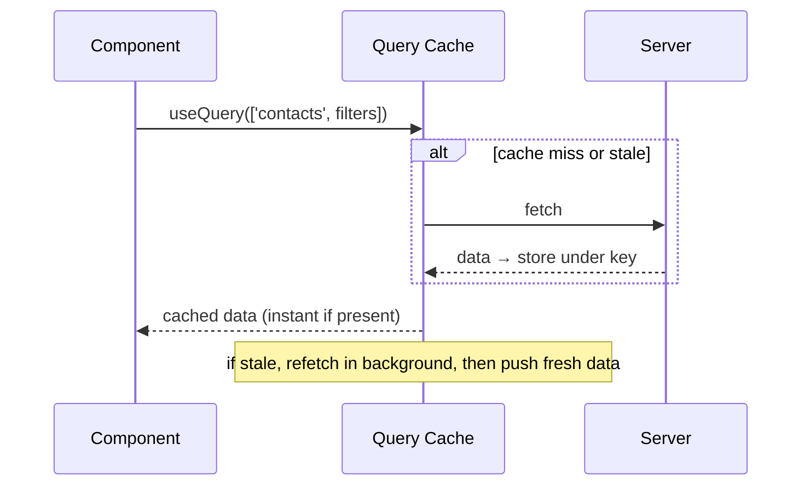
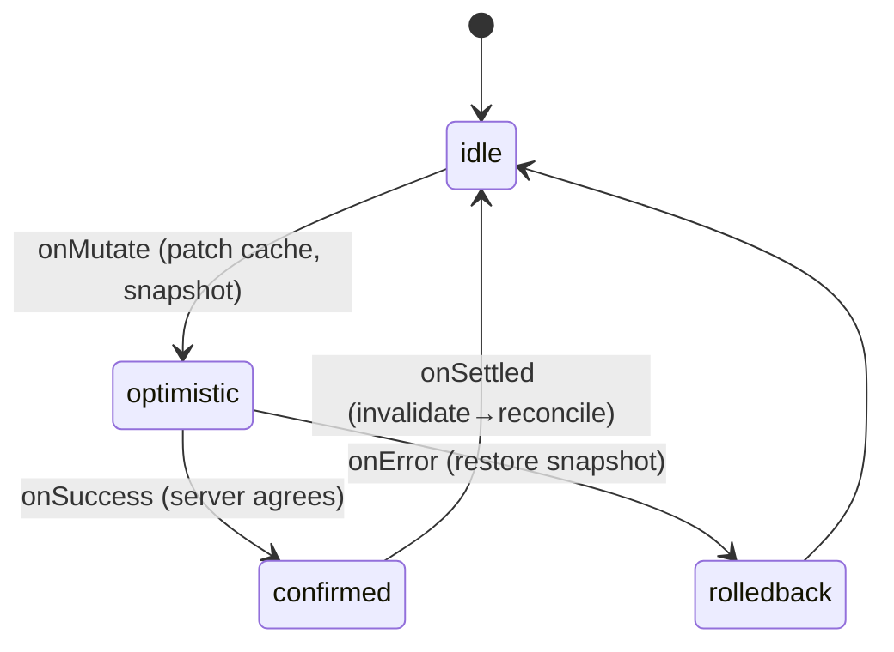

> Builds on Ch 02 (async/promises), Ch 03 (state & re-render), Ch 05 (effects). JD-critical:
> a product company lists TanStack Query twice. It's the data layer behind Interviewer's contacts table.

---

## The one mental model

> **Server state is not your state — it's a CACHE of data that lives on someone else's machine
> and can go stale at any moment. So you don't "store" it in `useState`; you cache it keyed by
> *what you asked for* (the query key), and you adopt a policy: show the cached copy instantly,
> and revalidate in the background (stale-while-revalidate). TanStack Query is that cache +
> policy engine. Every feature — staleTime, refetch, invalidation, optimistic updates — is just
> a knob on "how fresh must this cached copy be, and when do I re-ask?"**

From this you derive the whole API. You won't memorize options; you'll ask "what does this knob
do to cache freshness?" and the name explains itself.

---

## Learning Objectives

1. Explain why server state needs a different tool than `useState`/Redux (the core "why").
2. Use query keys as cache identity; explain `staleTime` vs `gcTime` precisely.
3. Explain invalidation and optimistic updates (the contacts-table status flip).
4. Map TanStack onto the windowed/infinite contacts list.

---

## Key Mental Models

- **Server state = remote, shared, async, can-go-stale.** Client state = yours, synchronous.
- **Query key = cache key.** Same key → same cached entry, deduped across components.
- **stale-while-revalidate:** serve cache now, refetch in background, swap when fresh arrives.
- **`staleTime`** = how long "fresh" (no refetch). **`gcTime`** = how long an *unused* entry
  stays in memory before garbage collection. Different axes.

---

## Introduction

The classic mistake is treating fetched data like local state: `useEffect(fetch)` +
`useState(data)` + manual loading/error flags, duplicated in every component, with no caching,
deduping, or refetch policy. TanStack Query exists because "data from a server" has properties
local state doesn't — it's shared, it goes stale, multiple components want the same data, and
you need loading/error/refetch handling. Once you see fetched data as a *cache*, the library is
obvious.

---

## Problem

```jsx
function Contacts() {
  const [data, setData] = useState(null);
  const [loading, setLoading] = useState(true);
  const [error, setError] = useState(null);
  useEffect(() => {
    setLoading(true);
    fetch("/contacts").then(r => r.json()).then(setData).catch(setError)
      .finally(() => setLoading(false));
  }, []);
  // ...repeat this in every component that needs contacts
}
```

Problems: no caching (refetches on every mount), no dedup (two components = two requests), no
background refresh, no shared invalidation, stale-closure risk (Ch 05), boilerplate everywhere.
The root issue: you're hand-rolling a cache badly. The designers' move: **extract the cache and
the fetch policy into a library**, keyed by the request.



---

## Engine Simulation — the cache lifecycle

```jsx
const { data, isLoading, isFetching } = useQuery({
  queryKey: ['contacts', { filters, page }],
  queryFn: () => api.getContacts(filters, page),
  staleTime: 30_000,   // fresh for 30s → no refetch on remount/focus within 30s
  gcTime: 5*60_000,    // keep unused cache 5 min, then drop
});
```

Trace it:

```
mount #1:  key ['contacts',{...}] not in cache → fetch → store → status 'success'
           isLoading true→false; data shown
remount within 30s:  key present & FRESH (within staleTime) → serve cache, NO fetch
remount after 30s:   key present but STALE → serve cache instantly + refetch in background
                     (isFetching=true while data still shows; swaps when fresh arrives)
component unmounts:  entry becomes 'inactive'; gcTime timer starts
no observers for 5min: entry garbage-collected
```

Two distinct timers, the classic interview confusion:
- **`staleTime`** governs *refetching* (freshness). High staleTime = fewer requests.
- **`gcTime`** governs *memory* (how long an unused entry survives so a remount is instant).

`isLoading` = first load, no data yet. `isFetching` = any fetch in flight (incl. background
revalidation while showing stale data). Showing a subtle spinner on `isFetching` but content on
`data` is the stale-while-revalidate UX.

---

## Mutations & optimistic updates (the contacts status flip)

Interviewer's table edits a contact's status inline. You don't want to refetch 500k rows. Two moves:

**Invalidate** (simple): after the mutation, mark queries stale so they refetch.
```jsx
const m = useMutation({
  mutationFn: updateStatus,
  onSuccess: () => qc.invalidateQueries({ queryKey: ['contacts'] }),
});
```

**Optimistic update** (instant UX): patch the cache *before* the server confirms, roll back on
error. This is what makes a 500k-row table feel instant.
```jsx
useMutation({
  mutationFn: updateStatus,
  onMutate: async (next) => {
    await qc.cancelQueries({ queryKey: ['contacts'] });      // stop races
    const prev = qc.getQueryData(['contacts']);              // snapshot for rollback
    qc.setQueryData(['contacts'], patch(prev, next));        // patch cache now
    return { prev };
  },
  onError: (_e, _next, ctx) => qc.setQueryData(['contacts'], ctx.prev), // rollback
  onSettled: () => qc.invalidateQueries({ queryKey: ['contacts'] }),    // reconcile
});
```



---

## Infinite/windowed contacts list

`useInfiniteQuery` pages data with a cursor; pair it with virtualization (Ch 08): the **query
cache** holds the fetched pages (data layer), the **virtualizer** decides which cached rows are
in the DOM (view layer). Real-time status events `setQueryData` to patch a row in the cache; if
the row is visible it re-renders in place (Ch 06 keyed), if off-screen it's correct when
scrolled to. This is the clean "data layer vs DOM layer" separation Interviewer probed — see
the interview guide §2f.

---

## Interview Discussion (reason first)

**Q1. "Why not just `useState` + `useEffect` to fetch?"**
> "Because server data is a *cache*, not local state — it's shared, async, and goes stale.
> Hand-rolling means no dedup, no caching, no background refresh, no shared invalidation, and
> stale-closure bugs. TanStack centralizes the cache keyed by the request and gives a refetch
> policy."

**Q2. "staleTime vs gcTime?"**
> "`staleTime` = how long data is considered fresh, so no refetch happens (controls requests).
> `gcTime` = how long an *unused* cache entry stays in memory before it's dropped (controls
> memory / instant remounts). Orthogonal: a query can be stale but still cached."

**Q3. "Edit one contact's status in a 500k table — how, without refetching everything?"**
> "Optimistic update: `onMutate` cancels in-flight queries, snapshots, and `setQueryData`
> patches just that row so the UI flips instantly; `onError` rolls back to the snapshot;
> `onSettled` invalidates to reconcile with the server. No full refetch."

*Scoring:* full = cache framing + two-timers + optimistic flow with rollback. Fail = "it's like
Redux for API calls."

---

## Common Mistakes

- **Putting server data in Redux/`useState`** and syncing manually — re-implementing TanStack badly.
- **Confusing `staleTime` and `gcTime`** (or thinking `staleTime: Infinity` frees memory — it
  doesn't; that's `gcTime`).
- **Unstable query keys** (new object identity that's actually the same query, or missing a
  variable the query depends on → stale data).
- **Optimistic update without `cancelQueries`** → an in-flight refetch overwrites your patch.
- **Forgetting rollback** on error → UI lies.

---

## Interview Questions

1. Why is server state categorically different from client state? Give 3 properties.
2. Walk the cache lifecycle of a query across mount → remount-fresh → remount-stale → unmount.
3. Implement an optimistic status toggle with rollback; why `cancelQueries` first?
4. How do query cache + virtualization split responsibilities in the contacts list?
5. `isLoading` vs `isFetching` — when does each fire?

---

## Homework

1. Replace a `useEffect`+`useState` fetch with `useQuery`; toggle `staleTime` and watch refetch
   behavior on remount/refocus in the Network tab.
2. Build an optimistic toggle (a "favorite" star); force the server to error and confirm rollback.
3. In `NOTES.md`: one line each for staleTime, gcTime, invalidate, optimistic update.

---

## Summary

- **Server state is a cache of remote data**, not local state — that single reframe justifies
  the whole library.
- **Query key = cache identity** (dedup + sharing). **stale-while-revalidate**: serve cache,
  refetch in background.
- **`staleTime`** controls freshness/refetching; **`gcTime`** controls how long unused cache
  survives in memory. Different axes.
- **Mutations**: `invalidateQueries` (simple) or **optimistic update** (`onMutate` patch +
  snapshot → `onError` rollback → `onSettled` reconcile) for instant UX on big tables.
- Pair `useInfiniteQuery` (data layer) with virtualization (view layer) — clean separation.

## Go deeper
TkDodo's *Practical React Query* posts are the definitive deep-dive once this model is solid.
The contacts-table real-time UX is in the interview guide §2.
