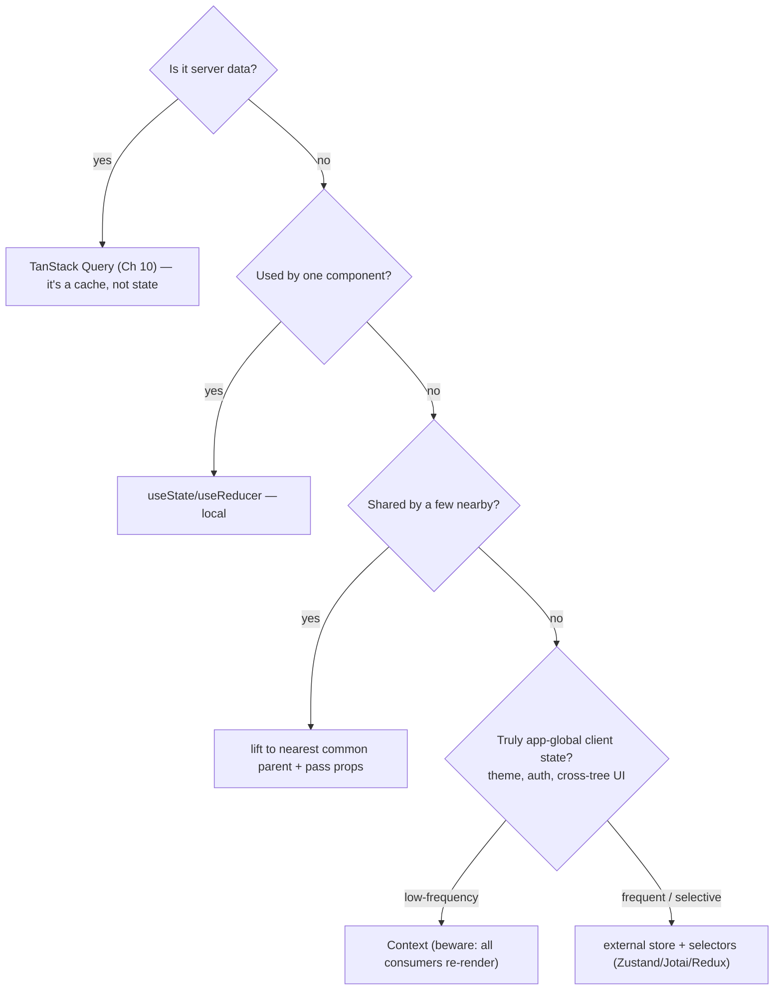

> Builds on everything so far. Covers the design-system / state-landscape / shadcn-Tailwind
> ground Interviewer probes, and the system-design framing for the contacts-table question.

---

## The one mental model

> **Architecture is about CONTAINING CHANGE. Every decision answers: "when requirements change,
> how small can I make the blast radius?" Two levers do most of the work: (1) put state as LOW
> (close to where it's used) as possible so changes stay local, and (2) hide volatile details
> behind STABLE boundaries (components, hooks, modules) so callers don't break when internals
> change. Good structure isn't about folders — it's about who has to change when something does.**

From "contain change" you derive: why colocation beats global state, why server state is its own
category (Ch 10), why composition beats configuration (Ch 24), why design systems exist, and how
to reason about a frontend system-design question.

---

## Learning Objectives

1. Choose where state lives (the state-location decision tree) and why colocation wins.
2. Map the state-management landscape (local / lifted / context / external store / server) and
   pick correctly — including Zustand's model.
3. Explain design systems, Tailwind, and shadcn/ui as change-containment strategies.
4. Run a frontend system-design interview (the contacts table) with a repeatable framework.

---

## Key Mental Models

- **Colocation:** keep state next to its only consumer; lift only when genuinely shared.
- **Boundaries:** a component/hook/module exposes a stable contract; internals can change freely.
- **State has categories**, each with a right tool — don't put one kind in another's tool.
- **Design system = one source of truth for UI**, so a change propagates once.

---

## Introduction

At SDE-2, "architecture" means making sane structural calls and defending them with tradeoffs —
not reciting folder layouts. The throughline is containing change. The same lens answers "where
should this state go," "Context or Zustand," "how do we keep UI consistent," and "design the
contacts page."

---

## Problem — where does state go?

Put everything in a global store and every change risks re-rendering and breaking unrelated
features (wide blast radius, Ch 08 perf). Put everything local and you can't share what must be
shared. The skill is matching each piece of state to the smallest scope that works.



---

## The state-management landscape (derived)

| State kind | Tool | Why |
|---|---|---|
| One component | `useState`/`useReducer` | Lowest blast radius |
| A few nearby | Lift + props | Still local-ish, explicit |
| App-global, rarely changes | **Context** | Simple; but every consumer re-renders on change |
| App-global, changes often / selective reads | **Zustand / Jotai / Redux** | Subscribe to slices |
| Remote/shared/async | **TanStack Query** (Ch 10) | It's a cache with a refetch policy |

**Why Context isn't a state manager:** a Context value change re-renders *all* consumers (no
selective subscription). Fine for theme/auth (rare changes); bad for high-frequency state.

**Zustand's model (interview-ready):** a store outside React; components subscribe via a
**selector** and only re-render when *their selected slice* changes — no provider, no
context re-render tax. `const count = useStore(s => s.count)`. That selector subscription is the
key difference from Context. Jotai = atomic (bottom-up atoms); Redux = single store + reducers +
middleware (more ceremony, great devtools/time-travel, mostly superseded by Query+Zustand for
new apps).

---

## Design systems, Tailwind & shadcn (they ask)

**Problem:** without a single source of truth, every team reinvents buttons/spacing/color →
inconsistent UI, change-it-in-50-places.

- **Design tokens** (color/spacing/typography scales) = the vocabulary. Change once, propagates.
- **Tailwind** = utility classes mapped to tokens (config). No CSS-file context switch; tiny
  prod CSS (unused classes purged); consistency by construction. Tradeoff: verbose class lists.
- **shadcn/ui** = NOT an npm dependency. A CLI **copies component source into your repo**, built
  on **Radix UI** primitives (accessible, unstyled behavior) + Tailwind styles. You **own** the
  code, so it's a starting point you customize — not a locked black box. This is its whole pitch:
  composable, accessible, owned. (Contrast MUI/AntD: installed, themed-but-constrained.)
- **Framer Motion** = declarative animation (`layout`, `AnimatePresence` for exit); respect
  `prefers-reduced-motion` (Ch 23).

---

## Folder structure & scaling (briefly)

Organize by **feature**, not by file-type — colocate a feature's components/hooks/api/tests so a
change touches one folder (containment again). A shared `ui/` (design system) + `lib/` (utils) +
`features/<x>/`. *Bulletproof React* is a good reference shape. Monorepos (Turborepo) share
packages across apps with enforced boundaries.

---

## Frontend system design framework (use on the contacts table)

```
1. Clarify   — scale, data shape, read/write patterns, real-time?, devices, constraints
2. Data      — API shape, pagination (cursor vs offset), caching layer (Ch 10), source of truth
3. Rendering — virtualization?, what re-renders, the four states (loading/empty/error/data)
4. State     — selection model, filters in URL, optimistic updates
5. Realtime  — patch-in-place vs banner (Ch 08 §2f), scroll anchoring
6. Cross-cuts— a11y (Ch 23), perf budget (Ch 08), error handling (Ch 22), tradeoffs out loud
```

Apply it and you reproduce the full contacts-table answer in the interview guide §2.

---

## Interview Discussion (reason first)

**Q1. "Context vs Zustand vs Redux — when each?"**
> "Context for low-frequency global values (theme/auth) — but every consumer re-renders on
> change, so not for hot state. Zustand for app-global client state with frequent/selective
> reads — selector subscriptions avoid the Context re-render tax, no provider boilerplate.
> Redux when you need its middleware/devtools/time-travel or a big team convention; for new apps
> TanStack Query (server) + Zustand (client) usually covers it."

**Q2. "Where should state live?"**
> Walk the decision tree: server → Query; single consumer → local; few → lift; global → context
> (rare changes) or store (frequent). "Default to the lowest scope; lifting is a deliberate
> choice with a re-render cost."

**Q3. "What is shadcn and why not just use MUI?"**
> "shadcn copies accessible Radix-based components into your repo so you own and customize the
> code — a design-system starting point, not a dependency. MUI/AntD are installed libraries:
> faster to start, but you're constrained by their theming and ship their bundle. shadcn trades
> a little setup for full ownership and Tailwind consistency."

*Scoring:* full = containment lens + selector-vs-context-rerender + shadcn-is-owned-source.

---

## Common Mistakes

- **Global store as a dumping ground** → wide re-renders, coupling. Colocate first.
- **Server data in Redux/Context** → re-implementing Query badly (Ch 10).
- **Context for high-frequency state** → all consumers re-render.
- **Folder-by-type at scale** → a feature change is scattered across many folders.
- **Reaching for Redux reflexively** when Query + local + a little Zustand suffices.

---

## Interview Questions

1. Walk the state-location decision tree for: form input, current theme, fetched contacts,
   a cross-page wizard step.
2. Why does a Context value change re-render all consumers, and how does Zustand avoid it?
3. Explain shadcn vs a component library; what's the tradeoff?
4. Run the system-design framework on "design a notifications dropdown with unread counts."
5. Feature-folders vs type-folders — argue for one via "blast radius."

---

## Homework

1. Take a small app that overuses Context; move one piece to local state and one to a Zustand
   selector; observe re-render differences in the Profiler.
2. Add a shadcn component to a Vite+Tailwind app; inspect the copied source and customize it.
3. In `NOTES.md`: the state-location decision tree from memory + one line on Zustand selectors.

---

## Summary

- **Architecture = containing change**: state as low as possible + stable boundaries around
  volatile details. Folders are downstream of this.
- **Match state to its category:** local / lifted / Context (rare global) / external store
  (frequent global, selector subscriptions) / server (Query, Ch 10).
- **Context re-renders all consumers; Zustand subscribes to slices** — the core distinction.
- **Design system + tokens + Tailwind + shadcn** contain UI change; shadcn copies owned,
  accessible Radix source rather than installing a constrained library.
- A **repeatable system-design framework** (clarify→data→render→state→realtime→cross-cuts)
  turns the contacts table into a structured answer.

## Go deeper
Ch 24 (design patterns) is the component-level companion; Ch 21 goes deeper on state managers;
the contacts-table worked answer is in the interview guide.
