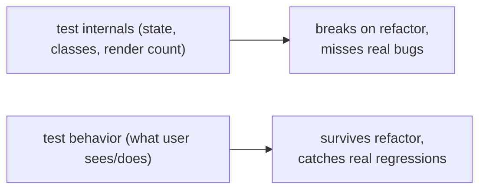

> Builds on Ch 03/05 (components/hooks), Ch 10 (async data). The JD values "clean, maintainable,
> scalable code" and shipping weekly — tests are how you ship fast without fear.

---

## The one mental model

> **Test BEHAVIOR at a boundary, not implementation details. Pick the boundary a real consumer
> sees — for a component, that's what the USER sees and does (rendered output + interactions);
> for a module, that's its public API. Tests coupled to internals (state names, private methods,
> render counts) break on every refactor and test nothing real. The goal is confidence per unit
> of maintenance: a test should fail when the behavior breaks and ONLY then.**

From "behavior at a boundary" you derive why React Testing Library queries by role/text (what
the user perceives) not by class, why you mock the network (a real boundary) but not internal
functions, and where unit / integration / e2e each pay off (the testing trophy).

---

## Learning Objectives

1. Test behavior, not implementation; explain why that survives refactors.
2. Use React Testing Library queries (role/label/text) and user-event interactions.
3. Mock the network boundary with MSW; test async UI (loading/error/data).
4. Place unit vs integration vs e2e (the trophy) and pick per cost/confidence.

---

## Key Mental Models

- **A good test asserts what a user/consumer observes**, so refactors that preserve behavior
  don't break it.
- **Query like a user:** by role, label, visible text — not by test-id-everything or CSS class.
- **Mock real boundaries** (network) — not your own internals.
- **Integration tests give the best confidence-per-cost** for UI (the trophy's fat middle).

---

## Introduction

Most teams test poorly: brittle tests tied to implementation that break on refactor and don't
catch real bugs. The fix is one principle — test behavior at a boundary — which is exactly how
React Testing Library is designed ("the more your tests resemble the way your software is used,
the more confidence they give"). Internalize that and the tooling follows.

---

## Problem — implementation tests rot

```jsx
// ❌ implementation-coupled: asserts internal state + structure
expect(wrapper.state('isOpen')).toBe(true);
expect(wrapper.find('.dropdown-inner').length).toBe(1);
```

Rename `isOpen`, restructure the markup, or switch to a hook — these tests break though the UI
works identically. They test *how* it's built, not *what* it does. Refactors become expensive;
people stop refactoring. The boundary is wrong.



---

## Engine Simulation — a behavior test (RTL)

```jsx
test("submitting the form shows a success message", async () => {
  render(<ContactForm />);
  // query like a user perceives the UI:
  await userEvent.type(screen.getByLabelText(/email/i), "ada@x.com");
  await userEvent.click(screen.getByRole("button", { name: /save/i }));
  // assert observable behavior:
  expect(await screen.findByText(/saved/i)).toBeInTheDocument();
});
```

Why this is robust: it names elements the way a user does (the label "Email", the button "Save"),
acts via real interactions (`userEvent`), and asserts visible output. Rename a state variable,
swap a `div` for a `section`, refactor to a hook — the test still passes because the *behavior* is
unchanged. Query priority (most→least preferred): **role → label → text → test-id** (test-id only
when nothing user-facing fits).

`findBy*` (async) waits for the element to appear — essential for data that arrives after a
fetch (Ch 02 microtasks). `getBy*` is sync (must exist now), `queryBy*` for asserting absence.

---

## Mocking the boundary — MSW

```js
// Mock the NETWORK (a real boundary), not your fetch function
const server = setupServer(
  http.get("/contacts", () => HttpResponse.json([{ id: 1, name: "Ada" }]))
);
test("renders contacts from the API", async () => {
  render(<Contacts />);
  expect(await screen.findByText("Ada")).toBeInTheDocument();   // loading → data
});
```

MSW (Mock Service Worker) intercepts requests at the network layer, so your code's real
fetch/Query path runs — you're testing the actual integration, just with a controlled server.
Far better than stubbing your own `api.getContacts` (which skips the real code path). You can also
return a 500 to test the error state, and delay to test loading.

---

## The testing trophy (placement)

```
        /\        e2e (Playwright/Cypress): real browser, whole flows.
       /  \       High confidence, slow/flaky/expensive → few, critical paths.
      /----\
     /      \     INTEGRATION (RTL + MSW): components + real interactions + mocked network.
    /        \    Best confidence-per-cost → the bulk of UI tests.
   /----------\
  /            \  unit: pure functions, hooks, utils. Fast, cheap → many, for logic.
 /--------------\
  static: TypeScript + ESLint  (catch a whole class of bugs for free — Ch 09)
```

- **Static** (TS, lint) — free bug class elimination; the base.
- **Unit** — pure logic (a reducer, a `formatDate`, a validation fn). Fast/cheap.
- **Integration** — render a feature, interact, assert; mock only the network. **Where to invest.**
- **E2E** — real browser, critical user journeys (login, checkout). Few, because slow/flaky.

Old "test pyramid" said mostly unit; the trophy says mostly **integration** for UI, because that's
where real confidence lives for component apps.

---

## Interview Discussion (reason first)

**Q1. "Why query by role/text instead of class or test-id?"**
> "Because tests should resemble how users use the app — they find a button by its label, not by
> `.btn-primary`. Querying by role/label means the test asserts real, accessible behavior and
> survives refactors that change structure but not behavior. test-id is a last resort."

**Q2. "What do you mock?"**
> "Real boundaries — the network (MSW), time, randomness. Not my own modules. Mocking internals
> tests the mock, not the code; mocking the network lets the real fetch/render path run with a
> controlled response, so I can test loading/error/success for real."

**Q3. "Unit vs integration vs e2e — where do you invest?"**
> "Static + unit for pure logic; the bulk in **integration** (RTL + MSW) for best
> confidence-per-cost; a few **e2e** for critical journeys since they're slow/flaky. That's the
> testing trophy — UI confidence comes from integration, not a pile of unit tests."

*Scoring:* full = behavior-at-boundary + query-like-user + mock-network-not-internals + trophy.

---

## Common Mistakes

- **Asserting internal state / render counts / CSS classes** → brittle, refactor-hostile.
- **Mocking your own functions** instead of the network → tests the mock.
- **`getBy` for async content** (throws before it arrives) — use `findBy`.
- **Over-investing in e2e** → slow, flaky suites people start ignoring.
- **Snapshot tests of everything** → noise; they assert structure, not behavior.

---

## Interview Questions

1. Rewrite an implementation-coupled test as a behavior test; why does the new one survive a
   refactor?
2. RTL query priority — why role first, test-id last?
3. Why mock with MSW instead of stubbing `api.getX`? What does each test path cover?
4. Place these on the trophy: a date formatter, a checkout flow, a search-and-filter feature.
5. `getBy` vs `findBy` vs `queryBy` — when each?

---

## Homework

1. Write an RTL test for a form: type, submit, assert a success message — using only role/label
   queries. Then refactor the component's internals and confirm the test still passes.
2. Add MSW; test loading → data and a 500 → error path for a TanStack-Query component.
3. In `NOTES.md`: the trophy layers + "test behavior at a boundary" in one line.

---

## Summary

- **Test behavior at a consumer boundary**, not implementation — that's what survives refactors
  and catches real regressions.
- **RTL queries like a user** (role → label → text → test-id) and acts via `userEvent`; use
  `findBy` for async content.
- **Mock real boundaries (network via MSW)**, not your own internals, so the real code path runs.
- **Testing trophy:** static (TS/lint) + unit (logic) + heavy **integration** (best
  confidence-per-cost) + few **e2e** (critical journeys).

## Go deeper
Ch 09 (TS as the static base), Ch 10 (testing Query components with MSW). Kent C. Dodds'
testing-trophy writing is the canonical source once this principle is solid.
