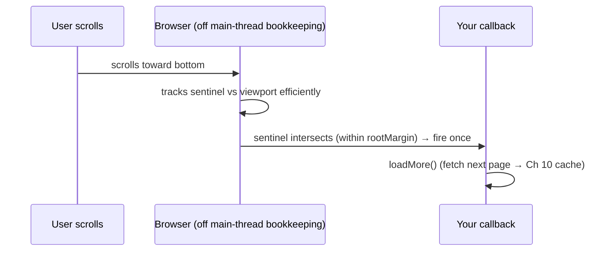

> Builds on Ch 02 (event loop, off-main-thread), Ch 07 (paint timing), Ch 08 (perf). These are
> the browser primitives behind infinite scroll, smooth animation, and not-freezing-the-tab.

---

## The one mental model

> **The browser gives you EVENT-DRIVEN primitives so you never have to POLL or BLOCK. Instead of
> "every frame, check if this element is on screen / resized / changed," you register a callback
> and the browser calls you when it matters — efficiently, off your hot path. The pattern is
> always the same: create an observer/scheduler, hand it a callback, the browser invokes it at
> the right time. And when you need real computation without freezing the one thread (Ch 02),
> you move it to another thread (Web Worker).**

From "don't poll, get notified" you derive why IntersectionObserver beats scroll-handler math,
why ResizeObserver beats window-resize listeners, why `requestAnimationFrame` is the right place
for visual updates, and why heavy work belongs in a Worker.

---

## Learning Objectives

1. Use **IntersectionObserver** for visibility (infinite scroll, lazy-load) instead of scroll math.
2. Use **ResizeObserver** for element-size reactions; **rAF** vs **requestIdleCallback** timing.
3. Move heavy compute to a **Web Worker** to keep the main thread free (Ch 02).
4. Pick the right **storage** (localStorage / sessionStorage / IndexedDB / cookies) and use the
   History API for client routing.

---

## Key Mental Models

- **Observer pattern:** register a callback; the browser fires it on the event — no polling.
- **`rAF` = right before paint** (Ch 07) → visual updates. **`requestIdleCallback` = spare time**
  → low-priority work.
- **Web Worker = a second thread** with no DOM access; talk via `postMessage`.
- **Storage tiers** differ by size, lifetime, sync/async, and whether they're sent to the server.

---

## Introduction

These APIs show up constantly in the job description's world: infinite scroll (IntersectionObserver),
responsive components (ResizeObserver), smooth interactions (rAF), and keeping a 500k-row table
responsive (Workers, Ch 08). They're small once you see them all as "register a callback, get
notified."

---

## Problem — polling is wasteful and janky

The naive way to do "load more when the user nears the bottom":

```js
window.addEventListener("scroll", () => {
  const rect = sentinel.getBoundingClientRect();  // forces layout every scroll event (Ch 07!)
  if (rect.top < window.innerHeight) loadMore();
});
```

Scroll fires dozens of times a second, and `getBoundingClientRect()` forces synchronous layout
each time (Ch 07 thrashing). You're polling geometry on the hot path. The browser already knows
when elements enter the viewport — so let it tell you.

---

## Engine Simulation — IntersectionObserver (infinite scroll)

```js
const io = new IntersectionObserver((entries) => {
  for (const e of entries) if (e.isIntersecting) loadMore();   // browser calls us, no polling
}, { rootMargin: "200px" });   // fire 200px early so data loads before the user hits bottom
io.observe(sentinel);
```



No scroll handler, no layout-forcing reads, fires only when it matters. This is the right
infinite-scroll trigger for the contacts table (Ch 08). **ResizeObserver** is the same pattern
for "react when an element's size changes" (responsive charts/virtualizer row measurement) —
better than a window `resize` listener because it's per-element and fires on any cause.

---

## Timing: rAF vs requestIdleCallback

- **`requestAnimationFrame(cb)`** — runs `cb` right before the next paint (Ch 07). Use for visual
  updates / animations so they're synced to the frame and batched. Reading layout then writing in
  rAF avoids thrashing.
- **`requestIdleCallback(cb)`** — runs `cb` when the main thread is idle. Use for low-priority,
  non-visual work (prefetch, analytics) so it doesn't compete with input/paint.

```
frame:  [ input ] → [ rAF callbacks ] → [ style→layout→paint→composite ] → [ idle? → rIC ]
```

---

## Web Workers — escape the one thread

A 200ms sort/parse on the main thread freezes scroll and paint (Ch 02). Move it off:

```js
// main.js
const worker = new Worker("sort.js");
worker.postMessage(bigArray);                 // structured-clone copy crosses the boundary
worker.onmessage = (e) => render(e.data);     // result comes back; main thread stayed free

// sort.js (separate thread, NO DOM access)
onmessage = (e) => postMessage(heavySort(e.data));
```

Workers have **no DOM** and communicate by message passing (data is copied/transferred, not
shared by reference — Ch 01 mental shift). Use for CPU-heavy work: parsing, sorting big datasets,
crypto, image processing. This is the "do it elsewhere" lever from Ch 08.

---

## Storage & History (quick map)

| API | Size | Lifetime | Sync? | Sent to server? |
|---|---|---|---|---|
| **localStorage** | ~5MB | until cleared | sync (blocks!) | no |
| **sessionStorage** | ~5MB | per tab session | sync | no |
| **IndexedDB** | large | persistent | **async** | no |
| **Cookies** | ~4KB | configurable | sync | **yes, every request** (Ch 13/14) |

- `localStorage` is synchronous → don't put hot/large reads in render paths. Big/structured data →
  **IndexedDB** (async). Tokens → think carefully (Ch 14: cookies vs storage tradeoffs).
- **History API** (`pushState`/`popstate`) is how client routers (React Router) change the URL
  without a full navigation — the basis of SPA routing (Ch 19).

---

## Interview Discussion (reason first)

**Q1. "How do you trigger infinite-scroll loading?"**
> "IntersectionObserver on a sentinel near the list bottom with a `rootMargin` so it loads early.
> It beats a scroll handler because the browser tracks visibility efficiently and I avoid
> `getBoundingClientRect` layout-thrashing on every scroll event (Ch 07)."

**Q2. "A 300ms data transform freezes the UI. Fix?"**
> "Move it to a Web Worker — separate thread, message-passing, no DOM. The main thread stays free
> for paint/input (Ch 02). If it must stay on main, chunk it across frames or use a transition."

**Q3. "localStorage vs IndexedDB vs cookies?"**
> "localStorage: small, synchronous, not sent to server — simple key/values. IndexedDB: large,
> async — structured/offline data. Cookies: tiny, sent on every request — for server-read auth
> (with SameSite/HttpOnly, Ch 14). I avoid synchronous localStorage in hot paths."

*Scoring:* full = observer-not-polling + worker-for-CPU + storage-tier tradeoffs.

---

## Common Mistakes

- **Scroll handlers doing `getBoundingClientRect`** instead of IntersectionObserver → thrashing.
- **Forgetting to `disconnect()`/`unobserve()`** observers on unmount → leaks.
- **Heavy work on the main thread** (parse/sort big arrays) instead of a Worker.
- **Synchronous `localStorage` in render / large blobs** — blocks; use IndexedDB.
- **Using `setTimeout` for animation** instead of `requestAnimationFrame`.

---

## Interview Questions

1. Why is IntersectionObserver better than a scroll listener for lazy-loading? (Tie to Ch 07.)
2. rAF vs requestIdleCallback — what runs in each and when?
3. What can't a Web Worker do, and how does data cross the boundary?
4. Map a token, a 50MB cache, and a user preference to the right storage and justify.
5. How does a client-side router change the URL without reloading?

---

## Homework

1. Implement infinite scroll with IntersectionObserver + `rootMargin`; remove a scroll handler
   version and compare CPU in the Performance panel.
2. Move a deliberately slow sort into a Web Worker; confirm the page stays scrollable during it.
3. In `NOTES.md`: the observer pattern in one line + the storage-tier table from memory.

---

## Summary

- The platform gives **event-driven primitives so you don't poll/block**: register a callback,
  the browser fires it at the right time.
- **IntersectionObserver** (visibility / infinite scroll), **ResizeObserver** (element size) —
  both beat scroll/resize-listener math and avoid layout thrashing (Ch 07).
- **`rAF`** = pre-paint visual updates; **`requestIdleCallback`** = spare-time low-priority work.
- **Web Workers** run heavy compute on another thread (no DOM, message-passing) so the main
  thread stays responsive (Ch 02/08).
- **Storage tiers** differ by size/lifetime/sync/sent-to-server; **History API** powers SPA
  routing (Ch 19).

## Go deeper
Ch 08 (these as perf levers), Ch 13/14 (cookies & token storage security), Ch 19 (History +
routing). MDN's observer/worker pages are good references once the pattern is internalized.
