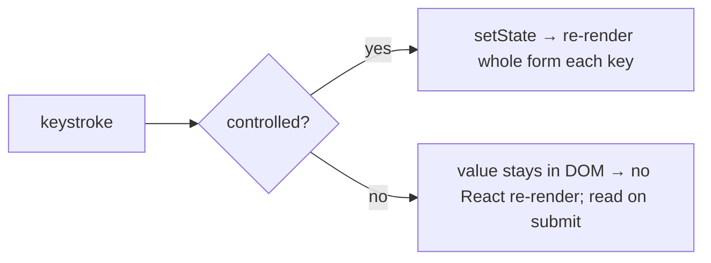

> Builds on Ch 03/05 (controlled state, re-render), Ch 09 (types/zod), Ch 21 (useReducer).
> Forms are where "who owns the value" and "how often does this re-render" collide.

---

## The one mental model

> **A form is just state plus a validation function: `errors = validate(values)`, and the UI is
> a function of `(values, errors, touched, submitting)`. The ONLY real decision is WHO OWNS each
> field's value: React (controlled — value lives in state, every keystroke re-renders) or the DOM
> (uncontrolled — value lives in the input, React reads it on submit via a ref). Performance and
> ergonomics both flow from that ownership choice.**

From "who owns the value" you derive why big controlled forms get slow, why react-hook-form is
fast (it's uncontrolled under the hood), where validation runs, and how to type it all with zod.

---

## Learning Objectives

1. Distinguish controlled vs uncontrolled by *where the value lives*, and the perf consequence.
2. Explain why large controlled forms re-render a lot and how RHF avoids it.
3. Place validation (on change / blur / submit) and connect it to a schema (zod) + types (Ch 09).
4. Model form state cleanly (values/errors/touched/status).

---

## Key Mental Models

- **Controlled = value in React state** (`value` + `onChange`): every keystroke = a re-render.
- **Uncontrolled = value in the DOM** (`defaultValue` + ref/FormData): React reads on submit.
- **Validation is a pure function** `validate(values) → errors`; a schema (zod) is that function
  plus runtime parsing + inferred types.
- **Form UI = f(values, errors, touched, submitting)** — the four-state idea again (Ch 09/12).

---

## Introduction

Forms are the most common machine-coding task (a product company has search/filter/bulk forms
everywhere) and a frequent perf gotcha. The whole topic is small once you see it as state +
validate(), with one ownership decision driving the rest.

---

## Problem — the controlled re-render cost

```jsx
function BigForm() {
  const [values, setValues] = useState({ /* 30 fields */ });
  // every keystroke: setValues → BigForm re-renders → all 30 inputs reconcile
  return fields.map(f =>
    <input value={values[f]} onChange={e => setValues(v => ({...v, [f]: e.target.value}))}/>);
}
```

Controlled inputs put each value in React state, so **every keystroke re-renders the whole form**
(Ch 03). For a few fields, fine. For large forms or expensive children, it janks. The tension:
controlled gives you live access to values (for validation/derived UI) but costs renders;
uncontrolled is cheap but you only read values on demand.



---

## Engine Simulation — controlled vs uncontrolled

```jsx
// Controlled: React owns the value
const [email, setEmail] = useState("");
<input value={email} onChange={e => setEmail(e.target.value)} />   // re-render per key

// Uncontrolled: DOM owns the value; read it lazily
const ref = useRef();
<input defaultValue="" ref={ref} />                                 // no re-render per key
<button onClick={() => console.log(ref.current.value)}>submit</button>
// or read everything at once:
<form onSubmit={e => { const data = Object.fromEntries(new FormData(e.target)); }}>
```

**react-hook-form (RHF) — why it's fast:** it keeps inputs *uncontrolled* and registers them via
refs, subscribing to changes outside React's render. The form component does **not** re-render on
every keystroke; only the fields that need to (e.g. one with a new error) update. That's the perf
win — it's "uncontrolled + subscriptions," which is exactly the Ch 21 selector idea applied to
forms.

---

## Validation & schema (zod, ties to Ch 09)

Validation is a pure function. A schema library makes it declarative *and* gives you types:

```ts
import { z } from "zod";
const Schema = z.object({
  email: z.string().email(),
  age: z.coerce.number().min(18),
});
type FormValues = z.infer<typeof Schema>;   // types DERIVED from the schema (Ch 09)
const result = Schema.safeParse(values);    // runtime validation at the boundary
```

Because types are erased at runtime (Ch 09), you validate *external/user input* with a runtime
schema at the boundary, and reuse the same schema's inferred type for the form values. One source
of truth for shape + validation. **When to validate:** on submit always; on blur for nicer UX
(mark `touched`); on change for instant feedback (debounce expensive checks).

---

## Modeling form state

```ts
type FormState = {
  values: FormValues;
  errors: Partial<Record<keyof FormValues, string>>;
  touched: Partial<Record<keyof FormValues, boolean>>;
  status: "idle" | "submitting" | "error" | "success";   // discriminated-union-friendly
};
```

A `useReducer` (Ch 21) is a clean fit for the transitions (field change, blur, submit, error).
RHF gives you this state machine out of the box.

---

## Interview Discussion (reason first)

**Q1. "Controlled vs uncontrolled — which and why?"**
> "It's about who owns the value. Controlled = React state, re-renders every keystroke, but gives
> live values for validation/derived UI. Uncontrolled = DOM owns it, read on submit, no per-key
> re-render. For small/interactive forms I go controlled; for large forms or perf-sensitive ones
> I use uncontrolled / react-hook-form, which registers inputs by ref and avoids form-wide
> re-renders."

**Q2. "Why is react-hook-form fast?"**
> "It keeps inputs uncontrolled and subscribes to field changes outside React's render, so typing
> doesn't re-render the whole form — only fields that must (e.g. a changed error). Same idea as
> selector subscriptions in a store."

**Q3. "Where does validation live and how do types fit?"**
> "Validation is a pure `validate(values)→errors`. A zod schema is that plus runtime parsing; I
> infer the form's TypeScript type from the schema (Ch 09) so shape and validation share one
> source, and I parse external input at the boundary since types are erased at runtime."

*Scoring:* full = ownership-drives-perf + RHF-is-uncontrolled + schema-as-validate+types.

---

## Common Mistakes

- **Large controlled forms** that re-render on every keystroke and jank — go uncontrolled/RHF.
- **Switching an input from uncontrolled to controlled** mid-life (`value` going from `undefined`
  to a string) → React warning + bugs. Pick one.
- **Trusting client validation only** — always validate server-side too; client validation is UX.
- **Validating on every keystroke with expensive/async checks** without debounce.
- **Duplicating shape in a type and a validator** instead of inferring the type from the schema.

---

## Interview Questions

1. Controlled vs uncontrolled: where does the value live, and what's the perf consequence?
2. Why doesn't react-hook-form re-render the whole form on each keystroke?
3. Write a zod schema and infer its type; why validate at runtime if you have TS types?
4. When do you validate (change/blur/submit) and why mark `touched`?
5. Model form state so "submitting" can't coexist with a stale error (tie to Ch 09 unions).

---

## Homework

1. Build a 20-field form controlled, log renders per keystroke; rebuild with react-hook-form and
   compare render counts in the Profiler.
2. Add a zod schema; infer the type; wire `safeParse` on submit and show field errors.
3. In `NOTES.md`: one line on controlled-vs-uncontrolled ownership and why RHF is fast.

---

## Summary

- A **form = state + `validate(values)`**; UI is `f(values, errors, touched, status)`.
- The core decision is **who owns the value**: controlled (React state, re-render per key, live
  values) vs uncontrolled (DOM owns it, read on submit, cheap).
- **react-hook-form** is fast because it's uncontrolled + ref subscriptions — no form-wide
  re-render per keystroke.
- **Validation is a pure function**; a **zod schema** gives runtime parsing + an inferred type
  (Ch 09) from one source; validate external input at the boundary and on the server too.
- Model state with a discriminated `status`; `useReducer` (Ch 21) fits the transitions.

## Go deeper
Ch 09 (types/inference), Ch 21 (useReducer), Ch 23 (accessible forms: labels, error
announcements). react-hook-form + zod docs are the practical pairing.
