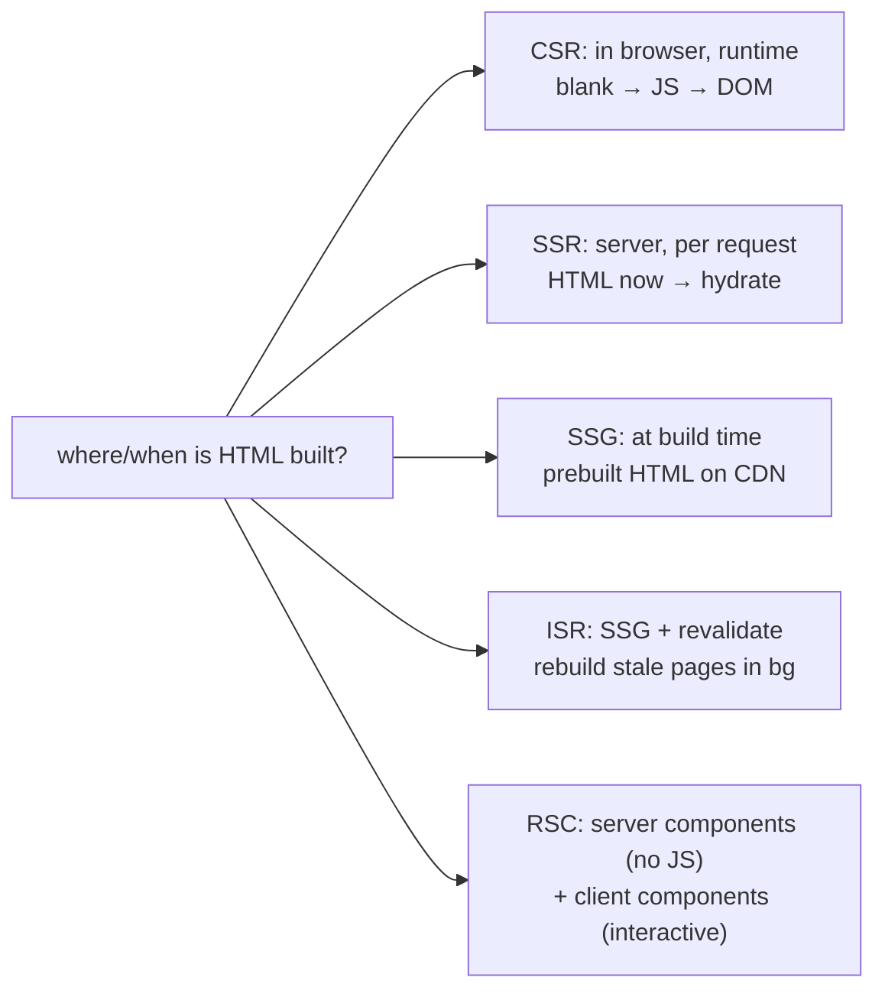

> Builds on Ch 03 (render produces HTML-ish output), Ch 07 (browser paints HTML), Ch 13
> (network). a product company is a Vite SPA (CSR), but an SDE-2 must reason about the whole spectrum.

---

## The one mental model

> **The only question is: WHERE and WHEN does the HTML get built? Four places/times — in the
> browser at runtime (CSR), on the server per request (SSR), at build time (SSG), or a hybrid
> that rebuilds stale pages (ISR) — plus RSC, which splits a component tree into server-rendered
> and client-interactive parts. Each choice trades off time-to-content, server cost, freshness,
> and interactivity. Pick by "how fresh must this be, how fast must first paint be, and how
> interactive is it."**

From "where/when is the HTML built" you derive why CSR has a blank-screen-then-hydrate cost, why
SSR improves first paint but costs server time, what hydration is (and its cost), and what RSC
actually solves. No memorizing acronyms — you place each on the where/when grid.

---

## Learning Objectives

1. Place CSR/SSR/SSG/ISR/RSC on the where/when-HTML-is-built axis and state each tradeoff.
2. Explain **hydration** and why it's a real cost.
3. Explain what **RSC** (React Server Components) changes and what stays on the client.
4. Explain client-side routing (Ch 17 History API) vs server routing.

---

## Key Mental Models

- **CSR:** server sends near-empty HTML + JS bundle; browser builds the DOM. Fast deploy, simple,
  but blank until JS loads/runs (worse first paint, SEO).
- **SSR:** server builds HTML per request → fast first paint, SEO; then **hydrate** on the client.
  Costs server CPU per request.
- **SSG:** build HTML once at deploy → fastest + cacheable on CDN; stale until next build.
- **ISR:** SSG + background re-generation so pages refresh without a full rebuild.
- **RSC:** components render on the server (no JS shipped for them); only interactive
  ("client") components ship JS.

---

## Introduction

This is "rendering strategy" interview territory and the backbone of Next.js questions. Even on a
Vite SPA you should articulate why you chose CSR and when you'd reach for SSR/SSG. It's all one
axis.

---

## Mental Model — the spectrum



```
                    first paint   freshness     server cost   SEO    interactivity
CSR (Vite SPA)        slow*        always live    none         poor   full (after JS)
SSR                   fast         per request    high         good   full (after hydrate)
SSG                   fastest      stale till build CDN-cheap   good   full (after hydrate)
ISR                   fastest      near-live       low          good   full (after hydrate)
RSC                   fast         flexible        medium       good   only client parts ship JS
* CSR first paint is blank until the JS bundle downloads + executes
```

---

## Engine Simulation — CSR vs SSR timeline

```
CSR:
  request → server sends <div id=root></div> + bundle.js
  browser: download JS → execute → React renders → DOM appears → interactive
  user sees: BLANK ........................ then content (all at once, late)

SSR:
  request → server runs React → sends full HTML
  browser: paint HTML immediately (content visible, NOT yet interactive)
           → download JS → HYDRATE (attach event listeners to existing DOM) → interactive
  user sees: content FAST, clickable a bit later
```

**Hydration** = React re-runs your components on the client over the server-rendered HTML to
attach event handlers and rebuild its internal tree (Fibers, Ch 04). The cost: you ship and
execute the JS anyway, and there's a window where content is visible but not interactive (poor
INP if heavy, Ch 08). RSC and "islands"/partial hydration exist to cut that JS.

---

## RSC — what it actually changes

React Server Components render **on the server** and ship their output (a serialized tree), not
their JS, to the client. Only **client components** (`"use client"`) ship JS and hydrate. Wins:
less JS shipped (server components add zero bundle), direct server data access (DB/fs in the
component), secrets stay server-side. The mental shift: a component tree is now split — static/
data parts run on the server, interactive leaves run on the client. (Next.js App Router default;
not relevant to a Vite SPA, but a strong "where's the boundary" interview topic.)

---

## Routing: client vs server

- **Client-side routing** (React Router in a SPA): the History API (`pushState`, Ch 17) changes
  the URL and the router swaps components — no full page load. Fast nav, but the first load is
  CSR-blank and you must handle 404s/deep links via a server fallback (`index.html` for all
  routes).
- **Server/file-based routing** (Next.js): each route maps to server-rendered output; navigation
  can be server-driven or client-enhanced. Better first-load and SEO per route.

---

## Interview Discussion (reason first)

**Q1. "CSR vs SSR — when each?"**
> "CSR (our Vite SPA) is simplest and cheapest to host, great for authed app-like UIs where SEO
> and first-paint-on-cold-load matter less — the tradeoff is a blank screen until the bundle runs.
> SSR builds HTML per request for fast first paint and SEO (marketing/content pages), at server
> CPU cost and a hydration step. I pick by first-paint/SEO needs vs server cost and freshness."

**Q2. "What is hydration and why is it a cost?"**
> "After SSR sends HTML, React re-runs components on the client to attach listeners and rebuild
> its tree over the existing DOM. You still ship/execute the JS, and there's a 'visible but not
> interactive' gap. Heavy hydration hurts INP — which is why RSC/partial hydration ship less JS."

**Q3. "What do RSC solve?"**
> "They render components on the server and ship their output, not their JS — so server components
> add zero bundle and can access server data directly. Only interactive client components ship JS
> and hydrate. It shrinks the JS you send and moves data/secrets server-side."

*Scoring:* full = where/when-HTML grid + hydration cost + RSC ships-less-JS.

---

## Common Mistakes

- **Thinking SSR makes apps 'faster'** universally — it improves first paint/SEO but adds server
  cost and hydration; interactivity still waits on JS.
- **Using SSG for highly dynamic, per-user data** (it's stale till rebuild) — use SSR/ISR/CSR.
- **Forgetting the SPA server fallback** → deep links 404.
- **Assuming RSC = SSR** — RSC is about *which components ship JS*, not just where HTML is built.
- **Over-engineering a simple authed dashboard with SSR/RSC** when CSR is fine.

---

## Interview Questions

1. Place CSR/SSR/SSG/ISR on first-paint vs freshness vs server-cost; give a use case for each.
2. Walk the CSR vs SSR load timeline; where does the user first see content / first interact?
3. What is hydration, and how does it relate to INP (Ch 08)?
4. What does RSC change about the bundle, and what still ships JS?
5. How does client-side routing change the URL without a reload (Ch 17)?

---

## Homework

1. Compare a Vite CSR app's initial HTML (View Source → near-empty) vs a Next.js SSR page (full
   HTML). Note the blank-then-hydrate vs content-then-hydrate difference in the Network/Perf panel.
2. In `NOTES.md`: the where/when grid + a one-line "why we use CSR (Vite SPA) here, and when I'd
   switch."

---

## Summary

- The strategy axis is **where/when HTML is built**: **CSR** (browser/runtime), **SSR**
  (server/per-request), **SSG** (build time), **ISR** (SSG + revalidate), **RSC** (server
  components ship no JS; client components do).
- Tradeoffs: first-paint, freshness, server cost, SEO, interactivity. **Hydration** is the cost
  of making SSR/SSG HTML interactive (ship + run JS; visible-but-not-interactive gap → INP).
- **RSC** shrinks shipped JS by rendering non-interactive parts on the server.
- **Client routing** (History API, Ch 17) swaps components without reload; needs a server
  fallback for deep links.

## Go deeper
Ch 20 (the bundler that produces the JS), Ch 08 (hydration/INP). Next.js docs are the reference
for SSR/SSG/ISR/RSC once this grid is solid.
