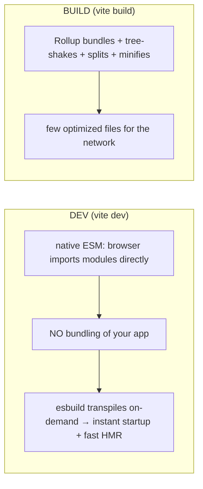

> Builds on Ch 02 (loading/parsing cost), Ch 08 (ship-less perf), Ch 19 (the bundle SSR ships).
> JD stack: Vite. This is what turns your source into what the browser runs.

---

## The one mental model

> **A bundler is a GRAPH OPTIMIZER. It starts at your entry file, follows every `import` to build
> a dependency graph of modules, then emits the smallest, fastest set of files the browser can
> load. Its two jobs: (1) RESOLVE & COMBINE modules (so the browser makes few requests), and
> (2) SHIP LESS — drop unused code (tree-shaking), split rarely-used code into separate chunks
> (code-splitting), minify. Everything — ESM vs CJS, Vite's dev-vs-build split, source maps — is
> in service of "build the graph, then ship the least JS possible."**

From "graph optimizer that ships less" you derive why ESM (static imports) enables tree-shaking
where CJS (dynamic require) can't, why Vite is fast in dev (native ESM, no bundling) but bundles
for prod (Rollup), and why code-splitting helps first load.

---

## Learning Objectives

1. Explain the module graph and ESM vs CJS (and why ESM enables tree-shaking).
2. Explain tree-shaking and code-splitting as "ship less / ship later."
3. Explain Vite's two-mode design (esbuild dev server + Rollup prod build) and why.
4. Know what source maps and minification do.

---

## Key Mental Models

- **Build = walk imports → dependency graph → emit optimized files.**
- **ESM is static** (`import` at top, analyzable) → enables tree-shaking. **CJS is dynamic**
  (`require()` anywhere) → hard to shake.
- **Tree-shaking** drops unused exports; **code-splitting** defers rarely-used code to lazy chunks.
- **Vite dev = unbundled native ESM (instant HMR); Vite build = bundled (Rollup) for the network.**

---

## Introduction

"Why is my bundle huge / my dev server fast / this import not tree-shaken" are real SDE-2
questions, and the job description names Vite. The whole area is small once you see the bundler as a graph
optimizer whose mission is shipping less.

---

## Problem — modules & why bundling existed

The browser can fetch JS, but hundreds of separate module files = hundreds of requests (slow,
esp. pre-HTTP/2, Ch 13). And browsers historically couldn't run Node's CJS `require`. So bundlers
combine modules into few files and transform syntax. Module systems:

- **CommonJS (CJS)** — Node's `require()`/`module.exports`. **Dynamic**: you can `require()`
  conditionally at runtime, so a tool can't statically know which exports are used → poor
  tree-shaking.
- **ES Modules (ESM)** — `import`/`export`, **static** (imports are top-level, resolved before
  run). Statically analyzable → the bundler *knows* exactly which exports each module uses → can
  drop the rest. ESM is the modern standard and why tree-shaking works.

```mermaid
flowchart TD
  entry["entry: main.tsx"] --> a[import App]
  a --> b[import Button from ui]
  a --> c[import { debounce } from lodash-es]
  b --> d[import styles]
  subgraph graph["dependency graph"]
    entry; a; b; c; d
  end
  graph --> opt["tree-shake unused + split + minify"] --> out["few optimized files"]
```

---

## Tree-shaking & code-splitting (ship less / later)

```js
// tree-shaking: import one function from a 70-fn library
import { debounce } from "lodash-es";   // ESM → bundler includes ONLY debounce, drops the rest
import _ from "lodash";                 // CJS default import → often pulls the WHOLE library

// code-splitting: defer a route's code to a separate chunk loaded on demand
const Settings = lazy(() => import("./Settings"));   // its JS only downloads when navigated to
```

- **Tree-shaking** = dead-code elimination across the ESM graph: unused exports never reach the
  bundle. Requires ESM + side-effect-free modules (`"sideEffects": false` in package.json helps).
- **Code-splitting** = break the graph at `import()` boundaries into chunks; the entry bundle
  shrinks and rarely-used code loads later (Ch 08 "ship less now"). Route-level splitting is the
  highest-leverage version.

---

## Vite's two modes — why it's fast in dev



- **Dev:** the browser supports native ESM, so Vite serves your modules **unbundled** and only
  transpiles what's requested (via esbuild, written in Go → very fast). Result: near-instant
  server start and HMR that updates only the changed module, regardless of app size. (Webpack
  bundled everything up front → slow as apps grew.)
- **Build:** unbundled ESM = too many requests for production, so Vite uses **Rollup** to bundle,
  tree-shake, code-split, and minify into a few cache-friendly files.

Two modes because dev optimizes *iteration speed* and prod optimizes *network delivery* — different
goals, different tools.

---

## Source maps & minification

- **Minification** strips whitespace/comments and shortens names → smaller bundle (less to
  download/parse, Ch 02). Done at build.
- **Source maps** map minified prod code back to your original source so stack traces and
  debugging (and Sentry, Ch 22) point to real lines. Ship them to your error tracker, not always
  to users.

---

## Interview Discussion (reason first)

**Q1. "Why is Vite's dev server so fast?"**
> "In dev it doesn't bundle your app — it serves native ESM so the browser imports modules
> directly, and transpiles on demand with esbuild (Go, very fast). Startup and HMR don't scale
> with app size like Webpack's full bundling did. For production it switches to Rollup to bundle/
> tree-shake/split, because unbundled ESM means too many requests."

**Q2. "Why does ESM tree-shake but CJS often doesn't?"**
> "ESM imports are static and top-level, so the bundler can statically determine exactly which
> exports are used and drop the rest. CJS `require()` is dynamic/runtime, so the tool can't be
> sure what's used and tends to include everything."

**Q3. "My bundle is huge — how do you attack it?"**
> "Analyze it (rollup-plugin-visualizer), import named ESM exports not whole libraries, route-
> level code-split with `lazy`/`import()`, drop heavy deps or swap for lighter ones, ensure
> tree-shaking isn't blocked by side effects. Measure, then cut the biggest chunks first (Ch 08)."

*Scoring:* full = graph-optimizer + ESM-static-enables-shaking + Vite dev/build split.

---

## Common Mistakes

- **`import _ from "lodash"`** (whole lib) instead of `lodash-es` named imports → no shaking.
- **No code-splitting** → one giant entry bundle blocks first paint.
- **Assuming dev perf = prod perf** (dev is unbundled; prod is bundled).
- **Side-effectful modules** silently defeating tree-shaking.
- **Shipping source maps publicly** when they should go only to the error tracker.

---

## Interview Questions

1. What does a bundler do, start to finish? (entry → graph → optimize → emit.)
2. ESM vs CJS — why does the difference matter for tree-shaking?
3. Why is Vite fast in dev and what changes for the production build?
4. How does code-splitting help first load, and where do you split?
5. What are source maps for, and where should they go?

---

## Homework

1. Add `rollup-plugin-visualizer` to a Vite build; find the biggest dependency; replace a whole-
   library import with named ESM imports and re-measure.
2. Route-split a page with `React.lazy` + `Suspense`; confirm a separate chunk loads on navigation
   in the Network tab.
3. In `NOTES.md`: bundler-as-graph-optimizer + ESM-vs-CJS-shaking + Vite dev/build in 3 lines.

---

## Summary

- A **bundler is a graph optimizer**: walk imports → dependency graph → emit the fewest, smallest
  files. Two jobs: **resolve/combine** and **ship less** (tree-shake, split, minify).
- **ESM is static → tree-shakeable; CJS is dynamic → not** (drop unused exports only with ESM).
- **Code-splitting** defers rarely-used code to lazy chunks (ship less now, Ch 08).
- **Vite** = unbundled native ESM + esbuild in **dev** (instant HMR) and **Rollup** bundling in
  **build** (network-optimized) — different goals, different tools.
- **Minification** shrinks; **source maps** map prod back to source for debugging/Sentry (Ch 22).

## Go deeper
Ch 08 (bundle as a perf lever), Ch 19 (what the bundle feeds), Ch 22 (source maps + Sentry). Vite
and Rollup docs are the reference once this model is solid.
