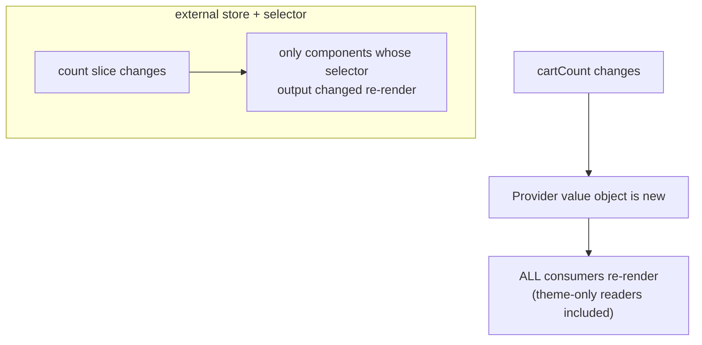

> Builds on Ch 03/05 (re-render, hooks), Ch 10 (server state), Ch 11 (state-location tree).
> This goes deep on the *client* state tools and why each exists.

---

## The one mental model

> **There is no single "state." There are KINDS of state, each with different access patterns,
> and the right tool matches the kind. The two axes that decide everything: WHO needs it (one
> component → the whole app) and HOW OFTEN it changes / how selectively it's read. Every tool —
> useState, useReducer, Context, Zustand, Jotai, Redux, TanStack Query — is a point on those two
> axes. Picking wrong is the root of both prop-drilling pain and global-re-render pain.**

From the two axes you derive when to lift, when Context bites you, why external stores use
selectors, and why server state is its own universe (Ch 10). No memorizing libraries — you place
the state on the grid and read off the tool.

---

## Learning Objectives

1. Classify state by scope × change-frequency and pick the tool from that.
2. Explain `useReducer` vs `useState` (when state transitions get complex).
3. Explain the **Context re-render problem** and how external stores (Zustand) solve it.
4. Compare Zustand / Jotai / Redux models and when each fits.

---

## Key Mental Models

- **Two axes: scope (local→global) × volatility/selectivity (rare→frequent, broad→selective).**
- **`useReducer`** centralizes complex transitions into one pure function (an interview favorite
  for "manage a multi-field form/wizard state").
- **Context delivers a value but has no selective subscription** → all consumers re-render.
- **External stores subscribe via selectors** → only components reading a changed slice re-render.

---

## Introduction

"How do you manage state in React?" is a trap if you answer with a library. The senior answer
is the taxonomy: most state is local; some is server (Query); a little is genuinely global
client state, and only *that* needs a store. We make the taxonomy reflexive.

---

## Problem — Context looks like a store but isn't

```jsx
const AppCtx = createContext();
function Provider({ children }) {
  const [user, setUser] = useState();
  const [theme, setTheme] = useState("light");
  const [cartCount, setCartCount] = useState(0);   // changes often
  return <AppCtx.Provider value={{ user, theme, cartCount, setTheme, setCartCount }}>
    {children}</AppCtx.Provider>;
}
```

Every time `cartCount` changes, the `value` object is new → **every component consuming `AppCtx`
re-renders**, even ones that only read `theme`. Context has no way to say "I only care about
`theme`." That's the core limitation: Context is a *dependency injection / broadcast* mechanism,
not a fine-grained store.



Two mitigations within Context: **split contexts** (separate `ThemeContext`, `CartContext`) so
changes are scoped; or memoize the value. But for frequently-changing, widely-read state, an
external store with selectors is the clean answer.

---

## useReducer — centralizing transitions

When state has many fields that change together with rules, scattered `useState` setters get
buggy. `useReducer` moves all transitions into one pure function:

```js
function reducer(state, action) {
  switch (action.type) {
    case "field":   return { ...state, [action.name]: action.value };
    case "submit":  return { ...state, status: "submitting", error: null };
    case "error":   return { ...state, status: "idle", error: action.error };
    default:        return state;
  }
}
const [state, dispatch] = useReducer(reducer, initial);
```

Why it helps: transitions are **testable in isolation** (pure function), the next state is
derived predictably, and it pairs with discriminated-union state (Ch 09). Reach for it when "set
this also implies set that" rules appear, or for wizards/forms. (Redux is `useReducer` scaled to
app level + middleware + devtools.)

---

## Engine Simulation — Zustand's selector subscription

```js
const useStore = create((set) => ({
  count: 0,
  user: null,
  inc: () => set((s) => ({ count: s.count + 1 })),
}));

function Counter() {
  const count = useStore((s) => s.count);   // subscribe to the count slice only
  return <button onClick={useStore.getState().inc}>{count}</button>;
}
function Profile() {
  const user = useStore((s) => s.user);     // subscribes to user only
  return <span>{user?.name}</span>;          // does NOT re-render when count changes
}
```

The store lives **outside React**. Each component's selector runs on every store change; if its
*output* is unchanged (`Object.is`), React skips that component. So `inc()` re-renders `Counter`
but not `Profile`. No provider, no context-broadcast re-render. That selector subscription is the
whole reason external stores scale where Context doesn't.

---

## The landscape (derived)

| Tool | Model | Reach for it when |
|---|---|---|
| `useState` | local cell | one component's state |
| `useReducer` | local + pure transitions | complex multi-field transitions, wizards |
| **Context** | broadcast/DI, no selectors | rarely-changing global (theme/auth/locale) |
| **Zustand** | external store + selectors | frequent/selective global client state, minimal API |
| **Jotai** | bottom-up atoms | derived/composable atomic state; fine-grained |
| **Redux Toolkit** | single store + reducers + middleware | big teams, complex flows, devtools/time-travel |
| **TanStack Query** | server cache (Ch 10) | anything from a server — it's not client state |

Modern default for a new app: **Query (server) + local state + a little Zustand (global client)**.
Redux is still common in large/legacy codebases and when its middleware ecosystem earns its keep.

---

## Interview Discussion (reason first)

**Q1. "Isn't Context a state manager? Why use Zustand/Redux?"**
> "Context is dependency injection + broadcast, not a fine-grained store: a value change
> re-renders *all* consumers regardless of what they read. Great for rarely-changing global
> values (theme/auth). For frequently-changing, widely-read state you want selector subscriptions
> (Zustand/Jotai/Redux) so only components reading the changed slice re-render."

**Q2. "useState vs useReducer?"**
> "useState for independent simple values. useReducer when transitions are complex or
> interdependent — it centralizes them in a pure, testable function and makes next-state
> predictable. It also scales conceptually to Redux."

**Q3. "How does Zustand avoid Context's re-render problem?"**
> "The store is external; components subscribe with a selector and only re-render when their
> selector's *output* changes (Object.is). No provider value object, so no broadcast re-render."

*Scoring:* full = scope×volatility taxonomy + context-broadcast + selector subscription + server
state is separate. Fail = "always use Redux" / "Context is global state, done."

---

## Common Mistakes

- **One giant Context** for everything, frequently changing → app-wide re-renders.
- **Server data in a client store** (re-implementing Query badly) — Ch 10.
- **Redux for trivial state** — boilerplate with no payoff.
- **Selectors returning new objects each call** (`s => ({a: s.a})`) → always "changed" → defeats
  the optimization. Return primitives or use shallow-equality.
- **Lifting state too high** "just in case" → re-renders and coupling (Ch 11).

---

## Interview Questions

1. Place these on the scope×volatility grid and pick a tool: theme, contacts list, a modal's
   open flag, cart count read across the app, a multi-step form.
2. Write the Context re-render problem and two ways to mitigate it within Context.
3. Convert a tangle of `useState` setters into a `useReducer`; why is it more testable?
4. Explain Zustand's selector subscription and a selector that accidentally defeats it.
5. When is Redux Toolkit still the right call over Query+Zustand?

---

## Homework

1. Build a provider with `theme` + a fast-changing counter; log renders in a theme-only consumer
   and watch it re-render on counter change. Fix by splitting contexts, then by moving the counter
   to Zustand; compare.
2. Refactor a 4-field form from `useState`×4 to `useReducer`; unit-test the reducer with no React.
3. In `NOTES.md`: the scope×volatility grid with one tool per cell.

---

## Summary

- **State has kinds**; pick by **scope × volatility/selectivity**. Most state is local; server
  state is a cache (Query, Ch 10); only genuinely global client state needs a store.
- **`useReducer`** centralizes complex transitions into a pure, testable function.
- **Context broadcasts** — a value change re-renders all consumers (good for rare global values;
  bad for hot state). Split contexts or memoize to mitigate.
- **External stores (Zustand/Jotai/Redux) subscribe via selectors** → only changed-slice readers
  re-render. That's why they scale where Context doesn't.
- Modern default: **Query + local + a little Zustand**; Redux for large/complex/legacy needs.

## Go deeper
Ch 10 (server state), Ch 11 (state-location decision tree), Ch 24 (composition as a state-sharing
alternative). Zustand's docs are short and worth a full read once this model is solid.
