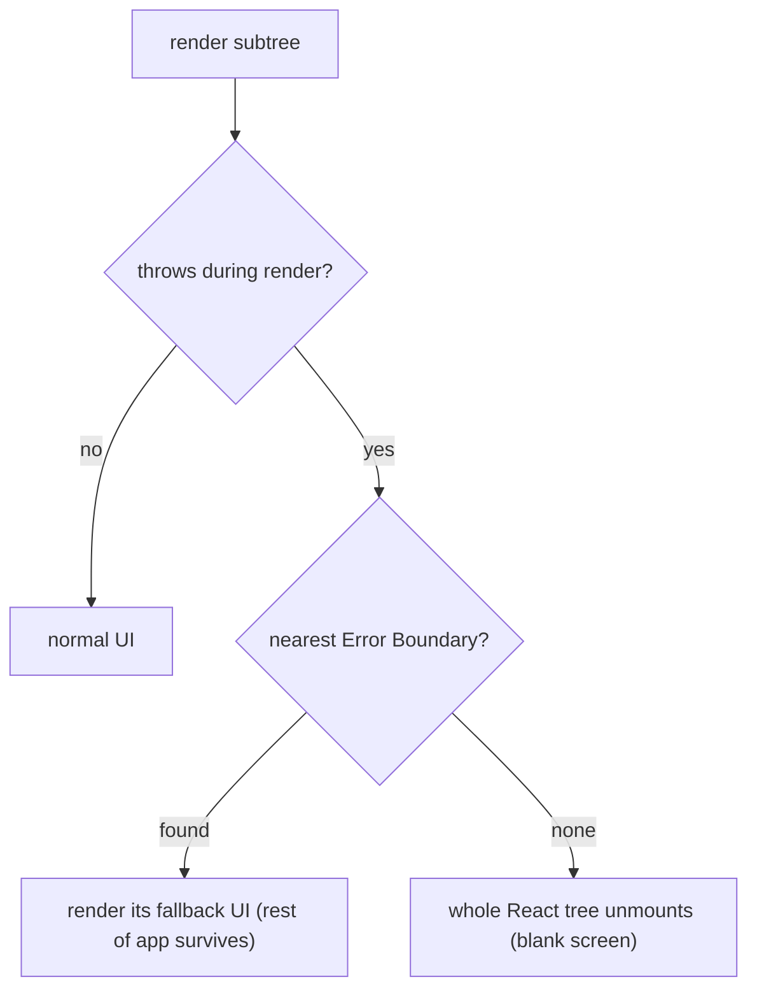

> Builds on Ch 03/04 (render/commit), Ch 09 (state as discriminated union), Ch 10 (async state).
> they ask "a release broke in production — what do you do?" — see the interview guide §4.

---

## The one mental model

> **An error is just another STATE your UI must render — not an exception to handle "somewhere
> else." So the design question is always: at which BOUNDARY do I catch it, and what do I render
> instead? Three boundaries cover everything: Error Boundaries catch errors thrown during RENDER
> in a subtree; try/catch + query error state catch ASYNC errors (events, fetch); Suspense
> catches "not ready yet." Pick the boundary, design the fallback, keep the blast radius small.**

From "error is a state, caught at a boundary" you derive why React needs Error Boundaries (you
can't try/catch a render), why they DON'T catch event/async errors, and how Suspense + error
boundaries + normal render compose into pending/failed/ready.

---

## Learning Objectives

1. Explain why render errors need Error Boundaries (you can't wrap render in try/catch).
2. Know exactly what boundaries catch and miss (async/events are NOT caught).
3. Model loading/error/empty/data as states (Ch 09) and compose Suspense + boundary.
4. Run a production-incident response: mitigate first (rollback/flag), then Sentry → reproduce.

---

## Key Mental Models

- **Error = a renderable state**, not just a thrown exception.
- **Error Boundary** = a class component with `componentDidCatch`/`getDerivedStateFromError` that
  catches errors thrown *while rendering its subtree* and shows a fallback.
- **Boundaries catch render-phase errors only** — not event handlers, not async, not SSR
  mismatches. Those you handle at the call site.
- **Suspense** catches "pending" (a thrown promise); pair with an error boundary for "failed."

---

## Introduction

Robust UIs treat failure as a first-class state with a designed fallback, so one broken component
doesn't blank the whole app. This is both a craft signal (the job description's "loading states, edge cases")
and an incident-readiness signal (Interviewer's broken-release question).

---

## Problem — you can't try/catch a render

```jsx
function Profile({ user }) {
  return <div>{user.name.toUpperCase()}</div>;   // if user is null → throws DURING render
}
```

A throw during render isn't inside any try/catch you can write — React is calling your function
(Ch 03). Pre-Error-Boundaries (React 15), one such throw corrupted React's internal tree and
could blank the entire app. React's fix: a component that can **catch** errors from its subtree's
render and swap in a fallback UI — the **Error Boundary** — containing the blast radius.



---

## Engine Simulation — what boundaries catch vs miss

```jsx
class ErrorBoundary extends React.Component {
  state = { hasError: false };
  static getDerivedStateFromError() { return { hasError: true }; }   // render fallback
  componentDidCatch(error, info) { logToSentry(error, info); }       // side effect: report
  render() { return this.state.hasError ? <Fallback/> : this.props.children; }
}

<ErrorBoundary>
  <Profile/>                {/* ✅ render throw here → caught, <Fallback/> shown */}
</ErrorBoundary>
```

**Caught:** errors thrown during render / lifecycle / constructor of the subtree.
**NOT caught** (and why): these don't happen during React's render pass —
- **Event handlers** (`onClick`) — run later, on the call stack of an event (Ch 02). Use try/catch.
- **Async** (`setTimeout`, `fetch().then`, `await`) — run in a later task/microtask (Ch 02). Use
  try/catch or the query's error state (Ch 10).
- **SSR/hydration** and errors in the boundary itself.

So: **render errors → boundary; async/event errors → handle at the call site.** Two different
mechanisms for two different execution contexts (the Ch 02 distinction pays off again).

---

## Composing Suspense + boundary + the four states

Async data has four UI states — model them (Ch 09 discriminated union):

```jsx
// With TanStack Query (Ch 10): explicit states
if (isLoading) return <Skeleton/>;
if (error)     return <ErrorState onRetry={refetch}/>;
if (!data.length) return <Empty/>;
return <List data={data}/>;
```

```jsx
// With Suspense: pending and failed are caught by boundaries, not if/else
<ErrorBoundary fallback={<ErrorState/>}>   {/* catches "failed" */}
  <Suspense fallback={<Skeleton/>}>         {/* catches "pending" (a thrown promise) */}
    <Contacts/>                             {/* renders "ready" data */}
  </Suspense>
</ErrorBoundary>
```

Suspense lets a child "suspend" (throw a promise) while loading; the nearest `<Suspense>` shows
the fallback until it resolves, and the nearest error boundary shows the error fallback if it
rejects. Pending/failed/ready become *boundaries in the tree* instead of branches in every
component.

---

## Production incident response (Interviewer's question)

**Lead with mitigation, then diagnose** (Smeet jumped to Sentry; do this instead):
1. **Mitigate now:** roll back the release / disable via feature flag to stop user impact
   (a product company uses rolling releases — reverting is fast). Don't debug a live fire first.
2. **Triage in Sentry:** the error, stack trace (source maps, Ch 20), release version, % users.
3. **Reproduce locally** with the same env/inputs; confirm root cause.
4. **Fix + guard:** add an error boundary / test so it can't silently recur; communicate status.
5. **Postmortem:** why did CI/review miss it? add the check.

Error boundaries + Sentry are *resilience* (graceful UI + visibility); rollback is *mitigation*.
A senior names mitigation first.

---

## Interview Discussion (reason first)

**Q1. "Why does React need Error Boundaries?"**
> "A throw during render isn't inside any try/catch I can write — React calls my component. Pre-
> boundaries, one render throw could blank the whole app. A boundary catches errors from its
> subtree's render and shows a fallback, containing the blast radius."

**Q2. "Does an Error Boundary catch a fetch error in an onClick?"**
> "No. Boundaries only catch render-phase errors. Event handlers and async run in later tasks
> (Ch 02), outside the render pass — handle those with try/catch or the query's error state."

**Q3. "Production release broke — what do you do?"**
> "Mitigate first: roll back or feature-flag off to stop user impact. Then Sentry for the stack
> trace and affected users, reproduce locally, fix with a guard/test, communicate, and postmortem
> why it slipped through."

*Scoring:* full = error-is-a-state + boundary-vs-async (Ch 02) + mitigate-before-diagnose.

---

## Common Mistakes

- **Expecting boundaries to catch async/event errors** — they don't; handle at the call site.
- **One top-level boundary only** → any error blanks everything; place boundaries around risky
  subtrees (a widget, a route) to contain blast radius.
- **No fallback design** — a raw white screen instead of a retry/empty UI.
- **Debugging production before mitigating** — users keep hitting the bug.
- **Treating error/loading as afterthoughts** instead of modeled states (Ch 09).

---

## Interview Questions

1. Why can't you try/catch a render error, and what catches it instead?
2. List what Error Boundaries do and don't catch, and why (tie to Ch 02 execution contexts).
3. Compose Suspense + an error boundary for pending/failed/ready.
4. Walk your production-incident response; what's the first action and why?
5. Where do you place boundaries to limit blast radius?

---

## Homework

1. Build an Error Boundary; throw in a child's render (caught) and in its `onClick` (not caught) —
   confirm the difference and add try/catch for the handler.
2. Wrap a Suspense-enabled data component with both `<Suspense>` and an error boundary; force
   pending and error states.
3. In `NOTES.md`: boundary-vs-async rule + the mitigate-first incident steps.

---

## Summary

- **An error is a renderable state**; design the fallback at a **boundary**.
- **Error Boundaries** catch **render-phase** errors in their subtree (fallback UI, report via
  `componentDidCatch`) — they do **NOT** catch **event/async** errors (later tasks, Ch 02), which
  you handle at the call site or via query error state (Ch 10).
- **Suspense** catches pending; pair with an error boundary so **pending/failed/ready** become
  boundaries in the tree, not branches everywhere. Always model the **four states** (Ch 09).
- **Incident response: mitigate first** (rollback/feature-flag), then Sentry → reproduce → guard →
  postmortem.

---

# ═══ Internals Deep-Dive (source-verified) ═══

> Verified against `facebook/react` (18.x/19.x) — `ReactFiberThrow.js`, `ReactFiberWorkLoop.js`.
> Suspense and error boundaries share the same throw/catch machinery in the work loop (Ch 04).

## A. Suspense: "suspending" is throwing a thenable (now a sentinel)

When data isn't ready, a component **throws** to suspend. The work loop wraps `performUnitOfWork`
in try/catch; `throwException(root, returnFiber, sourceFiber, value, lanes)` inspects the thrown
value:
- Historically you literally `throw promise` (`typeof value.then === 'function'`). React still
  supports it, classified as **`SuspendedOnDeprecatedThrowPromise`**.
- **Modern `use()` does NOT throw a real promise** — it throws an internal sentinel
  **`SuspenseException`**, and React recovers the actual thenable via `getSuspendedThenable()`.
  Source comment: *"the rest of the Suspense implementation expects the thrown value to be a
  thenable, because before `use` existed that was the (unstable) API for suspending."*

## B. The nearest boundary catches via a stack, not a tree walk

React finds the enclosing boundary with `getSuspenseHandler()` (a maintained handler stack — *not*
a parent traversal). It calls `markSuspenseBoundaryShouldCapture`, which sets the **`ShouldCapture`**
flag; unwinding clears it and sets **`DidCapture`**; `completeWork` then re-renders the boundary
showing its **fallback**. A Suspense boundary is actually two fibers: a `SuspenseComponent`
wrapping an `OffscreenComponent` (the primary children) plus a separate fallback fragment.

This is the **same throw/catch mechanism error boundaries use** — an error boundary's
`getDerivedStateFromError` sets state to render the fallback when a render throws an Error; Suspense
does the equivalent when a render throws a thenable. Both are "render threw → nearest boundary shows
fallback," which is exactly why neither catches **event/async** errors (those don't throw *during
the render pass* — Ch 02 execution contexts).

## C. Retry on resolve — dedicated retry lanes

`attachPingListener(root, wakeable, lanes)` (concurrent only — *"Legacy Suspense always commits
fallbacks synchronously, so there are no pings"*) dedupes via `root.pingCache` and registers
`wakeable.then(ping, ping)`. When the promise resolves, `ping` → `pingSuspendedRoot` →
`markRootPinged`, and React re-renders on a **dedicated retry lane** (`claimNextRetryLane`, Ch 04).
Fallback commits are throttled by `FALLBACK_THROTTLE_MS = 300` so fast resolves don't flash a
fallback.

## D. Transitions hide fallbacks (react.dev/Suspense)

If a boundary already shows content and then re-suspends, the fallback reappears **unless** the
update was wrapped in `startTransition`/`useDeferredValue` (Ch 04 lanes) — a Transition "only waits
long enough to avoid hiding already revealed content," keeping the stale UI with `isPending` for a
busy indicator instead of yanking it back to a spinner.

## Go deeper
Source: `facebook/react` `ReactFiberThrow.js` (throwException, attachPingListener,
markSuspenseBoundaryShouldCapture), `ReactFiberWorkLoop.js` (handleThrow, FALLBACK_THROTTLE_MS).
Ch 04 (lanes/work loop the catch runs in), Ch 02 (why async errors escape), Ch 10 (query
error/loading states), Ch 20 (source maps for Sentry). Note: `SuspenseList` is still
`unstable_`-only in 18 and 19 — not stable API.
