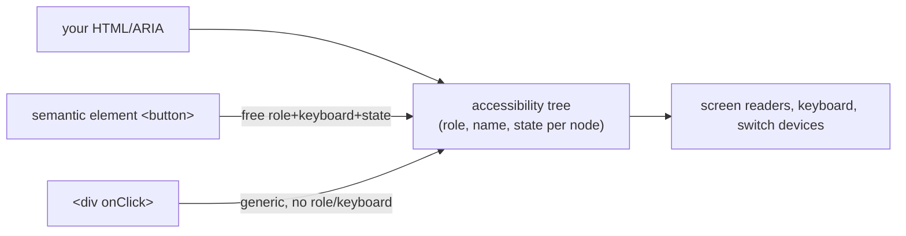

> Builds on Ch 16 (semantic HTML, focus), Ch 08 (virtualized lists are hard to make accessible).
> JD-critical: a product company explicitly cares about accessibility.

---

## The one mental model

> **The browser builds a second, invisible UI from your markup: the ACCESSIBILITY TREE. Screen
> readers, keyboards, and other assistive tech operate on THAT tree, not your pixels. Each node
> has a ROLE (what it is), a NAME (what it's called), and STATE (checked/expanded/disabled).
> Semantic HTML elements populate this tree correctly AND come with keyboard behavior for free.
> So the rule is: use the right element first; reach for ARIA only to patch what no element
> provides — because bad ARIA actively lies to the accessibility tree.**

From "there's an accessibility tree driven by role/name/state" you derive why `<button>` beats a
clickable `<div>`, why "no ARIA is better than bad ARIA," why keyboard + focus management matter,
and how to make a virtualized table accessible.

---

## Learning Objectives

1. Explain the accessibility tree (role/name/state) and semantic-HTML-first.
2. Use ARIA only to fill gaps; know the common roles/attributes and the cardinal rules.
3. Handle keyboard navigation, visible focus, and focus traps (modals).
4. Announce async updates (`aria-live`) and make a virtualized table accessible.

---

## Key Mental Models

- **Accessibility tree = role + name + state per node**, derived from your HTML/ARIA.
- **Semantic HTML is free a11y:** `<button>` gives role, focusability, Enter/Space, disabled
  state — a `<div onClick>` gives none of that.
- **ARIA changes the tree, not behavior.** `role="button"` on a div doesn't add keyboard
  handling — you must add it yourself. So prefer real elements.
- **Keyboard is the baseline interface;** if it works by keyboard with visible focus, most AT works.

---

## Introduction

Accessibility is both an ethical/legal baseline and, in this JD, an explicit evaluation axis
(Interviewer probed it under virtualization). The whole topic clicks once you stop thinking "extra
attributes" and start thinking "I'm authoring a second UI — the accessibility tree."

---

## Problem — the clickable div

```jsx
// ❌ looks like a button, but for the accessibility tree it's nothing
<div className="btn" onClick={save}>Save</div>
```

The accessibility tree sees a generic `<div>` with no role → a screen reader doesn't announce it
as a button; it's **not focusable** (no Tab), has **no keyboard activation** (Enter/Space do
nothing), and no disabled semantics. To fix it you'd have to re-add `role="button"`, `tabIndex=0`,
`onKeyDown` for Enter/Space, `aria-disabled`… reinventing `<button>` badly. So:

```jsx
<button onClick={save}>Save</button>   // ✅ role, focusable, Enter/Space, disabled — all free
```

This is the entire philosophy: **the right element is the cheapest, most correct a11y.**



---

## ARIA — patch gaps only (the cardinal rules)

ARIA = attributes that set role/state/properties when no native element fits (custom widgets:
tabs, comboboxes, tree views). Rules of ARIA, derived from "it changes the tree, not behavior":
1. **Prefer a native element** over ARIA whenever one exists.
2. **Don't change native semantics** (`<button role="heading">` — no).
3. **All interactive ARIA must be keyboard-operable** (you add the key handling).
4. **Don't use `role="presentation"`/`aria-hidden` on focusable elements.**
5. **Every control needs an accessible name** (label/`aria-label`/`aria-labelledby`).

Common pieces: `aria-label`/`aria-labelledby` (name), `aria-expanded`/`aria-selected`/`aria-checked`
(state), `aria-live` (announce dynamic changes), `role="dialog"`, `aria-describedby`. "**No ARIA
is better than bad ARIA**" — wrong ARIA tells AT something false, worse than nothing.

---

## Keyboard, focus & traps

- **Everything operable by mouse must work by keyboard.** Tab order follows DOM order; don't break
  it with positive `tabIndex`. `tabIndex={0}` makes a custom widget focusable; `-1` makes it
  programmatically focusable (for managing focus) but not in the Tab order.
- **Visible focus indicator** — never `outline: none` without a replacement. Keyboard users need
  to see where they are.
- **Focus trap in modals:** when a dialog opens, move focus into it, keep Tab cycling within it,
  restore focus to the trigger on close, and close on Esc. (Radix/shadcn do this for you — Ch 11.)

```jsx
<div role="dialog" aria-modal="true" aria-labelledby="title">
  <h2 id="title">Delete contact?</h2>      {/* names the dialog */}
  {/* focus moves here on open; Tab cycles inside; Esc closes; focus returns to trigger */}
</div>
```

- **`aria-live="polite"`** region announces async updates (a toast, "3 contacts updated") without
  moving focus — the accessible version of the real-time status changes in Ch 08.

---

## Accessible virtualized table (Interviewer's link)

Virtualization (Ch 08) removes off-screen rows from the DOM, which breaks default table semantics
and find. To keep it accessible:
- Use `role="grid"`/`row`/`gridcell` (or `<table>` semantics) and **`aria-rowcount`/`aria-rowindex`**
  so AT knows the *total* size and each row's real index even though only ~20 are in the DOM.
- Manage focus: when focus is on a row that gets recycled, move it deliberately (roving tabindex)
  rather than letting it vanish.
- Provide a non-virtualized path or search for "find," since Ctrl-F won't see off-screen rows.

This is exactly why Interviewer lists a11y as a virtualization *tradeoff* (interview guide §2d).

---

## Interview Discussion (reason first)

**Q1. "Why is `<button>` better than a `<div onClick>`?"**
> "The accessibility tree sees `<button>` as a button: it's focusable, announces its role,
> activates on Enter/Space, and supports disabled — all free. A `<div>` is generic: not focusable,
> no keyboard activation, no role. To match `<button>` I'd have to re-add role, tabIndex, key
> handlers, and disabled semantics — reinventing it worse."

**Q2. "When do you use ARIA?"**
> "Only to fill gaps native HTML can't express — custom widgets like tabs or comboboxes. ARIA
> changes the accessibility tree, not behavior, so I still add keyboard handling myself. The rule
> is native-first; no ARIA beats bad ARIA, which lies to assistive tech."

**Q3. "How do you make a virtualized list accessible?"**
> "Off-screen rows aren't in the DOM, so I expose the true structure via `aria-rowcount`/
> `aria-rowindex`, manage focus when rows recycle (roving tabindex), and give a search since
> Ctrl-F can't find unmounted rows. It's a real tradeoff of virtualization."

*Scoring:* full = accessibility-tree model + native-first/ARIA-gaps + focus/keyboard + virtual a11y.

---

## Common Mistakes

- **Clickable `<div>`/`<span>`** instead of `<button>`/`<a>` → not focusable, no keyboard.
- **`outline: none`** with no visible focus replacement.
- **Bad/excess ARIA** (`aria-*` that contradicts the element) → worse than none.
- **Modals without focus trap / focus restore / Esc.**
- **Images without `alt`, inputs without labels, icon buttons without `aria-label`.**
- **Color as the only signal** (fails color-blind users / contrast).

---

## Interview Questions

1. What is the accessibility tree, and what three things does each node carry?
2. Everything `<button>` gives you that a `<div onClick>` doesn't — list it.
3. State the cardinal rules of ARIA; when is ARIA the wrong tool?
4. Build an accessible modal: name, focus trap, restore, Esc.
5. Make a virtualized table accessible — what breaks and how do you fix it?

---

## Homework

1. Take a `<div onClick>` "button," tab to it (you can't), then convert to `<button>` and confirm
   focus + Enter/Space work. Inspect both in DevTools' Accessibility pane.
2. Build a modal with focus trap, focus restore, and Esc (or read Radix Dialog's implementation).
3. In `NOTES.md`: the accessibility-tree model + "native-first, ARIA for gaps" in one line.

---

## Summary

- The browser builds an **accessibility tree** (role + name + state per node) that AT drives —
  you're authoring a second UI.
- **Semantic HTML is free, correct a11y** (`<button>` = role + focus + keyboard + state); a
  clickable `<div>` provides none of it.
- **ARIA patches gaps only** — it changes the tree, not behavior, so keep it native-first and add
  keyboard handling yourself; **no ARIA > bad ARIA**.
- **Keyboard operability + visible focus + focus traps** (modals) are the baseline; **`aria-live`**
  announces async updates.
- **Virtualized tables** need `aria-rowcount`/`rowindex`, focus management, and a search path —
  the a11y tradeoff of windowing (Ch 08).

## Go deeper
Ch 16 (semantics/focus), Ch 08 (virtualization tradeoff), Ch 11 (Radix/shadcn give accessible
primitives). The WAI-ARIA Authoring Practices are the reference once this model is solid.
