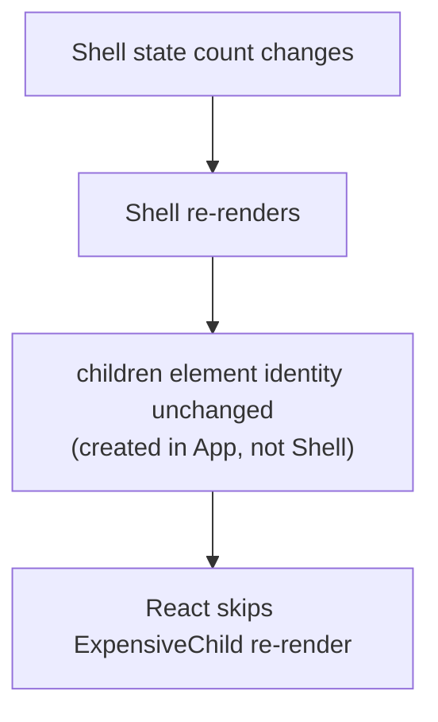

> Builds on Ch 03/05 (rendering, hooks), Ch 11 (architecture). The "pass children as a prop to
> avoid re-renders" answer from Interviewer's memo question (interview guide §1) lives here.

---

## The one mental model

> **Every React pattern answers one question: "who owns this state/behavior, and how do I let the
> consumer customize without me predicting every case?" The lever is almost always COMPOSITION
> over CONFIGURATION — instead of growing a component's props to cover every variation, let the
> caller pass in the pieces (elements, render functions, children). Composition pushes decisions
> outward to where the context is, keeps components open to extension, and (bonus) preserves
> element identity so React skips needless re-renders.**

From "composition over configuration" you derive compound components, slots, render props,
custom hooks, controlled-vs-uncontrolled, and why passing `children` fixes re-renders. No
memorizing a pattern catalog — each is a way to move a decision to the caller.

---

## Learning Objectives

1. Choose composition over configuration; explain its re-render bonus (Interviewer's trap).
2. Build compound components with implicit shared state (Context).
3. Decide controlled vs uncontrolled by "who owns the value" (ties to Ch 18).
4. Use custom hooks for logic reuse; know where render props/HOCs still apply.

---

## Key Mental Models

- **Configuration = props that enumerate cases** (grows forever, rigid).
- **Composition = caller passes the pieces** (`children`, slots, render fns) — flexible, open.
- **`children` passed from a parent has stable element identity**, so it doesn't re-render when
  the parent's own state changes (the re-render fix).
- **Custom hooks share LOGIC; components share UI.** Hooks replaced most HOCs/render props.

---

## Introduction

The difference between a junior and senior component is usually here: the junior adds a 12th
boolean prop; the senior makes the component composable so the 12th case needs no change. These
patterns are also frequent machine-coding asks (build a `<Tabs>`, a `<Modal>`, a reusable
`<Select>`).

---

## Problem — configuration explodes

```jsx
// ❌ configuration: every new need adds a prop; rigid, huge API
<Dialog
  title="Delete?" body="Sure?" icon="warn"
  showCancel cancelText="No" confirmText="Yes"
  footerAlign="right" onConfirm={...} onCancel={...} />
```

Each variation grows the prop surface; you can't express "a custom footer with two buttons and a
checkbox" without yet more props. The component is trying to predict every use. **Composition**
inverts it — give structure, let the caller fill it:

```jsx
// ✅ composition: caller assembles the pieces
<Dialog>
  <Dialog.Title>Delete?</Dialog.Title>
  <Dialog.Body>Sure?</Dialog.Body>
  <Dialog.Footer>
    <Button onClick={onCancel}>No</Button>
    <Button onClick={onConfirm}>Yes</Button>
  </Dialog.Footer>
</Dialog>
```

---

## Compound components — implicit shared state

The pieces coordinate through Context so the caller doesn't wire state manually:

```jsx
const TabsCtx = createContext();
function Tabs({ children, defaultTab }) {
  const [active, setActive] = useState(defaultTab);
  return <TabsCtx.Provider value={{ active, setActive }}>{children}</TabsCtx.Provider>;
}
Tabs.Tab = function Tab({ id, children }) {
  const { active, setActive } = useContext(TabsCtx);
  return <button aria-selected={active===id} onClick={() => setActive(id)}>{children}</button>;
};
Tabs.Panel = function Panel({ id, children }) {
  const { active } = useContext(TabsCtx);
  return active === id ? <div role="tabpanel">{children}</div> : null;
};
// Usage: <Tabs defaultTab="a"><Tabs.Tab id="a">A</Tabs.Tab><Tabs.Panel id="a">…</Tabs.Panel></Tabs>
```

State is shared implicitly via Context; the caller composes structure freely. This is how Radix /
shadcn (Ch 11) build accessible primitives.

---

## Engine Simulation — composition fixes re-renders (Interviewer's trap)

```jsx
// ❌ ExpensiveChild re-renders every time `count` changes, though it doesn't use count
function App() {
  const [count, setCount] = useState(0);
  return <div onClick={() => setCount(count+1)}>
    {count}
    <ExpensiveChild />
  </div>;
}

// ✅ pass it as children: its element is created in a PARENT that doesn't re-render
function Shell({ children }) {
  const [count, setCount] = useState(0);
  return <div onClick={() => setCount(count+1)}>{count}{children}</div>;
}
function App() {
  return <Shell><ExpensiveChild /></Shell>;   // ExpensiveChild element made here, identity stable
}
```

Why it works: `<ExpensiveChild/>` is created in `App`, which doesn't re-render on `count`. `Shell`
re-renders and re-uses the *same* `children` element object (stable identity, Ch 01 reference
model) → React reconciles it as unchanged → no re-render. **This is the structural alternative to
`React.memo`** Interviewer was fishing for — often cleaner than wrapping in memo (interview guide §1).



---

## Controlled vs uncontrolled, render props, hooks

- **Controlled vs uncontrolled (who owns the value):** a `<Select value onChange>` (caller owns)
  vs `<Select defaultValue>` (component owns). Same axis as forms (Ch 18). Good components support
  both.
- **Render props / children-as-function:** `<Tooltip>{({open}) => ...}</Tooltip>` — caller
  controls rendering with state the component provides. Mostly superseded by hooks but still handy
  for "give me state, you render."
- **HOCs** (`withAuth(Component)`): wrap to inject behavior. Largely replaced by **custom hooks**
  (`useAuth()`) which compose without wrapper hell and don't obscure the tree.
- **Custom hooks** share *logic* (a `useDisclosure()`, `useDebouncedValue()`); components share
  *UI*. Prefer a hook when the reuse is behavior, a component when it's markup.

---

## Interview Discussion (reason first)

**Q1. "A child re-renders when an unrelated parent state changes. Fixes?"**
> "Two options. `React.memo` the child + stable props — but it has a compare cost and no-ops on
> unstable props. Often cleaner: **composition** — pass the child as `children` from a component
> that doesn't own the changing state, so its element identity stays stable and React skips it.
> I'd reach for composition first, memo for measured hot spots." *(Don't say 'memo everything'.)*

**Q2. "Configuration vs composition?"**
> "Configuration enumerates cases as props and grows rigidly; composition lets the caller pass the
> pieces (children/slots/render fns), so new cases need no API change and decisions live where the
> context is. Compound components (Context-shared state) are the common pattern."

**Q3. "HOC vs custom hook?"**
> "Both reuse logic. HOCs wrap components (wrapper nesting, prop collisions, obscured tree); custom
> hooks compose flat, are explicit, and don't change the tree. Hooks replaced most HOC use; I reach
> for a hook to share logic and a component to share UI."

*Scoring:* full = composition-over-config + children-stable-identity re-render fix + hooks>HOC.

---

## Common Mistakes

- **Boolean-prop explosion** instead of composing structure.
- **Reaching for `memo`** when a composition (`children`) fix is cleaner (Interviewer's point).
- **HOC wrapper hell / prop collisions** where a custom hook would be flat and clear.
- **Compound components without Context** → forcing the caller to wire state by hand.
- **Supporting only controlled or only uncontrolled** when both are cheap to allow.

---

## Interview Questions

1. Refactor a 10-prop `<Dialog>` into a compound component; where does shared state live?
2. Show two ways to stop an unrelated child re-render; argue when composition beats `memo`.
3. Why did hooks largely replace HOCs and render props? When is a render prop still nice?
4. Make a `<Select>` support both controlled and uncontrolled use.
5. When do you extract a custom hook vs a component?

---

## Homework

1. Build `<Tabs>` as a compound component with Context-shared active state + a11y roles (Ch 23).
2. Reproduce the unrelated-re-render, fix it with the `children` composition trick, prove it in
   the Profiler, then compare to a `memo` fix.
3. In `NOTES.md`: composition-over-configuration + the children-identity re-render fix in one line.

---

## Summary

- Every pattern = **"who owns it, and how does the caller customize?"** Answer with **composition
  over configuration**: pass pieces (children/slots/render fns) instead of enumerating props.
- **Compound components** share state implicitly via Context (how Radix/shadcn work).
- **Passing `children`** keeps element identity stable, so a parent's state change skips
  re-rendering them — the structural alternative to `React.memo` (Interviewer's trap).
- **Controlled vs uncontrolled** = who owns the value (Ch 18); **custom hooks** share logic and
  have largely replaced **HOCs/render props**.

## Go deeper
Ch 11 (architecture/shadcn), Ch 18 (controlled/uncontrolled), Ch 08 (memo vs composition for
perf). patterns.dev is a good catalog once this lens is solid.
