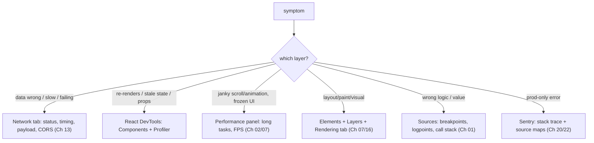

> Builds on Ch 02 (long tasks), Ch 04/05 (renders/hooks), Ch 07/08 (paint/perf), Ch 13
> (network). Interviewer's culture line: "debug with DevTools, logs, and performance metrics — not
> guesswork." This chapter is that skill.

---

## The one mental model

> **Debugging is a SCIENCE experiment, not a guessing game: form a hypothesis about where the
> bug is, then use the tool that OBSERVES that layer to confirm or kill it — and let the
> observation, not your hunch, pick the next step. Each layer has its instrument: network
> issues → Network tab; render/state issues → React DevTools; jank/slowness → Performance panel;
> layout/paint → Elements + Layers; logic → breakpoints. Bisect: cut the problem space in half
> each step until the cause is cornered.**

From "observe the layer, bisect" you derive why `console.log` spam is the slow path, how to find
*why* a component re-renders, how to locate a long task, and how to tell "is it the network or my
code." No memorizing tool menus — you map symptom → layer → instrument.

---

## Learning Objectives

1. Turn a vague bug into a hypothesis + the tool that tests it (symptom → layer → instrument).
2. Use React DevTools (Profiler "why did this render", Components) for render/state bugs.
3. Use the Performance panel to find long tasks/jank (Ch 02/07) and the Network tab for wire issues.
4. Use breakpoints (conditional, logpoints) instead of `console.log` archaeology.

---

## Key Mental Models

- **Symptom → layer → instrument.** Don't open a random tool; pick the one that observes the
  suspected layer.
- **Bisect.** Halve the search space each step (disable half, binary-search a commit, comment out
  a subtree).
- **Reproduce reliably first.** A bug you can't trigger on demand you can't fix with confidence.
- **Observe, don't assume.** The cause is usually not where you first think.

---

## Introduction

The JD and Interviewer both reward methodical debugging. Most engineers guess-and-`console.log`; a
senior reproduces, hypothesizes, and reaches for the right instrument. That discipline is a
direct interview signal ("walk me through debugging X") and a daily-velocity multiplier.

---

## Symptom → instrument map



---

## Engine Simulation — three common bugs, methodically

**1. "My component re-renders too much" (Ch 03/05/08).**
Hypothesis: an unstable prop or a parent re-render. Instrument: **React DevTools Profiler** →
record an interaction → click the component → **"Why did this render?"** tells you (props
changed / hooks changed / parent rendered). If a prop is "changed" every time, it's an unstable
object/function identity (Ch 01) → `useCallback`/`useMemo` or composition (Ch 24). You *observed*
the cause instead of sprinkling `memo` and hoping.

**2. "The page janks while scrolling" (Ch 02/07).**
Hypothesis: a long task or layout thrash. Instrument: **Performance panel** → record → look for
**long tasks** (red-flagged >50ms) and the flame chart. If it's "Recalculate Style/Layout"
repeatedly → layout thrashing (Ch 07) → batch reads/writes. If it's a big JS function → chunk it
or move to a Worker (Ch 17). The bar colors map straight to the pipeline (Ch 07).

**3. "Data is wrong / missing" (Ch 13/10).**
Hypothesis: bad request/response. Instrument: **Network tab** → find the request → check status
(401? 304? 500?), the payload, timing, and CORS headers (Ch 13). Rules out "is it the backend or
my rendering" in seconds — often it's the wire, not React.

---

## Breakpoints > console.log

```js
// Slow path: edit code, add logs, reload, read, repeat, remove logs...
console.log("here", value);
```

Faster: set a **breakpoint** in Sources (or a **logpoint** — logs without editing code), inspect
the live **scope** and **call stack** (Ch 01 — you can literally see the frames), step through.
**Conditional breakpoints** (`break when id === 7000`) pinpoint the one iteration that's wrong —
invaluable for the contacts-table-style "row 7000 misbehaves" bug. `debugger;` statement works
too. Reserve `console.log` for quick checks, not investigations.

---

## Other high-leverage tools

- **React DevTools → Components:** inspect props/state/hooks live; edit them to test hypotheses.
- **Rendering tab:** "Paint flashing" (what repaints), "Layout Shift regions" (CLS, Ch 08),
  FPS meter.
- **`$0`** in console = the selected element; **`$_`** = last result; `monitorEvents($0)`.
- **`why-did-you-render`** library for automatic re-render logging in dev.
- **Sentry** (Ch 22) for prod errors with source maps (Ch 20) → real line numbers.

---

## Interview Discussion (reason first)

**Q1. "A component re-renders too often. How do you find why — without guessing?"**
> "React DevTools Profiler, record the interaction, select the component, read 'Why did this
> render?' — it says props/hooks/parent. If a prop shows changed every render, it's unstable
> identity (Ch 01), so I stabilize it or restructure with composition. I confirm with the
> Profiler rather than blindly adding memo."

**Q2. "The UI is janky. Walk your process."**
> "Reproduce, then Performance panel: record and look for long tasks (>50ms) and the flame chart.
> Repeated Layout/Style = thrashing (batch reads/writes, Ch 07); a heavy JS function = chunk it or
> Worker it (Ch 17). The symptom points me at the instrument."

**Q3. "Data looks wrong — backend or frontend?"**
> "Network tab first: status, payload, timing, CORS. If the response is wrong it's backend/the
> request; if the response is right but the UI is wrong it's my rendering/state. Two minutes to
> bisect the layer."

*Scoring:* full = symptom→instrument + Profiler "why rendered" + Network-first triage + breakpoints.

---

## Common Mistakes

- **Guess-and-`console.log`** instead of picking the instrument for the layer.
- **Adding `memo` without the Profiler** confirming the cause (Ch 08).
- **Not reproducing reliably** before "fixing."
- **Ignoring the Network tab** and blaming React for a 401/CORS/slow API.
- **Reading prod stack traces without source maps** (Ch 20) → minified gibberish.

---

## Interview Questions

1. Map these symptoms to a tool: 401 on save, janky scroll, a value that's wrong on row 7000, too
   many re-renders.
2. How does the Profiler tell you *why* a component rendered, and what do you do per cause?
3. What's a long task and how do you spot it; what fixes layout thrashing?
4. Conditional breakpoint vs console.log — when is each right?
5. Why are source maps essential for prod debugging?

---

## Homework

1. Use the Profiler's "Why did this render?" on a component re-rendering from an unstable prop;
   fix it and confirm in the Profiler.
2. Record a janky interaction in the Performance panel; identify a long task or a Layout spike and
   tie it to Ch 02/07.
3. Set a conditional breakpoint to catch one bad iteration in a list; inspect the scope/call stack.
4. In `NOTES.md`: the symptom→instrument map.

---

## Summary

- Debug like an experiment: **hypothesis → observe the right layer → let data pick the next step**,
  and **bisect** the search space.
- **Symptom → instrument:** network → Network tab (Ch 13); re-renders/state → React DevTools
  Profiler ("why did this render?"); jank → Performance panel (long tasks, Ch 02/07); layout/paint
  → Elements/Layers/Rendering (Ch 07); logic → breakpoints (Ch 01); prod → Sentry + source maps
  (Ch 20/22).
- **Breakpoints/logpoints/conditional breakpoints** beat `console.log` archaeology.
- **Reproduce first; observe, don't assume** — the cause is rarely where you guessed.

## Go deeper
Ch 08 (Profiler for perf), Ch 07 (reading paint/layout), Ch 22 (Sentry). The Chrome DevTools docs
are the reference once the symptom→instrument reflex is built.
