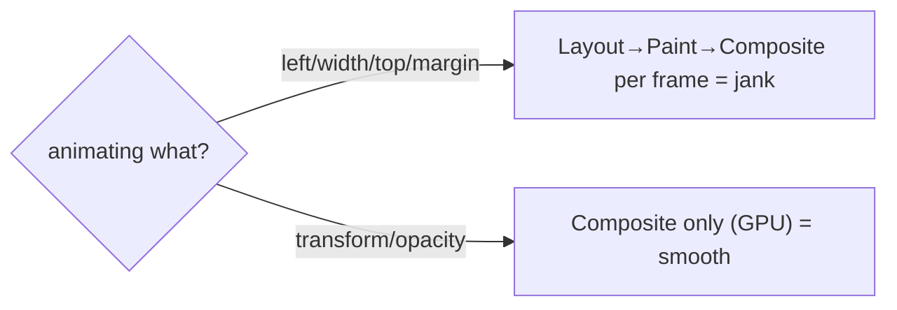

> Builds on Ch 07 (compositor: `transform`/`opacity` are cheap), Ch 17 (`requestAnimationFrame`),
> Ch 23 (reduced motion). JD bonus: Framer Motion. a product company wants "micro-interactions."

---

## The one mental model

> **Smooth animation = animate ONLY the cheap properties (`transform` and `opacity`) so the
> browser stays on the compositor and never re-runs layout/paint per frame (Ch 07), and let the
> browser drive timing (CSS transitions or rAF, Ch 17), not `setInterval`. A library like Framer
> Motion is just an ergonomic layer over that truth: you declare the start/end state and it
> interpolates cheap properties on the compositor, handling enter/exit/layout transitions for you.
> Animation is communication — it shows cause/effect and continuity, so it must also respect users
> who don't want motion.**

From "animate cheap props, browser-driven, motion is communication" you derive why `transform`
beats animating `top`/`width`, why `AnimatePresence` exists (React unmounts immediately, so exit
animations need help), and why you honor `prefers-reduced-motion`.

---

## Learning Objectives

1. Animate only compositor-friendly properties (`transform`/`opacity`) and explain why (Ch 07).
2. Choose CSS transitions/animations vs JS (rAF / Framer Motion) appropriately.
3. Use Framer Motion's model: `motion` components, `animate`, `AnimatePresence`, layout animations.
4. Respect `prefers-reduced-motion` and keep animation purposeful.

---

## Key Mental Models

- **Cheap = `transform` + `opacity`** (composite only, GPU). Everything else risks layout/paint
  per frame (Ch 07) → jank.
- **Browser-driven timing:** CSS transitions/animations or `requestAnimationFrame` — never
  `setInterval` (drifts, off-frame, Ch 02).
- **React unmounts instantly**, so **exit** animations need a tool that delays removal
  (`AnimatePresence`).
- **Animation is communication** (continuity, cause→effect, focus) — and optional for users who
  set reduced motion.

---

## Introduction

Polished micro-interactions are explicit in the job description, and animation is where Ch 07's pipeline pays
off visibly. The whole topic is "animate the cheap things, let the browser time it, make it mean
something."

---

## Problem — why naive animation janks

```css
/* ❌ animating layout properties → reflow every frame (Ch 07) → dropped frames */
.box { transition: left 300ms, width 300ms; }
.box:hover { left: 200px; width: 400px; }
```

`left`/`width` restart at **Layout** each frame (Ch 07's cost ladder), so a 60fps animation does
~60 layouts/sec → jank, especially with many elements. The fix is to express the same motion with
a compositor-only property:

```css
/* ✅ transform → composite only, GPU, smooth */
.box { transition: transform 300ms ease, opacity 300ms; }
.box:hover { transform: translateX(200px) scale(1.1); }
```



---

## CSS vs JS animation

- **CSS transitions** — interpolate between two states on a property change. Best for simple
  hover/toggle/enter effects; runs off the main thread for compositor props.
- **CSS keyframe animations** — multi-step, looping (spinners, pulses). Declarative, performant.
- **JS via `requestAnimationFrame`** (Ch 17) — when you need per-frame logic, physics, or values
  CSS can't express. Read/write in the rAF callback; never `setInterval`.
- **Framer Motion / Web Animations API** — declarative JS animation with spring physics, gesture,
  layout, and orchestration — the ergonomic choice for rich React UIs.

---

## Engine Simulation — Framer Motion's model

```jsx
import { motion, AnimatePresence } from "framer-motion";

// 1. Declare states; FM interpolates transform/opacity on the compositor
<motion.div
  initial={{ opacity: 0, y: 8 }}     // start
  animate={{ opacity: 1, y: 0 }}     // end (y → translateY, cheap)
  transition={{ duration: 0.2 }}
/>

// 2. Exit animations: React would unmount instantly; AnimatePresence delays removal
<AnimatePresence>
  {isOpen && (
    <motion.div key="modal"
      initial={{ opacity: 0 }} animate={{ opacity: 1 }}
      exit={{ opacity: 0 }} />     // runs BEFORE the node is removed
  )}
</AnimatePresence>
```

Why `AnimatePresence` exists: when `isOpen` goes false, React removes the node from the tree
*immediately* (Ch 03/06) — there's no frame to animate out. `AnimatePresence` keeps the element
mounted until its `exit` animation finishes, then removes it. That's the one Framer-Motion concept
people miss.

**Layout animations** (`layout` prop): FM measures the element's box before and after a layout
change (FLIP technique) and animates the difference with `transform` — so reordering a list
animates smoothly without animating layout properties directly. It's Ch 07's "transform is cheap"
applied automatically.

---

## Reduced motion (Ch 23)

```css
@media (prefers-reduced-motion: reduce) {
  * { animation: none !important; transition: none !important; }
}
```
```jsx
const reduce = useReducedMotion();            // Framer Motion hook
<motion.div animate={reduce ? {} : { y: 0 }} />
```

Vestibular disorders make motion physically unpleasant. Respect the OS setting — disable or
minimize non-essential motion. It's part of accessibility (Ch 23), not a nice-to-have.

---

## Interview Discussion (reason first)

**Q1. "Why animate `transform` instead of `top`/`width`?"**
> "Geometry properties restart the pipeline at Layout every frame (Ch 07), so a 60fps animation
> means ~60 layouts/sec → jank. `transform`/`opacity` are handled by the compositor on the GPU —
> no layout or paint per frame — so they stay smooth. Same visual result, far cheaper."

**Q2. "Why does Framer Motion need `AnimatePresence`?"**
> "React unmounts a removed element immediately, leaving no time to animate it out.
> `AnimatePresence` keeps it mounted until its `exit` animation completes, then removes it — that's
> how you get exit transitions."

**Q3. "How do you keep animations accessible?"**
> "Honor `prefers-reduced-motion` (media query / `useReducedMotion`) and disable non-essential
> motion; keep animation purposeful (showing continuity/cause-effect), short, and never blocking
> interaction."

*Scoring:* full = compositor-cheap-props (Ch 07) + AnimatePresence-because-unmount + reduced-motion.

---

## Common Mistakes

- **Animating `top`/`left`/`width`/`height`/`margin`** → reflow per frame, jank.
- **`setInterval` for animation** instead of CSS/rAF → off-frame, drifts (Ch 02).
- **Forgetting exit animations need `AnimatePresence`.**
- **Ignoring `prefers-reduced-motion`** (Ch 23).
- **Over-animating** — motion that distracts or delays the user instead of communicating.
- **Animating huge lists** without virtualization (Ch 08) — animate only what's visible.

---

## Interview Questions

1. Which properties animate cheaply and why (tie to Ch 07's pipeline)?
2. CSS transition vs keyframes vs rAF vs Framer Motion — when each?
3. Why is `AnimatePresence` necessary; what would happen without it?
4. What does Framer Motion's `layout` prop do (FLIP), and why is it smooth?
5. How do you make animations respect accessibility?

---

## Homework

1. Animate a card two ways (`left` vs `transform`); record both in the Performance panel and
   compare layout/paint cost (Ch 07).
2. Build a modal with Framer Motion enter + exit using `AnimatePresence`; remove `AnimatePresence`
   and watch the exit disappear instantly.
3. Add a `prefers-reduced-motion` path. In `NOTES.md`: cheap-props + AnimatePresence-why in 2 lines.

---

## Summary

- **Animate only `transform`/`opacity`** so the browser stays on the **compositor** (GPU) and
  skips layout/paint per frame (Ch 07) — that's the smooth-vs-janky line.
- **Browser-driven timing** (CSS transitions/keyframes or `requestAnimationFrame`, Ch 17) —
  never `setInterval`.
- **Framer Motion** declares start/end states and interpolates cheap props; **`AnimatePresence`**
  enables **exit** animations (React unmounts instantly otherwise); **`layout`** animates position
  changes via FLIP/transform.
- **Animation is communication** and must respect **`prefers-reduced-motion`** (Ch 23).

## Go deeper
Ch 07 (the pipeline this rests on), Ch 17 (rAF), Ch 23 (reduced motion). Framer Motion (motion.dev)
docs are the reference once the cheap-property model is solid.
