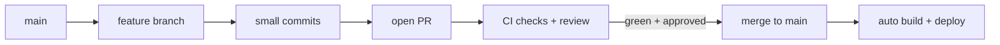
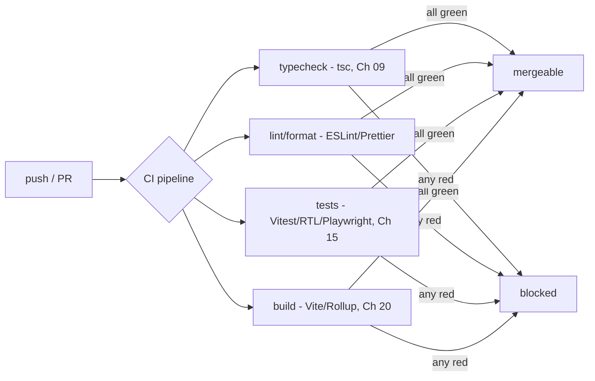
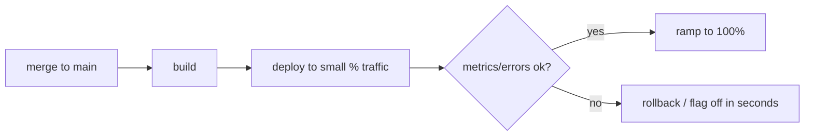

> Builds on Ch 15 (tests run in CI), Ch 20 (the build), Ch 22 (rollback on incident), Ch 19
> (where it deploys). JD: "ship weekly," rolling releases, high ownership.

---

## The one mental model

> **Shipping is a PIPELINE that trades manual risk for automated confidence: every change flows
> commit → branch → PR (review + automated checks) → merge → build → deploy, and the whole point
> is that machines verify quality (types, lint, tests, build) on every change so humans can ship
> small and often without fear. The deployment strategy (preview → gradual rollout → rollback)
> exists so a bad change has the smallest possible blast radius and is reversible in seconds.**

From "automate confidence, shrink blast radius, stay reversible" you derive why small frequent
PRs beat big merges, why CI gates exist, why preview deployments matter, and why rollback/feature
flags are the senior incident move (Ch 22).

---

## Learning Objectives

1. Use Git effectively: small branches/PRs, meaningful commits, merge vs rebase, resolve conflicts.
2. Explain CI as automated quality gates (types/lint/test/build) on every PR.
3. Explain CD: preview deployments, gradual/rolling rollout, instant rollback, feature flags.
4. Connect "ship weekly + reversible" to incident response (Ch 22) and the job description's velocity value.

---

## Key Mental Models

- **Small, frequent changes** = small blast radius + easy review + easy revert.
- **CI = the same checks, every time, automatically** — the safety net that enables speed.
- **CD = make deploys boring and reversible** (preview, gradual rollout, one-click rollback).
- **Feature flags decouple deploy from release** — ship code dark, turn it on/off without redeploy.

---

## Introduction

"Ship weekly" and "own outcomes" (JD) only work on top of a pipeline that catches mistakes
automatically and makes bad releases reversible. You don't need to be a DevOps engineer, but an
SDE-2 must work the pipeline confidently and answer "how do you ship safely / handle a bad
release."

---

## Git workflow

- **Branch per change**, kept **small and short-lived** — easier to review and revert; fewer
  conflicts. Long-lived branches drift and create painful merges.
- **Commits** tell a story; conventional style (`feat:`, `fix:`) aids changelogs/automation.
- **Merge vs rebase:** merge preserves history (a merge commit); rebase replays your commits onto
  the latest base for a linear history. Rebase your *local* feature branch to stay current; don't
  rebase shared/pushed history others build on.
- **Conflicts** happen when two branches change the same lines; resolve by choosing/combining,
  then re-test. Small frequent merges minimize them.

---

## CI — automated quality gates

CI runs the *same* checks on every PR so quality doesn't depend on someone remembering. The gate
makes "ship small and often" safe — a regression is caught before merge, not in production. This
is the job description's "maintainable, scalable code" enforced mechanically. (Pre-commit hooks, Ch tooling,
catch issues even earlier, locally.)

---

## CD — make deploys boring and reversible

- **Preview deployments:** every PR gets a unique URL with that branch deployed (Vercel-style), so
  reviewers and product test the real thing before merge. Huge for a UI team.
- **Production deploy:** merge to main → build → deploy automatically.
- **Gradual / rolling releases:** route a small % of traffic to the new version first, watch
  metrics/errors (Ch 22 Sentry), then ramp to 100%. A bad release hits few users.
- **Instant rollback:** promote the previous good build in seconds — the **first** move when
  something breaks (Ch 22 incident response).
- **Feature flags:** deploy code disabled, then flip it on for a cohort or everyone without a
  redeploy — and flip it **off** instantly if it misbehaves. Decouples *deploy* from *release*.

---

## Interview Discussion (reason first)

**Q1. "How do you ship safely while shipping weekly?"**
> "Small short-lived branches and PRs gated by CI — typecheck, lint, tests, build run on every
> change, so regressions are caught before merge. Preview deployments let product verify the real
> UI. Production uses gradual rollout with monitoring and one-click rollback, and feature flags so
> I can release dark and toggle off instantly. Small + automated + reversible = safe velocity."

**Q2. "A release broke production — first move?"**
> "Mitigate before diagnosing: roll back to the last good build or flip the feature flag off to
> stop user impact (Ch 22). Then Sentry → reproduce → fix with a guard/test → postmortem. Rolling
> releases make the rollback fast and the blast radius small."

**Q3. "Merge vs rebase?"**
> "Merge keeps true history with a merge commit; rebase replays commits for a linear history. I
> rebase my local feature branch to stay current and keep history clean, but never rebase shared/
> pushed branches others have based work on."

*Scoring:* full = small-PRs + CI-gates + rollout/rollback/flags + mitigate-first incident.

---

## Common Mistakes

- **Huge long-lived branches** → painful reviews, conflicts, risky merges.
- **Relying on humans to run checks** instead of CI gates.
- **No preview/staging** — first real test is production.
- **Debugging a bad release before rolling back** (Ch 22) — users keep getting hit.
- **Rebasing shared history** → rewrites others' base, chaos.
- **Coupling deploy and release** when a feature flag would let you ship dark and toggle.

---

## Interview Questions

1. Why do small, frequent PRs beat large merges (review, conflicts, revert)?
2. What checks belong in CI and why gate the merge on them?
3. Explain gradual rollout + rollback; how do feature flags relate?
4. First action on a broken production release, and why (tie to Ch 22)?
5. Merge vs rebase — when each, and what must you never rebase?

---

## Homework

1. Set up a tiny GitHub Actions CI that runs typecheck + lint + test + build on PRs; make a PR fail
   a check and watch it block.
2. Add a feature flag to gate a new component; flip it on/off without redeploying.
3. In `NOTES.md`: the commit→PR→CI→deploy pipeline + "mitigate (rollback/flag) first" in 2 lines.

---

## Summary

- Shipping is a **pipeline that trades manual risk for automated confidence**: commit → branch →
  PR (review + CI) → merge → build → deploy.
- **Small, frequent changes** shrink blast radius and ease review/revert; **CI** runs the same
  quality gates (types/lint/tests/build, Ch 09/15/20) on every PR so speed stays safe.
- **CD makes deploys boring and reversible:** preview URLs, **gradual/rolling rollout** with
  monitoring (Ch 22), **instant rollback**, and **feature flags** that decouple deploy from
  release.
- On a bad release: **mitigate first (rollback / flag off)**, then diagnose (Ch 22). This is what
  "ship weekly with high ownership" rests on.

## Go deeper
Ch 15 (tests CI runs), Ch 20 (the build), Ch 22 (incident response/rollback), Ch 19 (deploy
targets). Your platform's docs (GitHub Actions, Vercel) are the reference once the pipeline model
is clear.
