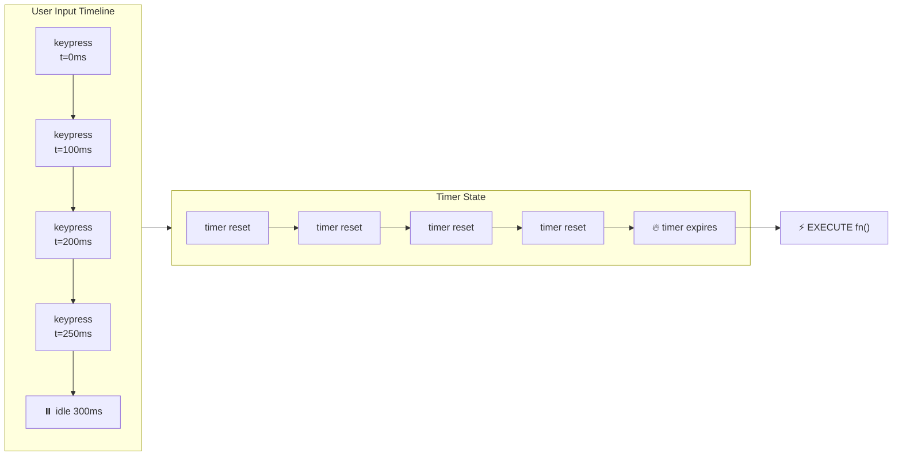
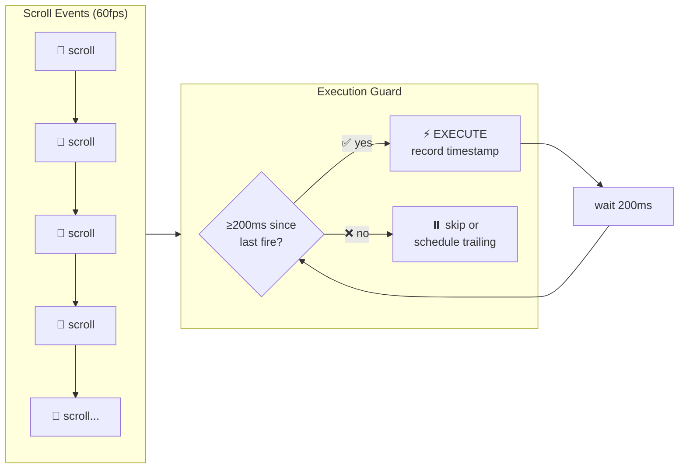
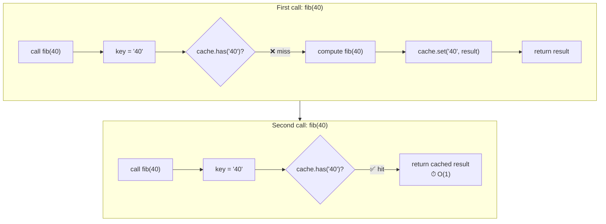

> Builds on Ch 01 (closures, memory, execution context), Ch 02 (event loop, promises, async/await).
> The whiteboard/coderpad round — implement these from scratch, no lodash, no libraries.

---

## The one mental model

> **Every coding problem tests whether you understand the raw primitives JavaScript gives you:**
> **closure (remember variables across calls), time (delay/cancel execution), iteration,**
> **promise creation/composition, and value vs reference. If you can re-derive the utility from**
> **those primitives, you never need to memorize the implementation — you build it from scratch**
> **by asking "what primitives does this problem need?"**

From "what primitives does this problem need" you derive: debounce needs closure + setTimeout,
throttle needs closure + time comparison, deep clone needs recursion + type checks,
Promise.all needs array iteration + resolve/reject tracking.

---

## Learning Objectives

1. Implement debounce and throttle from scratch — and explain the difference
2. Implement deep clone handling all edge types (Date, RegExp, Map, Set, circular refs)
3. Implement Promise.all, Promise.race, Promise.allSettled from scratch
4. Implement array utilities: flatten, groupBy, unique, chunk
5. Implement memoize/caching with LRU eviction
6. Implement async flow control: series, parallel, pool, retry, timeout

---

## Key Mental Models

- **Closure is a backpack.** A function remembers the variables that were in scope when it
  was created. Every util below (debounce, throttle, memoize) uses closure as its state.
- **JavaScript is single-threaded but async.** Promise and setTimeout let you schedule work.
  Understanding the event loop order (Ch 02) is essential for async utilities.
- **Value vs reference determines clone strategy.** Primitives copy by value; objects by
  reference. Deep clone needs to traverse the reference graph and copy at every node.
- **Recursion needs a termination condition.** Every recursive problem (flatten, deep clone)
  must know when to stop recursing.

---

## 1. Debounce

### Problem

User types in a search box. You want to call the API only after they STOP typing for 300ms,
not on every keystroke.

### Mental model



Every keystroke resets a timer. The function only fires when the timer expires without a reset.

### Implementation

```javascript
function debounce(fn, delay) {
  let timer = null;
  return function(...args) {
    const context = this;
    clearTimeout(timer);
    timer = setTimeout(() => fn.apply(context, args), delay);
  };
}
```

### Interview answer (SDE-2)

"Debounce creates a closure over a timer variable. Every call clears the previous timer and
starts a new one. The original function only executes after `delay` ms of inactivity. This is
essential for search-as-you-type, autocomplete, and window resize handlers where you want to
fire only after the user has stopped."

### Edge cases to discuss

- **`this` binding**: use `fn.apply(context, args)` to preserve the `this` of the returned
  wrapper, or use an arrow function wrapper.
- **Return value**: Standard debounce drops intermediate returns. For a return-value variant,
  return a Promise that resolves on the next execution.
- **Leading + trailing**: Some debounce implementations support `leading: true` to fire
  immediately on the first call, then debounce subsequent calls.
- **Cancel**: Expose a `.cancel()` method to clear the timer externally.

### Real-world

```javascript
// Autocomplete input
const handleSearch = debounce(async (query) => {
  const results = await fetch(`/api/search?q=${query}`);
  setResults(results);
}, 300);

// Window resize — don't recalculate layout on every pixel
const handleResize = debounce(() => recalculateLayout(), 150);
```

---

## 2. Throttle

### Problem

User scrolls a page. You want to fire a handler at most once every 200ms, not on every
scroll event (which can fire 60+ times/second).

### Mental model



Instead of resetting a timer (debounce), throttle checks if enough time has passed since the
last execution. If yes, execute and update the timestamp. If no, schedule for later or skip.

### Implementation (timestamp version — fires immediately)

```javascript
function throttle(fn, limit) {
  let lastCall = 0;
  return function(...args) {
    const now = Date.now();
    if (now - lastCall >= limit) {
      lastCall = now;
      fn.apply(this, args);
    }
  };
}
```

### Implementation (trailing edge — fires at end of burst)

```javascript
function throttle(fn, limit) {
  let lastCall = 0;
  let timer = null;
  return function(...args) {
    const context = this;
    const now = Date.now();
    const remaining = limit - (now - lastCall);

    if (remaining <= 0) {
      // Enough time passed — fire now
      if (timer) { clearTimeout(timer); timer = null; }
      lastCall = now;
      fn.apply(context, args);
    } else if (!timer) {
      // Schedule trailing edge
      timer = setTimeout(() => {
        lastCall = Date.now();
        timer = null;
        fn.apply(context, args);
      }, remaining);
    }
  };
}
```

### Debounce vs Throttle — interview table

| | Debounce | Throttle |
|---|---|---|
| Fires after | pause/inactivity | every N ms |
| Use case | search input, resize end | scroll, mousemove, progress events |
| Trailing edge | always | optional |
| Leading edge | optional (default false) | optional (default true) |

### Interview answer (SDE-2)

"Throttle guarantees execution at most once per interval. It's the right tool when you need
regular progress updates during a continuous action: scroll position, mouse coordinates,
upload progress. The key tradeoff: debounce might never fire if the event keeps streaming;
throttle guarantees at least one fire per interval."

---

## 3. Deep Clone

### Problem

```javascript
const original = { a: 1, b: { c: [1, 2, 3] } };
const copy = { ...original };
copy.b.c.push(4); // Mutates original.b.c too!
```

`Spread` and `Object.assign` only do shallow copy. Nested objects are shared by reference.

### Mental model

```
Shallow copy:
original ──→ { a: 1, b: ──→ { c: [1,2,3] } }
                               ↑
copy ─────→ { a: 1, b: ────────┘  (shared!)

Deep copy:
original ──→ { a: 1, b: ──→ { c: [1,2,3] } }
copy ─────→ { a: 1, b: ──→ { c: [1,2,3] } }  (fully independent)
```

Walk the object graph recursively, creating new objects at every node.

### Implementation

```javascript
function deepClone(value, seen = new WeakMap()) {
  // Primitives — return as-is
  if (value === null || typeof value !== 'object') return value;

  // Handle circular references
  if (seen.has(value)) return seen.get(value);

  let result;

  // Date, RegExp, Map, Set
  if (value instanceof Date) result = new Date(value);
  else if (value instanceof RegExp) result = new RegExp(value.source, value.flags);
  else if (value instanceof Map) {
    result = new Map();
    seen.set(value, result);
    value.forEach((v, k) => result.set(deepClone(k, seen), deepClone(v, seen)));
    return result;
  } else if (value instanceof Set) {
    result = new Set();
    seen.set(value, result);
    value.forEach(v => result.add(deepClone(v, seen)));
    return result;
  } else if (Array.isArray(value)) {
    result = [];
    seen.set(value, result);
    for (let i = 0; i < value.length; i++) result[i] = deepClone(value[i], seen);
  } else {
    // Plain object
    result = Object.create(Object.getPrototypeOf(value));
    seen.set(value, result);
    // Copy all properties including Symbols
    for (const key of [...Object.keys(value), ...Object.getOwnPropertySymbols(value)]) {
      result[key] = deepClone(value[key], seen);
    }
  }

  return result;
}
```

### Edge cases

- **Circular references**: `WeakMap` tracks visited objects. Without this → stack overflow.
- **Date/RegExp**: `new Date(date)` preserves milliseconds; `new RegExp(re.source, re.flags)`.
- **Map/Set**: Must iterate and deep clone keys and values individually.
- **Symbol keys**: `Object.getOwnPropertySymbols()` captures them; `Object.keys()` doesn't.
- **Prototype chain**: `Object.create(Object.getPrototypeOf(value))` preserves inheritance.
- **Typed arrays / ArrayBuffer**: Special-case these for completeness.
- **Functions**: Usually shared by reference in practice — but could compile anew.

### Interview answer (SDE-2)

"Deep clone recursively traverses the object graph and replicates every value. The challenge
is handling types: Date, RegExp, Map, Set all need their own construction strategy. Circular
references require a WeakMap cache — without it, you get infinite recursion. The WeakMap
stores already-cloned objects; when the clone encounters the same reference again, it returns
the cached clone. For production, `structuredClone()` (available in modern browsers and Node
17+) handles all this natively and is faster than any hand-rolled implementation."

---

## 4. Promise.all, Promise.race, Promise.allSettled

### Promise.all — wait for all, fail fast

```javascript
function promiseAll(iterable) {
  return new Promise((resolve, reject) => {
    const arr = Array.from(iterable);
    if (arr.length === 0) return resolve([]);

    const results = new Array(arr.length);
    let completed = 0;

    arr.forEach((item, i) => {
      Promise.resolve(item).then(
        value => {
          results[i] = value;
          completed++;
          if (completed === arr.length) resolve(results);
        },
        reject  // fail fast — reject immediately on first error
      );
    });
  });
}
```

### Promise.race — first settled wins

```javascript
function promiseRace(iterable) {
  return new Promise((resolve, reject) => {
    for (const item of iterable) {
      Promise.resolve(item).then(resolve, reject);
    }
  });
}
```

### Promise.allSettled — wait for all, collect results

```javascript
function promiseAllSettled(iterable) {
  return new Promise(resolve => {
    const arr = Array.from(iterable);
    if (arr.length === 0) return resolve([]);

    const results = new Array(arr.length);
    let completed = 0;

    arr.forEach((item, i) => {
      Promise.resolve(item).then(
        value => { results[i] = { status: 'fulfilled', value }; },
        reason => { results[i] = { status: 'rejected', reason }; }
      ).finally(() => {
        completed++;
        if (completed === arr.length) resolve(results);
      });
    });
  });
}
```

### Key insight

`Promise.all` and `Promise.race` use the **reject handler directly** (`reject` as second
`.then` arg) to fail fast. `Promise.allSettled` never rejects — it always resolves with
an array of `{ status, value/reason }` objects.

### Real-world

```javascript
// Promise.all — parallel independent requests
const [user, posts, notifications] = await Promise.all([
  fetchUser(id),
  fetchPosts(id),
  fetchNotifications(id),
]);

// Promise.race — timeout pattern
const result = await Promise.race([
  fetch(url),
  new Promise((_, reject) => setTimeout(() => reject(new Error('timeout')), 5000)),
]);

// Promise.allSettled — partial results acceptable
const results = await Promise.allSettled(
  urls.map(url => fetch(url))
);
const successful = results.filter(r => r.status === 'fulfilled').map(r => r.value);
```

---

## 5. Array Utilities

### Flatten

```javascript
function flatten(arr, depth = Infinity) {
  const result = [];
  for (const item of arr) {
    if (Array.isArray(item) && depth > 0) {
      result.push(...flatten(item, depth - 1));
    } else {
      result.push(item);
    }
  }
  return result;
}

// Iterative version (no recursion)
function flattenIterative(arr) {
  const stack = [...arr];
  const result = [];
  while (stack.length) {
    const next = stack.pop();
    if (Array.isArray(next)) {
      stack.push(...next);
    } else {
      result.unshift(next);
    }
  }
  return result;
}
```

### GroupBy

```javascript
function groupBy(arr, keyFn) {
  return arr.reduce((acc, item) => {
    const key = keyFn(item);
    if (!acc[key]) acc[key] = [];
    acc[key].push(item);
    return acc;
  }, {});
}

// Example
const people = [
  { name: 'Alice', role: 'engineer' },
  { name: 'Bob', role: 'designer' },
  { name: 'Charlie', role: 'engineer' },
];
groupBy(people, p => p.role);
// { engineer: [Alice, Charlie], designer: [Bob] }
```

### Unique

```javascript
function unique(arr) {
  return [...new Set(arr)];
}

// Unique by key (objects)
function uniqueBy(arr, keyFn) {
  const seen = new Set();
  return arr.filter(item => {
    const key = keyFn(item);
    if (seen.has(key)) return false;
    seen.add(key);
    return true;
  });
}
```

### Chunk

```javascript
function chunk(arr, size) {
  const result = [];
  for (let i = 0; i < arr.length; i += size) {
    result.push(arr.slice(i, i + size));
  }
  return result;
}
// chunk([1,2,3,4,5], 2) → [[1,2], [3,4], [5]]
```

### Interview answer (SDE-2)

"Array utilities are reduce and recursion puzzles. Flatten recursively or iteratively
with a stack — the iterative approach avoids call-stack limits for deeply nested data.
GroupBy is a single reduce with a Map accumulator. Chunk is slice in a loop. The key
question is always: 'what if the array is empty, what if all items map to the same key,
what if size is larger than the array length?' — that's what separates careful from
careless implementations."

---

## 6. Memoize

### Problem

```javascript
// Expensive computation called multiple times with same args
function fibonacci(n) { ... }
fibonacci(40); // expensive
fibonacci(40); // expensive again — same input, wasted work
```

### Mental model — closure over a cache



### Implementation

```javascript
function memoize(fn) {
  const cache = new Map();
  return function(...args) {
    const key = JSON.stringify(args);
    if (cache.has(key)) return cache.get(key);
    const result = fn.apply(this, args);
    cache.set(key, result);
    return result;
  };
}
```

### LRU Cache (interview favorite)

Least Recently Used eviction — when the cache exceeds `maxSize`, drop the oldest entry.

```javascript
function memoizeLRU(fn, maxSize = 100) {
  const cache = new Map();
  return function(...args) {
    const key = JSON.stringify(args);
    if (cache.has(key)) {
      // Move to end (most recently used)
      const value = cache.get(key);
      cache.delete(key);
      cache.set(key, value);
      return value;
    }
    const result = fn.apply(this, args);
    cache.set(key, result);
    if (cache.size > maxSize) {
      // Delete the least recently used (first entry)
      const oldestKey = cache.keys().next().value;
      cache.delete(oldestKey);
    }
    return result;
  };
}
```

### Interview answer (SDE-2)

"Memoize trades memory for CPU. The wrapper function stores results in a closure-held cache
keyed by serialized arguments. On every call, check the cache first — if hit, return
immediately; if miss, compute, store, return. The key challenge is argument serialization:
`JSON.stringify` works for primitives and plain objects but fails for `undefined`, functions,
Symbols, and circular references. A robust memoize uses a `Map` of argument tuples or a
custom key function. LRU eviction prevents memory leaks by dropping the oldest entry when
the cache exceeds a size limit — implemented with `Map`'s insertion-order guarantee."

---

## 7. Async Flow Control

### Series (sequential execution)

```javascript
async function series(tasks) {
  const results = [];
  for (const task of tasks) {
    results.push(await task());
  }
  return results;
}
```

### Parallel (concurrent with limit)

```javascript
async function parallel(tasks, concurrency = Infinity) {
  const iterator = tasks[Symbol.iterator]();
  const results = new Array(tasks.length);

  async function worker(workerId) {
    for (let i = 0; ; i++) {
      const { value, done } = iterator.next();
      if (done) break;
      // Reassign correct index — use closure over iterator
      results[i] = await value();
    }
  }

  const workers = Array.from({ length: Math.min(concurrency, tasks.length) },
    (_, i) => worker(i));
  await Promise.all(workers);
  return results;
}
```

### Retry with exponential backoff

```javascript
async function retry(fn, maxAttempts = 3, baseDelay = 1000) {
  for (let attempt = 1; attempt <= maxAttempts; attempt++) {
    try {
      return await fn();
    } catch (error) {
      if (attempt === maxAttempts) throw error;
      const delay = baseDelay * Math.pow(2, attempt - 1); // 1s, 2s, 4s
      await new Promise(resolve => setTimeout(resolve, delay));
    }
  }
}
```

### Timeout wrapper

```javascript
function withTimeout(promise, ms) {
  return Promise.race([
    promise,
    new Promise((_, reject) =>
      setTimeout(() => reject(new Error(`Timed out after ${ms}ms`)), ms)
    ),
  ]);
}
```

### Async pool (bounded concurrency)

```javascript
async function asyncPool(urls, limit, fetcher) {
  const results = [];
  const executing = new Set();

  for (const [index, url] of urls.entries()) {
    const p = fetcher(url).then(result => {
      results[index] = result;
      executing.delete(p);
    });
    executing.add(p);

    if (executing.size >= limit) {
      await Promise.race(executing);
    }
  }

  await Promise.all(executing);
  return results;
}
```

---

## 8. Pipe & Compose

```javascript
// Pipe — left to right
const pipe = (...fns) => x => fns.reduce((acc, fn) => fn(acc), x);

// Compose — right to left
const compose = (...fns) => x => fns.reduceRight((acc, fn) => fn(acc), x);

// Example
const add1 = x => x + 1;
const double = x => x * 2;
const toString = x => String(x);

pipe(add1, double, toString)(5);   // "12"
compose(toString, double, add1)(5); // "12"
```

---

## 9. Currying

```javascript
// Curry a binary function
function curry(fn) {
  return function curried(...args) {
    if (args.length >= fn.length) {
      return fn.apply(this, args);
    }
    return (...next) => curried(...args, ...next);
  };
}

// Example
const add = (a, b, c) => a + b + c;
const curriedAdd = curry(add);
curriedAdd(1)(2)(3); // 6
curriedAdd(1, 2)(3); // 6
```

---

## Interview Cheatsheet — Top 10 Coding Problems

| Problem | Primitive | Key edge cases |
|---|---|---|
| Debounce | closure + setTimeout | `this`, leading edge, cancel |
| Throttle | closure + time diff | trailing edge, timestamp monotonicity |
| Deep clone | recursion + WeakMap | circular, Date, RegExp, Map, Set, Symbol |
| Promise.all | array + resolve counter | empty input, non-promise items, fail-fast |
| Flatten | recursion / stack | depth parameter, empty arrays, sparse arrays |
| GroupBy | reduce | null items, symbol keys |
| Memoize | closure + Map | LRU eviction, key serialization |
| Retry | recursion + setTimeout | exponential backoff, jitter, max attempts |
| Compose/Pipe | reduce/reduceRight | arity of first/last function |
| Currying | recursion on arity | placeholder arg support |

---

## Summary

> **The 6 primitives: closure, setTimeout, recursion, Promise, Map, reduce.**
> Every coding problem reduces to composing these. Don't memorize implementations —
> practice deriving them from primitives while narrating edge cases aloud.

---

## Homework

1. Implement `debounce` with `leading` option that fires immediately on first call
2. Implement `throttle` that guarantees at least one trailing edge call
3. Implement `Promise.any` (first fulfilled, aggregate error if all reject)
4. Implement deep clone using `structuredClone` — compare with your hand-rolled version
5. Implement LRU cache with `get` and `set` methods (not just memoize)
6. Implement `asyncPool` that limits concurrency of fetch calls
7. Implement `pipeAsync` for async functions: `pipeAsync(fetchUser, parseJSON, validate)`
