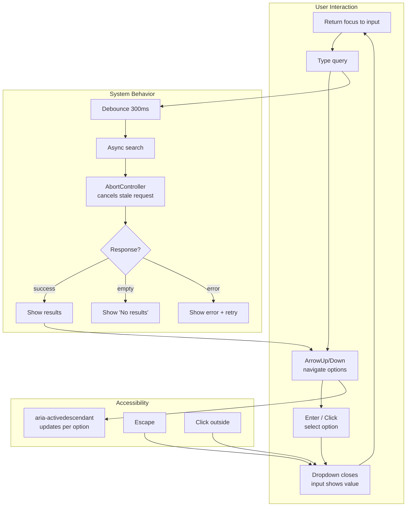
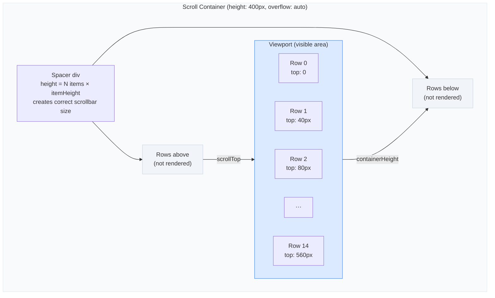

> Builds on Ch 03 (rendering), Ch 05 (hooks), Ch 06 (keys), Ch 24 (patterns).
> The shared-editor / CoderPad round — build a working component from scratch.

---

## The one mental model

> **Machine coding tests your component instinct: can you go from prompt → minimal state →**
> **working UI → edge cases → accessibility in 15–20 minutes, narrating your reasoning?**
> **The interviewer is NOT checking if you remember the exact API. They're checking:**
> **"Can this person BUILD something that works, handle the full interaction lifecycle,**
> **and talk about tradeoffs while coding?"**

From "minimal state → working UI → edges" you derive: use `useState` before over-engineering,
discriminated unions for status, controlled vs uncontrolled decision, keyboard + screen reader
support, and the four states (loading, empty, error, data).

---

## Learning Objectives

1. Build searchable dropdown / autocomplete with keyboard nav + debounce + cancel
2. Build tabs, accordion, modal with controlled + uncontrolled variants
3. Build infinite scroll with Intersection Observer
4. Build virtual list with fixed-height items
5. Build OTP input with auto-focus and paste
6. Build drag-and-drop without a library

---

## Key Mental Models

- **Minimal state**: Derive everything else. If a value can be computed from existing state,
  don't store it.
- **Discriminated union for status**: `{ status: 'loading' | 'empty' | 'error' | 'success',
  data?, error? }`. Covers every UI state without impossible combinations.
- **Controlled vs uncontrolled**: Does the parent own the value? Controlled. Does the
  component manage itself? Uncontrolled. Support both via the same pattern.
- **Keyboard + mouse**: Every interactive component needs Enter/Escape/Arrow/Tab handling,
  focus management, and screen reader attributes.

---

## 1. Searchable Dropdown / Autocomplete



This is the most common machine-coding question at SDE-2 level.

### Requirements

- Text input filters a list
- Keyboard: ArrowUp/ArrowDown to navigate, Enter to select, Escape to close
- Click outside closes
- Debounced async search with cancel
- Loading / empty / error states
- `aria-combobox` pattern for screen readers

### Minimal state

```javascript
{
  isOpen: false,
  inputValue: '',
  highlightedIndex: -1,
  items: [],          // filtered items
  status: 'idle',     // 'idle' | 'loading' | 'success' | 'empty' | 'error'
}
```

### Implementation skeleton

```jsx
function SearchableSelect({ options, onChange, async, onSearch }) {
  const [isOpen, setIsOpen] = useState(false);
  const [inputValue, setInputValue] = useState('');
  const [highlightedIndex, setHighlightedIndex] = useState(-1);
  const [items, setItems] = useState(async ? [] : options);
  const [status, setStatus] = useState('idle');
  const inputRef = useRef(null);
  const listRef = useRef(null);

  // Debounced async search with cancel
  useEffect(() => {
    if (!async || !inputValue) return;
    const controller = new AbortController();
    setStatus('loading');

    onSearch(inputValue, controller.signal)
      .then(data => {
        setItems(data);
        setStatus(data.length === 0 ? 'empty' : 'success');
      })
      .catch(err => {
        if (err.name !== 'AbortError') setStatus('error');
      });

    return () => controller.abort();
  }, [inputValue, async]);

  // Filter local options
  useEffect(() => {
    if (async) return;
    const filtered = options.filter(o =>
      o.label.toLowerCase().includes(inputValue.toLowerCase())
    );
    setItems(filtered);
    setStatus(filtered.length === 0 ? 'empty' : 'success');
  }, [inputValue, options]);

  // Keyboard navigation
  const handleKeyDown = (e) => {
    switch (e.key) {
      case 'ArrowDown':
        e.preventDefault();
        setHighlightedIndex(i => Math.min(i + 1, items.length - 1));
        break;
      case 'ArrowUp':
        e.preventDefault();
        setHighlightedIndex(i => Math.max(i - 1, 0));
        break;
      case 'Enter':
        if (highlightedIndex >= 0) {
          selectItem(items[highlightedIndex]);
        }
        break;
      case 'Escape':
        setIsOpen(false);
        break;
    }
  };

  const selectItem = (item) => {
    onChange?.(item);
    setInputValue(item.label);
    setIsOpen(false);
  };

  return (
    <div className="autocomplete" role="combobox" aria-expanded={isOpen}>
      <input
        ref={inputRef}
        value={inputValue}
        onChange={e => { setInputValue(e.target.value); setIsOpen(true); }}
        onFocus={() => setIsOpen(true)}
        onKeyDown={handleKeyDown}
        aria-autocomplete="list"
        aria-controls="listbox"
        aria-activedescendant={highlightedIndex >= 0 ? `option-${highlightedIndex}` : undefined}
      />
      {isOpen && (
        <ul ref={listRef} role="listbox" id="listbox">
          {status === 'loading' && <li>Loading...</li>}
          {status === 'empty' && <li>No results</li>}
          {status === 'error' && <li>Something went wrong</li>}
          {status === 'success' && items.map((item, i) => (
            <li
              key={item.value}
              id={`option-${i}`}
              role="option"
              aria-selected={i === highlightedIndex}
              className={i === highlightedIndex ? 'highlighted' : ''}
              onClick={() => selectItem(item)}
              onMouseEnter={() => setHighlightedIndex(i)}
            >
              {item.label}
            </li>
          ))}
        </ul>
      )}
    </div>
  );
}
```

### Interview checklist

- [ ] Debounce async input (use a custom `useDebounce` hook)
- [ ] Abort stale requests (AbortController in useEffect cleanup)
- [ ] Keyboard nav (ArrowUp/Down, Enter, Escape)
- [ ] Click-outside close (useRef + mousedown listener)
- [ ] aria attributes (`combobox`, `listbox`, `option`, `aria-activedescendant`)
- [ ] Loading / empty / error states
- [ ] Controlled + uncontrolled variants
- [ ] Virtualize if options > 100 (section 4)

---

## 2. Tabs

### Mental model

Tabs = TabList + Tab + TabPanel. Only one tab is "active" at a time.

```jsx
function Tabs({ tabs, activeTab, onChange, defaultTab }) {
  // Controlled or uncontrolled
  const [internalActive, setInternalActive] = useState(defaultTab ?? 0);
  const current = activeTab !== undefined ? activeTab : internalActive;

  const select = (index) => {
    if (activeTab === undefined) setInternalActive(index);
    onChange?.(index);
  };

  return (
    <div role="tablist">
      {tabs.map((tab, i) => (
        <button
          key={i}
          role="tab"
          aria-selected={current === i}
          aria-controls={`panel-${i}`}
          onClick={() => select(i)}
          onKeyDown={(e) => {
            if (e.key === 'ArrowRight') select(Math.min(i + 1, tabs.length - 1));
            if (e.key === 'ArrowLeft') select(Math.max(i - 1, 0));
          }}
        >
          {tab.label}
        </button>
      ))}
      {tabs.map((tab, i) => (
        <div
          key={i}
          role="tabpanel"
          id={`panel-${i}`}
          hidden={current !== i}
        >
          {tab.content}
        </div>
      ))}
    </div>
  );
}
```

### Interview notes

- Use `role="tablist"`, `role="tab"`, `role="tabpanel"` — screen readers need this.
- `aria-selected` on the active tab.
- `aria-controls` connects tab → panel.
- Arrow keys to navigate between tabs (roving tabindex).

---

## 3. Accordion

```jsx
function Accordion({ items, allowMultiple = false }) {
  const [openIndexes, setOpenIndexes] = useState([]);

  const toggle = (index) => {
    setOpenIndexes(prev =>
      prev.includes(index)
        ? prev.filter(i => i !== index)
        : allowMultiple
          ? [...prev, index]
          : [index]
    );
  };

  return (
    <div>
      {items.map((item, i) => (
        <div key={i}>
          <button
            onClick={() => toggle(i)}
            aria-expanded={openIndexes.includes(i)}
            aria-controls={`accordion-panel-${i}`}
          >
            {item.title}
          </button>
          <div
            id={`accordion-panel-${i}`}
            role="region"
            hidden={!openIndexes.includes(i)}
          >
            {item.content}
          </div>
        </div>
      ))}
    </div>
  );
}
```

---

## 4. Infinite Scroll

### Mental model

```
[List container] ← IntersectionObserver watches a sentinel element
  ├── Row 1
  ├── Row 2
  ├── ...
  ├── Row N
  └── <div ref={sentinel} /> ← when visible → load more
```

```javascript
function useInfiniteScroll(loadMore, hasMore) {
  const sentinelRef = useRef(null);

  useEffect(() => {
    if (!hasMore) return;
    const observer = new IntersectionObserver(([entry]) => {
      if (entry.isIntersecting) loadMore();
    }, { rootMargin: '200px' }); // trigger 200px before visible

    if (sentinelRef.current) observer.observe(sentinelRef.current);
    return () => observer.disconnect();
  }, [loadMore, hasMore]);

  return sentinelRef;
}

function InfiniteList({ fetchItems }) {
  const [items, setItems] = useState([]);
  const [page, setPage] = useState(1);
  const [hasMore, setHasMore] = useState(true);
  const [loading, setLoading] = useState(false);

  const loadMore = useCallback(async () => {
    if (loading) return;
    setLoading(true);
    const newItems = await fetchItems(page);
    setItems(prev => [...prev, ...newItems]);
    setHasMore(newItems.length > 0);
    setPage(p => p + 1);
    setLoading(false);
  }, [page, loading]);

  const sentinelRef = useInfiniteScroll(loadMore, hasMore);

  return (
    <div>
      {items.map((item, i) => <Row key={item.id} item={item} />)}
      {loading && <Spinner />}
      {hasMore && <div ref={sentinelRef} />}
    </div>
  );
}
```

### Interview notes

- `IntersectionObserver` is more performant than scroll listeners (Ch 17).
- `rootMargin` gives us a lookahead buffer so we load before the user reaches the bottom.
- Clean up observer in `useEffect` return to prevent memory leaks.
- Guard against duplicate calls with a `loading` flag.
- Handle empty results: `hasMore` becomes false.

---

## 5. Virtual List

### Mental model — windowing



```jsx
function VirtualList({ items, itemHeight = 40, containerHeight = 400 }) {
  const [scrollTop, setScrollTop] = useState(0);
  const containerRef = useRef(null);

  const totalHeight = items.length * itemHeight;
  const startIndex = Math.max(0, Math.floor(scrollTop / itemHeight) - 2); // overscan
  const endIndex = Math.min(
    items.length,
    Math.ceil((scrollTop + containerHeight) / itemHeight) + 2
  );

  const visibleItems = items.slice(startIndex, endIndex);

  const handleScroll = () => {
    setScrollTop(containerRef.current.scrollTop);
  };

  return (
    <div
      ref={containerRef}
      onScroll={handleScroll}
      style={{ height: containerHeight, overflow: 'auto' }}
    >
      <div style={{ height: totalHeight, position: 'relative' }}>
        {visibleItems.map((item, i) => (
          <div
            key={item.id}
            style={{
              position: 'absolute',
              top: (startIndex + i) * itemHeight,
              height: itemHeight,
              width: '100%',
            }}
          >
            {item.content}
          </div>
        ))}
      </div>
    </div>
  );
}
```

### Interview notes

- **Overscan**: Render 2-3 extra rows above/below viewport so empty space isn't visible
  during fast scrolling.
- **Dynamic heights**: Need to measure each row and maintain a cumulative height array.
  Use `ResizeObserver` per row.
- **Key**: Use item ID, not index — indexes shift when items are filtered/sorted.
- **Tab navigation**: Focusable elements inside virtual rows need special handling —
  ensure focus doesn't jump unexpectedly.
- **Libraries**: `react-window` (fixed), `react-virtuoso` (dynamic), `@tanstack/react-virtual`.

### Real-world

"I'd reach for `@tanstack/react-virtual` for a production virtual list — it handles
dynamic heights, sticky headers, scroll-to-index, and RTL. But for the interview, I'd
build a fixed-height version to show I understand the windowing mechanics."

---

## 6. OTP Input

### Requirements

- N input boxes, each accepting 1 digit
- Auto-focus next box on typing
- Auto-focus previous box on Backspace
- Paste support (fill all boxes)
- Keyboard navigation (ArrowLeft/ArrowRight)

```jsx
function OTPInput({ length = 6, onComplete }) {
  const [otp, setOtp] = useState(Array(length).fill(''));
  const inputRefs = useRef([]);

  const handleChange = (index, value) => {
    if (!/^\d*$/.test(value)) return; // digits only
    const newOtp = [...otp];
    // Handle paste — value may be multiple chars
    const digits = value.split('').filter(c => /^\d$/.test(c));
    for (let i = 0; i < digits.length && index + i < length; i++) {
      newOtp[index + i] = digits[i];
    }
    setOtp(newOtp);

    // Focus next empty box
    const nextEmpty = newOtp.findIndex((v, i) => !v && i > index);
    if (nextEmpty >= 0) inputRefs.current[nextEmpty]?.focus();

    // Call onComplete when all filled
    if (newOtp.every(v => v)) onComplete?.(newOtp.join(''));
  };

  const handleKeyDown = (index, e) => {
    if (e.key === 'Backspace' && !otp[index] && index > 0) {
      inputRefs.current[index - 1]?.focus();
    }
    if (e.key === 'ArrowLeft' && index > 0) {
      inputRefs.current[index - 1]?.focus();
    }
    if (e.key === 'ArrowRight' && index < length - 1) {
      inputRefs.current[index + 1]?.focus();
    }
  };

  const handlePaste = (e) => {
    e.preventDefault();
    const text = e.clipboardData.getData('text');
    handleChange(0, text);
  };

  return (
    <div onPaste={handlePaste} role="group" aria-label="OTP input">
      {otp.map((digit, i) => (
        <input
          key={i}
          ref={el => inputRefs.current[i] = el}
          type="text"
          inputMode="numeric"
          maxLength={length} // allow paste of full code
          value={digit}
          onChange={e => handleChange(i, e.target.value)}
          onKeyDown={e => handleKeyDown(i, e)}
          aria-label={`Digit ${i + 1}`}
        />
      ))}
    </div>
  );
}
```

---

## 7. Multi-Select

```jsx
function MultiSelect({ options, value = [], onChange }) {
  const [isOpen, setIsOpen] = useState(false);
  const [search, setSearch] = useState('');

  const filtered = options.filter(o =>
    o.label.toLowerCase().includes(search.toLowerCase())
  );

  const toggle = (option) => {
    const exists = value.find(v => v.value === option.value);
    const next = exists
      ? value.filter(v => v.value !== option.value)
      : [...value, option];
    onChange?.(next);
  };

  const removeTag = (option) => {
    onChange?.(value.filter(v => v.value !== option.value));
  };

  return (
    <div className="multiselect">
      <div className="tags">
        {value.map(v => (
          <span key={v.value} className="tag">
            {v.label}
            <button onClick={() => removeTag(v)} aria-label={`Remove ${v.label}`}>×</button>
          </span>
        ))}
        <input
          value={search}
          onChange={e => setSearch(e.target.value)}
          onFocus={() => setIsOpen(true)}
          placeholder="Search..."
        />
      </div>
      {isOpen && (
        <ul role="listbox" aria-multiselectable="true">
          {filtered.map(o => (
            <li
              key={o.value}
              role="option"
              aria-selected={!!value.find(v => v.value === o.value)}
              onClick={() => toggle(o)}
            >
              <input type="checkbox" checked={!!value.find(v => v.value === o.value)} readOnly />
              {o.label}
            </li>
          ))}
        </ul>
      )}
    </div>
  );
}
```

---

## 8. Modal

```jsx
function Modal({ isOpen, onClose, title, children }) {
  const overlayRef = useRef(null);

  // Close on Escape
  useEffect(() => {
    const handler = (e) => { if (e.key === 'Escape') onClose(); };
    if (isOpen) document.addEventListener('keydown', handler);
    return () => document.removeEventListener('keydown', handler);
  }, [isOpen, onClose]);

  // Close on overlay click
  const handleOverlayClick = (e) => {
    if (e.target === overlayRef.current) onClose();
  };

  // Trap focus (simplified)
  useEffect(() => {
    if (!isOpen) return;
    const focusable = overlayRef.current?.querySelector(
      'button, input, [tabindex]:not([tabindex="-1"])'
    );
    focusable?.focus();
  }, [isOpen]);

  if (!isOpen) return null;

  return (
    <div
      ref={overlayRef}
      className="modal-overlay"
      onClick={handleOverlayClick}
      role="dialog"
      aria-modal="true"
      aria-label={title}
    >
      <div className="modal-content">
        <header>
          <h2>{title}</h2>
          <button onClick={onClose} aria-label="Close modal">×</button>
        </header>
        {children}
      </div>
    </div>
  );
}
```

### Interview checklist

- [ ] `role="dialog"` + `aria-modal="true"` for screen readers
- [ ] Escape to close
- [ ] Click outside to close
- [ ] Focus trap (keep focus inside modal while open)
- [ ] Restore focus to trigger element on close
- [ ] Prevent body scroll when open (`overflow: hidden` on body)
- [ ] Render via portal to avoid z-index stacking issues
- [ ] Animation (fade overlay + slide content)

---

## 9. Toast / Notification

```jsx
// Hook-based toast system
function useToast() {
  const [toasts, setToasts] = useState([]);

  const addToast = useCallback((message, type = 'info', duration = 3000) => {
    const id = Date.now();
    setToasts(prev => [...prev, { id, message, type }]);
    setTimeout(() => {
      setToasts(prev => prev.filter(t => t.id !== id));
    }, duration);
  }, []);

  const removeToast = useCallback((id) => {
    setToasts(prev => prev.filter(t => t.id !== id));
  }, []);

  return { toasts, addToast, removeToast };
}

function ToastContainer({ toasts, removeToast }) {
  return (
    <div aria-live="polite" className="toast-container">
      {toasts.map(t => (
        <div key={t.id} className={`toast toast-${t.type}`} role="alert">
          <span>{t.message}</span>
          <button onClick={() => removeToast(t.id)} aria-label="Dismiss">×</button>
        </div>
      ))}
    </div>
  );
}
```

---

## 10. Multi-Step Form

```jsx
function MultiStepForm({ steps, onSubmit }) {
  const [currentStep, setCurrentStep] = useState(0);
  const [formData, setFormData] = useState({});

  const updateData = (data) => {
    setFormData(prev => ({ ...prev, ...data }));
  };

  const next = () => {
    if (currentStep < steps.length - 1) setCurrentStep(s => s + 1);
  };

  const prev = () => {
    if (currentStep > 0) setCurrentStep(s => s - 1);
  };

  const StepComponent = steps[currentStep].component;

  return (
    <div>
      <nav aria-label="Progress">
        {steps.map((step, i) => (
          <span key={i} className={i === currentStep ? 'active' : i < currentStep ? 'completed' : ''}>
            {step.title}
          </span>
        ))}
      </nav>
      <StepComponent data={formData} updateData={updateData} />
      <div>
        {currentStep > 0 && <button onClick={prev}>Back</button>}
        {currentStep < steps.length - 1 && <button onClick={next}>Next</button>}
        {currentStep === steps.length - 1 && <button onClick={() => onSubmit(formData)}>Submit</button>}
      </div>
    </div>
  );
}
```

---

## Common Machine Coding Prompts — Quick Reference

| Prompt | Key technique | Time |
|---|---|---|
| Searchable dropdown | debounce + AbortController + keyboard nav | 15-20m |
| Tabs | controlled/uncontrolled + aria | 5-10m |
| Accordion | single vs multi expand | 5-10m |
| Modal | portal + focus trap + escape | 10-15m |
| Toast | hook + auto-dismiss + stack | 10-15m |
| Infinite scroll | IntersectionObserver | 10-15m |
| Virtual list | windowing math + scroll calc | 15-20m |
| OTP input | ref array + paste handling | 10-15m |
| Multi-select | tags + filter + keyboard | 15-20m |
| Multi-step form | wizard pattern + progress | 10-15m |
| Kanban board | drag state + column logic | 20-25m |
| Editable table | inline edit + validation | 15-20m |
| Image uploader | drag-drop zone + preview | 15-20m |
| Date picker | calendar grid + keyboard | 20-25m |
| Pagination | page calculation + URL sync | 10-15m |

---

## Summary

> **Narrate the journey: clarify → state → happy path → edges → a11y → perf.**
> The interviewer is evaluating your process, not typing speed. A working component with
> keyboard support and screen reader attributes beats a perfect but silent solution.

---

## Homework

1. Build `useDebounce` hook and use it in an autocomplete
2. Build a Kanban board with `useState` + drag handlers (no library)
3. Build a data table with sort, filter, and column resize
4. Build a DatePicker calendar from scratch (no library)
5. Build an editable table where clicking a cell turns it into an input
6. Build a drag-and-drop file uploader with preview
