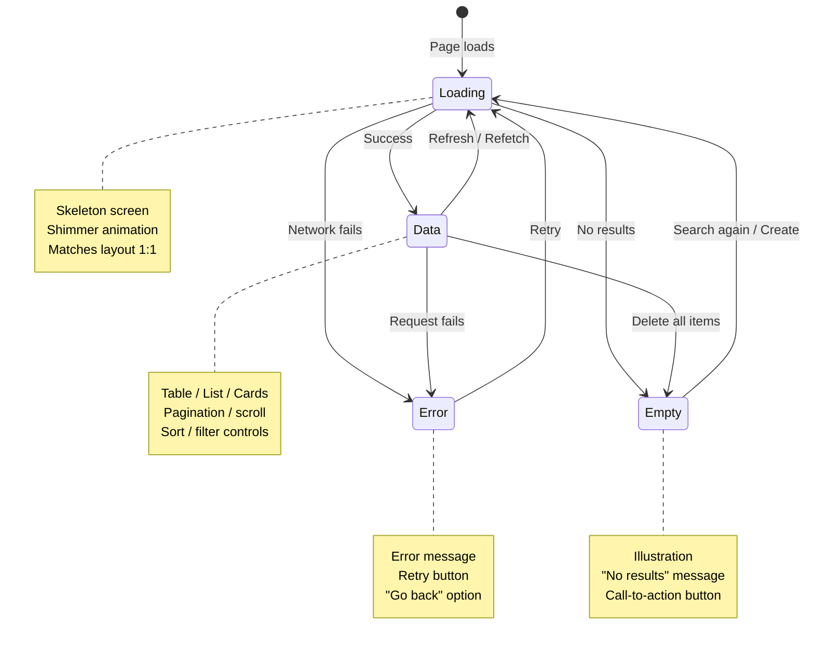
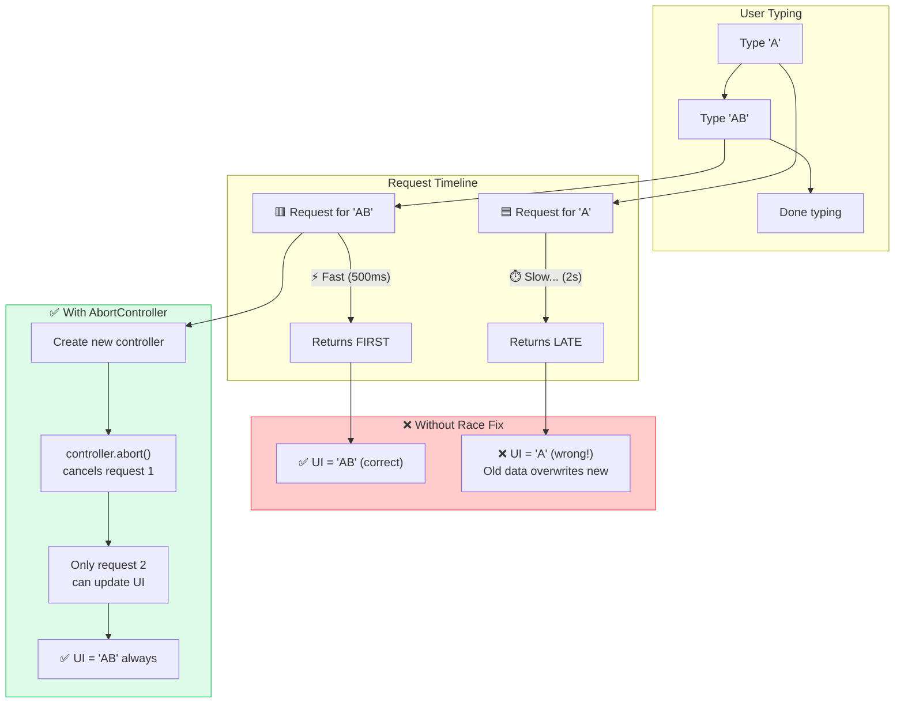
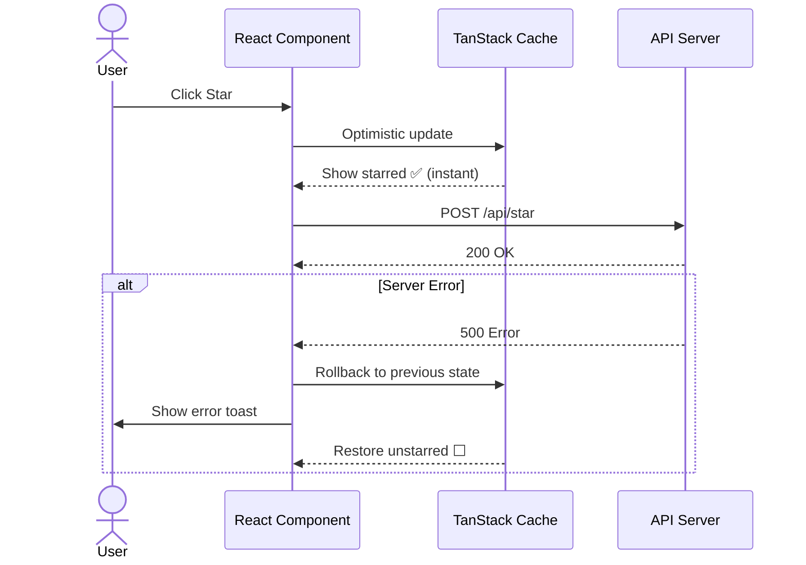

> Builds on Ch 08 (perf, loading states), Ch 10 (data fetching, retry), Ch 11 (architecture
> tradeoffs), Ch 22 (error handling). The JD repeatedly says "think about edge cases, loading
> states, micro-interactions, and accessibility" — this chapter turns that product instinct
> into a repeatable framework.

---

## The one mental model

> **Every user action has a lifecycle: INTENT → FLIGHT → RESULT. Product thinking means**
> **designing for ALL three phases, not just the happy path. Intent is what the user sees**
> **before acting (skeleton, placeholder). Flight is what happens during the action (loading,**
> **optimistic UI, progress). Result is what the user sees after — success, error, or empty.**
> **An SDE-2 doesn't just handle the happy path; they mentally simulate every state the UI**
> **can be in and make sure each one is designed, not an afterthought.**

From "intent → flight → result" you derive: the four states (loading, empty, error, data),
optimistic updates for perceived speed, undo for error recovery, retry for transient failures,
and skeleton screens over spinners.

---

## Learning Objectives

1. Apply the "intent → flight → result" framework to any UI action
2. Design for all four states: loading, empty, error, data — with specific UI treatment
3. Handle double-submit, rapid clicks, and race conditions
4. Design for offline, slow network, and partial failures
5. Implement undo, retry, and optimistic update patterns
6. Think about product edge cases before being asked

---

## Key Mental Models

- **The four states**: Every data-displaying component needs a designed state for
  loading / empty / error / data. If you only coded the "data" state, you're half done.
- **Optimistic UI > loading spinner > nothing.** Show the user what they'll get before
  the server confirms. Revert gracefully on failure.
- **Undo is better than confirmation.** Instead of "Are you sure?" show a toast with
  "Deleted × Undo" — fewer clicks, recoverable mistakes.
- **Assume the network is unreliable.** Every request can fail, timeout, or return stale
  data. Design for retry, backoff, and stale-while-revalidate.
- **Assume the user is fast.** They double-click, spam Enter, navigate before the page
  loads. Defend against their speed with debounce, disable, and idempotency.

---

## 1. The Four States — Deep Dive

Every component that displays data lives in exactly one of four states at any moment.



### Loading state

| State | What to show | Anti-pattern |
|---|---|---|
| Initial load | Skeleton screen matching layout | Full-page spinner |
| Refetch | Keep old data + subtle indicator | Replace with spinner |
| Pagination | Skeleton rows below existing | Full table reload |
| Action (submit) | Button spinner, disable button | Nothing |
| Lazy load | Skeleton card matching size | Jumping layout |

```jsx
// Loading skeleton — matches the data layout 1:1
function ContactTableSkeleton() {
  return (
    <div role="status" aria-label="Loading contacts">
      <div className="h-10 bg-gray-200 rounded animate-pulse" />
      {Array.from({ length: 5 }).map((_, i) => (
        <div key={i} className="flex gap-4 p-4">
          <div className="w-8 h-8 bg-gray-200 rounded-full animate-pulse" />
          <div className="flex-1 h-4 bg-gray-200 rounded animate-pulse" />
          <div className="w-24 h-4 bg-gray-200 rounded animate-pulse" />
        </div>
      ))}
    </div>
  );
}
```

### Empty state

| Scenario | What to show | Action |
|---|---|---|
| No items yet | Illustration + message | CTA to create first |
| No search results | "No results for X" | Clear filter button |
| No notifications | Bell icon + "All caught up" | — |
| Empty after filter | "No items match your filters" | Reset filters |

```jsx
function EmptyState({ title, description, action }) {
  return (
    <div className="flex flex-col items-center py-12" role="status">
      <InboxIcon className="w-16 h-16 text-gray-400" />
      <h3 className="mt-4 text-lg font-medium">{title}</h3>
      <p className="mt-1 text-sm text-gray-500">{description}</p>
      {action && (
        <button className="mt-4 btn btn-primary" onClick={action.onClick}>
          {action.label}
        </button>
      )}
    </div>
  );
}
```

### Error state

| Scenario | What to show | Recovery |
|---|---|---|
| Network failure | Message + retry button | Retry with exponential backoff |
| Validation error | Inline error next to field | Fix and resubmit |
| Server error (5xx) | "Something went wrong" | Retry / contact support |
| Rate limited | "Too many requests" | Wait and retry |
| Not found (404) | "This doesn't exist" | Go back / home |
| Unauthorized | "Please log in" | Redirect to login |

```jsx
function ErrorState({ error, onRetry }) {
  return (
    <div role="alert" className="flex flex-col items-center py-12">
      <AlertTriangle className="w-12 h-12 text-red-500" />
      <h3 className="mt-4 text-lg font-medium">Something went wrong</h3>
      <p className="mt-1 text-sm text-gray-500">{error?.message}</p>
      {onRetry && (
        <button className="mt-4 btn btn-primary" onClick={onRetry}>
          Try again
        </button>
      )}
    </div>
  );
}
```

### Data state

The happy path — but even here:

- **Partial data**: Show what loaded, indicate what's still loading
- **Stale data**: Show cached data + subtle indicator that it's refreshing
- **Reordering/sorting**: Animate rows to new positions (layout animations)
- **Real-time updates**: Notify user when new data arrives without disrupting (toast, badge)

---

## 2. Double-Submit Protection

### Problem

User clicks "Save" twice quickly → two API calls → duplicate record or inconsistent state.

### Solutions

```javascript
// 1. Disable button during submission
function SaveButton({ onClick }) {
  const [submitting, setSubmitting] = useState(false);
  const handleClick = async () => {
    setSubmitting(true);
    try {
      await onClick();
    } finally {
      setSubmitting(false);
    }
  };
  return (
    <Button onClick={handleClick} loading={submitting} disabled={submitting}>
      Save
    </Button>
  );
}

// 2. Debounce the click
const handleSave = debounce(onSave, 300, { leading: true, trailing: false });

// 3. Idempotency key in API
fetch('/api/contacts', {
  method: 'POST',
  headers: { 'Idempotency-Key': generateUUID() },
});
```

### Interview answer (SDE-2)

"Double-submit is prevented at three layers: the button shows loading and disables itself
during the request; the API should be idempotent (same request twice = same result); and
the UI should handle the response gracefully even if the second call succeeds with 'already
exists.' I implement all three because the user might refresh and resubmit, or the network
might retry the request automatically."

---

## 3. Race Conditions

### Problem

Search: user types "A" → request 1 → user types "AB" → request 2 → request 1 returns LAST
→ UI shows results for "A" even though the last input was "AB".



### Solutions

```javascript
// 1. AbortController — cancel stale requests
useEffect(() => {
  const controller = new AbortController();
  search(query, controller.signal).then(setResults).catch(ignoreAbort);
  return () => controller.abort();
}, [query]);

// 2. Request counter — ignore stale responses
useEffect(() => {
  let cancelled = false;
  search(query).then(data => { if (!cancelled) setResults(data); });
  return () => { cancelled = true; };
}, [query]);

// 3. TanStack Query — built-in dedup + cancellation
useQuery({
  queryKey: ['search', query],
  queryFn: ({ signal }) => search(query, signal),
  enabled: !!query,
});
```

### Interview answer (SDE-2)

"Race conditions happen when async operations complete out of order. The fix is to ensure
only the LATEST request can update state. AbortController is preferred because it actually
cancels the network request instead of ignoring its response. TanStack Query handles this
automatically — when the query key changes, the old request is cancelled and only the new
one updates the cache."

---

## 4. Optimistic Updates



### Problem

User clicks "Star" on an email. Waiting for server confirmation before showing the star
creates 200-500ms of perceived lag.

### Solution

```javascript
// TanStack Query — optimistic update
const mutation = useMutation({
  mutationFn: (id) => fetch(`/api/contacts/${id}/star`, { method: 'POST' }),
  onMutate: async (id) => {
    // 1. Cancel outgoing refetches
    await queryClient.cancelQueries({ queryKey: ['contacts'] });
    // 2. Snapshot previous value
    const previous = queryClient.getQueryData(['contacts']);
    // 3. Optimistically update the cache
    queryClient.setQueryData(['contacts'], old =>
      old.map(c => c.id === id ? { ...c, starred: !c.starred } : c)
    );
    return { previous };
  },
  onError: (err, id, context) => {
    // 4. Rollback on error
    queryClient.setQueryData(['contacts'], context.previous);
    toast.error('Failed to update star');
  },
  onSettled: () => {
    // 5. Refetch to ensure server sync
    queryClient.invalidateQueries({ queryKey: ['contacts'] });
  },
});
```

### Interview answer (SDE-2)

"Optimistic updates show the expected result immediately before the server confirms. If the
server fails, we ROLL BACK to the previous state and show an error toast. This pattern makes
the UI feel instant — the user sees the star fill immediately, and only notices if something
goes wrong. TanStack Query's `onMutate`/`onError`/`onSettled` lifecycle makes this
structured and predictable."

---

## 5. Offline & Network Resilience

### Patterns

```text
Online → Normal operation
Offline → Show cached data + "You're offline" banner → Queue mutations
Reconnect → Flush queue → Sync data → Remove banner
```

```javascript
// Listen for offline/online
const [isOnline, setIsOnline] = useState(navigator.onLine);
useEffect(() => {
  const goOffline = () => setIsOnline(false);
  const goOnline = () => setIsOnline(true);
  window.addEventListener('offline', goOffline);
  window.addEventListener('online', goOnline);
  return () => {
    window.removeEventListener('offline', goOffline);
    window.removeEventListener('online', goOnline);
  };
}, []);

// Show offline indicator
{!isOnline && (
  <Banner variant="warning">
    You're offline. Changes will sync when you reconnect.
  </Banner>
)}
```

### Network quality

```javascript
// Detect slow network via Network Information API
const connection = navigator.connection;
if (connection) {
  if (connection.effectiveType === 'slow-2g' || connection.effectiveType === '2g') {
    // Serve lower-resolution images, fewer results per page
  }
  connection.addEventListener('change', () => { /* re-evaluate */ });
}
```

---

## 6. Undo Pattern

### Problem

User deletes a contact. "Are you sure?" dialog slows them down. If they click Yes, it's
gone forever.

### Better: toast with undo

```javascript
function useUndo(action) {
  const execute = useCallback(async (...args) => {
    // Execute the action
    await action(...args);
    // Show toast with undo
    const undo = toast('Deleted', {
      action: {
        label: 'Undo',
        onClick: async () => {
          await undoAction(...args);
          toast.dismiss(undo);
        },
      },
      duration: 5000, // 5 seconds to undo
    });
  }, [action]);
  return execute;
}
```

### Where undo applies

| Action | Undo behavior |
|---|---|
| Delete item | Restore item, show toast for 5s |
| Archive | Unarchive |
| Mark as read | Mark as unread |
| Change status | Revert to previous status |
| Move to folder | Move back |

### SDE-2 answer

"Undo replaces confirmation dialogs for destructive actions. Instead of 'Are you sure?'
(which trains users to click through without reading), we perform the action immediately
and show a toast with an Undo button for 5 seconds. This is faster for the user and less
disruptive. The undo action must be idempotent — if the user clicks Undo twice, the second
click should be a no-op."

---

## 7. Retry & Backoff Patterns

### Automatic retry with exponential backoff

```javascript
async function fetchWithRetry(url, options = {}, retries = 3) {
  for (let i = 0; i < retries; i++) {
    try {
      return await fetch(url, options);
    } catch (error) {
      if (i === retries - 1) throw error;
      // Don't retry 4xx errors — they're client mistakes
      if (error.status >= 400 && error.status < 500) throw error;
      // Wait: 1s, 2s, 4s
      await new Promise(r => setTimeout(r, Math.pow(2, i) * 1000));
    }
  }
}

// TanStack Query has this built in
useQuery({
  queryKey: ['contacts'],
  queryFn: fetchContacts,
  retry: 3,
  retryDelay: (attempt) => Math.min(1000 * 2 ** attempt, 10000),
});
```

### Error types — what to retry

| Error | Retry? | Strategy |
|---|---|---|
| Network failure | Yes | Exponential backoff |
| 429 Rate limited | Yes | Use Retry-After header |
| 500 Server error | Yes | 1-3 retries with backoff |
| 401 Unauthorized | No | Redirect to login |
| 403 Forbidden | No | Show permission error |
| 404 Not found | No | Show not found |
| 400 Bad request | No | Fix client-side validation |
| 422 Validation | No | Show validation errors |
| Timeout | Yes | Increase timeout, retry |

---

## 8. Loading Sequences & Perceived Performance

### How users perceive time

```
0-100ms    → Instant. No feedback needed.
100-300ms  → Noticeable. Show subtle indicator (skeleton, not spinner)
300-1000ms → Feel the delay. Show skeleton + progress indicator
1s+        → User may leave. Show skeleton + estimated time + meaningful action
3s+        → User is likely to leave. Show progress + ability to cancel
```

### Optimistic patterns

```text
Instant:     Optimistic UI (update cache immediately)
Fast (100ms): Skeleton screen (layout-shape placeholders)
Slow (1s+):   Spinner + progress + "This may take a moment"
Failed:       Error message + retry + undo
```

---

## 9. Data Freshness & Staleness

### TanStack Query stale-while-revalidate

```javascript
const query = useQuery({
  queryKey: ['contacts'],
  queryFn: fetchContacts,
  staleTime: 30_000,      // Data is fresh for 30s — no refetch
  gcTime: 5 * 60_000,    // Keep in cache for 5 min after unmount
  refetchOnWindowFocus: true, // Refetch on tab switch
  refetchInterval: 60_000,    // Poll every 60s for real-time feel
});
```

### Stale indicator

```jsx
// Show user that data is being refreshed
<div>
  <ContactTable contacts={contacts} />
  {isRefetching && (
    <div className="text-xs text-gray-400 flex items-center gap-1">
      <Spinner className="w-3 h-3" /> Refreshing...
    </div>
  )}
</div>
```

---

## 10. Edge Cases Checklist

Before shipping any feature, run this mental checklist:

### Input edge cases

- [ ] Empty input — what happens when the user submits nothing?
- [ ] Very long input — does it break the layout?
- [ ] Special characters — XSS, SQL injection, unicode, emoji
- [ ] Rapid input — keystroke-level speed, paste, autocorrect

### Network edge cases

- [ ] Offline — what does the user see?
- [ ] Slow network — loading state, no layout jump
- [ ] Timeout — retry? error message? partial data?
- [ ] Race condition — request 1 returns after request 2
- [ ] Duplicate request — double-submit, double-mutation

### Data edge cases

- [ ] Empty data — appropriate empty state with action
- [ ] Single item — does the layout collapse?
- [ ] Many items — virtualization, pagination
- [ ] Very large values — truncation, overflow handling
- [ ] Missing fields — null/undefined checks

### Interaction edge cases

- [ ] Double-click — button disable, idempotency
- [ ] Rapid scroll — lazy loading, virtual list
- [ ] Tab away and back — refetch stale data
- [ ] Browser back/forward — URL state, scroll position
- [ ] Multiple tabs — stale data, conflict resolution

### Accessibility edge cases

- [ ] Screen reader — roles, aria labels, live regions
- [ ] Keyboard only — all interactions via keyboard
- [ ] Zoomed in (200%) — no horizontal scroll
- [ ] Reduced motion — respect prefers-reduced-motion
- [ ] High contrast — color not the only differentiator

---

## 11. Real-World Example — a product company Contacts Page

### Prompt

"Design a contacts listing page with search, filter, sort, pagination, and bulk actions."

### Product thinking walkthrough

```
User intent:
  "I want to find customer X and send them an email."

Phases:
  INTENT:     Sees search bar, filter pills, table skeleton
  FLIGHT:     Types query → debounced → loading shimmer → results
              Clicks "Select all" → optimistic check all
              Clicks "Delete" → toast "Deleted 3 contacts · Undo" (5s)
  RESULT:     Success → new data displayed
              Error → error banner with retry
              Empty → "No contacts match your search" + clear filter
              Offline → cached data + "You're offline" banner

Edge cases:
  - User searches while 3rd page is loaded → reset to page 1
  - User selects across pages → selection persists (store IDs, not indexes)
  - User clicks "Delete" on a contact that was just deleted by someone else
    → handle 404 gracefully, remove from list
  - User has 500K contacts → server-side pagination, virtual scroll
```

---

## Summary

> **Product thinking = simulate every state before writing code. Ask "what if?" for every**
> **user action: what if the network fails, what if the user double-clicks, what if there**
> **are no results, what if the data is huge, what if the user is offline. An SDE-2 is**
> **someone who answers these questions BEFORE they're asked, not after bugs are filed.**

---

## Homework

1. Audit a real app page for all four states (loading, empty, error, data) — which are missing?
2. Add undo to a delete action in a feature you've built
3. Add optimistic update to a toggle action (star, like, pin)
4. Test an app with DevTools offline mode — what breaks?
5. Add race condition handling to a search component (AbortController)
6. Write the product edge cases checklist for a "bulk email send" feature
