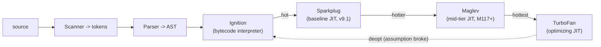

## The Problem You've Already Hit

Picture this: you ship a CRM dashboard. Your team built a table that fetches 500 rows. Each row has an "expand" button. User clicks row 42. Nothing happens. You open DevTools and see `Maximum call stack size exceeded`.

Your heart sinks. Where did this come from?

Turns out, someone wrote a recursive filter that walks a deeply nested customer hierarchy. One customer had 8,000 sub-accounts. The recursion went 8,000 levels deep. The engine ran out of stack.

This isn't just a bug — it's a window into how JavaScript's engine actually works under the hood. Let's peel back the curtain.

At the engine level, every script you ship runs into two fundamental problems:

**Problem 1: You need a pause-and-resume system for nested calls.**

Think about this code:

```js
function renderHeader() { return renderLogo() + renderSearch(); }
function renderLogo() { return ""; }
function renderSearch() { return "<input>"; }
renderHeader();
```

When `renderHeader` calls `renderLogo`, the engine has to pause `renderHeader` mid-execution. It needs to remember: "after `renderLogo` finishes, come back to `renderLogo() + renderSearch()` and finish the `+` operation." Then it runs `renderLogo`. Then it needs to remember where it was in `renderHeader` after `renderLogo` returned.

So it needs to store:
- Where to resume each paused function (the return address)
- Each call's own local variables (`renderHeader`'s template literal must not overwrite `renderLogo`'s)

It needs a last-in, first-out structure. The most recently called function finishes first. That structure is the call stack.

**Problem 2: Objects must outlive the call that created them.**

```js
function createWidget(config) {
  const widget = { id: config.id, state: "idle", subscribers: [] };
  return widget;
}
const mainWidget = createWidget({ id: "chart-1" });
```

Here's the thing: `createWidget`'s call frame is destroyed the instant it returns. But `mainWidget` has to survive. The object can't live in the stack frame — it would be wiped out. It has to live somewhere whose lifetime is independent of any single call. That somewhere is the heap.

This is the entire reason for the two-region memory split. It's not some arbitrary implementation detail. It falls directly out of a simple fact: some data outlives the call that made it, some doesn't.

---

## Why Existing Solutions Failed

Early languages like BASIC and early Fortran used a flat, single set of variable slots. Every function wrote to the same global pool of named variables. This worked for simple scripts. It broke immediately on two requirements:

**Recursion.** If function `A` calls itself, the second invocation's locals overwrite the first invocation's. Try computing factorial without recursion support — you need each invocation to have its own private copy of `n` and `result`.

**Re-entrancy.** If `A` calls `B` which calls `A`, three invocations exist simultaneously. A flat variable model cannot distinguish `A`'s first `count` from `A`'s second `count`. They collide.

The stack-of-contexts model solved both. Each call gets its own private frame. The frame holds locals, return address, and a link to the caller. Frames are ordered by call order, not by name. The "stack" name comes from this LIFO ordering: the last call pushed is the first one popped.

The heap solved the second problem. Objects with lifetimes independent of the creating call needed their own region. The heap is garbage-collected: an object lives until nothing references it. This decouples object lifetime from function call lifetime.

---

## Mental Model

Here's the single core insight I want you to carry with you:

**The stack tracks who called whom. The heap holds what outlives the call. Closures are what happens when the heap keeps a stack frame alive.**

Picture the JavaScript engine as a workshop with two tables:

- The **stack** is a narrow desk where you work on one task at a time, stacking papers for tasks you paused. Each paper (frame) lists local variables and where to go when done.
- The **heap** is a warehouse where you store objects that many tasks might need. You don't put warehouse items on the desk — they'd clutter it. You put a note card (address) on the desk pointing to the warehouse shelf.

```
            JavaScript Engine memory
 ┌───────────────────────────┬───────────────────────────────┐
 │          CALL STACK       │             HEAP              │
 │  (ordered, LIFO, small)   │   (unordered, dynamic, large) │
 ├───────────────────────────┼───────────────────────────────┤
 │  frame: renderSearch()    │   { id: "chart-1" }           │
 │  frame: renderLogo()      │   [1, 2, 3]                   │
 │  frame: renderHeader()    │   function bodies, closures   │
 │  frame: global()          │                               │
 └───────────────────────────┴───────────────────────────────┘
   holds primitives + addresses     holds the actual objects
```

Three rules fall out of this picture:

- A variable binding lives in a frame on the stack.
- If its value is a primitive (number, string, boolean, null, undefined, symbol, bigint), the value sits directly in the frame slot.
- If its value is an object (object literal, array, function), the frame slot holds an address. The object itself sits in the heap.

When a frame pops, its slots vanish. Heap objects only vanish later, when the garbage collector proves nothing references them anymore.

---

## Visualization

Let's trace `renderHeader() → renderLogo() → return` step by step. Watch the stack grow then unwind.

```
1) Global context, renderHeader() called
   STACK:                      2) renderHeader calls renderLogo
   ┌──────────────────┐        ┌──────────────────┐
   │ renderHeader()   │ top    │ renderLogo()     │ top
   ├──────────────────┤        ├──────────────────┤
   │ global           │        │ renderHeader()   │
   └──────────────────┘        ├──────────────────┤
                               │ global           │
                               └──────────────────┘

3) renderLogo returns    4) renderHeader resumes, calls renderSearch
   ┌──────────────────┐        ┌──────────────────┐
   │ renderHeader()   │ top    │ renderSearch()   │ top
   ├──────────────────┤        ├──────────────────┤
   │ global           │        │ renderHeader()   │
   └──────────────────┘        ├──────────────────┤
                               │ global           │
                               └──────────────────┘

5) renderSearch returns       6) renderHeader returns final string
   ┌──────────────────┐        ┌──────────────────┐
   │ renderHeader()   │ top    │ global           │ top
   ├──────────────────┤        └──────────────────┘
   │ global           │
   └──────────────────┘
```

The "stack" in stack overflow and in a stack trace is literally this structure. A runaway recursion never pops. Frames pile up until the engine aborts: `Maximum call stack size exceeded`.

Here's how V8 compiles your source code into something that runs on these structures:



Your source goes through scanner (tokenizer), parser (AST builder), then Ignition (bytecode interpreter). Hot functions get promoted through Sparkplug (fast baseline JIT) to Maglev (mid-tier JIT) to TurboFan (peak optimizer). If TurboFan makes a wrong assumption, it deoptimizes back to Ignition. For detailed explanations of each tier, see the Internal Implementation section below.

---

## Engine Simulation

Let's walk the engine through code that touches all five models: primitive vs reference, scope chain, and a closure that outlives its frame.

```js
const tax = 0.2;                    // (A) global primitive

function makeAccount(name) {        // (B) function object -> heap
  let balance = 100;                // (C) primitive, local to this call
  const owner = { name };           // (D) object allocation -> heap

  function deposit(amount) {        // (E) closes over balance + owner
    balance = balance + amount;
    return balance;
  }

  return deposit;                   // (F) return inner function
}

const d = makeAccount("Ada");       // (G)
d(50);                              // (H) -> 150
d(25);                              // (I) -> 175
```

### Step G: makeAccount("Ada") is called

A new execution context for `makeAccount` is pushed onto the stack. Its Variable Environment holds `name`, `balance`, `owner`, `deposit`. The object `{ name: "Ada" }` is allocated in the heap. `owner` holds its address.

```
STACK                                  HEAP
┌────────────────────────────┐         ┌───────────────────────┐
│ makeAccount("Ada")         │         │ #h1 { name: "Ada" }   |
│   name    = "Ada"          │         │                       |
│   balance = 100            │         │ #h2 <fn deposit>      |
│   owner   = -------------------------> (addr #h1)            |
│   deposit = -------------------------> (addr #h2)            |
├────────────────────────────┤         └───────────────────────┘
│ global                     │
│   tax = 0.2                │   deposit's [[Scope]] points
│   makeAccount = <fn>       │   back to makeAccount's env
│   d = <uninitialized>      │
└────────────────────────────┘
```

When the engine creates the `deposit` function object (#h2), it stamps onto it a hidden reference called `[[Scope]]` or `[[Environment]]`. This points to the environment where `deposit` was defined (makeAccount's environment). This stamping happens at definition time. That is lexical scope. The chain is fixed by where the function is written, not where it is later called.

### Step F/G: makeAccount returns. Its frame pops.

`makeAccount` returns the address of `deposit` (#h2). `d` (in global) now holds #h2. The `makeAccount` frame is popped off the stack.

Here's the crucial moment. Normally when a frame pops, its locals (`balance`, `owner`) are gone. But `deposit` (#h2) still holds a reference to makeAccount's environment. The garbage collector cannot reclaim that environment. Something live still points at it. The environment is detached from the stack but kept alive on the heap.

```
STACK                          HEAP
┌──────────────────────┐       ┌──────────────────────────────────────┐
│ global               │       │ #h1 { name: "Ada" }                  |
│   tax = 0.2          │       │ #h2 <fn deposit>                     |
│   makeAccount = <fn> │       │ #h3 [closed-over env]  <----------+  |
│   d = -----------------------> (addr #h2)                        |  |
└──────────────────────┘       │       balance = 100              |  |
                               │       owner   = #h1              |  |
    d's frame is gone, but     │   #h2.[[Scope]] -----------------+  |
    #h3 survives because #h2   └──────────────────────────────────────┘
    still references it        = CLOSURE
```

That surviving box (#h3) is the closure. A closure is not a special language feature bolted on top. It is the natural result of two facts: (1) functions carry a reference to their defining environment, and (2) the GC keeps alive anything still referenced. The environment simply moves from stack-managed to heap-managed lifetime.

### Step H: d(50)

A new frame for `deposit` is pushed. It needs `balance`. `balance` is not in deposit's own environment. The engine walks the scope chain: deposit's env → (via `[[Scope]]`) → the closed-over env (#h3), where it finds `balance = 100`. Updates it to `150`. Returns. Frame pops. But #h3 persists, so the new `balance` of 150 is remembered.

```
deposit(50) frame                lookup walk for `balance`:
┌──────────────────┐             deposit.env  ->  miss
│ amount = 50      │             #h3 (closure) ->  HIT (balance = 100 -> 150)
│ [[Scope]] -------------------------------+
└──────────────────┘
```

### Step I: d(25)

Same walk. `balance` is now `150` (the closure persisted it). It becomes `175`. Two calls to the same returned function accumulate state because they share one closed-over `balance` cell. They do not get a fresh one each time.

**Primitive vs reference follows from this model directly:**

```js
let x = 10;
let y = x;
y = 20;
// x is still 10 - separate slots, separate values

let a = { n: 1 };
let b = a;
b.n = 2;
// a.n is now 2 - both slots hold the same address -> same heap object
```

```
PRIMITIVE                         REFERENCE
STACK                             STACK            HEAP
┌───────────┐                     ┌───────────┐    ┌──────────┐
│ x = 10    │                     │ a = #h9 --------> {n: 2} │
│ y = 20    │ (independent)       │ b = #h9 --------> (same) │
└───────────┘                     └───────────┘    └──────────┘
```

"Pass by value vs reference" dissolves: JavaScript is always pass-by-value. For objects, the value being passed is an address. Reassigning the parameter does not affect the caller. Mutating the pointed-to object does.

---

## Internal Implementation

The mental model above is what you reason with. Here's what is actually true underneath in the ECMAScript spec and V8.

### Execution context spec (ECMA-262 section 9)

Every running execution context has these fields:

- **LexicalEnvironment**: resolves identifier references. Holds `let`, `const`, `class`, and block scope.
- **VariableEnvironment**: holds `var` bindings and formal parameters. `var` and `let` live in different environment fields of the same context. That is the spec-level reason `var` hoists to function scope while `let` is block-scoped.
- **PrivateEnvironment**: for `#private` names.
- Plus Function, Realm, ScriptOrModule.

Each LexicalEnvironment and VariableEnvironment points at an **Environment Record** (section 9.1). That is the spec's name for a scope. Concrete subtypes:

| Record type | Holds |
|---|---|
| Declarative | `let`, `const`, `class`, function declarations |
| Object | bindings as properties of a binding object (global object, legacy `with`) |
| Function | Declarative subtype per call; adds `this`, `super`, `new.target` |
| Global | Composite: Object record (`var` + builtins) + Declarative record (top-level `let`/`const`) |
| Module | Declarative subtype; supports immutable indirect bindings for imports |

**Scope chain pseudo-code.** Every Environment Record has `[[OuterEnv]]`, a pointer to the enclosing record (null at the global record). Identifier lookup works like this:

```
function getIdentifierReference(env, name):
  if env is null:
    throw ReferenceError(name + " is not defined")
  if env.hasBinding(name):
    return env.getBindingValue(name)
  return getIdentifierReference(env.[[OuterEnv]], name)
```

That recursion is the scope chain. It is not a metaphor. It is an algorithm.

**Closure creation pseudo-code.** When a function is created:

```
function createFunction(body, lexicalEnv):
  fn = new FunctionObject(body)
  fn.[[Environment]] = lexicalEnv   // capture current scope
  return fn
```

On each call:

```
function callFunction(fn, thisArg, args):
  env = newFunctionEnvironment(fn.[[Environment]])
  ctx = new ExecutionContext(env, thisArg)
  pushStack(ctx)
  result = evaluate(fn.body)
  popStack()
  return result
```

Because the returned inner function keeps `[[Environment]]`, that captured record stays reachable. It is not garbage-collected. The closure persists.

**`this` is a field, not a variable.** A Function Environment Record has `[[ThisValue]]` and `[[ThisBindingStatus]]` which is one of `lexical`, `initialized`, or `uninitialized`. Arrow functions are `lexical`. They hold no `this`. Reads walk `[[OuterEnv]]`, which is why arrows inherit `this` and ignore `call`/`apply` `thisArg`.

### V8 compilation pipeline

V8 runs code through four tiers:

1. **Scanner** produces tokens from source text.
2. **Parser** builds the AST. Lazy parsing: top-level code is parsed eagerly. Inner functions are pre-parsed (lightweight pass that validates syntax and records variable allocation). They are only fully parsed when first called.
3. **Ignition** compiles AST to bytecode (a register machine with an implicit accumulator). Bytecode is about 25-50% the size of equivalent machine code. Ignition interprets it while collecting runtime type feedback.
4. **Sparkplug** (V8 v9.1) compiles bytecode to machine code in a single linear pass with no intermediate representation. It produces near-instant baseline JIT code.
5. **Maglev** (Chrome M117+) is a fast SSA/CFG optimizing JIT. About 10x slower than Sparkplug and 10x faster than TurboFan.
6. **TurboFan** is the peak optimizing compiler. Uses collected feedback for speculative optimization.

### Hidden Classes (Maps), Inline Caches, Deoptimization

An object's first pointer in memory is its **Map** (V8's term for hidden class/shape). Objects with the same shape share one Map. The Map stores each property's name and offset once. Instances store only their values.

Property transitions form a tree. Adding property `x` then `y` moves through `{} → {x} → {x,y}` via a TransitionArray. Property order matters: `{x, y}` and `{y, x}` produce different shapes.

At a property access site like `o.name`, V8 caches (shape, offset) in the feedback vector. Next time, if the shape matches, it loads from the offset directly. This is O(1) instead of dictionary lookup. Cache states: Uninitialized → Monomorphic (1 shape, fastest) → Polymorphic (a few shapes) → Megamorphic (too many, generic lookup). Stable shapes keep caches monomorphic.

TurboFan code is speculative. It assumes the types seen so far. When an assumption breaks (a value expected to be a small integer is not), the Deoptimizer aborts optimized code and falls back to Ignition bytecode. Type-unstable code can thrash (optimize, deopt, optimize, deopt repeatedly) and never reach peak speed.

### Smis and tagged values

Every value slot is a tagged value. The low bit is a tag:

- Tag `0`: **Smi** (Small Integer). A 31-bit signed int stored inline, left-shifted by one. No heap allocation.
- Tag `1`: **Pointer** to a heap object. Further bits mark strong/weak.

So `let x = 10` really does sit in the slot as a Smi. `let o = {}` sits in the slot as a tagged pointer into the heap. This is the primitive-vs-reference model at the bit level.

Pointer compression (default since V8 v8.0): on 64-bit, the heap lives in a 4-GB cage. Pointers are stored as 32-bit offsets from a base. This cuts heap size by about 40%.

### Garbage collection: Orinoco

V8's GC is **Orinoco**, generational. Key insight: most objects die young.

- Heap is split into **young generation** (small, up to 16 MiB) and **old generation**.
- **Minor GC (Scavenger)** on young gen: semi-space copying. Young gen is split From/To. Live objects are copied From → To. Survivors of a prior GC are promoted to old gen.
- **Major GC (Mark-Compact)** on whole heap: mark reachable → sweep dead gaps → compact (defragment).
- **Tri-color marking**: objects are white (undiscovered), grey (found, on worklist, fields not scanned), black (fully scanned). Marking ends when no grey remain. Leftover white is garbage. Invariant: no black points to white.
- **Incremental + concurrent + parallel marking** spreads work across helper threads. Write barriers maintain the invariant and track old-to-new pointers.

This is why allocating many short-lived objects in a hot path hurts: it feeds the Scavenger and can trigger pauses.

---

## Real World Example

**CRM: per-session user state.** A sales dashboard loads 1,000 leads. Each lead has an "assign to me" button. When clicked, it calls an API, then updates that lead's status. You implement this with a factory:

```js
function makeLeadController(leadId, initialStatus) {
  let status = initialStatus;
  let retryCount = 0;

  return {
    assign(userId) {
      retryCount = 0;
      return api.assignLead(leadId, userId).then(() => {
        status = "assigned";
      });
    },
    retry() {
      retryCount++;
      return this.assign(currentUser);
    },
    getStatus() { return status; }
  };
}

// One controller per lead row
const controllers = leads.map(l => makeLeadController(l.id, l.status));
```

Each `makeLeadController` call creates a separate closure environment. `status` and `retryCount` are private to that lead. No two leads share state. If you render 1,000 leads, you get 1,000 independent closure environments in the heap. Clicking "assign" on lead 42 only affects lead 42's `status` cell.

This pattern appears everywhere: React hooks (`useState` is essentially a factory that returns `[value, setter]` where the setter closes over a state cell), event handlers in lists, per-request controllers in Express middleware, widget state in dashboards.

**React specifically:** A `useState` hook closes over the component's state cell the same way `deposit` closed over `balance`. A stale closure bug in a React event handler is exactly `deposit` holding an old environment cell. Reference identity (`{} !== {}`) is the root cause of most unnecessary re-renders. `useMemo` and `useCallback` exist to keep an address stable across renders.

**Search bar with debounce.** Every keystroke creates a new closure for the timeout callback. If the user types fast, old closures must not fire and overwrite the correct state. Understanding closure lifetime (each `setTimeout` callback captures the `query` variable at the time the timeout was scheduled) is how you debug ghost input values.

---

## Tradeoffs

**Advantages of the stack-heap model:**

- Recursion and re-entrancy work correctly. Each call frame is isolated.
- Stack allocation is cheap. Pushing and popping a frame is a pointer increment and decrement. No GC overhead for locals.
- Heap objects live exactly as long as needed. No manual memory management.
- Closures enable data hiding without classes. A function can own private state without exposing it on `this`.
- GC reduces memory leak surface compared to manual management (C, C++).

**Disadvantages:**

- Stack size is fixed (typically ~1 MB per thread on desktop). Deep recursion crashes. You cannot grow the stack mid-execution.
- Heap allocation is slower than stack allocation. Objects need allocation, initialization, and eventual GC.
- GC pauses can jank the UI. Allocating many objects in a hot render cycle increases GC pressure.
- Closures keep entire environment chains alive. A closure that only needs `balance` keeps `owner` alive too. Accidental retention (holding a closure reference longer than needed) causes memory leaks.
- Polymorphic property access (different-shaped objects at the same call site) deoptimizes to slow dictionary lookup in V8.
- Developer experience: debugging closures is harder than debugging class instances. DevTools show "Closure" in scope but the connection between the closed-over variable and the function that captured it is implicit.

**CPU cost of closures vs classes:**

```
Closure approach:
  makeAccount("Ada") -> allocates 1 env + 1 function object + 1 name object
  Each d(n) call     -> scope chain walk (2 hops) to find balance

Class approach:
  class Account { constructor(name) { this.balance = 100; this.name = name; } }
  deposit(n) { this.balance += n; return this.balance; }
  Each d(n) call     -> `this` lookup + property access (inline cache hit)
```

Classes use property access (IC-friendly, O(1) after monomorphic). Closures use scope chain walk (O(depth) per access). Classes win for hot-path code with many instances. Closures win for encapsulation without prototypal overhead or when you need truly private state.

---

## Common Mistakes

**Mixing up the variable with the object.** The variable is a slot on the stack. The object is heap data. "Freed when the function returns" is true of the slot, false of the object.

**Thinking closures copy variables.** They do not copy. They keep a live reference to the environment. Mutations are seen by all closures that share that environment.

**Believing each setTimeout or loop iteration gets its own `var`.** With `var` there is one shared binding (the classic loop-closure bug). `let` creates a fresh binding per iteration. Ask: "how many environment cells exist?"

**Assuming `{} === {}`.** Two object literals are two heap allocations. They get two different addresses. They are not equal. This is the root cause of most React re-render bugs.

**Saying "pass by reference."** Use the reassign-vs-mutate test: if reassigning the parameter inside the function also reassigns the caller's variable, that is pass-by-reference. JavaScript does not do that. It is always pass-by-value. For objects, the value is an address.

**Storing closures in state without cleanup.** If a React effect creates a closure that references DOM nodes or subscriptions, failing to clean up on unmount keeps those nodes reachable through the closure's environment chain. The GC cannot collect them until the closure itself is collected.

---

## SDE-2 Interview Answer

**Question: "Explain how JavaScript's runtime handles memory, scope, and closures. Use the stack, heap, and execution context model."**

### Mid-level variant

"The JavaScript engine uses a call stack to track function execution. Every function call pushes an execution context onto the stack. That context holds local variables, the value of `this`, and a reference to the surrounding scope. When the function returns, its context is popped. Objects live in the heap, which is garbage-collected.

Primitives like numbers are stored directly in the stack frame. Objects are stored in the heap, and the frame holds a reference to them. When you copy a variable holding an object, you copy the reference, not the object itself.

A closure happens when an inner function uses variables from an outer function, and the inner function outlives the outer function. The engine keeps the outer function's environment alive in the heap so the inner function can still access those variables. This is why `useState` works in React — the setter closes over a state cell that persists across renders."

### Senior variant

"The runtime splits memory into stack and heap because of a fundamental constraint: some data must outlive the call that created it. Locals and return addresses go on the stack (cheap, LIFO, deterministic lifetime). Objects that may be referenced after the call returns go on the heap (dynamic, GC-managed lifetime).

Every execution context has two environment records: a LexicalEnvironment for `let`/`const` and a VariableEnvironment for `var`. This is why `var` hoists to function scope while `let` is block-scoped. The scope chain is a linked list of `[[OuterEnv]]` pointers. When you reference a variable, the engine walks this list. That is linear time in the nesting depth.

Closures are a memory-lifetime phenomenon, not a syntax feature. When a function is created, its `[[Environment]]` slot captures the current LexicalEnvironment. If that function outlives its creator, the captured environment stays in the heap. The GC keeps it alive because it is still referenced. Every closure you create is a heap allocation that persists until nothing holds the function.

Practical implications: every function in JavaScript is a closure (it captures its `[[Environment]]` at definition time). But the memory cost only matters when the environment survives its creator. In React, every render creates new function objects and new closures. If those functions capture large objects from the component scope, those objects stay alive as long as the closure survives. This is why `useCallback` and `useMemo` exist: they stabilize the function reference and the value reference across renders, preventing unnecessary heap allocations and keeping the GC load low."

### Engineering Lead variant

"The stack-heap model constrains architecture decisions across the entire frontend. Three things I watch for:

**1. Closure lifecycles in component trees.** Every component render allocates closure environments for event handlers, effects, and callbacks. If those closures capture the entire component scope (props, state, derived values), a single leaked closure can keep an entire subtree alive. I enforce patterns that minimize captured scope: pass primitives to callbacks instead of objects, use refs for values that change frequently, and clean up subscriptions in `useEffect` returns. This is not micro-optimization. A leaked closure in a list component that re-renders 500 times doubles the memory retained per render cycle.

**2. Stack depth as a scalability boundary.** The fixed stack size (~1 MB) means deep recursion is off the table for production code. I mandate that any operation that can exceed 1,000 nested calls uses an iterative approach or a trampoline. The CRM dashboard crash in the problem section is exactly this: recursive tree walking without a depth check. This becomes a team standard: recursion is for prototypes only.

**3. GC pause budgets.** V8's Orinoco GC is generational and concurrent, but it still pauses. Allocating many short-lived objects on every interaction (creating new objects in render, dispatching Redux actions that clone entire state trees) feeds the young-generation scavenger. On low-end mobile devices, GC time above 16 ms per frame causes visible jank. I set team budgets: no more than one new object allocation per event handler unless cached. Use object pooling for hot paths. Prefer immutable updates that share structure (Immer, immutable.js) over full copies.

The runtime model determines what performance patterns are even possible. Understanding stack vs heap, closure retention, and GC behavior is not trivia. It is how you prevent production incidents at scale."

---

## Follow-up Questions

**Q1: Where does the object `{ name: "Ada" }` live, and when is it freed?**

The binding `owner` lives in makeAccount's stack frame as a pointer (address) to the heap. The object itself — `{ name: "Ada" }` — lives in the heap. It is freed when the garbage collector proves nothing references it anymore. Normally, when makeAccount returns and its frame pops, the object would be unreachable and collected. But here, the closure returned by makeAccount stores a `[[Environment]]` reference to makeAccount's environment record, which includes the `owner` binding. That environment record points to the heap object. As long as someone holds the returned `deposit` function (the variable `d`), the environment stays reachable, and the object stays alive. The GC cannot reclaim it. See Ch 03 for how React hooks use the same closure mechanism to keep state cells alive across renders.

**Q2: Why does calling `d(50)` then `d(25)` give 175 and not 125?**

Each `makeAccount` call creates exactly one environment with one `balance` cell. The returned `deposit` function closes over that specific cell. When you call `d(50)`, the closure walks the scope chain, finds `balance = 100` in the captured environment, adds 50, and stores `150` back in the same cell. When you call `d(25)`, the same closure walks the same scope chain, finds `balance = 150` (the updated value), adds 25, and stores `175`. The key insight: both calls share one `balance` cell because they reference the same closure environment. A second `makeAccount("Bob")` call would create a separate environment with its own `balance` cell, completely independent. This is the factory pattern — each invocation produces an isolated stateful unit. See Ch 05 for how React's `useState` uses this exact pattern to give each component its own state.

**Q3: Is JavaScript pass-by-value or pass-by-reference?**

Always pass-by-value. For objects, the value being passed is a memory address (a pointer to the heap object). The reassign-vs-mutate test proves it: if you reassign the parameter inside a function (`param = newObj`), the caller's variable is unaffected — the caller still points to the original object. That means the address was copied, not shared by reference. However, if you mutate the object through the parameter (`param.key = val`), the caller sees the change because both the parameter and the caller hold the same address pointing to the same heap object. True pass-by-reference (as in C++ or Rust) would let you reassign the caller's variable from inside the function. JavaScript does not have that. The confusion arises because "pass the reference" sounds like pass-by-reference, but it is really "pass the value of the reference" — the address is copied.

**Q4: What exactly causes `Maximum call stack size exceeded`, and why is it a stack error and not a heap error?**

The call stack has a fixed maximum size, typically around 1 MB per thread in V8. Each function call pushes a frame containing the return address, local variables, and parameters. Excessive recursion pushes frame after frame without popping any. When the stack pointer would exceed the reserved memory region, the engine throws a `RangeError` with the message "Maximum call stack size exceeded." It is a stack error because the stack is a contiguous, fixed-size memory region allocated per thread. You cannot grow it dynamically — the size is set when the thread starts. The heap, by contrast, is dynamic and can grow up to system memory limits (subject to V8's heap constraints). A heap error would be an out-of-memory condition, which is a different failure mode entirely. The stack's fixed size is a deliberate tradeoff: stack allocation is O(1) and cache-friendly, but deep recursion is inherently limited.

**Q5: Two `useState`-like counters made by the same factory share or do not share state? Tie to the closure model.**

They do not share state. Each factory call creates a separate execution context with its own environment record. The returned function closes over that specific environment via its `[[Environment]]` slot. Two calls to the factory produce two independent environment records, each with its own `count` cell. When `x = counter()` and `y = counter()`, `x`'s closure references environment #1's `count`, and `y`'s closure references environment #2's `count`. Calling `x()` increments #1's cell. Calling `y()` increments #2's cell. They are completely isolated. This is exactly the `makeAccount` model from earlier in this chapter. In React, each component instance gets its own Fiber with its own hook state (Ch 05), so two instances of the same component never share state — the same closure isolation principle applied at the framework level.

---

## Mental Trigger

**Closure = Function + Live Reference to Outer Environment = Heap-kept Stack Frame**

---

## One Page Revision

- **Problem:** Nested calls need pause/resume (stack). Objects outlive creators (heap).
- **Why stack:** Flat variable model fails at recursion and re-entrancy. Each call needs isolated locals and return address.
- **Why heap:** Objects must survive the call that created them. Cannot live in ephemeral stack frame.
- **Stack:** LIFO, fixed size (~1 MB), cheap push/pop. Holds primitives (by value) and addresses (by reference).
- **Heap:** Dynamic, GC-managed. Holds objects, function bodies, closure environments.
- **Primitive vs Reference:** Primitives are values in stack slot. Objects are addresses in stack slot pointing to heap.
- **Execution context:** Frame with LexicalEnvironment, VariableEnvironment, `this`, scope chain link.
- **Scope chain:** `[[OuterEnv]]` linked list. Walked at lookup time. Fixed at definition time (lexical).
- **Closure:** Function + `[[Environment]]` reference. Environment survives creator's frame pop. GC keeps it alive because function references it.
- **`this`:** Field in Function Environment Record. Arrow functions = `lexical` (inherit from outer). Method calls = reference base. Derived class before `super()` = `uninitialized`.
- **V8 pipeline:** Scanner → Parser → Ignition (bytecode) → Sparkplug (baseline JIT) → Maglev (mid JIT) → TurboFan (peak JIT). Deoptimization falls back to Ignition.
- **Hidden Classes (Maps):** Objects with same shape share Map with property offsets. Transitions form a tree. Property order matters for shape.
- **Inline Caches:** Cache (shape, offset) at access site. States: Uninitialized → Monomorphic → Polymorphic → Megamorphic.
- **Tagged values:** Low bit 0 = Smi (31-bit int inline). Low bit 1 = heap pointer.
- **GC (Orinoco):** Generational (young/old). Minor GC copies survivors. Major GC mark-sweep-compact. Tri-color marking. Incremental + concurrent.
- **Pass-by-value:** Always. For objects, value is address. Test: reassign param does not affect caller. Mutate does.
- **Common mistakes:** Variable vs object lifetime. Closures do not copy. `var` shares one binding per loop. `{} !== {}`. Saying "pass by reference." Not cleaning up closures in effects.
