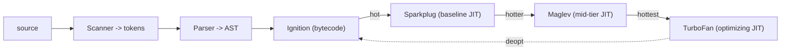

## The Problem

Your CRM dashboard has a table with 500 rows. User clicks row 42. Nothing happens. DevTools says `Maximum call stack size exceeded`. Someone wrote a recursive filter that walks a deeply nested customer hierarchy — one customer had 8,000 sub-accounts. The recursion went 8,000 levels deep. The engine ran out of stack.

This isn't just a bug. It's a window into how the engine works. Every script you ship runs into two fundamental problems:

**Problem 1: You need a pause-and-resume system for nested calls.** When `renderHeader` calls `renderLogo`, the engine must pause `renderHeader`, remember where to resume, run `renderLogo`, then come back. It needs a last-in, first-out structure. That's the call stack.

**Problem 2: Objects must outlive the call that created them.** When `createWidget` returns, its stack frame is destroyed. But the widget object has to survive. It can't live in the stack frame — it would be wiped out. It needs to live somewhere whose lifetime is independent of any single call. That somewhere is the heap.

## The One Insight

**The stack tracks who called whom. The heap holds what outlives the call. Closures are what happens when the heap keeps a stack frame alive.**

Think of the engine as a workshop. The stack is a narrow desk where you work on one task at a time, stacking papers for paused tasks. The heap is a warehouse where objects live. You don't put warehouse items on the desk — you put a note card with an address pointing to the warehouse shelf.

```
            JavaScript Engine memory
 ┌───────────────────────────┬───────────────────────────────┐
 │          CALL STACK       │             HEAP              │
 │  (ordered, LIFO, small)   │   (unordered, dynamic, large) │
 ├───────────────────────────┼───────────────────────────────┤
 │  frame: renderSearch()    │   { id: "chart-1" }           │
 │  frame: renderLogo()      │   [1, 2, 3]                   │
 │  frame: renderHeader()    │   function bodies, closures   │
 │  frame: global()          │                               │
 └───────────────────────────┴───────────────────────────────┘
   holds primitives + addresses     holds the actual objects
```

Three rules fall out of this picture:
- A variable binding lives in a frame on the stack.
- Primitives (number, string, boolean, null, undefined) sit directly in the frame slot.
- Objects (object literal, array, function) — the frame slot holds an address. The object sits in the heap.

When a frame pops, its slots vanish. Heap objects vanish later, when the garbage collector proves nothing references them.

## Closures, Plain English

```js
function makeAccount(name) {
  let balance = 100;
  const owner = { name };
  function deposit(amount) {
    balance = balance + amount;
    return balance;
  }
  return deposit;
}
const d = makeAccount("Ada");
d(50);  // 150
d(25);  // 175
```

When `deposit` is created, the engine stamps onto it a hidden `[[Environment]]` reference pointing to makeAccount's environment. When makeAccount returns and its frame pops, `deposit` still holds that reference. The GC cannot reclaim the environment. Something live still points at it.

That surviving environment is the closure. Not a special language feature. The natural result of two facts: (1) functions carry a reference to their defining environment, and (2) the GC keeps alive anything still referenced.

Two calls to `d()` share one `balance` cell because they reference the same closure environment. `d(50)` reads `balance=100`, writes `150`. `d(25)` reads `150`, writes `175`.

## Primitive vs Reference

```js
let x = 10;
let y = x;
y = 20;
// x is still 10 — separate slots, separate values

let a = { n: 1 };
let b = a;
b.n = 2;
// a.n is now 2 — both slots hold the same address → same heap object
```

JavaScript is always pass-by-value. For objects, the value being passed is an address. Reassigning the parameter doesn't affect the caller. Mutating the pointed-to object does.

## `this` Binding — The Four Rules

`this` is not a variable — it's a keyword whose value is determined at **call time**, not definition time. This is the source of the most common JavaScript interview question.

### The Mental Model

`this` is like a clipboard passed to a function. Who holds the clipboard depends on *how* the function was called, not *where* it was written.

```text
function getThis() { return this; }

getThis()              → globalThis (or undefined in strict mode)
obj.getThis()          → obj
new getThis()          → newly constructed object
getThis.call(target)   → target
```

### Rule 1: Default Binding

A plain function call binds `this` to the global object (or `undefined` in strict mode):

```js
function showThis() {
  console.log(this); // globalThis (non-strict) or undefined (strict)
}
showThis();
```

### Rule 2: Implicit Binding

When a function is called as a method of an object, `this` is that object:

```js
const user = {
  name: "Ada",
  greet() { console.log(this.name); }
};
user.greet(); // "Ada" — this === user
```

The pitfall: assigning a method to a variable loses the binding:

```js
const greet = user.greet;
greet(); // undefined — this === globalThis, not user
```

### Rule 3: Explicit Binding (`call`, `apply`, `bind`)

Force `this` to any object:

```js
function greet(greeting) {
  console.log(`${greeting}, ${this.name}`);
}

const user = { name: "Ada" };

greet.call(user, "Hello");     // "Hello, Ada" — this === user
greet.apply(user, ["Hello"]);  // "Hello, Ada" — same, args as array
const bound = greet.bind(user); // returns new function with this locked
bound("Hello");                 // "Hello, Ada" — this always === user
```

`call` and `apply` invoke immediately. `bind` returns a new function with `this` permanently set. `bind` also partially applies arguments:

```js
const greetAda = greet.bind(user, "Hello");
greetAda(); // "Hello, Ada"
```

### Rule 4: `new` Binding

When called with `new`, `this` is the newly constructed object:

```js
function User(name) {
  this.name = name; // this === new object
}
const ada = new User("Ada");
```

### Arrow Functions — No `this`

Arrow functions don't have their own `this`. They inherit `this` from the enclosing lexical scope:

```js
const user = {
  name: "Ada",
  greet: () => {
    console.log(this.name); // undefined — this is globalThis, not user
  },
  delayedGreet() {
    setTimeout(() => {
      console.log(this.name); // "Ada" — this is the enclosing scope (delayedGreet's this)
    }, 100);
  }
};
```

This is why arrow functions work as callbacks — they preserve `this` from the surrounding context. But they're wrong as object methods.

### Interview Answer

"There are four rules. Default binding: plain function call → globalThis/undefined. Implicit binding: method call → the object. Explicit binding: `call`/`apply`/`bind` → the target you specify. `new` binding: constructor → new object. Arrow functions don't bind `this` — they inherit from the lexical scope."

## Prototypal Inheritance — The Prototype Chain

Every object has an internal `[[Prototype]]` link. When you access a property that doesn't exist on an object, JavaScript walks up the chain until it finds it or reaches `null`.

```js
const animal = { eats: true };
const rabbit = Object.create(animal); // rabbit.__proto__ === animal
rabbit.jumps = true;

rabbit.eats;  // true — found on animal (up the chain)
rabbit.jumps; // true — found on rabbit
```

```text
rabbit                animal               Object.prototype      null
┌──────────┐         ┌──────────┐         ┌──────────┐
│ jumps: T │──[[P]]→│ eats: T  │──[[P]]→│ toString │──[[P]]→ null
└──────────┘         └──────────┘         └──────────┘
```

### Classes Are Syntactic Sugar

```js
class User {
  constructor(name) { this.name = name; }
  greet() { return `Hi, ${this.name}`; }
}

const ada = new User("Ada");
```

Under the hood, `new User("Ada")` does:
1. Creates a new object with `User.prototype` as its `[[Prototype]]`
2. Calls `User.call(newObj, "Ada")` — sets `newObj.name = "Ada"`
3. Returns `newObj`

`ada.__proto__ === User.prototype`. `User.prototype.__proto__ === Object.prototype`. The chain is: `ada → User.prototype → Object.prototype → null`.

### `Object.create` vs `class`

`Object.create(proto)` creates an object with an explicit prototype link. It's the low-level primitive. `class` is higher-level sugar that gives you `new`, `super`, `extends`, and `static`. Both produce prototype chains.

### Property Lookup and `hasOwnProperty`

```js
ada.name;       // found on ada (own property)
ada.greet();    // found on User.prototype (inherited)
ada.toString(); // found on Object.prototype (inherited)
```

Use `hasOwnProperty` to check own vs inherited:

```js
ada.hasOwnProperty("name");    // true — own
ada.hasOwnProperty("greet");   // false — inherited from prototype
```

### Interview Answer

"Every object has a `[[Prototype]]` link. Property access walks up the chain until found or `null`. `class` is syntactic sugar over prototypes — `new User()` creates an object with `User.prototype` as its prototype, and constructor calls set own properties. The chain is: instance → class.prototype → Object.prototype → null."

## Temporal Dead Zone (TDZ) — Why `let`/`const` Feel Different from `var`

```js
console.log(x); // undefined (var — hoisted, initialized to undefined)
var x = 10;

console.log(y); // ReferenceError: Cannot access 'y' before initialization
let y = 20;
```

Both `var` and declarations are hoisted — moved to the top of their scope during compilation. But `var` is **initialized** to `undefined` immediately. `let` and `const` are hoisted but **not initialized**. Accessing them before the declaration line throws a `ReferenceError`.

The period between entering scope and the declaration line is the **temporal dead zone**:

```js
{
  // TDZ starts here
  // console.log(a); → ReferenceError
  let a = 5;        // TDZ ends here
  console.log(a);   // 5
}
```

### Why TDZ Exists

TDZ enforces a guarantee: a `let`/`const` variable is always `undefined` or a value, never an accidentally hoisted `var`-like default. This catches bugs where you reference a variable before it's meaningfully initialized.

```js
let value = "global";
{
  console.log(value); // ReferenceError — not the outer "global"
  let value = "local";
}
```

If TDZ didn't exist, the `console.log` would silently read the outer `value`. TDZ forces you to be explicit about scope.

### The `var` Loop-Closure Bug

The classic:

```js
for (var i = 0; i < 3; i++) {
  setTimeout(() => console.log(i), 100);
}
// 3, 3, 3 — not 0, 1, 2
```

`var` is function-scoped. One `i` binding exists. All three closures share it. By the time `setTimeout` fires, the loop is done and `i === 3`.

`let` is block-scoped. Each iteration gets a fresh `i`:

```js
for (let i = 0; i < 3; i++) {
  setTimeout(() => console.log(i), 100);
}
// 0, 1, 2
```

### Interview Answer

"`var` is function-scoped and initialized to `undefined` on entry. `let`/`const` are block-scoped and enter a temporal dead zone from scope entry until the declaration — accessing them early throws a ReferenceError. This prevents accidental use of uninitialized variables and is why `let` in for-loops creates per-iteration bindings while `var` shares one."

## Memory Leaks — What the GC Can't See

JavaScript's garbage collector reclaims unreachable objects. A memory leak happens when objects you no longer need remain reachable.

### Leak 1: Closures Holding References

```js
function createUser() {
  const hugeData = fetchHugeDataset(); // 10MB of data
  return function getName() {
    return hugeData.name; // closure keeps hugeData alive
  };
}
const getName = createUser();
// hugeData is alive as long as getName exists, even though you only need .name
```

**Fix:** Extract only what you need before the closure captures the large object:

```js
function createUser() {
  const hugeData = fetchHugeDataset();
  const name = hugeData.name;
  return function getName() { return name; }; // name is small
}
```

### Leak 2: Detached DOM Nodes

```js
function addItem() {
  const div = document.createElement("div");
  document.body.appendChild(div);
  items.push(div); // array holds reference to DOM node
}
// If items is never cleaned, removed DOM nodes stay in memory
```

A DOM node removed from the document is still an object in the heap. If JS code holds a reference to it, the GC can't reclaim it.

### Leak 3: Event Listeners Not Removed

```js
function setup() {
  window.addEventListener("resize", handleResize);
  // No cleanup — handleResize lives forever
}
```

If a component adds an event listener but never removes it, the handler (and its closure) stays alive. In React, this is why `useEffect` cleanup matters.

### Leak 4: Timers Not Cleared

```js
function startPolling() {
  setInterval(() => {
    fetchUpdates(); // closure captures outer scope
  }, 5000);
  // Never clearInterval — runs forever
}
```

### Detection

Chrome DevTools → Memory tab → Take a heap snapshot → Take another → Compare. Look for detached DOM nodes, growing object counts, or retained closures you didn't expect.

### Interview Answer

"Memory leaks occur when objects remain reachable but unused. Common causes: closures capturing large objects unnecessarily, detached DOM nodes held by JS arrays, event listeners not removed on cleanup, and uncleared timers. Detect with heap snapshots in DevTools — compare snapshots over time and look for growing detached nodes or unexpected retained objects."

## V8 Compilation Pipeline



Source goes through scanner, parser, then Ignition (bytecode interpreter). Hot functions get promoted through Sparkplug to Maglev to TurboFan. If TurboFan makes a wrong assumption, it deoptimizes back to Ignition.

**Hidden classes (Maps):** Objects with the same shape share one Map. The Map stores property names and offsets once. At property access sites like `o.name`, V8 caches the (shape, offset) for O(1) lookup. Type-unstable code deoptimizes repeatedly and never reaches peak speed.

**Garbage collection (Orinoco):** Generational — most objects die young. Young generation uses semi-space copying. Old generation uses mark-compact. Incremental + concurrent marking spreads work across helper threads.

## Common Mistakes

- **Mixing up the variable with the object.** The variable is a slot on the stack. The object is heap data.
- **Thinking closures copy variables.** They keep a live reference. Mutations are seen by all closures sharing that environment.
- **Believing each `var` in a loop gets its own binding.** With `var` there's one shared binding (the classic loop-closure bug). `let` creates a fresh binding per iteration.
- **Saying "pass by reference."** JavaScript is always pass-by-value. For objects, the value is an address.
- **Forgetting that `this` depends on call site, not definition site.** A method extracted from its object loses its `this` binding. Use arrow functions or `bind` to preserve it.
- **Assuming `let`/`const` are "block-scoped `var`."** They're also subject to the TDZ — you can't use them before the declaration line, even in the same scope.
- **Not cleaning up event listeners and timers.** The GC can't see what you no longer need if something still references it. Every `addEventListener` should have a matching `removeEventListener`.

## Mental Trigger

**Closure = Function + Live Reference to Outer Environment = Heap-kept Stack Frame**

## Q&A

**Q: Where does `{ name: "Ada" }` live, and when is it freed?**
The binding `owner` lives in makeAccount's stack frame as an address. The object lives in the heap. Normally it would be freed when makeAccount returns. But the closure holds a `[[Environment]]` reference to makeAccount's environment, which includes `owner`. As long as someone holds `deposit`, the object stays alive.

**Q: Why does `d(50)` then `d(25)` give 175, not 125?**
Both calls share one `balance` cell because they reference the same closure environment. `d(50)` updates the cell to 150. `d(25)` reads the updated 150 and writes 175. A second `makeAccount("Bob")` call creates a completely separate environment.

**Q: Is JavaScript pass-by-value or pass-by-reference?**
Always pass-by-value. For objects, the value is an address. Reassigning the parameter inside a function doesn't affect the caller. Mutating the object through the parameter does, because both hold the same address.

**Q: What causes `Maximum call stack size exceeded`?**
The call stack has a fixed size (~1 MB). Each call pushes a frame. Excessive recursion pushes frames without popping. When the stack pointer exceeds the reserved region, the engine throws `RangeError`. The heap can grow dynamically — this is a stack-specific limit.

**Q: How does `this` work in an arrow function passed as a callback?**
Arrow functions don't have their own `this`. They inherit from the enclosing lexical scope. So `setTimeout(() => console.log(this), 100)` inside a class method logs the class instance, because the arrow function captures `this` from the method. A regular function callback would lose it.

**Q: What's the difference between `__proto__` and `prototype`?**
`__proto__` is the actual prototype link on an instance — it points to the constructor's `prototype` property. `prototype` is a property on the constructor function that becomes the prototype for instances created with `new`. `Object.getPrototypeOf(obj)` is the proper way to read the prototype (not `obj.__proto__`).

**Q: Why does `typeof null === "object"`?**
This is a historical bug in JavaScript's first implementation. In the original engine, values were represented with a type tag. `null` was represented as the NULL pointer (0x00), which shares the same type tag as objects. The bug was never fixed because it would break existing code.

**Q: How do you detect and fix a memory leak in production?**
Use Chrome DevTools Memory tab: take heap snapshots at intervals, compare them. Look for growing detached DOM nodes, increasing object counts, or retained closures. In production, use `performance.measureUserAgentSpecificMemory()` (Chrome) or monitor `performance.memory.usedJSHeapSize`. Fix by removing event listeners, clearing timers, and avoiding closure capture of large objects.
