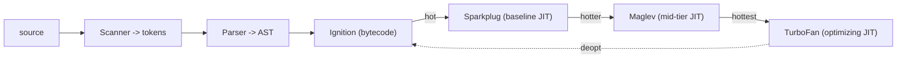

## The Problem

Your CRM dashboard has a table with 500 rows. User clicks row 42. Nothing happens. DevTools says `Maximum call stack size exceeded`. Someone wrote a recursive filter that walks a deeply nested customer hierarchy — one customer had 8,000 sub-accounts. The recursion went 8,000 levels deep. The engine ran out of stack.

This isn't just a bug. It's a window into how the engine works. Every script you ship runs into two fundamental problems:

**Problem 1: You need a pause-and-resume system for nested calls.** When `renderHeader` calls `renderLogo`, the engine must pause `renderHeader`, remember where to resume, run `renderLogo`, then come back. It needs a last-in, first-out structure. That's the call stack.

**Problem 2: Objects must outlive the call that created them.** When `createWidget` returns, its stack frame is destroyed. But the widget object has to survive. It can't live in the stack frame — it would be wiped out. It needs to live somewhere whose lifetime is independent of any single call. That somewhere is the heap.

## The One Insight

**The stack tracks who called whom. The heap holds what outlives the call. Closures are what happens when the heap keeps a stack frame alive.**

Think of the engine as a workshop. The stack is a narrow desk where you work on one task at a time, stacking papers for paused tasks. The heap is a warehouse where objects live. You don't put warehouse items on the desk — you put a note card with an address pointing to the warehouse shelf.

```
            JavaScript Engine memory
 ┌───────────────────────────┬───────────────────────────────┐
 │          CALL STACK       │             HEAP              │
 │  (ordered, LIFO, small)   │   (unordered, dynamic, large) │
 ├───────────────────────────┼───────────────────────────────┤
 │  frame: renderSearch()    │   { id: "chart-1" }           │
 │  frame: renderLogo()      │   [1, 2, 3]                   │
 │  frame: renderHeader()    │   function bodies, closures   │
 │  frame: global()          │                               │
 └───────────────────────────┴───────────────────────────────┘
   holds primitives + addresses     holds the actual objects
```

Three rules fall out of this picture:
- A variable binding lives in a frame on the stack.
- Primitives (number, string, boolean, null, undefined) sit directly in the frame slot.
- Objects (object literal, array, function) — the frame slot holds an address. The object sits in the heap.

When a frame pops, its slots vanish. Heap objects vanish later, when the garbage collector proves nothing references them.

## Closures, Plain English

```js
function makeAccount(name) {
  let balance = 100;
  const owner = { name };
  function deposit(amount) {
    balance = balance + amount;
    return balance;
  }
  return deposit;
}
const d = makeAccount("Ada");
d(50);  // 150
d(25);  // 175
```

When `deposit` is created, the engine stamps onto it a hidden `[[Environment]]` reference pointing to makeAccount's environment. When makeAccount returns and its frame pops, `deposit` still holds that reference. The GC cannot reclaim the environment. Something live still points at it.

That surviving environment is the closure. Not a special language feature. The natural result of two facts: (1) functions carry a reference to their defining environment, and (2) the GC keeps alive anything still referenced.

Two calls to `d()` share one `balance` cell because they reference the same closure environment. `d(50)` reads `balance=100`, writes `150`. `d(25)` reads `150`, writes `175`.

## Primitive vs Reference

```js
let x = 10;
let y = x;
y = 20;
// x is still 10 — separate slots, separate values

let a = { n: 1 };
let b = a;
b.n = 2;
// a.n is now 2 — both slots hold the same address → same heap object
```

JavaScript is always pass-by-value. For objects, the value being passed is an address. Reassigning the parameter doesn't affect the caller. Mutating the pointed-to object does.

## V8 Compilation Pipeline



Source goes through scanner, parser, then Ignition (bytecode interpreter). Hot functions get promoted through Sparkplug to Maglev to TurboFan. If TurboFan makes a wrong assumption, it deoptimizes back to Ignition.

**Hidden classes (Maps):** Objects with the same shape share one Map. The Map stores property names and offsets once. At property access sites like `o.name`, V8 caches the (shape, offset) for O(1) lookup. Type-unstable code deoptimizes repeatedly and never reaches peak speed.

**Garbage collection (Orinoco):** Generational — most objects die young. Young generation uses semi-space copying. Old generation uses mark-compact. Incremental + concurrent marking spreads work across helper threads.

## Common Mistakes

- **Mixing up the variable with the object.** The variable is a slot on the stack. The object is heap data.
- **Thinking closures copy variables.** They keep a live reference. Mutations are seen by all closures sharing that environment.
- **Believing each `var` in a loop gets its own binding.** With `var` there's one shared binding (the classic loop-closure bug). `let` creates a fresh binding per iteration.
- **Saying "pass by reference."** JavaScript is always pass-by-value. For objects, the value is an address.

## Mental Trigger

**Closure = Function + Live Reference to Outer Environment = Heap-kept Stack Frame**

## Q&A

**Q: Where does `{ name: "Ada" }` live, and when is it freed?**
The binding `owner` lives in makeAccount's stack frame as an address. The object lives in the heap. Normally it would be freed when makeAccount returns. But the closure holds a `[[Environment]]` reference to makeAccount's environment, which includes `owner`. As long as someone holds `deposit`, the object stays alive.

**Q: Why does `d(50)` then `d(25)` give 175, not 125?**
Both calls share one `balance` cell because they reference the same closure environment. `d(50)` updates the cell to 150. `d(25)` reads the updated 150 and writes 175. A second `makeAccount("Bob")` call creates a completely separate environment.

**Q: Is JavaScript pass-by-value or pass-by-reference?**
Always pass-by-value. For objects, the value is an address. Reassigning the parameter inside a function doesn't affect the caller. Mutating the object through the parameter does, because both hold the same address.

**Q: What causes `Maximum call stack size exceeded`?**
The call stack has a fixed size (~1 MB). Each call pushes a frame. Excessive recursion pushes frames without popping. When the stack pointer exceeds the reserved region, the engine throws `RangeError`. The heap can grow dynamically — this is a stack-specific limit.
