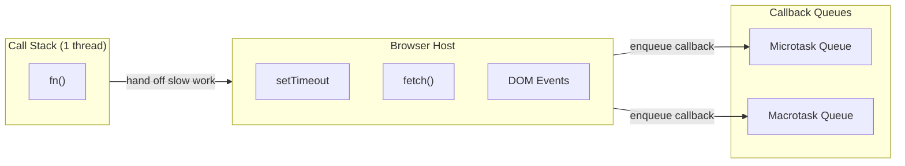
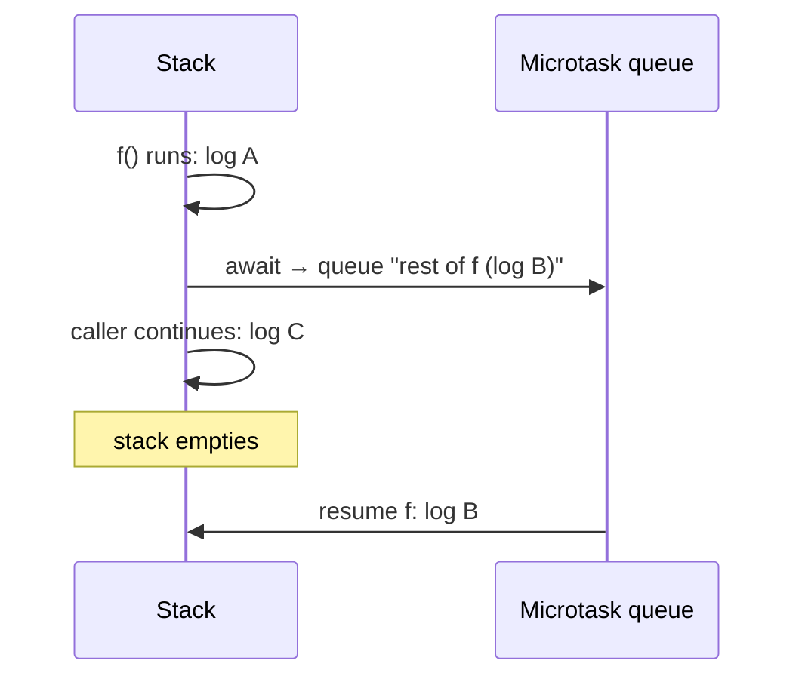

## The Problem

You're building a CRM dashboard. A sales rep clicks an account, and you need to fetch account details, contacts, and deals — all from different API endpoints. Each takes 200-400ms. If JavaScript blocked the thread for each request, the page would freeze for over a second. No scrolling. No clicking. No loading spinners.

JavaScript runs on a single thread. One call stack. It can't "wait" for anything without freezing everything. So how do you handle slow operations without locking up the page?

```js
// What you WISH you could write (but would freeze the tab):
const account = fetchFromNetwork('/api/accounts/42'); // blocks 300ms
const contacts = fetchFromNetwork('/api/accounts/42/contacts'); // blocks 200ms
render(account, contacts);
```

## The One Insight

**The event loop is a restaurant host.** You (the JavaScript thread) are the only waiter. You can only carry one plate at a time (one function on the call stack). Some orders take a long time — cooking a steak (network request), waiting for a cocktail (timer). You hand those off to kitchen staff (browser host threads). They do the work in the background.

When the kitchen finishes, they put your completed order in one of two windows:

- **Window 1 (Microtasks):** VIP guests. Promise callbacks, async/await continuations. These get served *immediately* after you finish your current plate — before you even look at the regular window.
- **Window 2 (Macrotasks):** Regular orders. setTimeout callbacks, click handlers, I/O. You pick one after the VIP window is completely empty.

**"Empty the stack, drain the VIPs, serve one regular order, repeat."**



## Execution Order Simulation

Run this in your head before reading the answer:

```js
console.log("1");
setTimeout(() => console.log("2"), 0);
Promise.resolve().then(() => console.log("3"));
console.log("4");
```

**Step-by-step:**
1. `console.log("1")` — runs synchronously. Output: `1`
2. `setTimeout(..., 0)` — the host starts a 0ms timer. Callback enqueued as a **macrotask**. Queue: `[() => log("2")]`
3. `Promise.resolve().then(...)` — callback enqueued as a **microtask**. Queue: `[() => log("3")]`
4. `console.log("4")` — runs synchronously. Output: `4`
5. Stack is empty. Event loop drains **all** microtasks. Output: `3`
6. Event loop picks one macrotask. Output: `2`

**Final output: `1, 4, 3, 2`**

The timer was coded before the Promise.then. But the Promise.then runs first. Because they go into different queues, and microtasks drain before the next macrotask. You cannot determine order by reading code top-to-bottom.

## What `await` Does Internally

```js
async function f() {
  console.log("A");
  await null;
  console.log("B");
}
f();
console.log("C");
```

Output: `A, C, B`

`await` splits the function at the await point. Everything before runs synchronously. Everything after runs as a microtask. `await null` wraps null in `Promise.resolve(null)`, calls `.then()`, and schedules the rest as a microtask. The function suspends, returns to the caller, and resumes when the microtask fires.

Every `await` costs at least one microtask tick — even `await null`.



## Implementation Details

The HTML spec defines the event loop processing model:

```
while (eventLoop.isRunning) {
  task = selectOldestRunnableTask(taskQueues)
  if (task) run(task)

  performMicrotaskCheckpoint()   // drain ALL microtasks

  if (isRenderingOpportunity()) updateRendering()
}
```

`performMicrotaskCheckpoint` loops until the microtask queue is empty. If a microtask queues more microtasks, the loop keeps going. This is why an infinite `Promise.then` chain starves macrotasks — the while loop never exits. User events and paint frames never get a turn.

**Task queues are sets, not FIFO.** The event loop can pick the first *runnable* task from any task source (timer, user interaction, networking). The browser can prioritize a user click over a timer callback. The microtask queue is a true FIFO.

## Common Mistakes

- **"setTimeout(0) runs immediately."** It schedules a macrotask. The callback runs only when the stack is empty AND all microtasks have drained. The 0ms delay is also clamped to 4ms for nested timers.
- **"async/await is multithreaded."** Wrong. One thread. `await` is syntactic sugar over Promise.then. The function splits at the await point.
- **"Code order determines execution order."** Wrong for async. You must simulate the queues.
- **"A microtask runs immediately."** It runs when the stack empties and a microtask checkpoint fires. If the stack is deep in recursion, microtasks queue up but don't run until the stack unwinds.

## Mental Trigger

**"Empty stack, drain the VIPs, serve one regular order, repeat."**

## Q&A

**Q: What is the difference between a microtask and a macrotask?**
Microtasks are high-priority — Promise.then, async/await continuations, queueMicrotask. Macrotasks are normal priority — setTimeout, DOM events, I/O. After each macrotask, all microtasks drain before the next macrotask.

**Q: Why does Promise.then run before setTimeout(fn, 0)?**
setTimeout schedules a macrotask. Promise.then schedules a microtask. After synchronous code finishes, the event loop drains all microtasks before picking the next macrotask. The Promise callback runs immediately. The setTimeout callback waits.

**Q: Does `await 5` still cost a microtask tick?**
Yes. Internally, `await` desugars to `Promise.resolve(value).then(resume)`. Even on an already-fulfilled Promise, `.then()` enqueues a microtask. The function yields and resumes asynchronously regardless of the awaited value's type.

**Q: A while(true) loop runs for 3 seconds. Why does the UI freeze?**
The loop keeps the call stack busy. The event loop can't run its tick because the stack is never empty. No macrotasks run. No microtasks run. No paint happens. Fix: chunk with `setTimeout` (break work into small pieces) or move to a Web Worker (separate thread).
