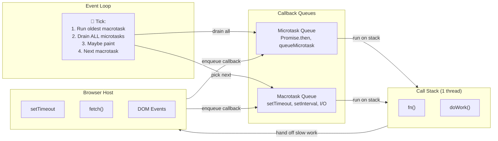
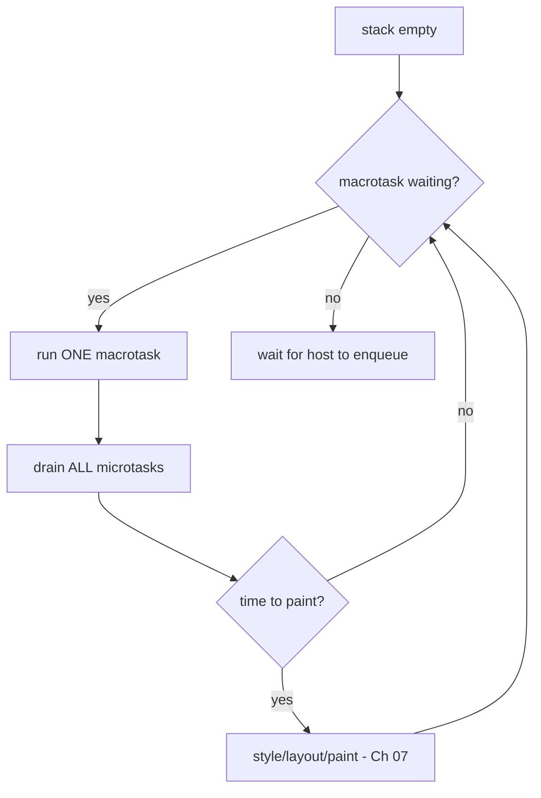
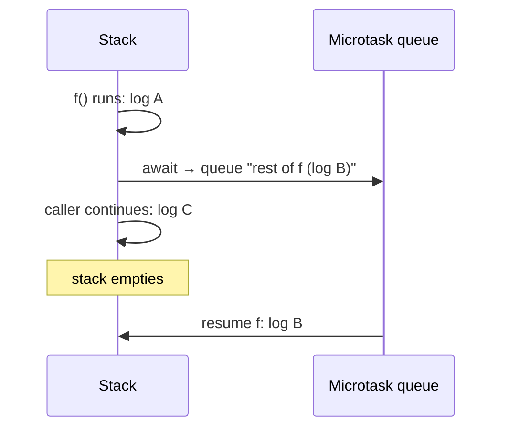

## Problem

You are building a CRM dashboard. When a sales rep opens an account page, you need to:

1. Fetch account details from `/api/accounts/42`
2. Fetch the contact list from `/api/accounts/42/contacts`
3. Fetch the deal pipeline from `/api/accounts/42/deals`
4. Render all three on screen

Each request takes 200-400ms. If JavaScript blocked the thread for each one, the page would freeze for over a second. No scrolling. No clicking. No animated loading spinners. The browser would show the "page unresponsive" dialog.

This is the fundamental problem: **JavaScript has one thread and one call stack. How do you wait for slow operations (network, timers, user input) without freezing the entire page?**

```js
// What you WISH you could write (but would freeze the tab):
const account = fetchFromNetwork('/api/accounts/42'); // blocks 300ms
const contacts = fetchFromNetwork('/api/accounts/42/contacts'); // blocks 200ms
render(account, contacts);
```

## Why Existing Solution Failed

Before JavaScript needed to run in a browser, languages handled I/O in two ways, both wrong for a UI thread.

**Synchronous blocking** (C, Java, Python default): A `read()` or `recv()` call blocks the thread until data arrives. The operating system context-switches to another thread. But browsers give each tab one UI thread. Blocking it freezes the entire tab. The user cannot scroll, click, or type.

**Thread-per-request** (Java servlets, C# servers): Each connection spawns a new thread. The OS handles blocking by switching between threads. But threads are expensive. Each one needs megabytes of stack space. A browser tab with 100 open network requests would crash on thread overhead alone. And threads introduce race conditions, deadlocks, and complexity that makes UI programming error-prone.

**The old web was static.** Before JavaScript, clicking a link reloaded the entire page. There was no interactivity. The browser was a document viewer, not an application platform.

JavaScript needed a third way: **single thread, cooperative scheduling, non-blocking I/O.** The language would never wait. The *host* (browser) would do the waiting on its own threads. When the host finished, it would drop a callback into a queue. The single thread would pick it up when it was free. This is the event loop.

The insight: instead of making the developer manage threads, the runtime manages a queue of work. The developer writes callbacks. The runtime decides when to run them. No locks. No race conditions. One thread, one stack, one queue at a time.

## Mental Model

JavaScript runs on ONE thread with ONE call stack. It cannot "wait" for anything. Slow operations (timers, network, DOM events) are handed to the browser host. The host has its own threads for timing and networking. When the host finishes, it drops a callback into a queue. The event loop has exactly one job: when the call stack is EMPTY, take the next callback and run it. There are two queues: microtasks (Promises) and macrotasks (timers, events). After each macrotask, drain ALL microtasks before the next macrotask or a repaint.

**"Empty the stack, drain the micros, run one macro, repeat."**

## Visualization





## Engine Simulation

Run this in your head. Do not look at the answer yet.

```js
console.log("1");
setTimeout(() => console.log("2"), 0);
Promise.resolve().then(() => console.log("3"));
console.log("4");
```

**Step-by-step simulation:**

```
Call stack starts empty. Execute script.

Step 1: console.log("1")
  Stack: [ log("1") ]
  Output: "1"
  Stack empties.

Step 2: setTimeout(() => console.log("2"), 0)
  Stack: [ setTimeout(...) ]
  The host starts a 0ms timer on a browser thread.
  The timer callback is enqueued as a MACROTASK.
  Macrotask queue: [ () => log("2") ]
  Stack empties.

Step 3: Promise.resolve().then(() => console.log("3"))
  Stack: [ .then(...) ]
  Promise.resolve() creates a fulfilled promise.
  .then() schedules the callback as a JOB (microtask).
  Microtask queue: [ () => log("3") ]
  Stack empties.

Step 4: console.log("4")
  Stack: [ log("4") ]
  Output: "4"
  Stack empties.

--- Call stack is EMPTY. Event loop takes over ---

Step 5: Drain microtask queue (ALL of them)
  Microtask queue has [ () => log("3") ]
  Dequeue and run: console.log("3")
  Output: "3"
  Microtask queue empty.

Step 6: Take one macrotask
  Macrotask queue has [ () => log("2") ]
  Dequeue and run: console.log("2")
  Output: "2"

Final output: 1, 4, 3, 2
```

**Why this order matters:** The timer was coded BEFORE the Promise.then. But the Promise.then callback runs first. Because they go into different queues, and microtasks drain before the next macrotask. You cannot determine order by reading code top-to-bottom. You must simulate the queues.

### Await simulation

```js
async function f() {
  console.log("A");
  await null;
  console.log("B");
}
f();
console.log("C");
```

**Step-by-step:**

```
Step 1: Call f()
  Stack: [ f() ]
  Run synchronously up to the await.

Step 2: console.log("A")
  Output: "A"

Step 3: await null
  await wraps null in Promise.resolve(null).
  It calls PerformPromiseThen on that promise.
  The rest of the function (console.log("B")) is scheduled as a microtask.
  f() suspends and returns control to the caller.
  Microtask queue: [ resume f, log("B") ]
  Stack empties.

Step 4: Back in caller
  console.log("C")
  Output: "C"
  Stack empties.

Step 5: Event loop drains microtasks
  Resume f(). Run console.log("B").
  Output: "B"

Final output: A, C, B
```



**What await does internally:** It splits the function at the await point. Everything before runs synchronously. Everything after runs as a microtask. The closure (Chapter 01) stores the execution context so the function resumes exactly where it paused. No threads. No blocking. Just queue manipulation.

## Internal Implementation

The HTML spec defines the event loop processing model. Here is the pseudo code.

### Event loop main loop

```
while (eventLoop.isRunning) {
  // 1. Select the oldest runnable task from any task queue
  task = selectOldestRunnableTask(taskQueues)
  if (task) {
    run(task)
    task = null
  }

  // 2. Perform a microtask checkpoint
  performMicrotaskCheckpoint()

  // 3. Update rendering (only at display refresh rate)
  if (isRenderingOpportunity()) {
    updateRendering()
  }
}
```

### Microtask checkpoint

```
function performMicrotaskCheckpoint() {
  // Re-entrancy guard: prevents recursive checkpoints.
  // If a microtask triggers an operation that starts another checkpoint,
  // the nested call returns immediately.
  if (isPerformingMicrotaskCheckpoint) return
  isPerformingMicrotaskCheckpoint = true

  while (microtaskQueue is not empty) {
    task = microtaskQueue.dequeue()
    run(task)
    // Microtask can queue MORE microtasks. The while loop keeps going.
  }

  isPerformingMicrotaskCheckpoint = false
}
```

This is why an infinite Promise.then chain starves macrotasks. The while loop never exits. User events and paint frames never get a turn.

### Promise.then internals

```
function then(onFulfilled, onRejected) {
  // .then always returns a new promise for chaining
  const resultPromise = new Promise()

  if (this.state === PENDING) {
    // Store handlers. They run when the promise settles.
    this.fulfillReactions.push({
      capability: resultPromise,
      handler: onFulfilled
    })
  } else {
    // Promise already settled. Enqueue a microtask now.
    const job = createPromiseReactionJob(this, onFulfilled, resultPromise)
    hostEnqueuePromiseJob(job)  // queues a microtask
  }

  return resultPromise
}
```

### Await desugaring

```
async function f() {
  await value
  // rest of function
}

// Is internally:
function f() {
  const promise = Promise.resolve(value)
  const resume = (v) => { /* resume execution with value v */ }
  const throwIn = (e) => { /* throw exception into the function */ }
  promise.then(resume, throwIn)
  // suspend and return to caller
}
```

Every `await` costs at least one microtask tick. Even `await null` goes through `Promise.resolve()` which schedules a .then() microtask.

### Task queues are sets, not FIFO

The HTML spec says task queues are **sets**, not queues. The event loop can pick the first *runnable* task from any **task source** (timer, DOM manipulation, user interaction, networking, navigation). This lets the browser prioritize: a user click task can jump ahead of a timer callback. But the microtask queue is a true FIFO. Strict ordering there.

## Real World Example

**CRM dashboard data loading.** A sales rep opens an account page. The app fires three fetches in parallel:

```js
async function loadAccountPage(accountId) {
  const [account, contacts, deals] = await Promise.all([
    fetch(`/api/accounts/${accountId}`),
    fetch(`/api/accounts/${accountId}/contacts`),
    fetch(`/api/accounts/${accountId}/deals`),
  ]);
  render({ account, contacts, deals });
}
```

Here is what the event loop does:

1. Three `fetch()` calls hand network work to the browser's networking threads. Each returns a Promise immediately. The Promises are pending.

2. `await Promise.all(...)` suspends the function. The microtask queue is empty. The event loop continues processing macrotasks: user clicks, scroll events, paint frames.

3. Network responses arrive in any order. Each response triggers a microtask that resolves one Promise. `Promise.all` tracks all three. When the last one resolves, it queues a microtask to resume the async function.

4. The resumed microtask calls `render()`. This runs synchronously to completion. If rendering takes more than 16ms, the next paint frame is delayed.

**Search-as-you-type with debounce.** A search input fires a request on every keystroke. Debounce with setTimeout:

```js
let debounceTimer;
input.addEventListener('input', (e) => {
  clearTimeout(debounceTimer);
  debounceTimer = setTimeout(() => {
    fetch(`/api/search?q=${e.target.value}`).then(renderResults);
  }, 300);
});
```

The timer callback is a macrotask. If a Promise.then from a previous search is still in the microtask queue, the timer waits. Debounced searches are never starved by microtask-heavy operations.

**Infinite scroll feed (LinkedIn, Twitter).** When the user scrolls near the bottom, the app fetches the next page. The fetch response handler (microtask) appends items to the DOM. Layout calculation runs on the next render frame. This interleaving of microtask (data processing) and macrotask (scroll event) keeps the feed smooth.

## Tradeoffs

### Advantages

**Non-blocking by default.** No thread pools, no locks, no race conditions from shared memory. Every async operation returns control to the stack immediately.

**Cooperative scheduling.** The developer decides priority by choosing microtask vs macrotask. Promise callbacks (microtasks) always run before timers (macrotasks). This enables predictable ordering.

**Single-threaded simplicity.** No context switching overhead. No mutexes. The call stack is deterministic (Chapter 01). JavaScript is predictable for UI programming.

### Disadvantages

**CPU-bound work still blocks.** A 500ms synchronous computation freezes the thread. The event loop cannot interleave it. The only fixes are chunking with setTimeout or moving to Web Workers (Chapter 17).

**Microtask storms starve macrotasks.** An infinite Promise.then chain fills the microtask queue faster than the event loop can drain it. Macrotasks (user events, paint frames) never get a turn. The page freezes even though each microtask is tiny.

**Error handling complexity.** Async errors need try/catch around await or .catch() on promises. An unhandled promise rejection silently disappears in older runtimes. Source maps for async stack traces are still imperfect.

**Not truly parallel.** Two CPU-heavy async functions share the same thread. They interleave at await points but never run simultaneously. This is cooperative multitasking, not parallelism.

### Developer Experience

The two-queue model with different drain rules is the hardest mental leap for new engineers. Senior engineers simulate the queues instinctively. The magic of `await` (looks synchronous but is not) is both the best and worst thing for DX: easy to write, confusing to debug when interleaving surprises happen.

## Common Mistakes

**"setTimeout(0) runs immediately."** Wrong. It schedules a macrotask. The callback runs only when the stack is empty AND all microtasks have drained. The 0ms delay is also clamped to 4ms for nested timers.

**"async/await is multithreaded."** Wrong. One thread. await is syntactic sugar over Promise.then. The function splits at the await point. The continuation is a microtask on the same thread.

**"Code order determines execution order."** Wrong for async. You cannot read a mix of setTimeout and Promise.then top-to-bottom and know the output. You must simulate the queues.

**"A microtask runs immediately."** Not exactly. A microtask runs when the stack empties and a microtask checkpoint fires. If the stack is deep in recursion, microtasks queue up but do not run until the stack unwinds.

**"Microtasks are faster than macrotasks."** Misleading. Both are function calls on the same thread. Microtasks get higher priority (they drain first), but they do not run on a separate fast path.

**"Promise.resolve().then() runs in the same tick."** Incorrect. .then() always enqueues a microtask. Even on an already-fulfilled promise, the callback defers to the microtask queue.

**"async functions run in parallel."** No. async functions yield at await points. Between awaits, they run synchronously. Two async functions interleave but never run simultaneously.

## SDE-2 Interview Answer

### Mid-level

"The event loop is how JavaScript handles asynchronous operations on a single thread. When you call setTimeout or fetch, the browser takes over the waiting. When the operation finishes, the callback goes into a queue. The event loop checks if the call stack is empty. If it is, it takes the next callback and runs it.

There are two queues. Microtasks are for Promises and async/await continuations. Macrotasks are for timers and DOM events. The rule is: after one macrotask, the event loop drains the entire microtask queue before the next macrotask. This is why Promise.then runs before setTimeout with zero delay.

Async/await is syntactic sugar. Await wraps the value in a Promise and schedules the rest of the function as a microtask. The function yields control back to the caller. When the microtask runs, the function resumes from where it paused. No threads involved."

### Senior

"When I design APIs that need scheduling guarantees, I think about the event loop as a priority system with two levels.

Microtasks are high priority. Promise reactions, queueMicrotask, and async function continuations go here. They drain completely after each macrotask. A Promise.then chain always completes before the next setTimeout fires, even if both were scheduled at the same clock time.

Macrotasks are normal priority. setTimeout, setInterval, I/O callbacks, and DOM event handlers go here. The event loop picks exactly one per turn.

The key production insight: a microtask storm can starve macrotasks. An infinite Promise.then chain keeps the microtask checkpoint running forever. User events never fire. Paint never happens. I have debugged this in production React apps where state updates in useEffect callbacks create a microtask feedback loop.

For CPU-heavy work, I chunk with setTimeout slices or use Web Workers. A long synchronous function blocks everything: microtasks, macrotasks, rendering. The event loop only runs when the stack is empty.

When reviewing code, I flag patterns that misuse the two queues. Using setTimeout(fn, 0) when queueMicrotask would be more appropriate, or vice versa. The choice depends on whether you need to yield to the render cycle."

### Engineering Lead

"The event loop is the execution model for the entire platform. Choosing the wrong queue has system-level consequences.

In my teams, I enforce a simple contract for async code. Network responses and user events go through macrotasks naturally. Business logic that processes those responses goes through microtasks via async/await. Heavy computation never runs on the main thread. We audit long tasks with the Performance Observer API and refactor anything over 50ms.

The architecture principle: the event loop is the scheduler. Treat it with the same respect as a database query planner or an OS process scheduler. A single long task at the wrong moment degrades user experience across the entire application, not just the current view.

For micro-frontends or widget architectures that share the event loop, one team's microtask storm can freeze another team's component. We use queueMicrotask sparingly and prefer requestIdleCallback or the Scheduler API for non-critical work.

The JavaScript runtime is your platform. The event loop is its kernel. Design for it."

## Follow-up Questions

**Q1: What is the difference between a microtask and a macrotask? Give one example of each.**

Microtasks come from Promise.then, async/await continuations, and queueMicrotask. Macrotasks come from setTimeout, setInterval, DOM events, and I/O callbacks. The event loop runs one macrotask per turn but drains all microtasks before the next macrotask.

**Q2: Why does Promise.then(fn) run before setTimeout(fn, 0) even when the setTimeout appears first in the code?**

setTimeout queues the callback as a macrotask. Promise.then queues it as a microtask. After synchronous code finishes, the event loop drains all microtasks first. Only then does it pick one macrotask. The timer callback is in the macrotask queue, behind the microtask drain. The Promise callback always wins.

**Q3: An async function calls await on a non-promise value like await 5. Does this still cost a microtask tick? Explain why.**

Yes. await internally calls Promise.resolve() to wrap the value in a Promise, then calls .then() on that Promise. Promise.resolve(5) returns a fulfilled promise. But .then() on a fulfilled promise still enqueues a microtask. So await null, await undefined, await 5 all cost at least one microtask tick. The function yields and resumes asynchronously.

**Q4: A while(true) loop runs for 3 seconds. Why does the UI freeze, and what two approaches fix it?**

The while(true) loop keeps the call stack busy for 3 seconds. The event loop cannot run its tick because the stack is never empty. No macrotasks (click handlers, timer callbacks) run. No microtasks (Promise reactions) run. No paint frames render.

Fix one: break the work into chunks and schedule each chunk with setTimeout(..., 0). Each chunk runs as a macrotask. Between chunks, the stack empties and the event loop drains microtasks and paints.

Fix two: move the work to a Web Worker. The worker runs on a separate thread. It communicates with the main thread via postMessage, which enqueues a task. The main thread stays responsive.

**Q5: Describe the PerformMicrotaskCheckpoint algorithm. Why does it include a re-entrancy guard, and what happens if a microtask queues another microtask?**

The algorithm has a boolean flag (isPerformingMicrotaskCheckpoint). On entry, if the flag is true, return immediately. Otherwise, set it to true. Then loop: while the microtask queue is not empty, dequeue and run the oldest microtask. After the loop, set the flag back to false.

The re-entrancy guard prevents recursive checkpoints. If a microtask triggers an operation that would normally start a checkpoint (like resolving a Promise inside a Promise reaction), the nested call returns immediately. The outer loop handles the newly queued microtask.

If a microtask queues another microtask, the while loop keeps going. It only stops when the queue is truly empty. This means an infinite chain of Promise.then calls (where each one creates another Promise) keeps the loop running forever. Macrotasks never get a turn. The page freezes.

## Mental Trigger

**"Empty stack, drain micros, one macro, repeat."**

## One Page Revision

- JavaScript: one thread, one call stack, one event loop.
- Slow operations (network, timers, DOM events) handed to browser host.
- Host finishes, enqueues callback into a queue.
- Event loop picks callbacks when stack is empty.
- Two queues: microtasks (Promise.then, await, queueMicrotask) and macrotasks (setTimeout, setInterval, events).
- One macrotask per event loop turn.
- ALL microtasks drain before next macrotask.
- await desugars to Promise.resolve() + .then() + suspend.
- await continuation always a microtask, even for non-promise values.
- Long synchronous work starves event loop, freezes UI.
- Fixes: chunk with setTimeout, or offload to Web Worker.
- Microtask storms (infinite .then chain) starve macrotasks and rendering.
- Event loop is the runtime scheduler. Design code around it.
- Trigger: "Empty stack, drain micros, one macro, repeat."
