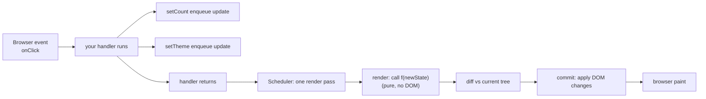
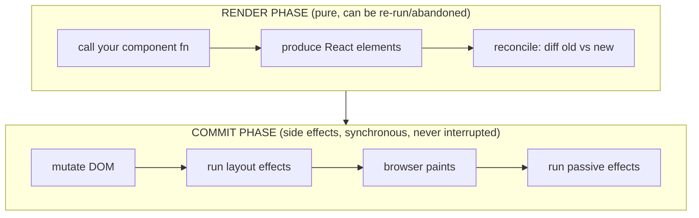
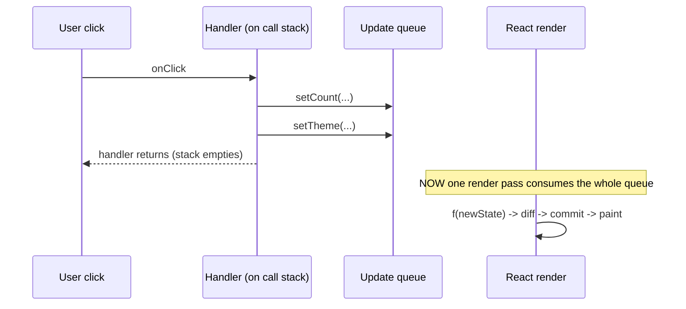

## Problem

A developer writes a click handler that updates two pieces of state:

```js
function handleClick() {
  setCount(count + 1);
  setTheme("dark");
}
```

They expect count to be 1 and theme to be "dark" on the next line. It is not. The count variable in scope is still 0. The theme variable in scope is still the old value. Confusion sets in.

A deeper problem: if each setter did mutate the variable synchronously and re-render the component immediately, three setters would produce three separate renders. Intermediate half-applied UIs. Wasted work. Layout thrashing. The DOM would be recalculated mid-handler, before the handler even finished.

```js
function handleClick() {
  setLoading(true);       // if this re-rendered now...
  setData(response);      // ...this would trigger a second render
  setError(null);         // ...and a third
}
```

Three setter calls. Three full re-renders of the entire subtree. The user sees a flash of loading state that is immediately replaced by data. The browser recalculates layout after each DOM write. The handler has not even returned yet, but the DOM was mutated three times.

The engineering challenge React had to solve: **How do you let developers write natural sequential state changes while only producing a single coherent DOM update?** The answer is not about making setState async. It is about decoupling the call to setState from the act of rendering.

---

## Why Existing Solution Failed

Before React, state changes meant immediate DOM mutation.

```js
// jQuery era
$("#loading").show();
$("#data").text(response);
$("#error").hide();
```

Each line reaches into the DOM and changes it. The browser has no idea more changes are coming. After each DOM write, it may recalculate layout. Three writes can trigger three layout passes. The developer must manually batch by building a DocumentFragment, concatenating HTML strings, or using requestAnimationFrame to coalesce.

Backbone and early frameworks had the same limitation. Changing a model attribute fires a "change" event. The view re-renders. Change three attributes:

```js
model.set("loading", true);  // triggers view re-render
model.set("data", result);   // triggers another re-render
model.set("error", null);    // triggers a third re-render
```

Either you get three re-renders, or you use silent flags and batch manually. The framework offered no help.

The core limitation: **State mutation and DOM update were tightly coupled.** Every setter either did synchronous DOM work or required manual batching from the developer. There was no declarative "this is what I want the state to be, you figure out when to update the screen."

React's solution was radical: decouple the set call from the render. Make setState an enqueue operation. The framework collects all changes, then produces one render. The developer just describes the desired end state.

---

## Mental Model

**setState does not change a variable. It files a request: "next time you render this component, use this value." Rendering is a pure function `UI = f(state)` that React calls when it decides to, not when you call the setter. Every value in a render is frozen as a snapshot captured by closure. A re-render creates a new closure with new values.**

One memorable sentence: **"The setter is a memo to the next render."**

Everything below (batching, stale state, functional updaters, the double increment puzzle) comes from this one sentence. You do not memorize rules. You derive them from "setter = request, render = snapshot."

This model requires two prerequisites from earlier chapters: closures (Ch 01) explain why count in a render is a frozen constant. The event loop and microtask queuing (Ch 02) explain why React defers work until the stack empties. React's batching reuses the same pattern: queue work, drain when the stack empties.

---

## Visualization

The full lifecycle from click to paint:



The two-phase architecture that makes this work:



Why do multiple setters in one handler produce only one render? The batching sequence:



---

## Engine Simulation

The double increment puzzle. Every React developer hits this:

```js
function Counter() {
  const [count, setCount] = useState(0);
  function handleClick() {
    setCount(count + 1);
    setCount(count + 1);
  }
  return <button onClick={handleClick}>{count}</button>;
}
```

You click. What is count displayed? **1, not 2.** Walk through what the engine does.

During this render, count is a closure-captured constant = 0. This is the snapshot for render #1. The variable count is frozen at 0 for the entire handler execution.

```
Step 1: setCount(count + 1)
  -> evaluates count + 1 = 0 + 1 = 1
  -> enqueues update: "set to 1"

Step 2: setCount(count + 1)
  -> evaluates count + 1 = 0 + 1 = 1 (count is STILL 0, frozen snapshot)
  -> enqueues update: "set to 1"

Update queue for Counter: [ set -> 1, set -> 1 ]

Step 3: handler returns. Stack empties.
Step 4: Scheduler runs ONE render pass.
Step 5: React applies queue: 0 -> 1 -> 1 => final value is 1
```

Count never became 1 mid-handler. It was frozen. Both setters read the same snapshot 0. Internally, React stores the update queue on the component's Fiber node. Each call to setState appends an update object `{ action: 1 }`. When the render runs, React starts with the base state (0) and applies each update in order: 0 -> 1 -> 1. The second update does nothing because it already sees 1 and sets to 1 again.

The fix is to stop reading the snapshot and instead describe a transformation:

```js
setCount(c => c + 1);   // "whatever it currently is, add 1"
setCount(c => c + 1);
```

Now each updater receives the running result from the previous one:

```
Update queue: [ (c) => c + 1, (c) => c + 1 ]
Apply:        0 -> (0+1)=1 -> (1+1)=2  => final value is 2
```

The functional updater is not a trick. It exists because the plain value form reads the frozen snapshot. The functional form says "I do not know the current value. Feed it to me when you drain the queue." This is the same mechanism useReducer uses internally.

---

## Internal Implementation

Each component instance has a Fiber node (detailed in Ch 04). The Fiber stores a linked list of pending state updates. Every call to setState goes through this path:

```
setState(action) -> dispatchSetState(fiber, queue, action)
  -> create update object { lane, action, next }
  -> enqueueUpdate(fiber, queue, update)
  -> scheduleUpdateOnFiber(fiber, lane)
    -> markRootUpdated(root, lane)
    -> ensureRootIsScheduled(root)
```

Here is pseudo code of what happens:

```js
function useState(initialValue) {
  var fiber = currentlyRenderingFiber;
  var queue = fiber.updateQueue;
  var state = reconcileUpdates(fiber, queue);
  var dispatch = dispatchSetState.bind(null, fiber, queue);
  return [state, dispatch];
}

function dispatchSetState(fiber, queue, action) {
  var update = {
    lane: requestUpdateLane(),
    action: action,
    next: null
  };
  enqueueUpdate(fiber, queue, update);
  scheduleUpdateOnFiber(fiber, update.lane);
  // returns immediately. Nothing has rendered.
}

function scheduleUpdateOnFiber(fiber, lane) {
  var root = markRootUpdated(fiber, lane);
  ensureRootIsScheduled(root);
  // defers actual work to a microtask
}

function ensureRootIsScheduled(root) {
  // uses queueMicrotask or Promise.resolve
  scheduleMicrotask(function flushWork() {
    if (not currently in render or commit) {
      flushSyncCallbacks();
    }
  });
}
```

The microtask flush is the mechanism behind automatic batching (React 18+). All setState calls during the same synchronous task create update objects and call scheduleUpdateOnFiber. Each call tries to schedule a microtask. The microtask library deduplicates: only one microtask is scheduled per root per event. When the current task finishes and the stack empties (Ch 02), the microtask runs. It calls flushSyncCallbacks, which starts the render phase.

**Pre-18 vs 18 batching:**

Pre-18, React used a flag called BatchedContext. Inside synthetic event handlers, React set this flag. setState during a batched context just queued updates without flushing. Outside the batched context (setTimeout, Promises), the flag was not set, so each setState flushed immediately. React 18 removed the flag-based approach. The microtask flush means all updates from the same task naturally batch, regardless of origin.

```js
// Pre-18 (conceptual)
function batchedUpdates(fn) {
  executionContext |= BatchedContext;
  try { fn(); } finally { executionContext &= ~BatchedContext; }
}
// Outside batchedUpdates, each setState flushed synchronously

// React 18+ (conceptual)
function scheduleUpdateOnFiber(fiber, lane) {
  markRootUpdated(fiber, lane);
  ensureRootIsScheduled(root);
  // ensureRootIsScheduled schedules a microtask
  // All calls during the same task share the same microtask
}
```

**Render phase vs Commit phase:**

Render phase: React calls your component function from top to bottom. The component reads the latest computed state from the queue and returns React elements (plain objects: `{type, props}`). No DOM is touched. This phase is pure. React may call your component multiple times (StrictMode double-invoke in dev, or abandoned work from an interruption). This is why side effects in render are dangerous.

```js
// Pseudo: render phase
function beginWork(current, workInProgress, renderLanes) {
  if (workInProgress.tag === FunctionComponent) {
    var newChildren = workInProgress.type(workInProgress.pendingProps);
    reconcileChildren(current, workInProgress, newChildren);
  }
}
```

Commit phase: React walks the finished work and applies DOM mutations synchronously. Layout effects (useLayoutEffect) fire. The browser paints. Passive effects (useEffect) fire after paint.

```js
// Pseudo: commit phase
function commitRoot(root) {
  var finishedWork = root.current.alternate;
  // Apply DOM mutations (insert, update, delete nodes)
  commitMutationEffects(finishedWork);
  // Run layout effects
  commitLayoutEffects(finishedWork);
  // Schedule passive effects to run after browser paint
  schedulePassiveEffects(finishedWork);
}
```

**Transitions and useDeferredValue:**

startTransition marks its updates with a transition lane (lower priority). An urgent update (a keystroke = SyncLane) can preempt an in-progress transition render. This is how typing stays responsive while a big list re-render runs in the background. Internally, requestUpdateLane checks for an active transition context (`ReactSharedInternals.T` in v19, was `ReactCurrentBatchConfig.transition` in v18) and assigns a transition lane.

useDeferredValue renders the urgent update with the old value, then schedules an interruptible background re-render with the new value (a DeferredLane in v19, a transition lane in v18).

**StrictMode double-invoke (dev only):**

In development, StrictMode deliberately runs your component body twice per render to find impure logic. Since React 18, it also double-invokes effects as mount, unmount, then mount again to catch missing cleanup. React 19 adds ref-callback double-invocation. All of this is dev-only. Production runs once. React can do this safely because the architecture guarantees render is pure and the work-in-progress tree is throwaway (Ch 04).

**Re-render does not guarantee DOM change.** If the component produces the same elements as the previous render, reconciliation (Ch 06) finds no diff and the DOM is untouched. A "wasted render" is a function call that produced no DOM change. Performance optimization (Ch 08) is about cutting those.

---

## Real World Example

A CRM contact list with search input, status filter, select-all checkbox, and paginated table. When the user types a search term, the handler needs to update multiple pieces of state:

```js
function onSearchInput(value) {
  setSearchQuery(value);       // update the search text
  setCurrentPage(1);           // reset to page 1
  setLoading(true);            // show loading spinner
  setSelectedContacts([]);     // clear the selection
}
```

With jQuery or Backbone, each line would trigger a separate DOM update. The loading spinner flashes briefly before data loads. The selection clears visibly. The page number jumps. The user sees a flickering sequence of intermediate states.

With React's model, all four setter calls enqueue updates on their respective Fiber nodes. The handler returns. The microtask fires. React runs one render pass. The component function reads the latest state (searchQuery updated, page=1, loading=true, selected=[]) and produces one set of React elements. Reconciliation computes the minimal DOM diff. The DOM is patched once. The user sees a single coherent transition.

This pattern repeats across every SaaS application:

- A dashboard with multiple filter widgets that all drive one data table. Each filter change resets pagination, updates the query, shows loading. All batch into one render.
- A form with real-time validation. Each keystroke updates field value, clears field error, updates character count, toggles submit button. One render.
- A file uploader that tracks progress percentage, upload status, error state, and preview URL. Multiple setState calls from one upload event. One render.

The developer writes natural sequential code. React handles the coalescing.

---

## Tradeoffs

**Advantages:**
- Predictable renders: each render is a pure snapshot with frozen values. No mid-render tearing where part of the UI reflects old state and part reflects new.
- Automatic batching: multiple state changes from one action produce one render. No manual debouncing or batch wrappers needed.
- Interruptible rendering: because render is decoupled from commit, React can pause work to handle higher priority updates (Ch 04).
- Declarative model: developer describes end state, not DOM operations. Less surface for mutation bugs.
- Early bailout: setState with the same primitive value skips the render for that component. Reconciliation with no diff skips DOM commit.

**Disadvantages:**
- Stale closure problem: a callback that reads state from an old render sees the old value (Ch 01). Requires functional updaters or refs to escape.
- Learning curve: new developers expect state to update like a variable assignment. The snapshot model is not intuitive from the surface API.
- Memory overhead: each update is a small object allocated on the heap. Heavy queuing under rapid setState calls adds allocation pressure.
- Framework complexity: the two-phase architecture (render suspendable, commit not) adds internal complexity. Bugs like "state update in effect causes double render" are harder to trace.
- Batching can mask intent: if code accidentally relied on intermediate renders for correctness, automatic batching breaks the assumption. This is the developer's bug, but it can be subtle.

**CPU and memory considerations:**
- Update queue is a linked list. Enqueue is O(1). Drain is O(n) where n is updates in the queue.
- Render phase is a function call. CPU cost proportional to component tree depth.
- Commit phase is DOM mutation. This triggers browser layout recalculation, which is the expensive part.
- Each update object is small (approximately 48 bytes). A queue of 1000 updates is 48 KB. Not a concern for normal usage.

**Developer experience:**
- Functional updaters are elegant once understood but confusing for beginners who expect `x = x + 1` semantics.
- Rules of hooks add mental overhead. useState must be called at top level, not conditionally.
- Debugging stale closures requires understanding closure mechanics (Ch 01), which many React tutorials skip.
- React DevTools show component state but not the pending update queue.

---

## Common Mistakes

1. **Reading state right after setting it expecting the new value.** It is the old snapshot. The new value is in the queue, not in the current render's variable.

2. **Chaining value setters that depend on each other without functional form.** `setCount(count + 1); setCount(count + 1)` only adds 1. Fix: `setCount(c => c + 1)` so each updater receives the running result.

3. **Putting side effects in render.** Render is pure. React may call your component twice in development (StrictMode) or abandon the render output (interruption). Side effects belong in useEffect and event handlers.

4. **Assuming re-render equals slow.** Re-render is a function call. The expensive part is DOM commit and browser layout. Measure before memoizing (Ch 08).

5. **Thinking setState in timeouts is broken in React 18.** It became batched, which is correct behavior. Same mental model, wider net.

6. **Using setState for values that do not affect the UI.** If the value is not rendered, use a ref. Every setState schedules a render even if nothing visually changes.

7. **Mutating state directly instead of calling setState.** `state.count = 2` does not schedule a render. React has no way to detect the mutation. The UI stays stale.

8. **Assuming setting the same value does nothing.** For primitives, React bails out via Object.is comparison. For objects, a new reference always triggers a render even if the contents are identical. This is why spreading state without changes causes unnecessary re-renders.

---

## SDE-2 Interview Answer

Explain your reasoning step by step. Show you understand the mechanism, not just the rule.

**Mid-level variant:**

"When I call setState, the value does not update synchronously. React appends the update to an internal queue on the component and schedules a re-render. The current render's variable is a frozen snapshot captured by closure. It only changes when React calls the component again for the next render. If I need to chain updates, I use the functional updater form `setCount(c => c + 1)` so each updater receives the latest value from the queue as it drains."

**Senior variant:**

"setState is an enqueue operation, not a mutation. Each render is a snapshot created by a closure over the component's local variables. React collects all updates from the current synchronous task, then processes them in a single render pass. This automatic batching is why you can call setState multiple times in one handler and get only one render. The mechanism is a microtask-based flush that runs after the call stack empties. This model also explains stale state in callbacks: the callback closed over the old snapshot. I use functional updaters when the new state depends on the old, and refs when I need to read the latest state outside a render cycle."

**Engineering Lead variant:**

"The architecture deliberately decouples state intentions from render execution. This design is not accidental. It enables batching, priority-based preemption (transitions vs urgent updates), and interruptible rendering via Fiber. From a team perspective, this model forces developers to treat renders as pure functions, which eliminates an entire class of bugs from mid-update tearing. The main tradeoff is closure staleness, which requires discipline around functional updaters and refs. In code reviews, I catch patterns where state is read in async callbacks without a ref or functional updater. For complex state with multiple interdependent fields, I prefer useReducer over multiple useState calls because it centralizes the update logic into testable pure reducers. The mental model is the same either way: the setter queues, the render snapshots."

---

## Follow-up Questions

**Q1. What happens internally when you call setState with the same value as the current state?**

React compares the new value with the current state using Object.is. For primitives (numbers, strings), if the values are the same, React bails out. It does not re-render the component. For objects and arrays, a new reference always fails the Object.is check (since `{} !== {}`), so React does re-render even if the contents are identical. This is why spreading state without changing it causes a wasted render.

**Q2. How does React associate each useState call with the correct component?**

Each useState call captures the currently rendering Fiber node through a module-level variable. During the render phase, React sets a global pointer to the current Fiber. When useState is called, it reads from that pointer's update queue. This is why hooks must be called in the same order every render: React relies on the call order to associate each useState with the correct slot in the Fiber's state list. If you put useState inside a conditional, the order shifts and state gets misaligned.

**Q3. Explain the render phase versus commit phase distinction. Why does it matter for concurrent features?**

The render phase is pure and can be interrupted, re-run, or abandoned. React calls your component, you return elements, React reconciles. No DOM is touched. This phase can be paused when a higher priority update comes in (Ch 04 Fiber time-slicing). The commit phase applies DOM mutations synchronously and cannot be interrupted. This distinction matters because it means React can start rendering an update, get interrupted by a user keystroke, throw away the partial work, and start fresh on the keystroke. The user never sees a half-rendered UI because the commit only happens once the render phase finishes without interruption.

**Q4. How did batching change between React 17 and React 18? What was the internal mechanism change?**

React 17 only batched inside synthetic event handlers. It used a BatchedContext flag. When setState was called outside a React event (setTimeout, fetch callback), the flag was not set and each setState flushed synchronously. React 18 introduced automatic batching via a microtask mechanism. Instead of checking a batch flag, scheduleUpdateOnFiber defers the flush to a microtask. All setState calls during the same synchronous task create one microtask. When the task finishes and the stack empties, the microtask runs and processes all queued updates in a single render. flushSync provides an escape hatch for synchronous flush when needed.

**Q5. If you call setState inside a useEffect that runs after every render, how many renders occur? What prevents infinite loops?**

This creates a render cycle. The sequence: component renders, effect runs, setState inside effect enqueues an update, effect finishes, React detects pending update, schedules another render, component renders again, effect runs again. Without a guard, this loops forever. React has a maximum update depth limit (50 by default) to prevent infinite loops. If the setState sets the same primitive value, React bails out at the component level and breaks the cycle. If the setState depends on changing external data (like a timestamp), the loop continues until the limit is hit and React throws an error.

---

## Mental Trigger

**"Setter is a memo to the next render."**

---

## One Page Revision

- setter is not a mutation. It is enqueue + schedule.
- Each render is a snapshot captured by closure. Variables are frozen for that render.
- Next render creates a new closure with new values.
- Batching comes from the event loop model. All updates from one task drain into one render after the stack empties.
- React 18 batches everything (timeouts, promises, native events) via microtask flush.
- Pre-18 only batched inside React's synthetic event handlers (BatchedContext flag).
- Double increment puzzle: both setters read the same snapshot. Fix with functional updater.
- Functional updater lets React feed the running value during queue drain.
- Render phase: pure, calls components, produces elements, no DOM, may be interrupted.
- Commit phase: DOM mutations, synchronous, never interrupted.
- setState with same primitive value = bailout via Object.is. No render.
- Objects always trigger render on new reference even if contents identical.
- State in callbacks is stale if callback captured old render closure. Fix with functional updater or ref.
- Side effects in render are wrong. Render is pure and may run multiple times.
- useReducer centralizes update logic into testable pure reducers.
- flushSync forces synchronous render. Use sparingly only when needed.
- StrictMode double-invokes components in dev to find impure render logic. Dev only.
- Each update is a small object on the heap. Queue is a linked list. O(1) enqueue, O(n) drain.
- Re-render does not mean DOM change. Reconciliation finds no diff = no DOM mutation.
