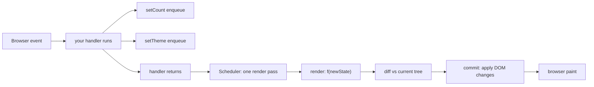
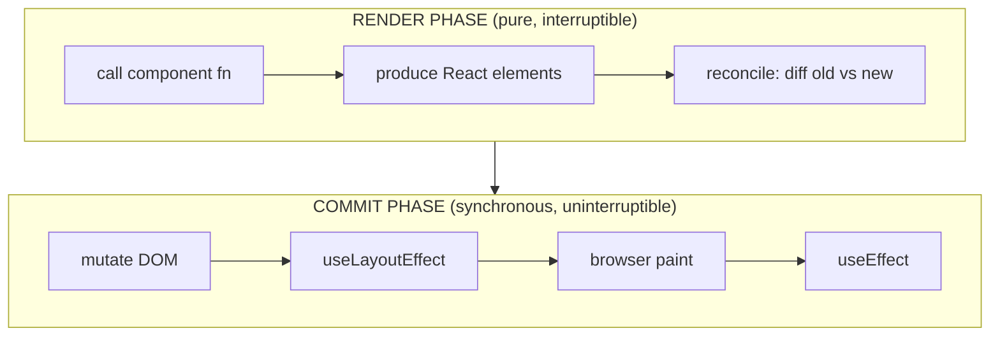

## The Problem

You write a click handler that updates two pieces of state:

```js
function handleClick() {
  setCount(count + 1);
  setTheme("dark");
}
```

You expect `count` to be `1` and `theme` to be `"dark"` on the next line. They're not. The variables in scope are still the old values. Here's the deeper problem: if each setter *did* re-render immediately, three setters in one handler would produce three separate renders. Intermediate half-applied UIs. Layout thrashing. The DOM mutated three times before the handler even returns.

The engineering challenge: **how do you let developers write natural sequential state changes while only producing a single coherent DOM update?**

Think of it like a restaurant. You don't want the waiter running to the kitchen after every item. You say "soup, salad, and steak," and *then* the waiter goes to the kitchen once.

## The One Insight

**`setState` is a sticky note on a whiteboard.** You write "count = 5" on a note and stick it there. Nothing changes yet. You write "theme = dark" on another note. Nothing changes yet. When React walks by, it reads all the sticky notes at once, updates the whiteboard in one pass, and takes a photo. That photo is your render.

The setter is a memo to the next render. Everything below — batching, stale state, functional updaters — comes from this one idea.



## The Double Increment Puzzle

Every React developer hits this:

```js
function Counter() {
  const [count, setCount] = useState(0);
  function handleClick() {
    setCount(count + 1);
    setCount(count + 1);
  }
  return <button onClick={handleClick}>{count}</button>;
}
```

Click. What is count? **1, not 2.**

During this render, `count` is a closure-captured constant = `0`. Both setters read the same snapshot `0`. React stores updates as a linked list on the Fiber. When the render runs, it applies: `0 -> 1 -> 1`. Final value: `1`.

The fix — stop reading the snapshot, describe a transformation:

```js
setCount(c => c + 1);
setCount(c => c + 1);
```

Now each updater receives the running result: `0 -> (0+1)=1 -> (1+1)=2`. The functional updater says "I don't know the current value — feed it to me when you drain the queue."

## How Batching Works

Each `setState` call goes through this path:

```
setState(action)
  -> create update object { lane, action, next }
  -> enqueueUpdate(fiber, queue, update)
  -> scheduleUpdateOnFiber(fiber, lane)
    -> ensureRootIsScheduled(root)
      -> scheduleMicrotask(flushWork)
```

All `setState` calls during the same synchronous task create update objects and call `scheduleUpdateOnFiber`. Each tries to schedule a microtask. The microtask library deduplicates: only one microtask per root per event. When the task finishes and the stack empties (Ch 02), the microtask runs, processes all queued updates in one render.

**React 18 vs Pre-18:** Pre-18 used a `BatchedContext` flag — only batched inside React's synthetic event handlers. In setTimeout or Promises, each setState flushed immediately. React 18 removed the flag. The microtask flush means all updates from the same task naturally batch, regardless of origin.

## Render Phase vs Commit Phase

**Render phase (pure, interruptible):** React calls your component function from top to bottom. You return React elements (plain objects). No DOM is touched. This phase can be paused when a higher-priority update arrives. React may call your component multiple times (StrictMode double-invoke, or abandoned work). Side effects in render are dangerous.

**Commit phase (synchronous, uninterruptible):** React walks the finished work-in-progress tree and applies DOM mutations. `useLayoutEffect` fires. Browser paints. `useEffect` fires after paint. This is one atomic operation — the user never sees a half-applied tree.



## Common Mistakes

- **Reading state right after setting it.** It's the old snapshot. The new value is in the queue, not the current render's variable.
- **Chaining value setters without functional form.** `setCount(count + 1); setCount(count + 1)` only adds 1. Use `setCount(c => c + 1)`.
- **Putting side effects in render.** Render is pure. React may run it twice (StrictMode) or abandon it (interruption).
- **Assuming re-render equals slow.** Re-render is a function call. The expensive part is DOM commit and browser layout. Measure before memoizing.
- **Mutating state directly.** `state.count = 2` doesn't schedule a render. React can't detect the mutation.

## Mental Trigger

**"Setter is a memo to the next render."**

## Q&A

**Q: What happens when you call setState with the same value?**
React compares using `Object.is`. For primitives, `Object.is(1, 1)` is true — React bails out, no update enqueued, no re-render. For objects, a new reference always fails (`{} !== {}`), so React re-renders even if contents are identical.

**Q: How does React associate each useState with the correct component?**
Positional. React sets a module-level pointer before calling your component. First `useState` reads slot 0, second reads slot 1. It only knows call order, not variable names. This is why hooks must be called in the same order every render.

**Q: How did batching change between React 17 and 18?**
React 17 used a `BatchedContext` flag — only batched inside React event handlers. Outside (setTimeout, Promises), each setState flushed immediately. React 18 uses a microtask flush — all updates from the same task batch automatically, no flag needed.

**Q: If setState in a useEffect runs after every render, how many renders occur?**
A render cycle: render → commit → paint → effect → setState → render → ... React enforces a maximum update depth (50). It breaks if the setState sets the same value (Object.is bailout). Fix: add a dependency array or a condition inside the effect.
