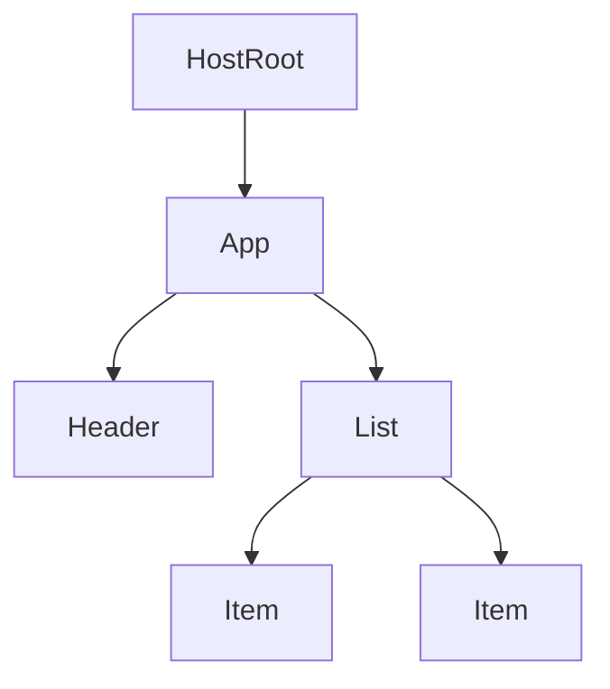
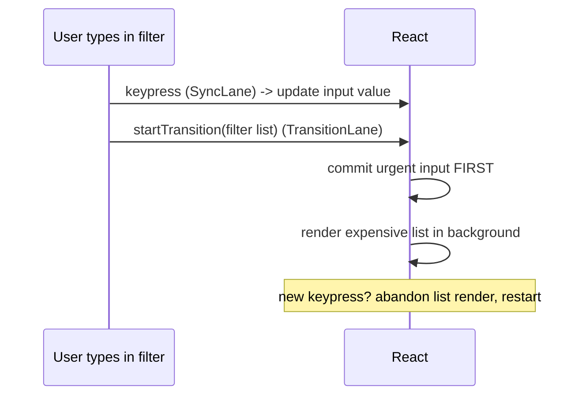

## The Problem

You're building a CRM dashboard with 10,000 contacts. User types in search. Each keystroke filters the list. Before React 16, that keystroke triggers a full recursive reconciliation of the entire component tree. The main thread is busy. The browser can't paint the input cursor. The user feels jank.

This isn't a performance bug you can fix with memo. It's an architectural limit. A recursive tree walk cannot be paused. Its progress lives in the JS call stack. You cannot snapshot the call stack, yield to the browser, and resume later. Once reconciliation starts, it must finish.

## The One Insight

**Before Fiber:** Rendering was like reading a book cover-to-cover in one sitting. You couldn't stop mid-chapter.

**After Fiber:** Rendering is like reading a book with bookmarks. You read a chapter, put in a bookmark, and come back later. The bookmark is your Fiber node — it remembers exactly where you left off.

Fiber turns rendering from one un-interruptible recursive call into a list of small units of work that React can pause, abandon, or resume. A Fiber is a plain JS object, one per element. It is both a node in a linked tree and a unit of work with a priority.

## The Fiber Node

```
Fiber {
  type        : 'div' | FunctionComponent | ...
  key         : reconciliation identity
  child       : first child Fiber
  sibling     : next sibling Fiber
  return      : parent Fiber
  pendingProps / memoizedProps
  memoizedState : head of the hook linked-list
  lanes       : priority bits for pending work
  alternate   : twin Fiber in the other tree (current <-> workInProgress)
}
```

Think of it like a linked list you traverse with a pointer. `beginWork` goes down via `child`. `completeWork` goes up and over via `sibling`/`return`. That pointer is the resumable cursor — the bookmark.



## Two Trees, Double Buffering

Two trees exist at all times. `current` is what's painted on screen. On an update, React builds `workInProgress` by cloning fibers from `current` and applying changes.

The render loop:

```
workInProgress = root

RENDER PHASE (interruptible):
  while (workInProgress !== null && !shouldYield()) {
    performUnitOfWork(workInProgress)
  }
  // if shouldYield() fired, workInProgress still points to next fiber
  // browser schedules us again via MessageChannel, we resume

COMMIT PHASE (synchronous, NOT interruptible):
  1. mutation: apply DOM ops from the diff
  2. swap: root.current = workInProgress
  3. layout effects (useLayoutEffect) run, before paint
  4. browser paints
  5. passive effects (useEffect) flush
```

The screen always shows the consistent `current` tree until commit flips atomically. An interrupted, half-built `workInProgress` never touches the screen. This is why a render can be abandoned safely and why your render function must be pure.

## Lanes: Priority Labels

Lanes use a 31-bit bitmask. Lower bit = higher priority.



Key lanes:
- **SyncLane** (bit 1): urgent input, click, keypress
- **DefaultLane** (bit 5): normal state updates
- **TransitionLanes** (bits 9-22): useTransition, Suspense
- **IdleLane** (bit 28): background work

When a higher-priority update arrives mid-render, React discards the WIP tree and rebuilds from scratch. It does not resume the abandoned render.

## Real World: CRM Search Filter

```js
function SearchFilter() {
  const [query, setQuery] = useState('')
  const [isPending, startTransition] = useTransition()

  function handleChange(e) {
    setQuery(e.target.value)            // SyncLane: urgent
    startTransition(() => {
      setFilterText(e.target.value)     // TransitionLane: low priority
    })
  }

  return (
    <>
      <input onChange={handleChange} />
      {isPending && <Spinner />}
      <LeadTable filter={filterText} />
    </>
  )
}
```

The input gets SyncLane — commits immediately, input stays responsive. The table filter gets TransitionLane — runs in background slices. If the user types again, React abandons the in-progress table render and starts fresh.

## Common Mistakes

- **"Fiber is the virtual DOM."** The element tree ({type, props}) is the VDOM description. Fibers are the persistent work and instance nodes.
- **Side effects in render.** React may run your component, discard the result, and re-run it. Effects belong in commit-phase hooks.
- **Thinking commit is interruptible.** It's synchronous and atomic. The user never sees a half-applied tree.
- **Believing useTransition makes things faster.** It makes render interruptible and lower priority. Total CPU work may be equal. The benefit is perceived responsiveness.

## Mental Trigger

**Fiber = pausable linked-list render.**

## Q&A

**Q: How does React resume a render after yielding?**
The cursor is stored in a module-level variable `workInProgress` on the heap. When the browser schedules the next frame via MessageChannel, the callback re-enters the work loop. `workInProgress` still points to the next fiber. Execution resumes from where it left off.

**Q: Why does double buffering make abandoning a render safe?**
The current tree (painted on screen) is never modified during render. The WIP tree is a shadow copy that can be thrown away. When a higher-priority update arrives, React discards the WIP tree (just memory, gets GC'd) and rebuilds from `root.current`. The user never sees flicker.

**Q: What is a lane? Walk through a typing-while-filtering example.**
A lane is a 31-bit priority mask. User types "a" → `setQuery("a")` gets SyncLane. Inside `startTransition`, `setFilterText("a")` gets TransitionLane. SyncLane renders and commits first — input shows "a" immediately. TransitionLane renders in background. User types "b" before transition finishes → React abandons the transition, commits "b", starts new transition.

**Q: Render phase vs commit phase — which is interruptible?**
Render phase is interruptible — React calls components, reconciles, builds WIP tree. No DOM touched. Can be paused, abandoned, restarted. Commit phase is synchronous and uninterruptible — DOM mutations, layout effects, browser paint, passive effects all run in one shot.
