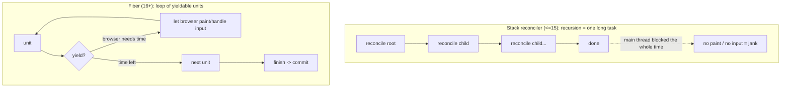
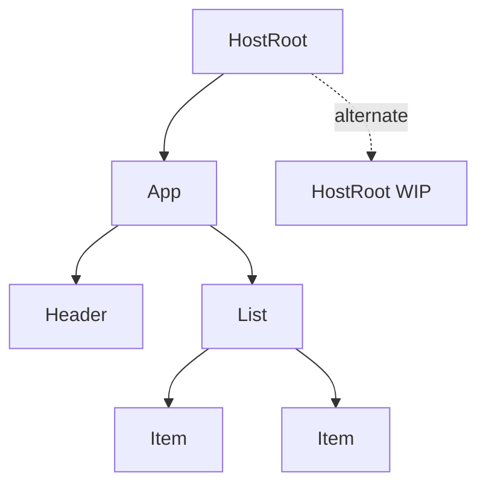
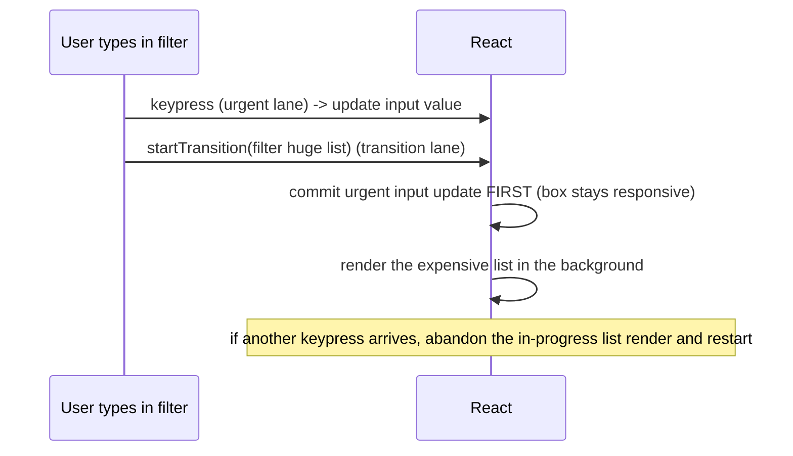

## Problem

You work on a CRM dashboard with a table of 10,000 contacts. User types in the search box. Each keystroke filters the list. Before React 16, this update triggers a full recursive reconciliation of the entire component tree. React walks every node, compares every element, produces a diff. During this time the main thread is busy. The browser cannot paint the input cursor moving. It cannot process the next keystroke. The user feels jank.

This is not a performance bug. It is an architectural limit. A recursive tree walk cannot be paused. Its progress lives in the JS call stack. You cannot snapshot the call stack, yield to the browser, and resume later. Once reconciliation starts, it must finish.

## Why Existing Solution Failed

The stack reconciler (React version 15 and below) used recursive function calls to reconcile the virtual DOM tree. Each call pushed a frame onto the call stack. The recursion walked down to the leaves, then bubbled back up. This worked for small trees but failed at scale.

The limitation is fundamental to recursion. The call stack is a runtime structure you do not control. You cannot pause a recursion midway, save its state, and hand the CPU back to the browser. The event loop needs an empty call stack to process a paint or input event. A long synchronous recursion is a long task. It blocks everything.

Engineers tried workarounds: debouncing, manual virtualization, splitting work with setTimeout. These all required the developer to manage scheduling manually. They were brittle. React needed to own scheduling itself.

## Mental Model

Fiber turns rendering from one un-interruptible recursive function call into a list of small units of work that React can pause, abandon, or resume. A Fiber is a plain JS object, one per element. It is both a node in a linked tree and a unit of work with a priority. The render phase walks these units and can yield to the browser between them. The commit phase applies the result to the DOM in one synchronous, uninterruptible burst.

From this model you derive everything else: why render must be pure (the WIP tree may be thrown away), why there are two trees (double buffering), what lanes are (priority labels on work), and what concurrent features actually buy.

## Visualization

The old approach versus the new approach:



A Fiber node is a plain JS object with these fields:

```
Fiber {
  type        : 'div' | FunctionComponent | ...
  key         : reconciliation identity used by the diff algorithm
  child       : first child Fiber
  sibling     : next sibling Fiber
  return      : parent Fiber (where to go up)
  pendingProps / memoizedProps
  memoizedState : head of the hook linked-list for function components
  lanes       : priority bits for pending work
  alternate   : the twin Fiber in the other tree (current <-> workInProgress)
}
```

The tree is a linked list you can traverse with a pointer. `beginWork` goes down via `child`. `completeWork` goes up and over via `sibling`/`return`. That pointer is the resumable cursor.



Lanes mark each update with a priority. Lower bits = higher priority.



## Engine Simulation

Two trees exist at all times. `current` is what is painted on screen. On an update, React builds `workInProgress` by cloning fibers from `current` and applying changes.

The render loop:

```
workInProgress = root    // start at root fiber

RENDER PHASE (interruptible):
  cursor at App -> beginWork -> produce children -> cursor to Header -> ...
  after each unit:
    if (shouldYield()) {
      // save cursor implicitly: workInProgress module variable holds position
      return to browser
    }
    // next time browser schedules us, restore workInProgress and continue

  ... eventually whole workInProgress tree is built and complete

COMMIT PHASE (synchronous, NOT interruptible):
  1. mutation: apply DOM ops from the diff
  2. swap: root.current = workInProgress
  3. layout effects (useLayoutEffect) run, before paint
  4. browser paints
  5. passive effects (useEffect) flush
```

Memory state during simulation:

- **Stack**: contains the work loop frame. When React yields, this frame pops. The call stack is empty. Browser can paint.
- **Heap**: contains the entire fiber tree. `workInProgress` is a module-level variable on the heap. It survives the yield.
- **Restore**: browser's MessageChannel callback fires. React re-enters the work loop. `workInProgress` is still pointing at the same fiber. Execution resumes.

The two trees exist so that an interrupted, half-built `workInProgress` never touches the screen. The screen always shows the consistent `current` tree until commit flips atomically. This is why a render can be abandoned safely (when a higher-priority update arrives). And why your render function must be pure: React may run it, throw away the WIP tree, and run it again. Side effects in render would fire on work the user never sees.

## Internal Implementation

React implements Fiber as a plain JS object. The work loop is a `while` loop (not recursion):

```
function workLoopSync() {
  while (workInProgress !== null) {
    performUnitOfWork(workInProgress)
  }
}

function workLoopConcurrent() {
  while (workInProgress !== null && !shouldYield()) {
    performUnitOfWork(workInProgress)
  }
}
```

The only difference between sync and concurrent is the `!shouldYield()` guard. That single clause enables interruptible rendering.

`performUnitOfWork` does three things:

```
performUnitOfWork(fiber):
  current = fiber.alternate
  next = beginWork(current, fiber, renderLanes)
  fiber.memoizedProps = fiber.pendingProps
  if next is null:
    completeUnitOfWork(fiber)
  else:
    workInProgress = next
```

`beginWork` is a switch on fiber tag. For a function component, it calls your function. For a host component (div, span), it processes props. It returns the first child fiber or null.

`completeWork` runs when a fiber has no more children. It walks up via `return` and over via `sibling`. For host components, it creates or updates the real DOM node. It also calls `bubbleProperties` which ORs child flags into the parent. This tells the commit phase which subtrees changed.

Lanes use a 31-bit bitmask. Lower bit = higher priority. Operations are bitwise:

```
mergeLanes(a, b) = a | b
getHighestPriorityLane(lanes) = lanes & -lanes
isSubsetOfLanes(set, subset) = (set & subset) === subset
```

Concrete lane values (approximate):

- SyncLane: bit 1 (urgent input, click, keypress)
- InputContinuousLane: bit 3 (continuous input like scroll)
- DefaultLane: bit 5 (normal state updates)
- TransitionLanes: bits 9-22 (useTransition, Suspense)
- IdleLane: bit 28 (background work)

Priority starvation is prevented by `markStarvedLanesAsExpired`. Transition lanes that wait too long get promoted to sync priority.

The scheduler uses `MessageChannel` to yield to the browser, not `requestIdleCallback` or `setTimeout`. `setTimeout` has a 4ms minimum clamp. `requestIdleCallback` has low browser support. `MessageChannel.postMessage` schedules a macrotask immediately. When the callback fires, React records the start time, runs work in the concurrent loop, and checks `shouldYield()` after each unit. Yielding happens when approximately 5ms have elapsed (configurable via `forceFrameRate`).

When a higher-priority update arrives mid-render:

```
ensureRootIsScheduled(root, newLanes)
  prepareFreshStack(root, newLanes)
    // Discards in-progress WIP tree
    // Clones fresh WIP from root.current
    // Restarts render from root
```

React does not resume the abandoned render. It throws the WIP tree away and rebuilds from scratch. This is why render functions must be idempotent. They may run, be discarded, and run again with zero side effects.

## Real World Example

A CRM sales dashboard displays a table of 10,000 leads. Each row has 15 columns. The user types a company name into the search filter.

Without Fiber: each keystroke triggers a full reconciliation. React walks 10,000 rows recursively. The main thread is blocked for 60ms. The search input feels heavy. Characters appear late. The user perceives the app as sluggish.

With Fiber + `startTransition`:

```
function SearchFilter() {
  const [query, setQuery] = useState('')
  const [isPending, startTransition] = useTransition()

  function handleChange(e) {
    // urgent: update input value immediately
    setQuery(e.target.value)

    // non-urgent: filter the table at low priority
    startTransition(() => {
      setFilterText(e.target.value)
    })
  }

  return (
    <>
      <input onChange={handleChange} />
      {isPending && <Spinner />}
      <LeadTable filter={filterText} />
    </>
  )
}
```

The input state update gets a SyncLane (highest priority). The filter update gets a TransitionLane (low priority). React commits the input change first. The input stays responsive. The table re-render runs in background slices. If the user types another character, React abandons the in-progress table render and starts over with the new query. The user never sees stale intermediate results.

This pattern works for search, tab switching, navigation, and any expensive render that should not block user input.

## Tradeoffs

**Advantages:**
- Responsive UI during large renders. Input and paint are never blocked.
- Priority-based scheduling. Urgent updates preempt non-urgent ones.
- Concurrent features unlocked: Suspense, transitions, offscreen rendering.
- Abandonable renders. Work can be thrown away if obsolete.

**Disadvantages:**
- Memory: two full tree copies instead of one. Each fiber is a JS object with many fields. Larger apps see noticeable memory overhead.
- CPU overhead: linked list traversal is slower than array iteration. The work loop checks shouldYield after every unit.
- Complexity: the reconciler is significantly more code. Harder to debug. Stack traces for re-render issues are harder to read.
- Developer experience: render functions must be pure. Side effects in render cause hard-to-find bugs. StrictMode double-invokes in dev to expose this, but developers find it surprising.
- Learning curve: fiber architecture, lanes, render/commit phases, and concurrent mode are concepts developers must understand to avoid pitfalls.

## Common Mistakes

**"Fiber is the virtual DOM."**
The element tree ({type, props}) is the VDOM description. Fibers are the persistent work and instance nodes that perform reconciliation. They serve different purposes. Fibers exist across renders. Element objects are created fresh every render.

**Side effects in render, assuming it runs once.**
React may run your component, discard the result, and re-run it. This happens when a higher-priority update interrupts a render, or in StrictMode's dev double-invoke. Side effects in render (subscribing to a store, starting a fetch, mutating a ref) fire for renders the user never sees. Effects belong in commit-phase hooks like useEffect.

**Thinking commit is interruptible.**
The commit phase is synchronous and uninterruptible. That is why React keeps commit work minimal. DOM mutations, layout effects, and passive effects all run in one shot. The user never sees a half-applied tree.

**Believing useTransition makes things faster.**
It does not make render faster. It makes render interruptible and lower priority. Total CPU work may be equal or more because React may restart the render. The benefit is perceived responsiveness. Urgent input gets priority while expensive renders run in the background.

## SDE-2 Interview Answer

**"Why did React introduce Fiber?"**

*Mid-level answer:*
"React introduced Fiber to solve the jank problem. Before Fiber, reconciliation was a recursive walk that blocked the main thread. If you had a large component tree, the browser would freeze during updates. Fiber breaks the work into small units that can be paused and resumed. This lets the browser handle user input and paint between units of work. The result is a smoother user experience."

*Senior answer:*
"The fundamental problem was that the old stack reconciler used recursion, which lives on the JS call stack. You cannot pause a recursive call midway, save its state, and resume later. Fiber moves rendering state from the call stack into a data structure, a linked list of fiber nodes. Each fiber stores child, sibling, and return pointers, so React can walk the tree iteratively. This makes render interruptible.

The render phase becomes a cooperative loop: do a unit of work, check if the browser needs time, yield if necessary, resume later. The commit phase stays synchronous and atomic. This architecture enables React to schedule work by priority. Urgent updates (clicks, typing) preempt non-urgent ones (transition renders). The result is not faster render, but better perceived responsiveness.

From this single architectural change, React got concurrent rendering, Suspense, useTransition, useDeferredValue, and automatic batching. Fiber is not about speed. It is about scheduling."

*Engineering Lead answer:*
"The decision to rewrite the reconciler was about scheduling, not about raw speed. Pre-Fiber, each render pass was an all-or-nothing synchronous recursion. This violated a fundamental constraint of the browser's event-driven model: long tasks block painting and input processing.

Fiber reframes rendering as a cooperative scheduling problem. Each fiber node is a unit of work with a priority lane. React owns the scheduling loop entirely. It yields control to the browser via the MessageChannel API after approximately 5ms slices. The key insight is that rendering must be pausable and abortable. This purity constraint cascades through the entire API: render functions must be idempotent, effect cleanup is explicit, and hooks replaced class lifecycles because lifecycles assumed a single committed render.

The double buffering pattern (current tree vs workInProgress tree) guarantees the user never sees inconsistent state. A higher-priority update mid-render causes React to discard the WIP tree and rebuild from scratch. This is safe because the current tree is still on screen.

From a team perspective, the linked list structure is easier to test and reason about than recursive trees. The migration was painful, but it unlocked concurrent features and positioned React for the next five years. The cost was significant: more memory, more code complexity, and a steeper learning curve for developers. But the benefit, predictable jank-free rendering at scale, is worth it."

## Follow-up Questions

**Q1: Draw the fiber tree for `<App><Header/><List><Item/></List></App>`. Label child, sibling, return, and alternate.**

The tree has five fibers. App has child = Header. Header has sibling = List, return = App. List has child = Item, return = App. Item has return = List. The alternate pointer connects each fiber to its twin in the other tree (current paired with workInProgress). Header has no children so its child is null. Item has no children or siblings so both are null.

**Q2: Explain how React resumes a render after yielding. Where is the cursor stored? Why could the old reconciler not do this?**

React stores the cursor in a module-level variable called `workInProgress`. After yielding, the browser schedules a callback via MessageChannel. That callback re-enters the work loop, which reads `workInProgress` and continues from where it left off. The old stack reconciler could not do this because its progress lived in the JS call stack as recursive frames. You cannot save and restore the call stack programmatically. Fiber moved progress into a heap-allocated data structure that survives across tasks.

**Q3: Why does double buffering make abandoning a render safe? Walk through what happens if a higher priority update arrives mid-render.**

The current tree is painted on screen. The workInProgress tree is built in memory. If a higher-priority update arrives, React calls `prepareFreshStack`, which discards the in-progress WIP tree and creates a new WIP tree from root.current. The screen never flickers or shows partial state because the current tree was never modified. The WIP tree is just memory that gets garbage collected. After the high-priority render commits, the new tree becomes current. This is safe because render is pure and the WIP tree is invisible to the user.

**Q4: What is a lane? Walk through a typing-while-filtering example with startTransition. What lane does each update get? How does preemption work?**

A lane is a 31-bit priority label for pending work. Lower bit index = higher priority. In the typing example: the input value update (from onChange) gets a SyncLane (bit 1). The startTransition callback gets a TransitionLane (bit 9-22 range). React schedules both. The SyncLane render runs first, commits the input change. Then the TransitionLane render starts in the background. If the user types another character during the transition render, React checks lanes: the new SyncLane is higher than the in-progress TransitionLane. It abandons the transition render, discards the WIP tree, and starts a new render with the latest state.

**Q5: Render phase vs commit phase: which is interruptible, where do useLayoutEffect and useEffect fire, and why? What happens if a useEffect triggers a state update during commit?**

The render phase is interruptible and pure. The commit phase is synchronous and uninterruptible. `useLayoutEffect` fires synchronously after DOM mutation but before the browser paints (step 3 in commit). `useEffect` fires after paint (step 5 in commit). The order exists because layout effects may need to read DOM geometry before the browser paints. If a useEffect fires a state update during commit, React schedules a new render synchronously. This is called a flush sync and is processed after the current commit finishes. It is the mechanism behind patterns like `useEffect(() => setState(...), [])` for derived state, though it is generally discouraged because it causes an extra render.

## Mental Trigger

Fiber = pausable linked-list render.

## One Page Revision

- Pre-Fiber: synchronous recursive tree walk. Cannot pause. Blocks main thread. Jank.
- Fiber solution: linked list of work units. Each fiber = JS object with child/sibling/return links.
- Work loop: `while(workInProgress && !shouldYield()) { performUnitOfWork() }`
- Render phase: interruptible, pure, builds WIP tree. Can be abandoned.
- Commit phase: synchronous, applies DOM, flips `root.current = workInProgress`.
- Two trees: current (painted) and workInProgress (being built). Double buffering.
- Lanes: 31-bit priority mask. Lower bit = higher priority. SyncLane > TransitionLanes.
- useTransition/startTransition: marks update with transition lane. Lower priority than input.
- useDeferredValue: trailing version of a value at low priority.
- Scheduler: MessageChannel for macrotask scheduling. ~5ms yield interval.
- Higher priority interrupt: discards WIP tree, restarts from root. Render must be pure.
- Memory: two full tree copies. More objects but enables scheduling.
- Key tradeoff: more total work possible, but perceived responsiveness improves.
- Common mistake: Fiber = VDOM. Wrong. VDOM is element tree. Fiber is work instance.
- Render purity is a consequence of abortable renders, not an arbitrary rule.
