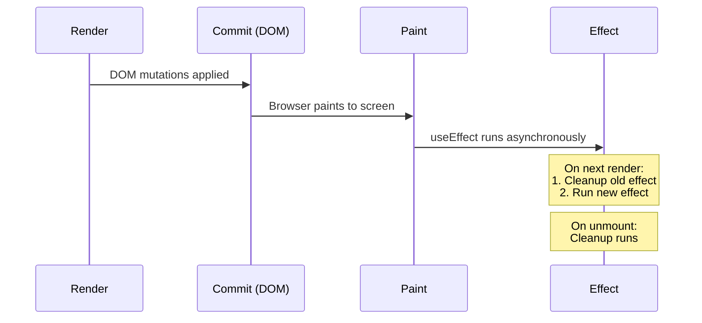
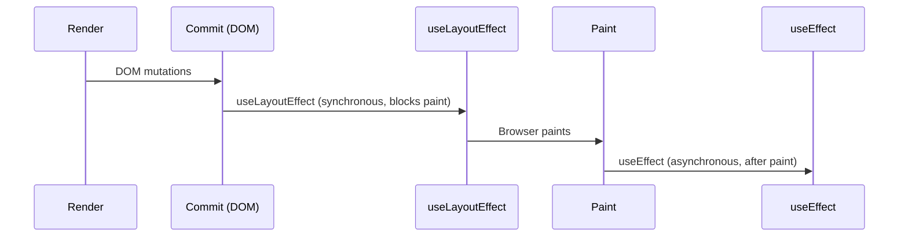

## The Problem

You write a `setInterval` inside `useEffect`. The count should tick every second, but it just logs `0` forever. Or you add a conditional hook and suddenly your state is scrambled. These aren't React bugs. They're direct consequences of one design choice: React matches hooks by **call order**.

Every component render is a fresh function call. Local variables die when the function returns. So where does React stash your `useState` values? Outside the function, on the Fiber. React can't see your variable names — it only sees you called `useState` three times, in that order. Slot 0, slot 1, slot 2. No names. Just position.

This one decision — match by position — is why hooks can't live inside `if` statements, loops, or after early returns. If you skip a hook conditionally, slot indices shift. Slot 1 of render 2 reads what was slot 2 of render 1. State corrupted.

## The One Insight

**A hook is a numbered slot on the Fiber's pegboard, and every render walks the pegboard in the same order to grab its values.**

Each render is a fresh function call. New local variables. New closures. But the pegboard persists. When React calls your component again, it starts at peg 0, grabs the value, moves to peg 1, and so on. A function defined during that render — an effect callback, an event handler — closes over the values it read *this render*. It doesn't know about later renders. It's frozen in time.

That's a stale closure. Not a bug. An unavoidable consequence of how JavaScript closures work.

## The Model in 15 Lines

```js
let slots = [];        // lives on the Fiber in real React
let cursor = 0;

function useState(initial) {
  const i = cursor;
  slots[i] = slots[i] ?? initial;
  const setState = (next) => {
    slots[i] = typeof next === "function" ? next(slots[i]) : next;
    scheduleRender();
  };
  cursor++;
  return [slots[i], setState];
}

function renderComponent() {
  cursor = 0;           // reset cursor each render
  return Component();   // hooks consume slots 0,1,2... in order
}
```

`cursor` resets to 0 at the start of each render. First `useState` grabs index 0. Second grabs index 1. Each slot persists because `slots` lives outside the function. When `setState` fires, it writes to the slot and triggers a new render.

The bug a conditional hook causes:

```
render #1: useState A (slot0), if(cond) useState B (slot1), useState C (slot2)
render #2: cond=false -> useState A (slot0), useState C (slot1) <- C reads B's old slot!
```

## The Real Implementation

The "slots array" is a singly linked list on `fiber.memoizedState`:

```js
type Hook = {
  memoizedState: any,        // committed value
  baseState: any,            // state before priority-skipped updates
  baseQueue: Update | null,  // skipped updates from lane priority
  queue: any,                // UpdateQueue or effect payload
  next: Hook | null,         // next hook
};
```

React swaps the entire dispatcher before calling your component:

```js
ReactSharedInternals.H =
  current === null
    ? HooksDispatcherOnMount     // useState -> mountState
    : HooksDispatcherOnUpdate;   // useState -> updateState
```

On mount: allocates a fresh Hook and appends it in call order. On update: walks the previous render's hook list via `currentHook.next`, cloning each. This traversal is strictly positional. That's the mechanical reason for the Rules of Hooks.

**Eager-state bailout:** If the queue is empty when you call the setter, React computes the next state right there. If `Object.is(eagerState, currentState)`, it skips scheduling a re-render entirely.

## The Stale Closure Bug

```js
function Timer() {
  const [count, setCount] = useState(0);

  useEffect(() => {
    const id = setInterval(() => {
      console.log(count);      // always logs 0
    }, 1000);
    return () => clearInterval(id);
  }, []);                      // empty deps, effect runs once

  return <button onClick={() => setCount(count + 1)}>{count}</button>;
}
```

The effect ran during render 1. The arrow function is a closure born in render 1. It captured render 1's `count` cell = `0`. `setCount` makes new renders with new `count` cells. But the interval still holds the first closure. It logs `0` forever.

Three fixes:

1. **Functional updater:** `setInterval(() => setCount(c => c + 1), 1000)` — bypasses the stale closure entirely. React feeds the latest `c` from the slot.

2. **Honest deps:** Add `[count]` to deps. Effect re-runs on every count change with a fresh closure. Correct but re-creates the interval each tick.

3. **Ref escape hatch:** Store count in a `useRef`, update `ref.current` each render, read it inside the interval. The ref is the same object every render. No re-subscription needed.

## Batching — Why setState Is Not Synchronous

You write this:

```js
function handleClick() {
  setCount(1);
  setFlag(true);
  setName("Alice");
}
```

Three state updates, one click handler. How many re-renders? One. React **batches** them.

### The Mental Model

Batching is a flush, not a frequency. React collects all state updates triggered during a single event handler (or effect, or timeout), then flushes them in one render. The state you read immediately after `setState` is still the old value. State is stale until the next render.

```text
handleClick()
  ├─ setCount(1)     → update queued
  ├─ setFlag(true)    → update queued
  ├─ setName("Alice") → update queued
  └─ function returns
       ↓
  React flushes all queued updates in one render
       ↓
  Component re-renders once with count=1, flag=true, name="Alice"
```

### What Changed in React 18

Before React 18, batching only happened inside React event handlers. Inside `setTimeout`, `Promise`, or native event handlers, each `setState` triggered a separate re-render:

```js
// React 17: 3 separate re-renders
setTimeout(() => {
  setCount(1);   // re-render #1
  setFlag(true);  // re-render #2
  setName("Alice"); // re-render #3
}, 1000);

// React 18: 1 re-render (automatic batching)
setTimeout(() => {
  setCount(1);   // queued
  setFlag(true);  // queued
  setName("Alice"); // queued
}, 1000);
```

React 18 introduced **automatic batching** via `createRoot`. Every update — inside events, timeouts, promises, native handlers — is batched by default. The mechanism: React wraps each batch in `batchedUpdates(fn)`, which marks the batch as active. Any `setState` call during that window adds to the queue instead of triggering an immediate render.

### Opting Out: `flushSync`

If you need synchronous rendering (rare — e.g., measuring DOM after state change), use `flushSync`:

```js
import { flushSync } from "react-dom";

function handleClick() {
  flushSync(() => setCount(1));  // renders immediately
  // DOM is updated here
  flushSync(() => setFlag(true)); // renders again
}
```

### Interview Answer

"React batches state updates to avoid unnecessary re-renders. Before React 18, batching only worked inside React event handlers. React 18 extended automatic batching to all contexts — timeouts, promises, native handlers — using `flushSync` to opt out when you need synchronous rendering."

## useEffect Deep Dive — Two Phases, Not One

The stale closure section showed *what* goes wrong. This section explains *when* and *why* — the exact lifecycle of `useEffect`.

### The Lifecycle



The sequence: render → commit → paint → **cleanup old** → **run new**. Cleanup and run happen *after* paint, asynchronously. This is why `useEffect` doesn't block the browser from showing the updated UI.

### Strict Mode Double-Invoke

In development with `<StrictMode>`, React mounts → unmounts → remounts every component. This means `useEffect` fires, its cleanup runs, then it fires again:

```text
mount → effect runs → cleanup runs → effect runs again
```

This is intentional. It surfaces missing cleanups — if your effect subscribes to something but doesn't clean up, the double-invoke exposes the leak. In production, effects fire once on mount.

```js
useEffect(() => {
  const subscription = api.subscribe(handler);
  return () => subscription.unsubscribe(); // Strict Mode tests this
}, []);
```

### Dependency Array Internals

React stores the previous deps array in the hook slot. On re-render, it compares each element using `Object.is`:

```js
// React's internal check (simplified)
function updateEffect(fiber, hook, deps) {
  const prevDeps = hook.memoizedState; // stored from last render
  if (prevDeps !== null) {
    const allEqual = deps.every((dep, i) => Object.is(dep, prevDeps[i]));
    if (allEqual) return; // skip — nothing changed
  }
  // cleanup old, run new
}
```

`Object.is` treats `NaN` as equal to `NaN` (unlike `===`), and distinguishes `+0` from `-0`. Objects and arrays are compared by reference, not value — so `{a: 1}` in deps creates a new reference every render unless you `useMemo` it.

The ESLint `exhaustive-deps` rule exists because a missing dep means React thinks "nothing changed" when something did. The effect runs with stale values.

### Race Conditions in Async Effects

This is the most common senior interview gotcha with `useEffect`:

```js
useEffect(() => {
  let result = null;

  fetch(`/api/search?q=${query}`)
    .then(res => res.json())
    .then(data => { result = data; setSearchResults(data); });

  return () => { result = null; }; // cleanup doesn't cancel the fetch
}, [query]);
```

If the user types "react" then "react hooks" quickly, the first fetch may resolve *after* the second. Search results show "react" data, not "react hooks" data. The stale fetch overwrites the newer one.

**Fix 1 — AbortController:**

```js
useEffect(() => {
  const controller = new AbortController();

  fetch(`/api/search?q=${query}`, { signal: controller.signal })
    .then(res => res.json())
    .then(data => setSearchResults(data))
    .catch(err => {
      if (err.name !== "AbortError") throw err;
    });

  return () => controller.abort();
}, [query]);
```

**Fix 2 — Ignore flag:**

```js
useEffect(() => {
  let ignore = false;

  fetch(`/api/search?q=${query}`)
    .then(res => res.json())
    .then(data => { if (!ignore) setSearchResults(data); });

  return () => { ignore = true; };
}, [query]);
```

Both patterns ensure only the latest request writes to state. AbortController is preferred because it actually cancels the network request; the ignore flag just discards the result.

### Interview Answer

"Effects run after paint, not synchronously. Cleanup runs before the next effect, not immediately on unmount. Strict Mode double-invokes effects in dev to catch missing cleanups. For async effects, always use AbortController or an ignore flag to prevent race conditions — a stale fetch overwriting a newer one is the most common bug."

## useMemo vs useCallback — When Identity Stability Matters

These two hooks are often confused. The relationship is simple:

```js
useCallback(fn, deps)  ≡  useMemo(() => fn, deps)
```

`useCallback` returns a memoized *function*. `useMemo` returns a memoized *value*. Both store the previous result in their hook slot and skip re-computation when deps are equal.

### When It Matters

**1. Preventing child re-renders.** If you pass a callback to a `React.memo` child, a new function reference on every render defeats the memo:

```js
// Without useCallback: child re-renders every time (new function ref)
const handleClick = () => setCount(c => c + 1);
return <ExpensiveChild onClick={handleClick} />;

// With useCallback: child skips re-render (stable ref)
const handleClick = useCallback(() => setCount(c => c + 1), []);
return <ExpensiveChild onClick={handleClick} />;
```

**2. Stable dependency for other hooks.** If a function is a dependency of `useEffect` or another `useMemo`, a new reference each render causes unnecessary re-runs:

```js
const fetchData = useCallback(async () => {
  const res = await fetch(url);
  return res.json();
}, [url]);

useEffect(() => {
  fetchData().then(setData);
}, [fetchData]); // stable — only re-runs when url changes
```

**3. Expensive computation.** `useMemo` avoids recomputing costly derivations:

```js
const sortedItems = useMemo(
  () => items.slice().sort((a, b) => a.name.localeCompare(b.name)),
  [items]
);
```

### When It's Noise

- No `React.memo` child receiving the function
- No downstream dependency
- The computation is cheap (string concatenation, simple arithmetic)
- The cost of memoization (cache check + GC pressure) exceeds the work saved

The rule: **memoize to prevent work, not to prevent reference changes for their own sake.** If changing a reference doesn't cause anyone to do extra work, the memo is wasted.

### Interview Answer

"`useCallback` memoizes a function reference, `useMemo` memoizes a value. They're useful when identity stability prevents downstream work — passing to `React.memo` children, or as stable dependencies for other hooks. They're unnecessary when no downstream consumer cares about reference equality."

## useReducer vs When State Logic Gets Complex

`useState` is a slot with a setter. `useReducer` is a slot with a dispatcher. The difference is *how* updates are computed.

```js
// useState: update is the value itself
setCount(5);
setCount(prev => prev + 1);

// useReducer: update is an action dispatched to a reducer
dispatch({ type: "increment" });
```

### When useReducer Wins

**Multiple sub-values that update together.** A form with `name`, `email`, `errors`, `isSubmitting` — updating them individually with `useState` creates race conditions. A reducer atomically transitions the whole state:

```js
const [state, dispatch] = useReducer(formReducer, initialState);

// One action updates multiple fields atomically
dispatch({ type: "submit_start" });
// { name, email, errors unchanged, isSubmitting: true }
```

**Next state depends on previous state.** The reducer receives `state` as an argument, making the transition explicit and testable:

```js
function reducer(state, action) {
  switch (action.type) {
    case "increment": return { count: state.count + 1 };
    case "decrement": return { count: state.count - 1 };
    default: return state;
  }
}
```

**Complex transition logic.** Multi-step forms, state machines, undo/redo — reducers make the transition logic visible and debuggable. React DevTools shows each action dispatched.

### When useState Is Simpler

Single value. Independent updates. No transition logic. The reducer overhead isn't worth it for a boolean toggle or a counter.

### The Shared Mechanism

Both `useState` and `useReducer` use the same hook slot on the Fiber. The difference is purely ergonomic — `useReducer` gives you a function to compute the next state, `useState` gives you a setter. Under the hood, `useState` is a special case of `useReducer` with a built-in identity reducer (`(state, action) => action`).

### Interview Answer

"`useReducer` when multiple state values update together, the next state depends on the previous state, or the transition logic is complex enough to benefit from being a pure function. `useState` for simple, independent values. Both use the same hook mechanism — the reducer is just a function that computes the next state."

## useLayoutEffect vs useEffect — Timing Matters

Both fire after render and commit. The difference is *when* relative to paint.



`useLayoutEffect` fires synchronously after DOM mutations but **before** the browser paints. `useEffect` fires asynchronously **after** paint.

### When useLayoutEffect

**Measuring DOM elements.** If you need to measure a tooltip's position and adjust it before the user sees it, `useLayoutEffect` prevents a single-frame flicker:

```js
useLayoutEffect(() => {
  const rect = tooltipRef.current.getBoundingClientRect();
  setPosition({ top: rect.top - 8, left: rect.left });
}, []);
```

**Scroll restoration.** Restoring scroll position after navigation must happen before paint to avoid a visible jump.

**Avoiding FOUC (Flash of Unstyled Content).** When injecting CSS-in-JS at runtime, `useInsertionEffect` (React 18) or `useLayoutEffect` ensures styles are applied before paint.

### Performance Caveat

`useLayoutEffect` blocks paint. If your effect is slow, the user sees a blank frame. If you can tolerate a single-frame flicker, use `useEffect` instead.

### SSR Note

`useLayoutEffect` warns during server-side rendering because there's no DOM to measure. For non-DOM cases, use `useEffect`. For CSS-in-JS, use `useInsertionEffect` (React 18+), which fires even earlier — before layout effects.

### Interview Answer

"`useLayoutEffect` fires synchronously after DOM mutations but before paint — use it when you need to measure or mutate the DOM without a visual flicker. `useEffect` fires after paint — use it for everything else. `useLayoutEffect` blocks the browser from painting, so use it sparingly."

## Custom Hooks — Composition Without Inheritance

Custom hooks extract stateful logic into reusable functions. They're the primary mechanism for sharing behavior between components.

### The Naming Rule

A function is a hook only if its name starts with `use`. This is how React enforces the Rules of Hooks — the linter checks that `use*` functions follow positional rules.

### Extraction Pattern

Extract into a custom hook when:

1. **Two components share the same stateful logic.** Both components manage a debounced value, a media query, or an intersection observer — extract the logic.
2. **A component's effect logic is complex.** If a component has multiple related effects (subscribe + cleanup + resize handler), extract them into a hook that encapsulates the lifecycle.

```js
function useDebounce(value, delay) {
  const [debouncedValue, setDebouncedValue] = useState(value);

  useEffect(() => {
    const timer = setTimeout(() => setDebouncedValue(value), delay);
    return () => clearTimeout(timer);
  }, [value, delay]);

  return debouncedValue;
}
```

### Composition

Custom hooks call other hooks. The pegboard is shared — every hook in the call stack reads from the same Fiber slots. A custom hook doesn't "own" state; it reads and writes to the slots it claims via `useState` or `useReducer`.

```js
function useSearch(query) {
  const debouncedQuery = useDebounce(query, 300); // hook calls hook
  const { data, isLoading } = useQuery({
    queryKey: ["search", debouncedQuery],
    queryFn: () => fetchSearch(debouncedQuery),
  });
  return { results: data, isLoading };
}
```

### Testing Custom Hooks

Use `renderHook` from `@testing-library/react`:

```js
import { renderHook, act } from "@testing-library/react";

test("useCounter increments", () => {
  const { result } = renderHook(() => useCounter(0));

  act(() => result.current.increment());
  expect(result.current.count).toBe(1);
});
```

Test the hook's *return values*, not its internal implementation. The hook is a black box: inputs in, values out.

### Interview Answer

"Custom hooks extract stateful logic into reusable functions. They must start with `use` so the linter enforces the Rules of Hooks. A hook can call other hooks — they share the same Fiber pegboard. Extract when two components share the same lifecycle logic, or when a component's effects are complex. Test with `renderHook`."

## React 18+ Hooks — Concurrent Rendering Changes Everything

React 18 introduced concurrent rendering — the ability to interrupt, pause, and resume renders. These hooks give you control over that behavior.

### useTransition — Mark Updates as Non-Urgent

```js
const [isPending, startTransition] = useTransition();

function handleTabChange(tab) {
  startTransition(() => {
    setActiveTab(tab); // non-urgent — can be interrupted
  });
}
```

Without `startTransition`, switching tabs renders the new tab synchronously — the old UI disappears immediately, and the user sees a jank frame while the new tab renders. With `startTransition`, React keeps the old UI visible while preparing the new one in the background. The update can be interrupted by urgent updates (typing, clicking).

`isPending` tells you whether the transition is still in progress — use it to show a loading indicator.

**Use for:** tab switches, filtered lists, any update that doesn't need to be instant.

### useDeferredValue — Stale-While-Revalidate for Values

```js
const [query, setQuery] = useState("");
const deferredQuery = useDeferredValue(query);
```

`deferredQuery` lags behind `query`. While the user is typing, `deferredQuery` holds the previous value — the expensive filtered list renders with stale data. When the user pauses, `deferredQuery` catches up.

The difference from `useTransition`: `startTransition` wraps a *state update*. `useDeferredValue` wraps a *value*. Use `useDeferredValue` when you can't control the state update (e.g., a value coming from props or a third-party library).

**Use for:** search input → heavy filtered results, typeahead suggestions.

### useSyncExternalStore — Subscribe to External Stores

```js
const count = useSyncExternalStore(
  (callback) => store.subscribe(callback),
  () => store.getState() // client snapshot
);
```

External stores (Redux, Zustand, custom event emitters) aren't managed by React. Without `useSyncExternalStore`, concurrent rendering can cause tearing — different components reading different store versions during an interrupted render. This hook guarantees all components read the same snapshot during a single render.

Before this hook, the `useEffect` + `useState` pattern for external stores broke in concurrent mode because the subscription and state read could happen at different times.

### useId — Stable IDs Across Server and Client

```js
const id = useId(); // ":r1:" on client, same on server
```

`useId` generates a stable ID that's consistent between server rendering and client hydration. It avoids the hydration mismatch that happens with `Math.random()` or `counter++`. The ID is scoped to the component — multiple instances get unique IDs.

### Interview Answer

"`useTransition` marks updates as non-urgent so React can interrupt them for urgent input. `useDeferredValue` creates a stale copy of a value that lags behind the current one — useful for heavy computations. `useSyncExternalStore` safely subscribes to external stores in concurrent mode. `useId` generates hydration-safe IDs."

## Infinite Re-render Loops — The Cycle of Doom

A component re-renders, the render triggers a state update, the update triggers another render, forever.

### Common Causes

**1. `setState` in `useEffect` without proper deps:**

```js
// BAD: objects create new references every render → effect always runs → setState → re-render → loop
useEffect(() => {
  setData({ derived: value }); // new object every time
}, [data]); // data changed → effect runs → creates new data → loop
```

**Fix:** Compute during render. Effects are for side effects, not derivations:

```js
const data = useMemo(() => ({ derived: value }), [value]);
```

**2. Objects/arrays in deps:**

```js
// BAD: new object every render
useEffect(() => {
  fetchData(options);
}, [options]); // { page: 1 } !== { page: 1 } by reference
```

**Fix:** Destructure deps to primitives, or `useMemo` the options object.

**3. `setState` inside event handler that creates a new object reference:**

```js
// BAD: spread creates new array → state changed → re-render
setItems([...items, newItem]); // this is fine if items is state
// BAD: but if this triggers a re-render that re-creates items...
```

### Detection

React DevTools Profiler: look for continuous re-renders with no user interaction. The component's render count climbs indefinitely. The flame chart shows the same component rendering repeatedly with identical props.

### Prevention

- Compute derived values during render (not in effects)
- Use `useMemo` for objects/arrays in dependency arrays
- Use `useRef` for mutable values that shouldn't trigger renders
- Destructure to primitives in deps

### Interview Answer

"Infinite loops happen when a render triggers a state update that triggers another render. Most common cause: `setState` in `useEffect` with deps that change every render (objects, arrays). Fix: compute during render instead of in effects, or stabilize deps with `useMemo`."

## Common Mistakes

- **Hooks in conditionals, loops, or after early return.** Breaks positional matching.
- **Lying in the deps array.** Omitting a value to "run once" doesn't run once. It runs with a stale closure.
- **Putting non-reactive mutable state in `useState`.** Use `useRef` instead.
- **Expecting `ref.current` changes to re-render.** They don't. That's the point.
- **`useCallback`/`useMemo` everywhere.** They have a cost. Only worth it when identity stability prevents actual work.
- **`useEffect` without cleanup for subscriptions/timers.** Memory leaks and stale callbacks accumulate.
- **Using `useEffect` to compute derived state.** Compute during render instead. Effects are for side effects, not calculations.
- **Calling `setState` in `useLayoutEffect` without understanding the timing.** Can cause layout thrashing — the browser measures, you mutate, it measures again.
- **Overusing `useRef` for state.** If you need re-renders, use `useState`. Refs are for values that survive renders but shouldn't trigger them.

## Mental Trigger

**Ordered slots plus closure snapshot explain every hook behavior and gotcha.**

## Q&A

**Q: Show the slot misalignment a conditional hook causes.**
Render 1 with `hasFeature=true`: hooks run as slots 0, 1, 2. `a` reads slot 0, `b` reads slot 1, `c` reads slot 2. Render 2 with `hasFeature=false`: conditional hook skipped. `a` reads slot 0 (correct), but `c` reads slot 1 (which was `b`'s slot). `c` shows `b`'s value. State corrupted.

**Q: Given the stale interval bug, when would you pick each fix?**
Functional updater when you only need to update state based on previous value. Honest deps when the effect logically depends on the value and re-subscription cost is acceptable. Ref for intervals, timers, or long-lived subscriptions where you need the latest value without re-subscribing.

**Q: What does the deps array do internally for useEffect vs useMemo?**
Both store previous deps in their hook slot. On re-render, React compares each element using `Object.is`. If all equal, useMemo returns the cached value, useEffect skips running. A wrong deps array tells React "nothing changed" when something did — the effect runs with stale values.

**Q: Why doesn't mutating `ref.current` re-render?**
`useRef` returns the same object every render. `ref.current` is a plain property assignment on a JS object. React has no mechanism to detect it. No update enqueued, no re-render triggered. Use refs for values that survive renders but shouldn't cause re-renders (interval IDs, DOM nodes, timers).

**Q: React batches my setState calls. Why doesn't state update immediately after each call?**
React batches updates to avoid unnecessary re-renders. Inside a single event handler, multiple `setState` calls are collected and flushed in one render. State is stale until the next render — reading it immediately after `setState` gives the old value. React 18 extended automatic batching to all contexts (timeouts, promises, native handlers).

**Q: Your fetch effect fires twice on mount. Is it a bug?**
Not in development with StrictMode. React double-invokes effects to surface missing cleanups. The second invocation is intentional — it verifies your cleanup function works. In production, effects fire once. If you need to detect mount, use a `useRef` flag or ignore the first effect call.

**Q: When would you use useTransition vs useDeferredValue?**
`useTransition` wraps a state update — you control the `setState` call inside `startTransition`. `useDeferredValue` wraps a value — use it when you can't control the state update (props, third-party state). Both keep old UI visible while new UI prepares, but `useTransition` gives you an `isPending` flag while `useDeferredValue` gives you a lagging value.

**Q: How do you test a custom hook?**
Use `renderHook` from `@testing-library/react`. It mounts the hook in a test component and exposes `result.current` for assertions. Use `act` to trigger state changes. Test the hook's return values and side effects, not its internal implementation.
