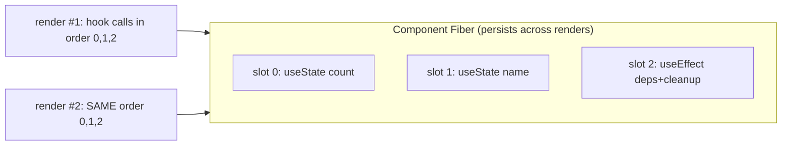

## Problem

Why can hook state not just be normal variables in your function? Because the function returns and its local frame is destroyed. Each render calls the component from scratch. Variables vanish.

State must live outside the call, on something persistent. React uses the Fiber (Ch 04). But then React needs to know which `useState` call maps to which stored slot. It has no variable names. Function calls have no names. The cheapest reliable key is call order.

This single design choice, map by order, forces every hook rule. If you put a hook inside `if`, call order changes between renders. Slot 1 of render 2 lines up with slot 2 of render 1. State cross-wires. That is why hooks cannot go in conditionals, loops, or after early returns. Not an arbitrary rule. A direct result of positional matching.

## Why Existing Solution Failed

Before hooks, React had class components. State lived on `this.state`. Side effects went in lifecycle methods: `componentDidMount`, `componentDidUpdate`, `componentWillUnmount`. Logic reuse required Higher-Order Components (HOCs) or render props.

Both approaches created deeply nested wrapper trees. Related logic like event subscription and cleanup was split across multiple lifecycle methods. `this` binding was error-prone. Function components could not use state or effects at all.

Hooks solved all of this. No classes. No `this`. No wrapper hell. Related logic stays together. But hooks introduced two new failure modes: positional matching requires consistent call order, and closure capture freezes a render's values. These are the gotchas you face today.

## Mental Model

A hook is not magic state inside your function. It is a slot in an ordered list that lives on the component's Fiber. On each render React walks that list in the same order and hands you back slot 1, slot 2, slot 3. Your component closes over the values it read this render.

So a hook value is a snapshot of that render. A function defined in this render "remembers" this render's snapshot forever. That is a stale closure.

Key ideas:
- Hooks are ordered slots on the Fiber, matched by call index. No names. Just position.
- Each render is a fresh function call. New local consts. New closures.
- A closure freezes the render it was born in. An effect, handler, or timer callback sees the variables of the render that created it, not "the latest."
- `useRef` returns the same object every render. Mutating `ref.current` does not re-render and is not a snapshot. It is the deliberate hole in the snapshot model.

## Visualization



The Fiber persists across renders. Each render walks the same slot list in order. If call order changes, slots misalign and state corrupts.

## Engine Simulation

This ~15-line model is the whole secret. Build it in your head.

```js
let slots = [];        // lives on the Fiber in real React
let cursor = 0;

function useState(initial) {
  const i = cursor;
  slots[i] = slots[i] ?? initial;
  const setState = (next) => {
    slots[i] = typeof next === "function" ? next(slots[i]) : next;
    scheduleRender();
  };
  cursor++;
  return [slots[i], setState];
}

function renderComponent() {
  cursor = 0;           // reset cursor each render
  return Component();   // hooks consume slots 0,1,2... in order
}
```

What happens internally: `cursor` resets to 0 at the start of each render. The first `useState` captures index 0. The second captures index 1. Each slot persists across renders because `slots` lives outside the function. When you call `setState`, it writes to the slot and triggers a new render. The new render reads the updated slot.

Trace two `useState` calls across two renders:

```
render #1: cursor 0 -> count slot0=0 ; cursor 1 -> name slot1="" ; cursor->2
   user clicks setCount(5): slots[0]=5, scheduleRender
render #2: cursor 0 -> count slot0=5 ; cursor 1 -> name slot1="" ; cursor->2
```

State persists because the slot array lives outside the function. Each render re-reads the same slots.

Now see the bug a conditional hook causes:

```
render #1: useState A (slot0), if(cond) useState B (slot1), useState C (slot2)
render #2: cond=false -> useState A (slot0), useState C (slot1) <- C now reads B's old slot!
```

State corruption exactly as predicted by "matched by position." That is why ESLint's rules-of-hooks exists. Not style. Correctness.

## Internal Implementation

**The real Hook object.** The "slots array" is actually a singly linked list on `fiber.memoizedState`.

```js
type Hook = {
  memoizedState: any,        // committed value
  baseState: any,            // state before priority-skipped updates
  baseQueue: Update | null,  // skipped updates from lane priority
  queue: any,                // UpdateQueue or effect payload
  next: Hook | null,         // next hook
};
```

`baseState` and `baseQueue` exist because of lanes (Ch 04). High-priority updates can jump ahead of lower-priority ones. React must replay from a consistent base later. That is why the real Hook has four fields, not one.

**The dispatcher.** There is no `if (firstRender)` inside `useState`. React swaps the entire dispatcher before calling your component:

```js
ReactSharedInternals.H =
  current === null || current.memoizedState === null
    ? HooksDispatcherOnMount     // useState -> mountState
    : HooksDispatcherOnUpdate;   // useState -> updateState
```

On mount: `mountWorkInProgressHook()` allocates a fresh Hook and appends it in call order. On update: `updateWorkInProgressHook()` walks the previous render's hook list via `currentHook.next`, cloning each. This traversal is strictly positional. That is the mechanical reason for the Rules of Hooks.

**The update queue.** `mountState` builds a queue and binds the setter:

```js
const queue = {
  pending: null,
  lanes: NoLanes,
  dispatch: null,
  lastRenderedReducer: basicStateReducer,
  lastRenderedState: initialState
};
queue.dispatch = dispatchSetState.bind(null, currentlyRenderingFiber, queue);
```

`dispatchSetState` appends an `Update` to `queue.pending` as a circular singly-linked list. On the next render, `updateReducer` walks that ring applying each update to produce new state.

**Eager-state bailout.** If the queue is empty when you call the setter, React computes the next state right there. If `Object.is(eagerState, currentState)`, it skips scheduling a re-render entirely. That is why setting state to the same value is effectively free.

**useMemo and useCallback.** Both store `[value, deps]` in their slot. On re-render React `Object.is`-compares each dep. If all equal, return the cached value (stable identity from Ch 01). Otherwise recompute. The deps array is a cache key.

**useEffect.** Stores the effect function, its deps, and cleanup. After commit, React compares deps. If changed, it runs the previous cleanup then the new effect. Empty deps means the key never changes, so the effect runs once and never re-runs. Wrong deps means the key claims nothing changed when something did, giving you a stale closure.

**useLayoutEffect.** Same mechanism but fires synchronously before paint (Ch 07). Use for measuring DOM or avoiding flicker.

## Real World Example

The classic stale closure bug with `setInterval` and `useState`.

```js
function Timer() {
  const [count, setCount] = useState(0);

  useEffect(() => {
    const id = setInterval(() => {
      console.log(count);      // always logs 0
    }, 1000);
    return () => clearInterval(id);
  }, []);                      // empty deps, effect runs once

  return <button onClick={() => setCount(count + 1)}>{count}</button>;
}
```

What happens internally: The effect ran during render 1. The arrow `() => console.log(count)` is a closure born in render 1. It captured render 1's `count` cell = `0`. Closures capture the cell of that scope (Ch 01). `setCount` makes new renders with new `count` cells. But the interval still holds the first closure. It logs `0` forever.

```
render#1 count=0 -> interval callback closes over count(0)  logs 0,0,0...
render#2 count=1     (new closure exists, but interval still runs the old one)
render#3 count=2
```

Three fixes with different tradeoffs:

1. **Functional updater** avoids reading the captured snapshot: `setInterval(() => setCount(c => c + 1), 1000)`. React feeds the latest `c` from the slot. Best for update-only cases.

2. **Honest deps** re-subscribes with a fresh closure on each `count` change: add `[count]` to the deps array. Correct but re-creates the interval on every tick.

3. **Ref escape hatch** keeps a mutable box the callback reads live: store `count` in `useRef`, update `ref.current` each render, read `ref.current` inside the interval. The ref is the same object every render. No re-subscription needed. But you must sync `ref.current` manually.

## Tradeoffs

**useState vs useReducer.** `useState` is `useReducer` with a built-in reducer. Use `useState` for independent values. Use `useReducer` when state updates depend on each other or the logic is complex enough to extract into a reducer function.

**useMemo / useCallback vs inline.** Both store previous deps and compare each render. Only pay that cost when the cached identity prevents actual work, like skipping a memoized child's render or stabilizing a dep for another hook. Otherwise inline is cheaper.

**Complete deps vs "run once."** Lying about deps to make an effect "run once" does not run once. It runs with a stale closure. If you truly want once, prove the value cannot change, or use a ref. Honest deps re-run the effect but give correct values.

**useRef vs useState for mutable values.** `useRef` does not trigger re-render. `useState` does. Use refs for values that need to survive renders but should not cause re-renders when they change (interval IDs, previous values, DOM nodes). Use state for values that drive the UI.

**useEffect vs useLayoutEffect.** Both run after render. `useEffect` fires asynchronously after paint. `useLayoutEffect` fires synchronously before paint. Use `useLayoutEffect` when you need to measure or mutate the DOM before the user sees it. Use `useEffect` for everything else to avoid blocking paint.

## Common Mistakes

- **Hooks in conditionals, loops, or after early return.** Breaks positional matching.
- **Lying in the deps array.** Omitting a used value to "run once" does not run once. It runs with a stale closure.
- **Putting non-reactive mutable state in `useState`.** Causes needless renders. Use `useRef` instead.
- **Expecting `ref.current` changes to re-render.** They do not. That is the point.
- **`useCallback`/`useMemo` everywhere.** They have a cost (store + compare deps). Only worth it when identity stability prevents actual work.

## SDE-2 Interview Answer (Mid-level + Senior + Engineering Lead variants)

**Mid-level (SDE-1 / junior SDE-2):**

Question: "Why can't hooks go inside an `if` statement?"

"Hooks are matched by call order, not by name. React stores hook state in slots on the Fiber. On each render, it walks the slots in order. If you put a hook in a conditional, the number of hooks changes between renders. Slot indices shift. One hook reads another's state. That is why hooks must run unconditionally at the top level. The rule is a result of the storage design, not an arbitrary style choice."

**Senior (SDE-2 / SDE-3):**

Question: "This interval logs stale count. Explain why and fix it three ways."

"The effect closure was born in render 1. It captured render 1's `count` value. Subsequent renders create new closures, but the interval still holds the first one. Three fixes: functional updater avoids reading the snapshot, honest deps re-subscribes with a fresh closure, and the ref escape hatch provides a live mutable box. The tradeoff is between simplicity, correctness, and overhead. The ref approach is most efficient for intervals because it avoids re-subscribing."

**Engineering Lead (Staff / Principal):**

Question: "How would you design custom hook patterns for your team to minimize stale closure bugs?"

"First, educate the team on the two root causes: positional matching forces the Rules of Hooks, and closure capture freezes render values. Second, establish patterns: custom hooks that return callbacks should use `useCallback` with honest deps. Hooks that manage intervals or subscriptions should use refs for mutable values or accept re-subscription cost with honest deps. Third, create lint rules beyond the defaults. For example, enforce that interval IDs are stored in refs, not state. Fourth, build reusable primitives like `useStableCallback` that uses refs to always return the latest callback without re-rendering. The design decision of positional vs named hooks is worth understanding. Positional is simpler and lower overhead. But the team needs to understand the implications."

## Follow-up Questions (5, progressively harder)

1. Implement `useState` in about 15 lines. Where does the slot live? Why reset the cursor each render?
   _(Proves understanding of the slot concept.)_

2. Show the slot misalignment a conditional hook causes. Walk through render 1 vs render 2.
   _(Applies the model to a concrete bug.)_

3. Given the stale interval bug, give all three fixes and say when you would pick each.
   _(Tests tradeoff awareness, not just fix memorization.)_

4. What does the deps array do internally for `useEffect` vs `useMemo`? Why is a wrong deps array a correctness bug, not just a perf one?
   _(Tests understanding of the mechanism behind deps.)_

5. Why does mutating `ref.current` not re-render? When would you use a ref instead of state for a value that changes?
   _(Tests the snapshot model boundary. Differentiates reactive from non-reactive state.)_

## Mental Trigger

**Ordered slots plus closure snapshot explain every hook behavior and gotcha.**

## One Page Revision

- Hooks are ordered slots on the Fiber, matched by call index. No names. Just position.
- Each render is a fresh call. Hook and prop values are that render's snapshot.
- Any function born in that render closes over that snapshot. This causes stale closures.
- The Rules of Hooks exist because conditional hooks shift slot indices and corrupt state.
- Fix stale reads: functional updater (update-only), honest deps (re-subscribe), or ref (live mutable box).
- Deps arrays are cache keys. useMemo and useCallback return cached identity when deps are `Object.is`-equal. useRef compares nothing; it returns the same object every render.
- useState is useReducer with a built-in reducer. useRef is the intentional escape hatch from the snapshot model.
- The real Hook is a linked list on fiber.memoizedState. React swaps the dispatcher on mount vs update.
- Eager-state bailout: setting state to the same value skips re-render entirely.
- useLayoutEffect fires before paint. useEffect fires after paint.
