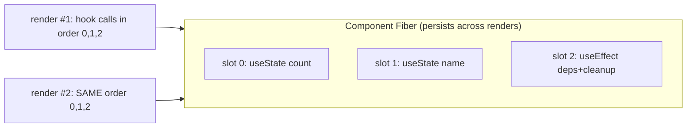

> Prerequisites: understanding of closures (closures capture a *cell*), render = snapshot mental
> model, and React Fiber architecture (the Fiber is the per-component record). This chapter is
> where those three pay off together.

---

## The one mental model

> **A hook is not magic state inside your function. It is a slot in an ordered list that lives
> on the component's Fiber. On every render React walks that list in the SAME ORDER and hands
> you back slot #1, slot #2, slot #3... Your component closes over the values it read this
> render. So a hook value is a snapshot, and a function defined in this render "remembers"
> this render's snapshot forever (that is a stale closure).**

From this one picture you can figure out *every* hook rule: why hooks cannot go in `if`, why deps arrays exist, why `useRef` is the escape hatch, and why your `setInterval` logs the same old `count` forever. We figure them out. No memorizing "the rules of hooks."

---

## Learning Objectives

1. Explain where hook state actually lives and why order matters (derive Rules of Hooks).
2. Re-derive the **stale closure** bug from Ch 01 and fix it three ways, knowing the tradeoffs.
3. Explain `useRef` as "a box whose identity is stable across renders" and when to reach for it.
4. Explain what a dependency array *is* (a memo key) and why a wrong one causes stale reads.

---

## Key Mental Models

- **Hooks = ordered slots on the Fiber, matched by call index.** No names. Just position.
- **Every render is a fresh function call** (Ch 03: each render calls the component function from scratch, creating new local variables). New local consts. New closures. Values from `useState`/props are this render's snapshot.
- **A closure freezes the render it was born in.** An effect, handler, or timer callback sees the variables of the render that created it. Not "the latest."
- **`useRef` returns the same object every render.** Mutating `ref.current` does not re-render and is not a snapshot. It is the deliberate hole in the snapshot model.

---

## Introduction

Hooks feel like the function "has memory." It does not. The *Fiber* has memory. The function is re-run from scratch each render, reading its slots. Once you see that, the famous gotchas stop being trivia. The engineering favorite: "your `useEffect` set up an interval that logs `count`. Why is it stuck at 0?" This is literally the Ch 01 closure simulation wearing a React costume.

---

## Problem

Why can hook state not just be normal variables in the function? Because the function returns and its frame is destroyed every render (Ch 01). Locals cannot survive. So state must live *outside* the call, on something persistent: the Fiber. But then React needs to know *which* `useState` call maps to *which* stored slot across renders. It has no variable names to go by (they are just function calls). The cheapest reliable key is **call order**.



That single design choice, *map by order*, forces the Rules of Hooks. If you put a hook in an `if`, the call order changes between renders. Slot 1 of render #2 lines up with slot 2 of render #1. The state gets cross-wired. So: **no hooks in conditionals, loops, or early returns**. This is not an arbitrary rule. It is a direct result of "matched by position."

---

## Engine Simulation: a minimal hook implementation

This approximately 15-line model is the whole secret. Build it in your head:

```js
let slots = [];        // lives on the Fiber in real React
let cursor = 0;

function useState(initial) {
  const i = cursor;                          // capture THIS call's slot index
  slots[i] = slots[i] ?? initial;            // first render seeds it
  const setState = (next) => {
    slots[i] = typeof next === "function" ? next(slots[i]) : next;
    scheduleRender();                         // re-run component
  };
  cursor++;                                   // next hook gets next slot
  return [slots[i], setState];
}

function renderComponent() {
  cursor = 0;                                 // reset cursor EACH render
  return Component();                         // hooks consume slots 0,1,2... in order
}
```

Trace two `useState` calls across two renders:

```
render #1: cursor 0 → count slot0=0 ; cursor 1 → name slot1="" ; cursor→2
   user clicks setCount(5): slots[0]=5, scheduleRender
render #2: cursor 0 → count slot0=5 ; cursor 1 → name slot1="" ; cursor→2
```

Now see the bug an `if` causes:

```
render #1: useState A (slot0), if(cond) useState B (slot1), useState C (slot2)
render #2: cond=false → useState A (slot0), useState C (slot1)  ← C now reads B's old slot!
```

State corruption, exactly as predicted by "matched by position." That is why ESLint screams.

---

## The stale closure: Ch 01, in a React costume

```js
function Timer() {
  const [count, setCount] = useState(0);

  useEffect(() => {
    const id = setInterval(() => {
      console.log(count);      // ❓ always logs 0
    }, 1000);
    return () => clearInterval(id);
  }, []);                      // empty deps → effect runs ONCE

  return <button onClick={() => setCount(count + 1)}>{count}</button>;
}
```

Figure it out. The effect ran during render #1. The arrow `() => console.log(count)` is a closure born in render #1. So it captured render #1's `count` cell = `0` (Ch 01: closures capture the *cell of that scope*). `setCount` makes new renders with new `count` cells. But the interval still holds the **first** closure. It logs `0` forever.

```
render#1 count=0 ──▶ interval callback closes over count(0)  ⟲ ⟲ ⟲ logs 0,0,0...
render#2 count=1     (new closure exists, but interval still runs the old one)
render#3 count=2
```

**Three fixes, each derived (know the tradeoffs: classic follow-up):**

1. **Functional updater**: stop reading the captured snapshot:
   ```js
   setInterval(() => setCount(c => c + 1), 1000);   // React feeds the latest c
   ```
   Best when you only need to *update*, not *read* for side effects.

2. **Honest deps**: let the effect re-subscribe with a fresh closure each time `count` changes:
   ```js
   useEffect(() => {
     const id = setInterval(() => console.log(count), 1000);
     return () => clearInterval(id);
   }, [count]);    // new closure per count; cleanup tears down the stale one
   ```
   Correct, but re-creates the interval each tick of state.

3. **Ref escape hatch**: keep a mutable box the callback reads live:
   ```js
   const countRef = useRef(0);
   countRef.current = count;                 // updated every render
   useEffect(() => {
     const id = setInterval(() => console.log(countRef.current), 1000);
     return () => clearInterval(id);
   }, []);
   ```
   `useRef` returns the *same object* every render. So `.current` is not a snapshot. It reads whatever the latest render wrote. This is what refs are *for*.

---

## React Internals

- Hooks live as a **linked list** on the Fiber (`fiber.memoizedState`), not a literal array. But "ordered slots matched by call index" is the exact mental model.
- `useState` is `useReducer` with a built-in reducer. Both store an update queue per slot (Ch 03 covered the update queue: the list of pending setState calls React processes during render. That queue lives per hook, not globally).
- `useMemo(fn, deps)` / `useCallback(fn, deps)` store `[value, deps]` in the slot. On re-render they `Object.is`-compare each dep. If all equal, return the cached value (stable identity: Ch 01's referential identity. Objects and functions are compared by reference, not by value). Otherwise recompute. **Deps array = a cache key.**
- `useEffect` stores the effect + its deps + cleanup. After commit, React compares deps. If changed, it runs the previous cleanup then the new effect. Empty deps = "key never changes" = run once. Wrong deps = "key claims nothing changed" = stale closure.
- `useLayoutEffect` is the same but fires synchronously before paint (Ch 07). This is for measuring DOM or avoiding flicker.

---

## Interview Discussion (reason first)

**Q1. "Why can't hooks go inside an `if`?"**

*Plausible-but-wrong:* "Because React said so. It is a style rule."

*Correction:* Because hook state is matched by **call order**, not name. A conditional hook changes the order between renders. Slot indices shift. One hook reads another's state. Show the slot trace. The rule is a *result* of the storage design.

*Model answer:* "Hooks are positional slots on the Fiber. Conditionals change call order. Slots misalign across renders, causing corrupted state. So they must run unconditionally, at the top level."

**Q2. "Interval logs stale `count`. Why, and fix it three ways with tradeoffs."**

*Model answer:* The closure-from-render-1 explanation above. Functional updater (update-only), honest deps (re-subscribes), ref (live read). Naming the tradeoff is what scores SDE-2.

**Q3. "What is `useRef` actually for, beyond DOM nodes?"**

*Model answer:* "A stable, mutable box that survives renders without causing one and without being a snapshot. Two uses: holding a DOM node, and holding mutable values you want to read 'live' inside closures and timers. It is the deliberate escape from the snapshot model."

*Scoring:* full = positional slots + closure capture + ref-as-escape-hatch. Fail = "use useCallback to fix stale closures" with no mechanism.

---

## Common Mistakes

- **Hooks in conditionals, loops, or after early `return`.** Breaks positional matching.
- **Lying in the deps array** (omitting a used value to "run once"). It does not run once. It runs with a stale closure. If you truly want once, prove the value cannot matter, or use a ref.
- **Putting non-reactive mutable state in `useState`** (causes needless renders) instead of `useRef`.
- **Expecting `ref.current` changes to re-render.** They do not. That is the point.
- **`useCallback`/`useMemo` everywhere.** They have a cost (store + compare deps). Only worth it when identity stability actually prevents work (memoized child, effect dep). See Ch 08.

---

## Interview Questions

1. Implement `useState` in about 15 lines. Where does the slot live? Why reset the cursor each render?
2. Show the slot misalignment a conditional hook causes, render #1 vs #2.
3. Given the stale-interval bug, give all three fixes and say when you would pick each.
4. What does the deps array *do* internally for `useEffect` vs `useMemo`? Why is a wrong deps array a correctness bug, not just a perf one?
5. Why does mutating `ref.current` not re-render, and why is that useful?

---

## Homework

1. Type the 15-line `useState` and run two components off one module-level `slots` array. Observe why React actually needs per-Fiber storage (they would collide).
2. Reproduce the stale-interval bug. Then apply each of the three fixes. Add a render-count log to see which fix re-subscribes.
3. Write a `usePrevious(value)` custom hook using a ref. Explain, in `NOTES.md`, why a ref (not state) is the right tool.

---

## Summary

- **Hooks are ordered slots on the Fiber, matched by call index.** That single fact gives you the Rules of Hooks.
- **Each render is a fresh call.** Hook and prop values are that render's snapshot (Ch 03). Any function born in that render closes over that snapshot (Ch 01). This causes **stale closures**.
- Fix stale reads by not depending on the snapshot (**functional updater**), by **honest deps** (re-subscribe with a fresh closure), or by a **ref** (live, mutable, non-snapshot box).
- **Deps arrays are cache keys.** `useMemo`/`useCallback` return cached identity when deps are `Object.is`-equal. The Ch 01 reference model is why they exist.
- **`useRef`** is the intentional escape hatch from the snapshot model.

---

---

# ═══ Internals Deep-Dive (source-verified) ═══

> Verified against `facebook/react` v19.2.0: `react-reconciler/src/ReactFiberHooks.js`. The
> "ordered slots" model above is exactly right. Here is the real data structure and dispatcher.

## A. The real `Hook` object: a linked list, not an array

The chapter's "slots array" is implemented as a **singly linked list** hanging off the fiber's `memoizedState` (Ch 04: the Fiber is React's per-component data structure that persists across renders, storing state, effects, and DOM references). The actual type:

```js
type Hook = {
  memoizedState: any,        // this hook's current committed value
  baseState: any,            // state before priority-skipped updates were applied
  baseQueue: Update | null,  // updates carried over because higher-priority work jumped ahead
  queue: any,                // the UpdateQueue (state/reducer) or effect/ref payload
  next: Hook | null,         // → next hook in this fiber's list
};
```

`baseState`/`baseQueue` exist because of lanes (Ch 04: React's priority system: high-priority updates like user input can jump ahead of lower-priority ones). When a high-priority update is processed before a low-priority one queued earlier, React must replay from a consistent base later. So it stashes the skipped updates. That is invisible in the simple "slots" model but is why the real Hook has four fields, not one.

## B. The dispatcher: mount vs update (`renderWithHooks`)

There is no `if (firstRender)` inside `useState`. Instead React swaps the **entire dispatcher** before calling your component:

```js
ReactSharedInternals.H =
  current === null || current.memoizedState === null
    ? HooksDispatcherOnMount     // useState → mountState, useEffect → mountEffect, …
    : HooksDispatcherOnUpdate;   // useState → updateState (= updateReducer(basicStateReducer))
```

- **Mount:** `mountWorkInProgressHook()` allocates a fresh `Hook` and **appends** it (call order).
- **Update:** `updateWorkInProgressHook()` **walks the alternate fiber's hook list via `currentHook.next`**, cloning each. This traversal is *strictly positional*. There are no names or keys. So the Nth `useX()` this render must line up with the Nth hook last render. **That is the mechanical reason for the Rules of Hooks** (Ch-05's core claim), and the source of the dev warning *"React has detected a change in the order of Hooks."*

> Version flag: `ReactSharedInternals.H` is the **React 19** name. It was `ReactCurrentDispatcher.current` in 17/18. Same mechanism.

## C. The update queue: a circular linked list + eager-state bailout

`mountState` builds the queue and binds the setter:

```js
const queue = { pending: null, lanes: NoLanes, dispatch: null,
                lastRenderedReducer: basicStateReducer, lastRenderedState: initialState };
queue.dispatch = dispatchSetState.bind(null, currentlyRenderingFiber, queue);
```

`dispatchSetState` appends an `Update` to `queue.pending` as a **circular singly-linked list** (`pending` points at the *last* node; `pending.next` is the first). On the next render, `updateReducer` walks that ring applying each update to produce the new state. *This* is the queue the Ch-03 "double increment" walks over.

**Eager-state bailout:** if the queue is empty when you call the setter, React computes the next state *eagerly* right there. If `Object.is(eagerState, currentState)`, it **skips scheduling a re-render entirely**. That is why `setState` to the same value is effectively free (Ch 03 established that setState always schedules a re-render. This eager-state bailout is the optimization that skips the schedule when the new state equals the current.)
