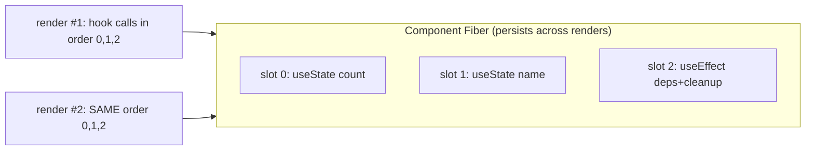

## The Problem That Keeps You Up at Night

You've hit this. You write a `setInterval` inside `useEffect`, the count should tick up every second, but it just logs `0` forever. Or you add a conditional hook and suddenly your state is scrambled. You think, "this is a bug in React," but it's not. It's a direct consequence of a single design choice: React matches hooks by **call order**.

Think of it like this. Every component render is a fresh function call. Local variables die when the function returns. So where does React stash your `useState` values? Outside the function, on the Fiber. But React can't see your variable names — it can only see that you called `useState` three times, in that order. So it assigns slot 0, slot 1, slot 2. That's it. No names. Just position.

This one decision — match by position — is why hooks can't live inside `if` statements, loops, or after early returns. If you skip a hook conditionally, slot indices shift. Slot 1 of render 2 reads what was slot 2 of render 1. Your state is corrupted. Not because of some arbitrary rule. Because positional matching broke.

## Why Existing Solutions Failed

Before hooks, React had class components. State lived on `this.state`. Side effects went into lifecycle methods: `componentDidMount`, `componentDidUpdate`, `componentWillUnmount`. Reusing logic meant Higher-Order Components or render props.

Here's the pain: related logic — say, subscribing to a WebSocket and cleaning up — got split across `componentDidMount` and `componentWillUnmount`. You had to hunt through the file to find the matching pieces. HOCs and render props created deeply nested wrapper trees that were hard to debug. And `this` binding? Constant source of bugs. Function components? They couldn't use state or effects at all.

Hooks fixed all of this. No classes. No `this`. No wrapper hell. Related logic stays together in one place. But hooks brought two new gotchas: positional matching forces the Rules of Hooks, and closure capture freezes a render's values. That's what we deal with today.

## Mental Model: The Pegboard

Here's one sentence that explains everything: **A hook is a numbered slot on the Fiber's pegboard, and every render walks the pegboard in the same order to grab its values.**

Each render is a fresh function call. New local variables. New closures. But the pegboard persists. When React calls your component again, it starts at peg 0, grabs the value, moves to peg 1, and so on. A function defined during that render — an effect callback, an event handler, a timer — closes over the values it read *this render*. It doesn't know about later renders. It's frozen in time.

That's a stale closure. Not a bug. An unavoidable consequence of how JavaScript closures work: a function remembers the variables that existed when it was born. If a new render creates new variables, the old function still points at the old ones.

And `useRef`? That's the deliberate hole in the snapshot model. It returns the same object every render. Mutating `ref.current` doesn't re-render. It's a mutable box that lives outside the snapshot system, for when you need something that survives across renders without triggering re-renders.

## Visualization



The Fiber persists across renders. Each render walks the same slot list in order. If call order changes, slots misalign and state corrupts.

## Engine Simulation

This ~15-line model is the whole secret. Build it in your head.

```js
let slots = [];        // lives on the Fiber in real React
let cursor = 0;

function useState(initial) {
  const i = cursor;
  slots[i] = slots[i] ?? initial;
  const setState = (next) => {
    slots[i] = typeof next === "function" ? next(slots[i]) : next;
    scheduleRender();
  };
  cursor++;
  return [slots[i], setState];
}

function renderComponent() {
  cursor = 0;           // reset cursor each render
  return Component();   // hooks consume slots 0,1,2... in order
}
```

Here's what happens: `cursor` resets to 0 at the start of each render. The first `useState` grabs index 0. The second grabs index 1. Each slot persists because `slots` lives outside the function. When you call `setState`, it writes to the slot and triggers a new render. The new render reads the updated slot.

Trace two `useState` calls across two renders:

```
render #1: cursor 0 -> count slot0=0 ; cursor 1 -> name slot1="" ; cursor->2
   user clicks setCount(5): slots[0]=5, scheduleRender
render #2: cursor 0 -> count slot0=5 ; cursor 1 -> name slot1="" ; cursor->2
```

State persists because the slot array lives outside the function. Each render re-reads the same slots.

Now see the bug a conditional hook causes:

```
render #1: useState A (slot0), if(cond) useState B (slot1), useState C (slot2)
render #2: cond=false -> useState A (slot0), useState C (slot1) <- C now reads B's old slot!
```

State corruption exactly as predicted by "matched by position." That is why ESLint's rules-of-hooks exists. Not style. Correctness.

## Internal Implementation

**The real Hook object.** The "slots array" is actually a singly linked list on `fiber.memoizedState`.

```js
type Hook = {
  memoizedState: any,        // committed value
  baseState: any,            // state before priority-skipped updates
  baseQueue: Update | null,  // skipped updates from lane priority
  queue: any,                // UpdateQueue or effect payload
  next: Hook | null,         // next hook
};
```

`baseState` and `baseQueue` exist because of lanes (Ch 04). High-priority updates can jump ahead of lower-priority ones. React must replay from a consistent base later. That is why the real Hook has four fields, not one.

**The dispatcher.** There is no `if (firstRender)` inside `useState`. React swaps the entire dispatcher before calling your component:

```js
ReactSharedInternals.H =
  current === null || current.memoizedState === null
    ? HooksDispatcherOnMount     // useState -> mountState
    : HooksDispatcherOnUpdate;   // useState -> updateState
```

On mount: `mountWorkInProgressHook()` allocates a fresh Hook and appends it in call order. On update: `updateWorkInProgressHook()` walks the previous render's hook list via `currentHook.next`, cloning each. This traversal is strictly positional. That is the mechanical reason for the Rules of Hooks.

**The update queue.** `mountState` builds a queue and binds the setter:

```js
const queue = {
  pending: null,
  lanes: NoLanes,
  dispatch: null,
  lastRenderedReducer: basicStateReducer,
  lastRenderedState: initialState
};
queue.dispatch = dispatchSetState.bind(null, currentlyRenderingFiber, queue);
```

`dispatchSetState` appends an `Update` to `queue.pending` as a circular singly-linked list. On the next render, `updateReducer` walks that ring applying each update to produce new state.

**Eager-state bailout.** If the queue is empty when you call the setter, React computes the next state right there. If `Object.is(eagerState, currentState)`, it skips scheduling a re-render entirely. That is why setting state to the same value is effectively free.

**useMemo and useCallback.** Both store `[value, deps]` in their slot. On re-render React `Object.is`-compares each dep. If all equal, return the cached value (stable identity from Ch 01). Otherwise recompute. The deps array is a cache key.

**useEffect.** Stores the effect function, its deps, and cleanup. After commit, React compares deps. If changed, it runs the previous cleanup then the new effect. Empty deps means the key never changes, so the effect runs once and never re-runs. Wrong deps means the key claims nothing changed when something did, giving you a stale closure.

**useLayoutEffect.** Same mechanism but fires synchronously before paint (Ch 07). Use for measuring DOM or avoiding flicker.

## Real World Example

The classic stale closure bug with `setInterval` and `useState`.

```js
function Timer() {
  const [count, setCount] = useState(0);

  useEffect(() => {
    const id = setInterval(() => {
      console.log(count);      // always logs 0
    }, 1000);
    return () => clearInterval(id);
  }, []);                      // empty deps, effect runs once

  return <button onClick={() => setCount(count + 1)}>{count}</button>;
}
```

What happens internally: The effect ran during render 1. The arrow `() => console.log(count)` is a closure born in render 1. It captured render 1's `count` cell = `0`. Closures capture the cell of that scope (Ch 01). `setCount` makes new renders with new `count` cells. But the interval still holds the first closure. It logs `0` forever.

```
render#1 count=0 -> interval callback closes over count(0)  logs 0,0,0...
render#2 count=1     (new closure exists, but interval still runs the old one)
render#3 count=2
```

Three fixes with different tradeoffs:

1. **Functional updater** avoids reading the captured snapshot: `setInterval(() => setCount(c => c + 1), 1000)`. React feeds the latest `c` from the slot. Best for update-only cases.

2. **Honest deps** re-subscribes with a fresh closure on each `count` change: add `[count]` to the deps array. Correct but re-creates the interval on every tick.

3. **Ref escape hatch** keeps a mutable box the callback reads live: store `count` in `useRef`, update `ref.current` each render, read `ref.current` inside the interval. The ref is the same object every render. No re-subscription needed. But you must sync `ref.current` manually.

## Tradeoffs

**useState vs useReducer.** `useState` is `useReducer` with a built-in reducer. Use `useState` for independent values. Use `useReducer` when state updates depend on each other or the logic is complex enough to extract into a reducer function.

**useMemo / useCallback vs inline.** Both store previous deps and compare each render. Only pay that cost when the cached identity prevents actual work, like skipping a memoized child's render or stabilizing a dep for another hook. Otherwise inline is cheaper.

**Complete deps vs "run once."** Lying about deps to make an effect "run once" does not run once. It runs with a stale closure. If you truly want once, prove the value cannot change, or use a ref. Honest deps re-run the effect but give correct values.

**useRef vs useState for mutable values.** `useRef` does not trigger re-render. `useState` does. Use refs for values that need to survive renders but should not cause re-renders when they change (interval IDs, previous values, DOM nodes). Use state for values that drive the UI.

**useEffect vs useLayoutEffect.** Both run after render. `useEffect` fires asynchronously after paint. `useLayoutEffect` fires synchronously before paint. Use `useLayoutEffect` when you need to measure or mutate the DOM before the user sees it. Use `useEffect` for everything else to avoid blocking paint.

## Common Mistakes

- **Hooks in conditionals, loops, or after early return.** Breaks positional matching.
- **Lying in the deps array.** Omitting a used value to "run once" does not run once. It runs with a stale closure.
- **Putting non-reactive mutable state in `useState`.** Causes needless renders. Use `useRef` instead.
- **Expecting `ref.current` changes to re-render.** They do not. That is the point.
- **`useCallback`/`useMemo` everywhere.** They have a cost (store + compare deps). Only worth it when identity stability prevents actual work.

## SDE-2 Interview Answer (Mid-level + Senior + Engineering Lead variants)

**Mid-level (SDE-1 / junior SDE-2):**

Question: "Why can't hooks go inside an `if` statement?"

"Hooks are matched by call order, not by name. React stores hook state in slots on the Fiber. On each render, it walks the slots in order. If you put a hook in a conditional, the number of hooks changes between renders. Slot indices shift. One hook reads another's state. That is why hooks must run unconditionally at the top level. The rule is a result of the storage design, not an arbitrary style choice."

**Senior (SDE-2 / SDE-3):**

Question: "This interval logs stale count. Explain why and fix it three ways."

"The effect closure was born in render 1. It captured render 1's `count` value. Subsequent renders create new closures, but the interval still holds the first one. Three fixes: functional updater avoids reading the snapshot, honest deps re-subscribes with a fresh closure, and the ref escape hatch provides a live mutable box. The tradeoff is between simplicity, correctness, and overhead. The ref approach is most efficient for intervals because it avoids re-subscribing."

**Engineering Lead (Staff / Principal):**

Question: "How would you design custom hook patterns for your team to minimize stale closure bugs?"

"First, educate the team on the two root causes: positional matching forces the Rules of Hooks, and closure capture freezes render values. Second, establish patterns: custom hooks that return callbacks should use `useCallback` with honest deps. Hooks that manage intervals or subscriptions should use refs for mutable values or accept re-subscription cost with honest deps. Third, create lint rules beyond the defaults. For example, enforce that interval IDs are stored in refs, not state. Fourth, build reusable primitives like `useStableCallback` that uses refs to always return the latest callback without re-rendering. The design decision of positional vs named hooks is worth understanding. Positional is simpler and lower overhead. But the team needs to understand the implications."

## Follow-up Questions (5, progressively harder)

**Q1: Implement `useState` in about 15 lines. Where does the slot live? Why reset the cursor each render?**

The slot lives on the Fiber node, which persists across renders. In a simplified model:

```js
let slots = [];
let cursor = 0;

function useState(initial) {
  const i = cursor;
  slots[i] = slots[i] ?? initial;
  const setState = (next) => {
    slots[i] = typeof next === "function" ? next(slots[i]) : next;
    scheduleRender();
  };
  cursor++;
  return [slots[i], setState];
}

function renderComponent() {
  cursor = 0;
  return Component();
}
```

The cursor resets at the start of each render because React walks the hook list in the same positional order every time. If the cursor did not reset, the second `useState` call would grab index 1 even on the first render, skipping index 0. The slot array persists because it lives outside the component function — on the Fiber's `memoizedState` linked list. Each render re-reads the same slots, which is why state survives across renders. See Ch 03 for how the Fiber stores this linked list.

**Q2: Show the slot misalignment a conditional hook causes. Walk through render 1 vs render 2.**

Suppose you have this code:

```jsx
function Component({ hasFeature }) {
  const [a, setA] = useState("A");
  if (hasFeature) {
    const [b, setB] = useState("B");
  }
  const [c, setC] = useState("C");
}
```

Render 1 with `hasFeature = true`: hooks run in order as slots 0, 1, 2. `a` reads slot 0, `b` reads slot 1, `c` reads slot 2. Everything is fine.

Render 2 with `hasFeature = false`: the conditional hook is skipped. Now `a` reads slot 0 (correct), but `c` reads slot 1 (which was `b`'s slot). `c` gets `b`'s value. Slot 2 is untouched. State is corrupted — `c` shows `B` instead of `C`. This is not a React bug. It is a direct consequence of positional matching. The ESLint `rules-of-hooks` plugin exists to catch exactly this pattern, not as a style preference but as a correctness guard.

**Q3: Given the stale interval bug, give all three fixes and say when you would pick each.**

The bug: `setInterval` captures render 1's `count` via closure and logs `0` forever.

**Fix 1 — Functional updater:** `setInterval(() => setCount(c => c + 1), 1000)`. The updater receives the latest value from React's slot, bypassing the stale closure entirely. Pick this when you only need to update state based on its previous value and do not need to read external values inside the callback.

**Fix 2 — Honest deps:** Add `[count]` to the deps array. The effect re-runs on every count change, creating a fresh closure that captures the current count. Pick this when the effect logically depends on the value (e.g., an API call that needs the current count) and re-subscription cost is acceptable.

**Fix 3 — Ref escape hatch:** Store `count` in a `useRef`, update `ref.current` each render, and read `ref.current` inside the interval. The ref is the same object across renders — it is not part of the snapshot model. Pick this for intervals, timers, or any long-lived subscription where you need the latest value without re-subscribing. This is the most efficient fix for this specific pattern. See Ch 01 for why refs break the closure snapshot model.

**Q4: What does the deps array do internally for `useEffect` vs `useMemo`? Why is a wrong deps array a correctness bug, not just a perf one?**

Both `useEffect` and `useMemo` store their previous deps array in their hook slot. On the next render, React compares each element using `Object.is`. If all deps are equal, the hook returns the cached value (for `useMemo`) or skips running the effect (for `useEffect`). If any dep changed, `useMemo` recomputes and `useEffect` runs cleanup on the old effect then runs the new effect.

A wrong deps array is a correctness bug because it tells React "nothing changed" when something did. The effect runs with a stale closure — it reads old values from a previous render's scope. For `useMemo`, it returns a stale cached value derived from old inputs. This is not a performance issue where you do too much work; it is a semantic issue where you do the wrong work. The effect may fire with outdated data, skip necessary cleanup, or return values that no longer correspond to current state. See Ch 03 for how closures capture render snapshots.

**Q5: Why does mutating `ref.current` not re-render? When would you use a ref instead of state for a value that changes?**

`useRef` returns the same object every render. The ref's `.current` property is a mutable field on that object, stored on the Fiber's hook slot. Unlike `useState`, which calls `scheduleRender()` when the setter fires, `useRef`'s setter is just a plain property assignment on a JS object. React has no mechanism to detect that assignment. No update is enqueued, no re-render is triggered. The value changes silently.

Use a ref when you need a value that survives renders but should not cause re-renders when it changes: interval IDs, previous prop values, DOM node references, timers, WebSocket instances, or any mutable bookkeeping. Use state when the value drives the UI and the user should see it update. The rule of thumb: if changing the value should make the screen update, use state. If it is internal bookkeeping, use a ref. See Ch 04 for why the commit phase reads refs but the render phase does not re-trigger on ref changes.

## Mental Trigger

**Ordered slots plus closure snapshot explain every hook behavior and gotcha.**

## One Page Revision

- Hooks are ordered slots on the Fiber, matched by call index. No names. Just position.
- Each render is a fresh call. Hook and prop values are that render's snapshot.
- Any function born in that render closes over that snapshot. This causes stale closures.
- The Rules of Hooks exist because conditional hooks shift slot indices and corrupt state.
- Fix stale reads: functional updater (update-only), honest deps (re-subscribe), or ref (live mutable box).
- Deps arrays are cache keys. useMemo and useCallback return cached identity when deps are `Object.is`-equal. useRef compares nothing; it returns the same object every render.
- useState is useReducer with a built-in reducer. useRef is the intentional escape hatch from the snapshot model.
- The real Hook is a linked list on fiber.memoizedState. React swaps the dispatcher on mount vs update.
- Eager-state bailout: setting state to the same value skips re-render entirely.
- useLayoutEffect fires before paint. useEffect fires after paint.
