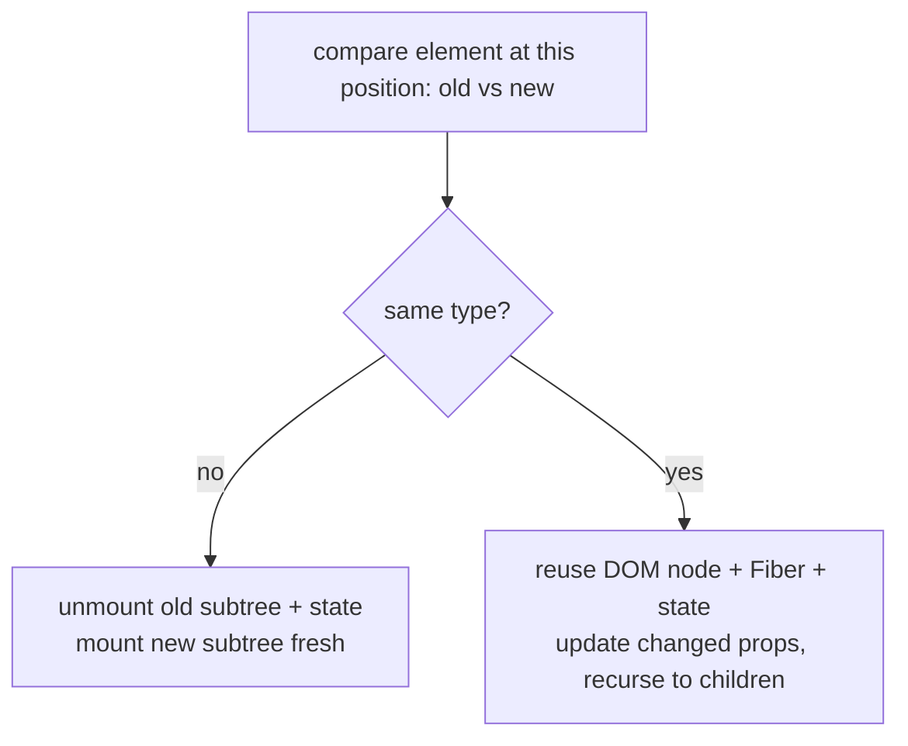
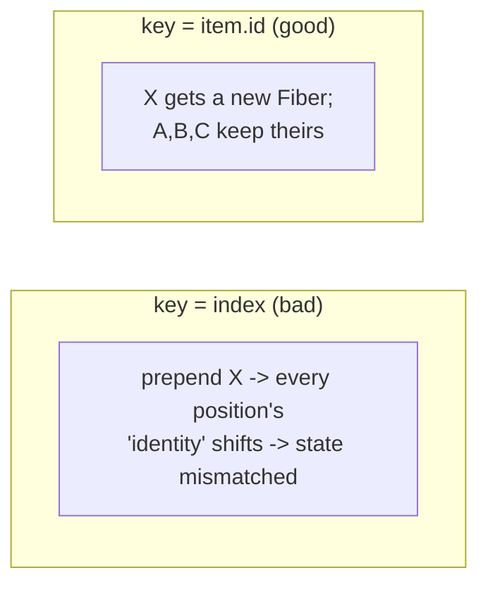
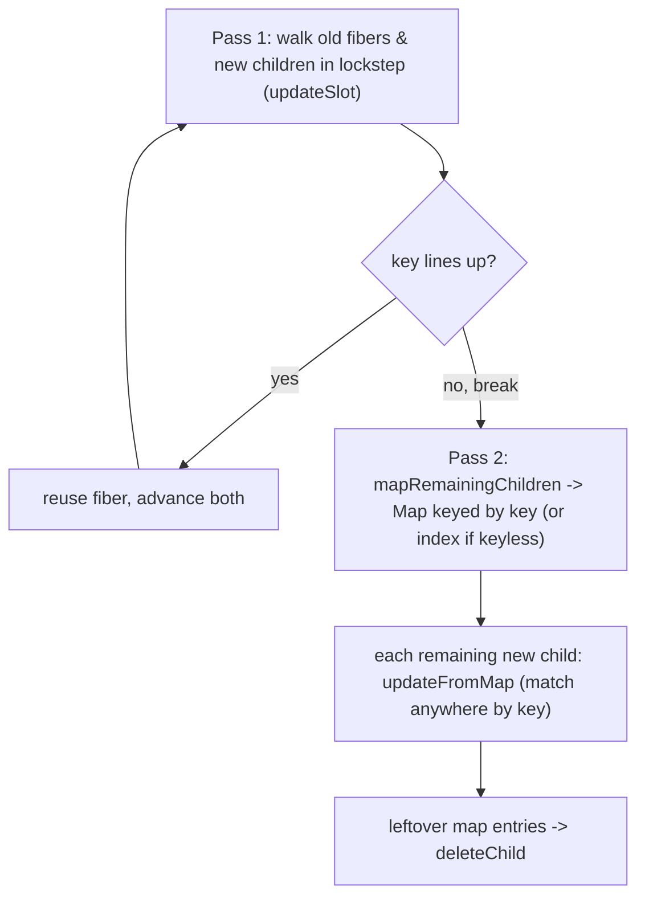

## Problem

React receives a new element tree each render (Ch 03). It must update the DOM to match. The naive approach, a general tree diff, is O(n³). Far too slow for UI that re-renders constantly.

React needs a "good enough" diff in O(n). It uses two assumptions that hold for real UIs: different element types produce different trees, and developers can mark stable identity with `key`.

## Why Existing Solution Failed

Before React, developers manipulated the DOM directly (jQuery, vanilla JS). Each state change required manual DOM mutations. This was error-prone and hard to maintain. Early frameworks like Backbone.js re-rendered entire templates on any change, which was wasteful.

React's virtual DOM plus diffing algorithm was the first practical O(n) approach. But the abstraction leaks when developers misuse keys, cause unnecessary remounts, or misunderstand when state resets. The problem is not the diffing algorithm. It is knowing what triggers a remount vs an update.

## Mental Model

React does NOT compare your new tree against the DOM. It compares the new element tree against the previous one, position by position. At each position it asks one question: "same type as before?" Same type means keep the DOM node and the Fiber (and its state), just update props. Different type means throw away that node and its entire subtree (and its state) and build fresh. `key` overrides "position" with "identity" so React can match items that moved.

Key ideas:
- Diff is per-position, type-first. Type mismatch means unmount subtree and mount new.
- State is tied to position-in-tree (a Fiber), not to your JSX variable. Move or replace the position and the state goes with the Fiber, or it dies.
- `key` re-defines identity within a list, so reorders reuse the right Fiber.

## Visualization



Same type means reuse. Different type means rebuild. That is the entire diffing heuristic.



Index keys shift identity on prepend or reorder. Stable keys follow the item wherever it moves.

## Engine Simulation

**Type change wipes state.**

```jsx
{isWide ? <div><Profile/></div> : <section><Profile/></section>}
```

What happens internally: `div` to `section` is a type change at that position. React unmounts the whole subtree. `Profile` is destroyed and remounted, losing its state and re-running its effects. Same JSX `Profile`, but it sits under a position whose type flipped. State lives on the Fiber at that position, and the position was rebuilt.

```
render A:  <div>      render B:  <section>
             └ Profile(state=X)     └ Profile(state=fresh)   ← type changed -> remount
```

**Lists and the index-key bug.**

```jsx
{items.map((it, i) => <Row key={i} item={it} />)}   // index as key
```

What happens internally: You have rows A, B, C with keys 0, 1, 2. Each `<Row>` holds local state (say a checkbox toggle). Now you prepend X. The list becomes X, A, B, C with keys 0, 1, 2, 3.

```
before:  key0->A(stateA)  key1->B(stateB)  key2->C(stateC)
after :  key0->X          key1->A          key2->B          key3->C
match by key:
  key0: A->X  reuse Fiber -> X now shows A's state!   (toggle leaks)
  key1: B->A  reuse Fiber -> A shows B's state
```

React matched by `key=0` and decided "row 0 is the same row, just new props." So it kept row 0's state and handed it to X. Every row's state shifted to the wrong item.

The fix is a key that follows the item, not the slot:

```jsx
{items.map((it) => <Row key={it.id} item={it} />)}   // stable identity
```

Now `key=A.id` matches A's Fiber wherever A moves. Prepending X just mounts one new Fiber and reuses the rest correctly.

When is index-as-key fine? Only for static lists that never reorder, insert, or delete in the middle, and whose rows hold no state. Otherwise use a stable id.

## Internal Implementation

**Two reconcilers from one body.** `createChildReconciler(shouldTrackSideEffects)` produces two functions from the same code: `mountChildFibers` (skips deletion tracking, used for initial mount) and `reconcileChildFibers` (tracks Placement and ChildDeletion flags, used for updates).

`reconcileChildFibersImpl` branches on the new child's type:
- Single element (`$$typeof === REACT_ELEMENT_TYPE`) calls `reconcileSingleElement`
- String or number calls text node handler
- Array calls `reconcileChildrenArray`
- Iterable calls the iterator variant

**Single element reuse rule.** `reconcileSingleElement` / `updateElement` reuse the existing fiber if `key` matches AND `current.elementType === element.type`. Then `useFiber(current, props)` (which is `createWorkInProgress` from Ch 04). State is preserved. Otherwise `deleteChild` + create a fresh fiber with `Placement`. State is lost.

**List diff: two passes (`reconcileChildrenArray`).** React deliberately does no two-ended diff. Source comment: "This algorithm can't optimize by searching from both ends since we don't have backpointers on fibers."



Pass 1 loops old + new in index lockstep. It calls `updateSlot`, which returns `null` the moment a key does not line up. This causes a `break`. Pass 2 uses `mapRemainingChildren` to build a `Map` keyed by `fiber.key`, falling back to `fiber.index` when key is null. Then `updateFromMap` matches each remaining new child by `newChild.key ?? newIdx`. Leftover map entries are deleted.

`placeChild(newFiber, lastPlacedIndex, newIndex)` decides moves. If a matched fiber's old index is less than `lastPlacedIndex`, it marks `Placement` (a move). Otherwise it advances `lastPlacedIndex`.

**Why index keys corrupt state: the exact mechanism.** Keyless (or index-keyed) children are stored under their index. `updateFromMap` looks up `newChild.key === null ? newIdx : newChild.key`. So index keys make React match by position. When you prepend, insert, or reorder, position N now holds a different logical item. But its key (the index) is unchanged. React reuses that position's fiber and hands it the new item. The old fiber's state and uncontrolled DOM (input text, focus, checkbox) attach to the wrong row.

## Real World Example

**Chat app with reordering messages.** You have a list of messages. Each message has a checkbox for selection. New messages arrive at the top with real-time updates.

```jsx
{messages.map((msg, i) => <MessageRow key={i} msg={msg} />)}
```

A new message arrives. It gets prepended. Keys 0,1,2 now point to different messages. Each `MessageRow` keeps its checkbox state from the previous message. The user sees the wrong messages selected.

Fix: use `key={msg.id}`. Now each message keeps its Fiber regardless of position. New messages get fresh Fibers. Old messages keep their checkbox state.

**Tab switcher with form state.** You toggle between two tabs that wrap content in different containers.

```jsx
{activeTab === "profile" ? <div><ProfileForm/></div> : <section><ProfileForm/></section>}
```

What happens internally: Switching tabs changes the wrapper from `div` to `section`. That is a type change at that position. React unmounts `ProfileForm` and remounts it fresh. The user's unsaved form data is lost.

Fix: use the same wrapper element type for both tabs, or give `ProfileForm` a `key` tied to the tab so React treats each tab's form as separate.

```jsx
{activeTab === "profile"
  ? <div><ProfileForm key="profile" /></div>
  : <div><ProfileForm key="settings" /></div>
}
```

Now each tab gets its own Fiber with independent state. The user can switch tabs without losing form data.

## Tradeoffs

**Index keys vs stable keys.** Index keys are cheaper to compute and require no data model changes. But they cause state bugs on reorder, insert, or delete. Stable keys (item.id) are the safe default. Only use index keys for static, read-only lists that never change order.

**Random keys (`key={Math.random()}`).** This remounts every render. Every child is deleted and recreated. All state is lost. All effects re-run. Performance is worst possible. Never do this.

**Type change vs key change.** Changing the wrapper type (div to section) remounts the entire subtree. Changing a child's key remounts only that child. Use key changes for targeted remounts. Use type changes when the entire subtree structure is different.

**Reconciliation vs full rebuild.** Reconciliation is cheaper than full rebuild for most updates. But the comparison itself has a cost. For deeply nested trees with many siblings, key lookups and type checks add up. This is why list virtualization (Ch 08) matters: fewer Fibers to diff means less work.

## Common Mistakes

- **Index keys on dynamic or stateful lists.** State leaks to wrong rows.
- **Using a random key (`key={Math.random()}`).** Remounts every render, destroys state and perf.
- **Forgetting that a type change remounts.** You lose animation or input state when restructuring.
- **Assuming React diffs against the DOM.** It diffs element tree against previous element tree.
- **Thinking keys must be globally unique.** They only need to be unique among siblings.

## SDE-2 Interview Answer (Mid-level + Senior + Engineering Lead variants)

**Mid-level (SDE-1 / junior SDE-2):**

Question: "Why does React need keys?"

"Keys give list children stable identity. Without keys, React matches elements by position. When you reorder or insert items, position-based matching reuses the wrong Fiber. State and DOM attach to the wrong item. Keys tell React: 'this element is this item, wherever it moved.' The main purpose is correctness, not performance."

**Senior (SDE-2 / SDE-3):**

Question: "Changing a wrapper from div to section reset my form. Why?"

"React compares element types at each position. A div and a section are different types. Different type means React unmounts the old subtree and mounts a fresh one. The form's Fiber is destroyed, so its state is lost. State lives on the Fiber at a position. The position was rebuilt. Fix: use the same wrapper type for both branches, or use a key on the form to separate its state intentionally."

**Engineering Lead (Staff / Principal):**

Question: "How would you design a list component that handles reordering, insertion, and deletion without losing state?"

"First, use stable keys derived from item data (item.id or a composite key). Never use index keys. Second, ensure the data layer provides stable identifiers. If the API does not, generate IDs on the client on first load and persist them. Third, for complex lists with drag-and-drop reordering, use a library like `@dnd-kit` that manages key stability and DOM position. Fourth, educate the team on the type-change remount rule. When restructuring UI, keep wrapper types consistent to preserve child state. Use keys deliberately to reset state when needed, like `<Editor key={docId} />` to reset editor state per document."

## Follow-up Questions (5, progressively harder)

1. Walk through the prepend-with-index-key bug, Fiber by Fiber. Then fix it.
   _(Tests ability to trace execution through reconciliation.)_

2. Why is the general tree-diff O(n³) and what two assumptions make React's O(n)?
   _(Tests understanding of why React's approach works.)_

3. How would you intentionally force a subtree to reset its state?
   _(Tests understanding of key as identity tool.)_

4. Same-type vs different-type at a position: what happens to DOM, Fiber, state, and effects?
   _(Tests comprehensive understanding of the reconciliation pipeline.)_

5. Is `key` globally unique? What happens if keys collide among siblings?
   _(Tests edge case understanding of the key mechanism.)_

## Mental Trigger

**Type change means remount. Key is identity. State lives on the Fiber at a position.**

## One Page Revision

- React diffs new element tree vs previous, per position, type-first. O(n) via two heuristics.
- Same type means reuse Fiber, DOM, and state, then update props.
- Different type means unmount subtree and remount. State and effects reset.
- State lives on the Fiber at a position, not on your JSX variable.
- `key` redefines identity in lists so reorders match by item, not by position.
- Index keys cause state bugs on reorder, insert, or delete. Use stable item IDs.
- Random keys (`Math.random()`) remount every render. Never use them.
- Use a changing key deliberately (`key={docId}`) to force a reset.
- The real reconciler uses two passes: lockstep then keyed map.
- `reconcileSingleElement` checks `elementType` match plus `key` match. Both must line up.
- `placeChild` determines moves by comparing old index to `lastPlacedIndex`.
