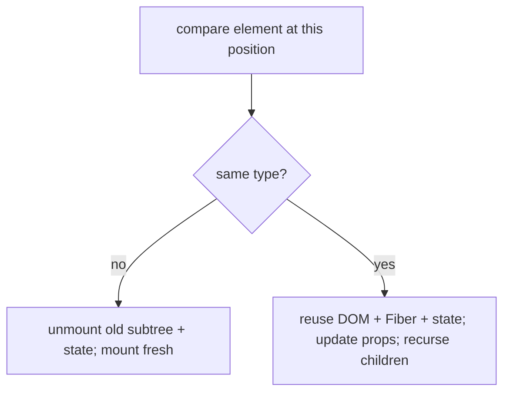
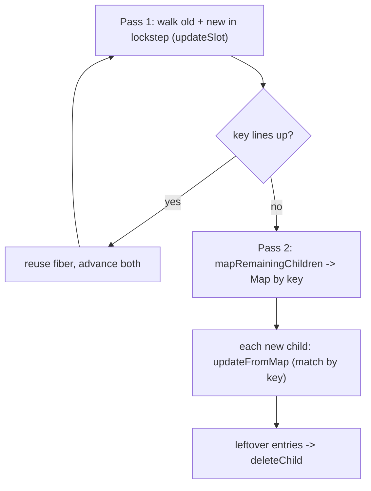

## The Problem

Every render gives React a new element tree. It needs to figure out the cheapest way to update the DOM to match. The naive approach — comparing every node in the old tree against every node in the new tree — is O(n³). That's catastrophic for a UI that re-renders dozens of times per second.

React needs something fast. It finds it by making two practical assumptions about real UIs.

## The One Insight

**React does NOT compare your new tree against the DOM. It compares your new element tree against the previous element tree, position by position, asking one question at each spot: "Same type as before?"**

Same type → keep the DOM node, keep the Fiber, keep its state, just update props.
Different type → throw away that node and its entire subtree (and its state) and build fresh.

`key` is how you tell React "ignore position — use identity instead." It's like putting name tags on chairs. Without name tags, React matches people to chairs by seat number. Shuffle the chairs and the wrong people end up in wrong seats. With name tags, React matches each person to their correct chair no matter where it moves.



## The Index Key Bug

```jsx
{items.map((it, i) => <Row key={i} item={it} />)}   // index as key
```

You have rows A, B, C with keys 0, 1, 2. Each `<Row>` holds checkbox state. Prepend X. List becomes X, A, B, C with keys 0, 1, 2, 3.

```
before:  key0->A(stateA)  key1->B(stateB)  key2->C(stateC)
after :  key0->X          key1->A          key2->B          key3->C
```

React matched by `key=0`: "row 0 is the same row, just new props." It kept row 0's state and handed it to X. Every row's state shifted to the wrong item. Musical chairs — everyone moved, but the name tags stayed put.

Fix: use a key that follows the item, not the slot:

```jsx
{items.map((it) => <Row key={it.id} item={it} />)}
```

Now `key=A.id` matches A's Fiber wherever A moves. Prepending X mounts one new Fiber and reuses the rest correctly.

When is index-as-key fine? Only for static lists that never reorder, insert, or delete, and whose rows hold no state.

## Type Change Wipes State

```jsx
{isWide ? <div><Profile/></div> : <section><Profile/></section>}
```

Going from `div` to `section` is a type change. React unmounts the whole subtree. `Profile` is destroyed and remounted, losing its state and re-running its effects. Same JSX component, but it sits under a position whose type flipped.

```
render A:  <div>      render B:  <section>
             └ Profile(state=X)     └ Profile(state=fresh)  ← remount
```

## The Diffing Algorithm

**Two heuristics bring O(n³) down to O(n):**

1. **Different types produce different trees.** If a node changes from `<div>` to `<span>`, React unmounts the entire subtree. This eliminates cross-level comparison.

2. **Keys identify elements in lists.** Within siblings, React uses `key` to match elements across renders. Without keys, React would compare every old child against every new child (O(n²)). With keys, it builds a map in O(n) and looks up matches in O(1).

**Two-pass list diff:**



Pass 1 walks old and new children in lockstep. The moment a key doesn't match, it breaks to Pass 2 — a Map-based lookup that finds matches anywhere in the remaining list. Leftover entries get deleted.

## Real World Examples

**Chat app with reordering messages.** Each message has a checkbox. New messages arrive at the top. With index keys, prepending shifts every checkbox to the wrong message. With `key={msg.id}`, each message keeps its Fiber regardless of position.

**Tab switcher with form state.** Switching between tabs wrapped in different containers (`div` vs `section`) triggers a type-change remount. User's unsaved form data is lost. Fix: use the same wrapper element type, or give the form a `key` tied to the tab.

```jsx
{activeTab === "profile"
  ? <div><ProfileForm key="profile" /></div>
  : <div><ProfileForm key="settings" /></div>
}
```

## Common Mistakes

- **Index keys on dynamic or stateful lists.** State leaks to wrong rows. The #1 key bug.
- **Random keys (`key={Math.random()}`).** Remounts every render. All state lost. Performance worst possible.
- **Forgetting that a type change remounts.** You lose animation or input state when restructuring.
- **Assuming React diffs against the DOM.** It diffs element tree against previous element tree.
- **Thinking keys must be globally unique.** They only need to be unique among siblings.

## Mental Trigger

**Type change means remount. Key is identity. State lives on the Fiber at a position.**

## Q&A

**Q: Walk through the prepend-with-index-key bug.**
List `[A, B, C]` with `key={i}`. Prepend X → `[X, A, B, C]`. Key 0: old Fiber-A vs new element X. React reuses Fiber-A's state for X. Key 1: Fiber-B's state goes to A. Key 2: Fiber-C's state goes to B. Key 3: fresh Fiber for C. Every row shows the wrong checkbox state.

**Q: What two assumptions make React's diff O(n)?**
(1) Different types produce different trees — no cross-level comparison. (2) Keys identify elements in lists — O(1) map lookup instead of O(n) linear scan. Together: single O(n) pass.

**Q: How would you intentionally force a subtree to reset state?**
Change the key: `<Editor key={documentId} />`. When `documentId` changes, React unmounts the old Fiber and mounts fresh. All state and effects destroyed. Cleanest approach because it's explicit and declarative.

**Q: Same-type vs different-type at a position — what happens to DOM, state, effects?**
Same type: DOM reused, Fiber reused, state preserved, effects run only if deps changed. Different type: DOM destroyed, Fiber destroyed, state lost, previous effects cleaned up, new effects run as fresh mount.

## Interview Deep-Dive: React.memo and Unnecessary Re-renders

This pattern comes from a real senior frontend interview. The interviewer walked through a逐步加深 (progressive deepening) of the memo question.

### Q: Parent has states A and B. Child receives only A as prop. B changes. Does Child re-render?

**Yes.** When parent re-renders (because B changed), React re-renders all children by default — regardless of whether their props changed. This is by design: React assumes re-renders are cheap and that correctness (not performance) is the default.

### Q: Is this an unnecessary re-render?

**It depends.** If the child is cheap (just renders some text), the re-render is negligible. React can re-render thousands of simple components in <1ms. The re-render is only "unnecessary" if the child is expensive (complex computation, large subtree, heavy animation).

### Q: How do you fix it?

**React.memo:** Wrap the child in `React.memo`. It performs a shallow comparison of props. If props haven't changed, the child skips re-rendering.

```jsx
const Child = React.memo(function Child({ a }) {
  return <div>{a}</div>;
});
```

### Q: Should you wrap ALL components in React.memo?

**No.** This is the critical insight most candidates miss.

`React.memo` has costs:
1. **Shallow comparison** on every parent render — adds CPU time
2. **Memory overhead** — stores previous props for comparison
3. **False sense of security** — if you pass inline objects/functions, memo does nothing

**The rule:** Memoize measured hot spots. Not everything. If you haven't measured, don't memoize.

### Q: You memoized the child, but now you're passing a function C as a prop. Child still re-renders. Why?

Because **every render creates a new function object**. `React.memo` does shallow comparison — it sees a new reference for `C` and concludes props changed.

```jsx
function Parent() {
  const [b, setB] = useState(0);
  
  function handleClick() { /* ... */ }  // new reference every render
  
  return <MemoizedChild onClick={handleClick} />;
}
```

### Q: How do you fix the function problem?

**useCallback** stabilizes the function reference:

```jsx
function Parent() {
  const [b, setB] = useState(0);
  
  const handleClick = useCallback(() => {
    /* ... */
  }, []);  // stable reference
  
  return <MemoizedChild onClick={handleClick} />;
}
```

### Q: Should you wrap ALL functions in useCallback?

**No. Same logic as React.memo.** Only when:
1. The function is passed to a `React.memo`-wrapped child
2. The function is a dependency of another hook
3. The function is expensive to recreate

For presentational components 1-2 levels deep that don't do heavy work, the overhead of memoization exceeds the benefit.

### Q: When WOULD you use useCallback?

- Function passed to a `React.memo` child (prevents child re-render)
- Function used as a dependency of `useEffect` or `useMemo` (prevents unnecessary effect re-runs)
- Function passed through Context (prevents all consumers from re-rendering)
- Function passed 3+ levels deep as prop (compounding re-render cost)

### The Decision Framework

```
Is the child expensive to render?
  ├─ No → Don't memoize. Re-render is cheap.
  └─ Yes → Is the function passed to a memoized child?
              ├─ No → React.memo alone is enough
              └─ Yes → Use useCallback to stabilize the function
                       + React.memo on the child
```

### Common Interview Follow-ups

1. "What about useMemo?" — Same idea but for values, not functions. Use when computation is expensive.
2. "What about React Compiler?" — React 19's compiler auto-memoizes. But understanding the manual approach shows you understand *why* memoization matters.
3. "How do you measure if memo helps?" — React DevTools Profiler. Record before/after. Compare render counts and commit times.
