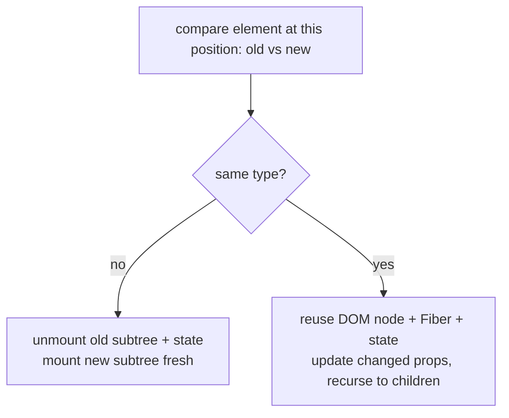
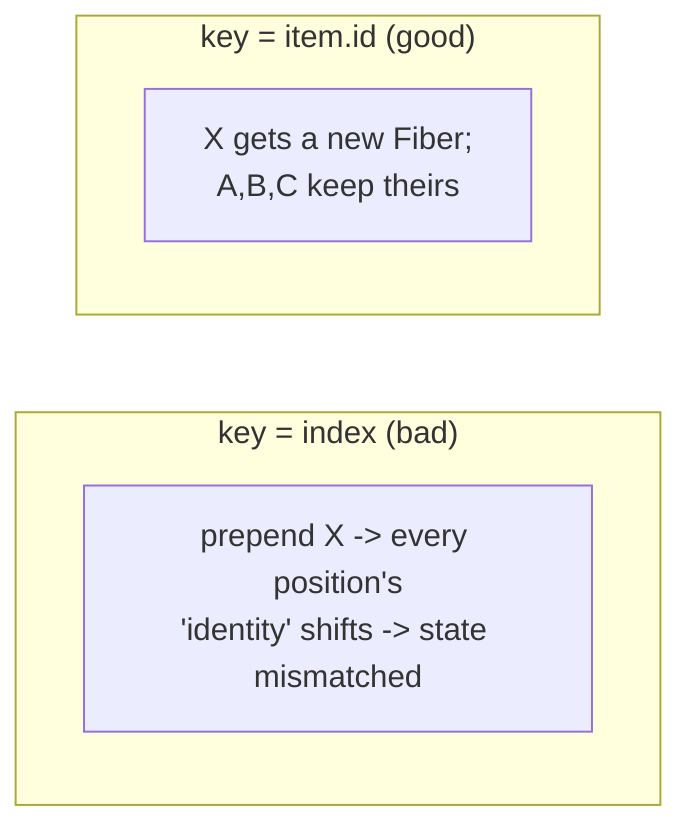
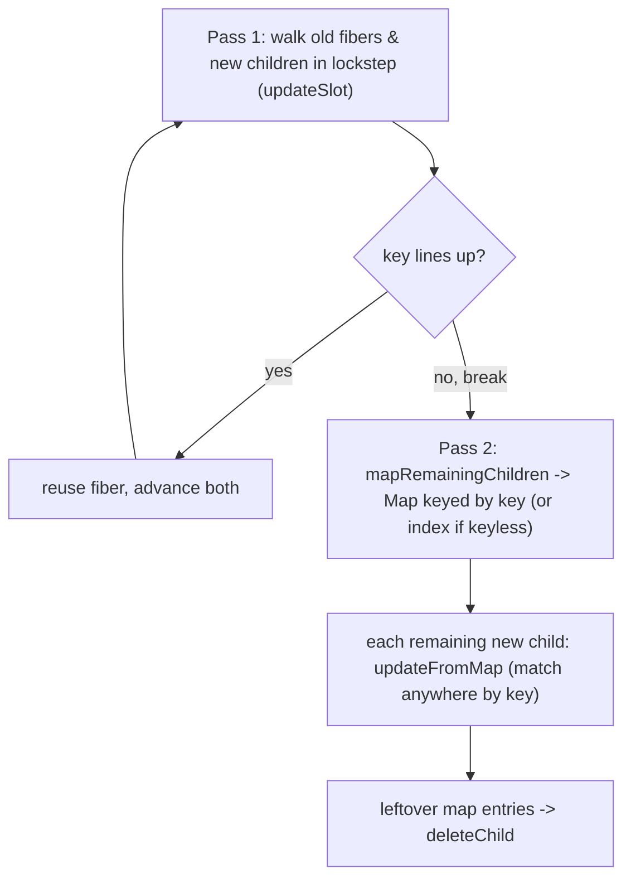

## Problem

Imagine you have two choreographies. One for today's show, one for tomorrow's. The director doesn't want to re-choreograph the entire dance from scratch — she wants to spot what changed and only fix those moves. React faces the exact same problem: every render gives it a new element tree, and it needs to figure out the cheapest way to update the DOM to match.

The naive approach — comparing every node in the old tree against every node in the new tree — is O(n³). That's catastrophic for a UI that re-renders dozens of times per second. React needs something fast enough, and it finds it by making two very practical assumptions about real UIs.

## Why Existing Solution Failed

Before React, developers reached into the DOM directly with jQuery or vanilla JavaScript. Every time something changed, you had to manually figure out which DOM nodes to touch, add, or remove. It was like editing a novel by hand with scissors and glue — it worked, but it was tedious, error-prone, and you'd inevitably forget a step.

Frameworks like Backbone.js tried to help by re-rendering entire templates on any change. That's the equivalent of rewriting a whole page when one word changes. Wasteful, slow, and it didn't scale.

React's virtual DOM plus its diffing algorithm was the first practical O(n) approach. But the abstraction leaks in practice. Developers misuse keys, cause unnecessary remounts, or don't understand what triggers a state reset. The diffing algorithm itself is rarely the problem — what trips people up is knowing when React keeps a Fiber versus when it throws it away and starts fresh.

## Mental Model

Here's the one thing that makes everything click: **React does NOT compare your new tree against the DOM. It compares your new element tree against the previous element tree, position by position, asking one question at each spot: "Same type as before?"**

Same type → keep the DOM node, keep the Fiber, keep its state, just update props. Different type → throw away that node and its entire subtree (and its state) and build it fresh from scratch.

`key` is how you tell React "ignore position — use identity instead." It's like putting name tags on chairs. Without name tags, React matches people to chairs by seat number. If you shuffle the chairs, the wrong people end up in the wrong seats. With name tags, React can match each person to their correct chair no matter where it moves.

## Visualization



Same type means reuse. Different type means rebuild. That's the entire diffing heuristic. Elegant, simple, fast.



Index keys shift identity on prepend or reorder. Stable keys follow the item wherever it moves. Think of index keys like assigned parking spots — park a new car in spot 0 and suddenly spot 0 has a different car, but React still thinks it's the original one. Stable keys are like license plates — the car carries its identity with it.

## Engine Simulation

**Type change wipes state.**

```jsx
{isWide ? <div><Profile/></div> : <section><Profile/></section>}
```

What happens internally: going from `div` to `section` is a type change at that position. React unmounts the whole subtree. `Profile` is destroyed and remounted, losing its state and re-running its effects. It's the same JSX `Profile` component, but it sits under a position whose type flipped. State lives on the Fiber at that position, and that position was rebuilt.

```
render A:  <div>      render B:  <section>
             └ Profile(state=X)     └ Profile(state=fresh)   ← type changed -> remount
```

**Lists and the index-key bug.**

```jsx
{items.map((it, i) => <Row key={i} item={it} />)}   // index as key
```

What happens internally: You have rows A, B, C with keys 0, 1, 2. Each `<Row>` holds local state (say a checkbox toggle). Now you prepend X. The list becomes X, A, B, C with keys 0, 1, 2, 3.

```
before:  key0->A(stateA)  key1->B(stateB)  key2->C(stateC)
after :  key0->X          key1->A          key2->B          key3->C
match by key:
  key0: A->X  reuse Fiber -> X now shows A's state!   (toggle leaks)
  key1: B->A  reuse Fiber -> A shows B's state
```

React matched by `key=0` and decided "row 0 is the same row, just new props." So it kept row 0's state and handed it to X. Every row's state shifted to the wrong item. It's like musical chairs — everyone moved, but the name tags stayed put.

The fix is a key that follows the item, not the slot:

```jsx
{items.map((it) => <Row key={it.id} item={it} />)}   // stable identity
```

Now `key=A.id` matches A's Fiber wherever A moves. Prepending X just mounts one new Fiber and reuses the rest correctly.

When is index-as-key fine? Only for static lists that never reorder, insert, or delete in the middle, and whose rows hold no state. Otherwise use a stable id.

## Internal Implementation

**Two reconcilers from one body.** `createChildReconciler(shouldTrackSideEffects)` produces two functions from the same code: `mountChildFibers` (skips deletion tracking, used for initial mount) and `reconcileChildFibers` (tracks Placement and ChildDeletion flags, used for updates). Think of it as one recipe with two serving modes — one for fresh dishes, one for reheating.

`reconcileChildFibersImpl` branches on the new child's type:
- Single element (`$$typeof === REACT_ELEMENT_TYPE`) calls `reconcileSingleElement`
- String or number calls text node handler
- Array calls `reconcileChildrenArray`
- Iterable calls the iterator variant

**Single element reuse rule.** `reconcileSingleElement` / `updateElement` reuse the existing fiber if `key` matches AND `current.elementType === element.type`. Then `useFiber(current, props)` (which is `createWorkInProgress` from Ch 04). State is preserved. Otherwise `deleteChild` + create a fresh fiber with `Placement`. State is lost.

**List diff: two passes (`reconcileChildrenArray`).** React deliberately does no two-ended diff. Source comment: "This algorithm can't optimize by searching from both ends since we don't have backpointers on fibers."



Pass 1 walks old and new children in lockstep, checking if keys line up. The moment one doesn't match, it breaks out and switches to Pass 2 — a Map-based lookup that finds matches anywhere in the remaining list. Leftover entries from the Map get deleted.

Pass 1 loops old + new in index lockstep. It calls `updateSlot`, which returns `null` the moment a key does not line up. This causes a `break`. Pass 2 uses `mapRemainingChildren` to build a `Map` keyed by `fiber.key`, falling back to `fiber.index` when key is null. Then `updateFromMap` matches each remaining new child by `newChild.key ?? newIdx`. Leftover map entries are deleted.

`placeChild(newFiber, lastPlacedIndex, newIndex)` decides moves. If a matched fiber's old index is less than `lastPlacedIndex`, it marks `Placement` (a move). Otherwise it advances `lastPlacedIndex`.

**Why index keys corrupt state: the exact mechanism.** Keyless (or index-keyed) children are stored under their index. `updateFromMap` looks up `newChild.key === null ? newIdx : newChild.key`. So index keys make React match by position. When you prepend, insert, or reorder, position N now holds a different logical item. But its key (the index) is unchanged. React reuses that position's fiber and hands it the new item. The old fiber's state and uncontrolled DOM (input text, focus, checkbox) attach to the wrong row.

## Real World Example

**Chat app with reordering messages.** You have a list of messages. Each message has a checkbox for selection. New messages arrive at the top with real-time updates.

```jsx
{messages.map((msg, i) => <MessageRow key={i} msg={msg} />)}
```

A new message arrives. It gets prepended. Keys 0,1,2 now point to different messages. Each `MessageRow` keeps its checkbox state from the previous message. The user sees the wrong messages selected. Frustrating and confusing.

Fix: use `key={msg.id}`. Now each message keeps its Fiber regardless of position. New messages get fresh Fibers. Old messages keep their checkbox state. Problem solved.

**Tab switcher with form state.** You toggle between two tabs that wrap content in different containers.

```jsx
{activeTab === "profile" ? <div><ProfileForm/></div> : <section><ProfileForm/></section>}
```

What happens internally: Switching tabs changes the wrapper from `div` to `section`. That is a type change at that position. React unmounts `ProfileForm` and remounts it fresh. The user's unsaved form data is lost. Devastating if they just filled out a long form.

Fix: use the same wrapper element type for both tabs, or give `ProfileForm` a `key` tied to the tab so React treats each tab's form as separate.

```jsx
{activeTab === "profile"
  ? <div><ProfileForm key="profile" /></div>
  : <div><ProfileForm key="settings" /></div>
}
```

Now each tab gets its own Fiber with independent state. The user can switch tabs without losing form data. The key here acts as a deliberate identity separator — each tab's form is a distinct entity in React's eyes.

## Tradeoffs

**Index keys vs stable keys.** Index keys are cheaper to compute and require no data model changes. But they cause state bugs on reorder, insert, or delete. Stable keys (item.id) are the safe default. Only use index keys for static, read-only lists that never change order.

**Random keys (`key={Math.random()}`).** This remounts every render. Every child is deleted and recreated. All state is lost. All effects re-run. Performance is worst possible. Never do this. It's the nuclear option for your component tree.

**Type change vs key change.** Changing the wrapper type (div to section) remounts the entire subtree. Changing a child's key remounts only that child. Use key changes for targeted remounts. Use type changes when the entire subtree structure is different.

**Reconciliation vs full rebuild.** Reconciliation is cheaper than full rebuild for most updates. But the comparison itself has a cost. For deeply nested trees with many siblings, key lookups and type checks add up. This is why list virtualization (Ch 08) matters: fewer Fibers to diff means less work.

## Common Mistakes

- **Index keys on dynamic or stateful lists.** State leaks to wrong rows. This is the #1 key bug.
- **Using a random key (`key={Math.random()}`).** Remounts every render, destroys state and perf.
- **Forgetting that a type change remounts.** You lose animation or input state when restructuring.
- **Assuming React diffs against the DOM.** It diffs element tree against previous element tree.
- **Thinking keys must be globally unique.** They only need to be unique among siblings. A key of `"a"` can appear in two different lists — just not in the same list twice.

## SDE-2 Interview Answer (Mid-level + Senior + Engineering Lead variants)

**Mid-level (SDE-1 / junior SDE-2):**

Question: "Why does React need keys?"

"Keys give list children stable identity. Without keys, React matches elements by position. When you reorder or insert items, position-based matching reuses the wrong Fiber. State and DOM attach to the wrong item. Keys tell React: 'this element is this item, wherever it moved.' The main purpose is correctness, not performance."

**Senior (SDE-2 / SDE-3):**

Question: "Changing a wrapper from div to section reset my form. Why?"

"React compares element types at each position. A div and a section are different types. Different type means React unmounts the old subtree and mounts a fresh one. The form's Fiber is destroyed, so its state is lost. State lives on the Fiber at a position. The position was rebuilt. Fix: use the same wrapper type for both branches, or use a key on the form to separate its state intentionally."

**Engineering Lead (Staff / Principal):**

Question: "How would you design a list component that handles reordering, insertion, and deletion without losing state?"

"First, use stable keys derived from item data (item.id or a composite key). Never use index keys. Second, ensure the data layer provides stable identifiers. If the API does not, generate IDs on the client on first load and persist them. Third, for complex lists with drag-and-drop reordering, use a library like `@dnd-kit` that manages key stability and DOM position. Fourth, educate the team on the type-change remount rule. When restructuring UI, keep wrapper types consistent to preserve child state. Use keys deliberately to reset state when needed, like `<Editor key={docId} />` to reset editor state per document."

## Follow-up Questions (5, progressively harder)

**Q1: Walk through the prepend-with-index-key bug, Fiber by Fiber. Then fix it.**

Given a list `[A, B, C]` rendered with `key={i}`, the fibers are:

```
key 0 → Fiber-A (state: checked=true)
key 1 → Fiber-B (state: checked=false)
key 2 → Fiber-C (state: checked=false)
```

You prepend X. New list is `[X, A, B, C]` with keys `0, 1, 2, 3`. Reconciliation runs:

- key 0: old Fiber-A vs new element X. Same key (0), so React reuses Fiber-A's DOM and state. But the element is X, so Fiber-A's props now say `item=X`. Fiber-A's checked state persists — it was A's checkbox state, now attached to X.
- key 1: old Fiber-B vs new element A. Reuses Fiber-B's state. A shows B's state.
- key 2: old Fiber-C vs new element B. Reuses Fiber-C's state. B shows C's state.
- key 3: no old fiber. New Fiber created for C. C gets fresh state.

The fix: use stable keys derived from item data, not position:

```jsx
{items.map((it) => <Row key={it.id} item={it} />)}
```

Now X gets a fresh Fiber (its `it.id` has no existing match). A, B, C keep their Fibers regardless of where they move. State stays attached to the correct items. See Ch 04 for how Fibers are the persistent instances that hold state across renders.

**Q2: Why is the general tree-diff O(n³) and what two assumptions make React's O(n)?**

The naive tree diff algorithm compares every node in tree A against every node in tree B to find the minimum number of operations (insert, delete, move) to transform A into B. This is the tree edit distance problem, which is O(n³) in general. For a UI that re-renders hundreds of times per second with thousands of nodes, this is catastrophic.

React's two heuristics bring this to O(n):

1. **Different types produce different trees.** If a node at position P changes from `<div>` to `<span>`, React does not try to find a matching `<div>` elsewhere in the new tree. It unmounts the entire subtree and builds a new one. This eliminates cross-level comparison. Each node is only compared against the node at the same position in the previous tree.

2. **Keys identify elements in lists.** Within a group of siblings, React uses the `key` prop to match elements across renders instead of relying on position. Without keys, React would need to compare every old child against every new child (O(n²)). With keys, React builds a map from keys to fibers in O(n) and looks up matches in O(1).

Together these assumptions mean React never compares across different levels of the tree, and within a level it uses O(1) key lookups instead of O(n) linear scans. The result is a single O(n) pass. See Ch 04 for how the fiber linked list enables this traversal without recursion.

**Q3: How would you intentionally force a subtree to reset its state?**

There are two mechanisms:

1. **Change the key.** Give the component a key tied to the data identity you want to reset on. When the key changes, React unmounts the old fiber and mounts a new one. All state and effects are destroyed and recreated fresh:

```jsx
<Editor key={documentId} />
```

When `documentId` changes, the editor's state resets. This is the cleanest approach because it is explicit and declarative.

2. **Change the wrapper element type.** Switching from `<div>` to `<section>` at the same position triggers a type-change remount:

```jsx
{isProfile
  ? <div><ProfileForm /></div>
  : <section><ProfileForm /></section>}
```

Both approaches destroy state and re-run effects. The key approach is preferred because it is intentional and does not depend on wrapping element types. The type-change approach is a side effect of reconciliation, not a recommended pattern. Use it only when you genuinely need different DOM structures. See Ch 03 for why the render phase is pure and why remounting is safe.

**Q4: Same-type vs different-type at a position: what happens to DOM, Fiber, state, and effects?**

**Same type (e.g., `<div>` to `<div>` with different children):**
- DOM node: reused. The real DOM element persists. Only its attributes and children are updated.
- Fiber: reused. The existing fiber's `alternate` pointer links it to the work-in-progress twin. Its `memoizedState` (hooks) persists. State is preserved.
- State: preserved. All useState and useReducer values carry over. The component does not remount.
- Effects: `useLayoutEffect` and `useEffect` from the previous render have their cleanup skipped if deps did not change. If deps changed, cleanup runs, then the new effect runs.

**Different type (e.g., `<div>` to `<section>`):**
- DOM node: destroyed. The old DOM node is removed from the document. A new one is created.
- Fiber: destroyed. The old fiber and its entire subtree are unmounted. A new fiber tree is built from scratch.
- State: lost. All useState and useReducer values are gone. The new fiber starts with initial state.
- Effects: all previous effects are cleaned up (the unmount cleanup functions run). Then all new effects run as if this were a fresh mount.

This is why switching wrapper types destroys form state, scroll position, and local component state. The position was rebuilt. See Ch 04 for how the commit phase applies these DOM mutations atomically.

**Q5: Is `key` globally unique? What happens if keys collide among siblings?**

Keys are not globally unique. They only need to be unique among siblings. A key of `"a"` can appear in two different lists — it just cannot appear twice in the same list. React uses keys only within a single parent's children to identify elements during reconciliation.

If two siblings have the same key, React treats them as the same element during diffing. The first match reuses the fiber, and the second match also tries to reuse or create based on the same key. This causes state confusion — both elements may share or overwrite each other's state because React cannot distinguish them. In practice, React may log a warning in development, but the behavior is undefined. The second element with the duplicate key may overwrite the first's fiber, or React may create a new fiber and cause unexpected unmounts. Always use unique keys among siblings. For list items, use `item.id` or a composite key like `${type}-${id}`. See Ch 04 for how the two-pass reconciliation algorithm uses keys in its map-based lookup.

## Mental Trigger

**Type change means remount. Key is identity. State lives on the Fiber at a position.**

## One Page Revision

- React diffs new element tree vs previous, per position, type-first. O(n) via two heuristics.
- Same type means reuse Fiber, DOM, and state, then update props.
- Different type means unmount subtree and remount. State and effects reset.
- State lives on the Fiber at a position, not on your JSX variable.
- `key` redefines identity in lists so reorders match by item, not by position.
- Index keys cause state bugs on reorder, insert, or delete. Use stable item IDs.
- Random keys (`Math.random()`) remount every render. Never use them.
- Use a changing key deliberately (`key={docId}`) to force a reset.
- The real reconciler uses two passes: lockstep then keyed map.
- `reconcileSingleElement` checks `elementType` match plus `key` match. Both must line up.
- `placeChild` determines moves by comparing old index to `lastPlacedIndex`.
