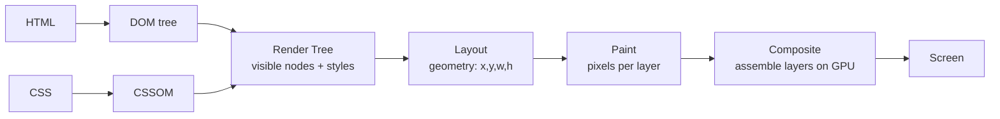
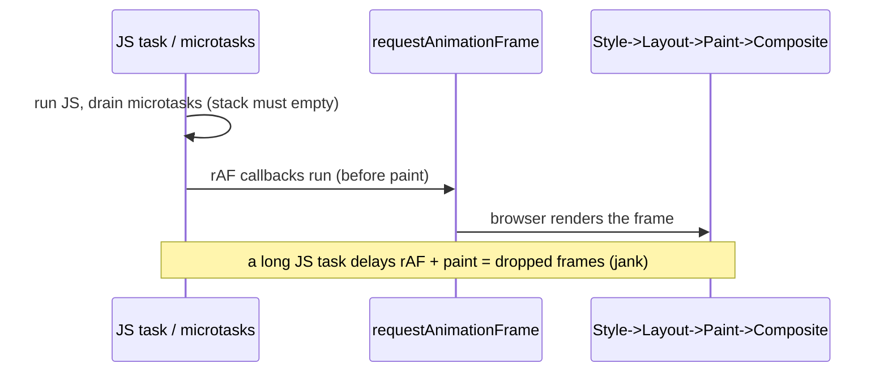

## Problem

Ever noticed your page stutter when you animate something? Or why a smooth scroll suddenly becomes janky? Here’s the core issue: every time you change an element, the browser has to figure out what it looks like, where it sits, and how to draw it. But it can’t just do this all at once—because one change affects the next. For example, if you change an element’s width, its position might shift, which might push its siblings, which might change the parent’s size. So the browser breaks this into stages, like an assembly line. And since there’s only one main thread handling your JavaScript, any heavy work there means no frames get painted—your page freezes.

## Why Existing Solution Failed

Before modern browsers, every visual change meant redrawing everything from scratch. Even a tiny color tweak could force a full repaint of the entire region. Developers noticed that `transform` animations felt smoother than `top` animations, but they couldn’t explain why. They’d blame the browser or their framework.

Today, browsers use compositing layers and GPU acceleration to help, but the pipeline is still mostly sequential. Developers still create layout thrashing by mixing DOM reads and writes. They still animate expensive properties because they don’t understand the stages. The core issue remains: if you don’t know the pipeline, you can’t optimize it.

## Mental Model

Imagine an assembly line where your HTML and CSS are raw materials, and pixels are the finished product. The line has fixed stations: DOM + CSSOM → Render Tree → Layout → Paint → Composite. Each station does one job, and you can’t skip ahead. But here’s the key insight: **the later in the pipeline you make changes, the cheaper it is.** Changing geometry (like width or top) restarts the line at Layout—the most expensive stage. Changing colors restarts at Paint—medium cost. Changing `transform` or `opacity` only touches Composite—the cheapest, GPU-accelerated stage.

Why does this matter? Because performance isn’t about doing less—it’s about doing work at the right stage. Once you grasp this, you’ll instinctively pick the right properties to animate.

## Visualization



Each stage depends on the previous one. You can’t paint without layout. You can’t layout without the render tree.



A long JS task pushes everything past the frame budget. No paint happens until JS yields.

## Engine Simulation

**What each change re-triggers.**

```
change a node's width / top / font-size / add-remove DOM
        └─> LAYOUT -> PAINT -> COMPOSITE        (reflow, most expensive)

change a node's color / background / box-shadow / visibility
        └─> PAINT -> COMPOSITE                 (repaint, medium)

change a node's transform / opacity (on its own layer)
        └─> COMPOSITE only                    (cheapest, GPU)
```

This table is the whole chapter. Animate `transform: translateX()` not `left`. Animate `opacity` not `visibility` or `display`. The smooth versus janky difference is which stage you restart.

**Layout thrashing.**

Here’s the trap: if you read and write DOM properties in a loop, you force layout to run repeatedly within one frame. It’s like checking a blueprint, then changing it, then checking it again—each check invalidates the previous one.

```js
// thrashing: each read forces a synchronous layout because the previous write invalidated it
for (const box of boxes) {
  const w = box.offsetWidth;       // READ -> forces layout (flush pending writes)
  box.style.width = w + 10 + "px"; // WRITE -> invalidates layout
}                                  // next iteration forces layout AGAIN -> N layouts
```

What happens internally: The browser defers recomputation until the next layout pass. But when you read a layout property like `offsetWidth`, it must flush all pending invalidations to give you a correct answer. So each read after a write forces synchronous layout. With N elements, you trigger N layout passes in one frame. That’s jank.

```
write -> invalidate -> READ forces layout -> write -> invalidate -> READ forces layout -> ...
   (N elements means ~N synchronous layouts in one frame)
```

Fix: batch all reads, then all writes.

```js
// one layout: read everything first, then write everything
const widths = boxes.map(b => b.offsetWidth);   // reads (one layout)
boxes.forEach((b, i) => b.style.width = widths[i] + 10 + "px"); // writes (one layout next frame)
```

Layout-forcing properties: `offsetTop`, `offsetWidth`, `offsetHeight`, `getBoundingClientRect()`, `scrollTop`, `getComputedStyle()`. Reading any of these flushes pending work synchronously.

## Internal Implementation

**The render tree.** The browser builds the render tree from the DOM and CSSOM. It includes only visible nodes: `display:none` nodes are excluded, `visibility:hidden` nodes are included but marked invisible. Each node has computed styles.

**Layout (reflow).** The browser computes geometry: position (x, y) and size (width, height) for each render tree node. This is a recursive walk. Changing one node’s width can cascade to siblings, children, and parent. Layout is expensive because it recalculates the box model for affected subtrees.

**Paint.** The browser fills in pixels for each render tree node: text, colors, images, borders, shadows. Paint is typically done per layer. Chrome uses Skia for rasterization. Layers are painted independently.

**Composite.** The browser takes all painted layers and composites them on the GPU. This is the only stage that runs on the compositor thread, not the main thread. Compositing is cheap because it just blends pre-rasterized textures.

**Layer promotion with `will-change`.** The `will-change` CSS property tells the browser a property will change. The browser promotes the element to its own compositor layer. This moves paint work off the main thread. But too many layers cost GPU memory. Use sparingly for elements you animate continuously.

**`requestAnimationFrame`.** Runs callbacks right before the browser paints. It fires after all JS tasks and microtasks have drained. The callback receives a high-resolution timestamp. Use it for visual updates to align with the frame cycle. A 50ms JS task blows the ~16.7ms frame budget at 60fps. That means dropped frames.

## Real World Example

**Product page with scroll-triggered animations.** You have a product listing page. Each product card has a hover animation. As the user scrolls, you read `scrollTop` and set `transform` values to create parallax effects.

```js
function onScroll() {
  const cards = document.querySelectorAll(".product-card");
  for (const card of cards) {
    const rect = card.getBoundingClientRect();  // READ (forces layout)
    card.style.transform = `translateY(${rect.top * 0.3}px)`; // WRITE (invalidates layout)
    card.style.opacity = Math.max(0, 1 - rect.top / 500);     // WRITE (composite only)
  }
}
```

What happens internally: Each scroll event fires the handler. `getBoundingClientRect()` forces synchronous layout. Then `style.transform` is a composite-only change, but the layout flush already happened. The next scroll event fires before the frame completes, causing another forced layout. This creates a cascade of forced layouts per scroll tick.

Fix: batch reads first, then writes. Or better, use IntersectionObserver (Ch 17) to avoid scroll handlers entirely.

```js
function onScroll() {
  const rects = cards.map(c => c.getBoundingClientRect());  // all reads (one forced layout)
  cards.forEach((card, i) => {
    card.style.transform = `translateY(${rects[i].top * 0.3}px)`;
    card.style.opacity = Math.max(0, 1 - rects[i].top / 500);
  });
}
```

Now one forced layout per scroll tick instead of N.

## Tradeoffs

**`transform` vs `top`/`left` for animation.** `top` and `left` change geometry. They restart at Layout every frame, then paint, then composite. This is expensive and janky. `transform` is handled by the compositor on the GPU. It skips layout and paint. It only re-composites. The visual move is the same but far cheaper.

**`opacity` vs `visibility`/`display` for show/hide.** `opacity: 0` only triggers composite (if on its own layer). `visibility: hidden` triggers paint (the element still occupies layout space). `display: none` triggers layout (removes from flow). For smooth transitions, use `opacity`.

**`will-change` cost.** Promoting an element to its own compositor layer costs GPU memory. Each layer is a texture. Too many layers exceeds GPU memory, especially on mobile. Use `will-change` only on elements you animate continuously, and only for the properties you animate. Remove it when the animation stops.

**Layout thrashing vs batching.** The thrashing fix costs time: you must collect all reads before writes. This may mean two loops instead of one. But the layout cost saved is far larger than the extra loop. Always batch.

**RAF vs `setTimeout` for visual updates.** `requestAnimationFrame` fires before paint, aligned with the frame cycle. `setTimeout(fn, 16)` may fire mid-frame or after paint, causing double layout or missed frames. Always use RAF for visual updates.

## Common Mistakes

- **Animating `width`/`height`/`top`/`margin`** for smooth motion. Use `transform` or `opacity` instead.
- **Reading layout props inside a write loop.** This causes thrashing.
- **Overusing `will-change` or layer promotion.** Too many GPU layers costs memory. Use sparingly.
- **Blaming React for jank that is actually layout/paint or a long task.** Profile first.
- **Thinking `display:none` to `block` is cheap.** It is a reflow (and remounts in React subtrees).

## SDE-2 Interview Answer (Mid-level + Senior + Engineering Lead variants)

**Mid-level (SDE-1 / junior SDE-2):**

Question: "Why animate with `transform` instead of `top`/`left`?"

"Think of the browser as an assembly line. Changing `top` or `left` restarts the entire line at the Layout station—expensive. `transform` skips Layout and Paint, going straight to Composite on the GPU. Same visual result, but way cheaper."

**Senior (SDE-2 / SDE-3):**

Question: "What is layout thrashing and how do you fix it?"

"Layout thrashing is when you force the browser to recalculate layout multiple times in one frame by mixing reads and writes. For example, reading `offsetWidth` after setting `style.width` flushes pending layout work. If you do this in a loop with N elements, you get N layout passes. The fix is to batch: read all layout properties first, then write all style changes. This collapses everything into one layout pass."

**Engineering Lead (Staff / Principal):**

Question: "Your product page has janky scroll animations. How do you diagnose and fix it?"

"First, I’d open the Performance panel and record a scroll. I’d look for repeated purple (layout) or green (paint) bars within a single frame—that’s a sign of thrashing. I’d identify which properties trigger layout, often `scrollTop` or `getBoundingClientRect` in a scroll handler. The immediate fix is to batch reads before writes. But a better approach is to move visual updates to `requestAnimationFrame` to align with the frame cycle. The best solution might be to replace scroll handlers with IntersectionObserver for visibility-based effects. For animations, stick to `transform` and `opacity`. If geometry reads are unavoidable, I’d isolate them in a separate rAF callback. Finally, I’d ensure the team understands the pipeline cost order so we avoid these issues by design."

## Follow-up Questions (5, progressively harder)

**Q1: For each change, which pipeline stages re-run: width change, color change, `transform` change?**

A **width change** is a geometry change. It affects the element's box model, which may cascade to siblings and parents. This restarts at **Layout** — the browser must recalculate position and size for the affected subtree. After Layout, **Paint** runs to re-rasterize the affected area, then **Composite** assembles layers on the GPU. All three stages re-run. This is the most expensive path.

A **color change** (background, text color, box-shadow) does not affect geometry. Layout is unchanged. The browser skips Layout and restarts at **Paint** — it must re-rasterize the pixels for the affected element. Then **Composite** assembles the updated layer. Two stages re-run. This is medium cost.

A **transform change** (translateX, rotate, scale) on an element with its own compositor layer affects neither geometry nor paint. The browser skips Layout and Paint entirely. Only **Composite** re-runs — the GPU repositions the pre-rasterized texture. One stage re-runs. This is the cheapest path. See Ch 08 for why this distinction is the foundation of all CSS animation performance advice.

**Q2: Write thrashing code, then fix it. Explain why the fix is one layout.**

Thrashing code:

```js
for (const box of boxes) {
  const w = box.offsetWidth;       // READ — forces layout
  box.style.width = w + 10 + "px"; // WRITE — invalidates layout
}
```

Each iteration: reading `offsetWidth` flushes all pending style/layout invalidations to give a correct answer. Then writing `style.width` invalidates layout for the next read. With N elements, the browser runs N synchronous layout passes within one frame. Each layout recalculates geometry for affected subtrees, which is O(subtree size).

Fixed code:

```js
const widths = boxes.map(b => b.offsetWidth);  // all reads — one layout
boxes.forEach((b, i) => {
  b.style.width = widths[i] + 10 + "px";       // all writes — no layout yet
});
```

Why this is one layout: the first loop reads all `offsetWidth` values. The first read forces one synchronous layout flush. All subsequent reads in that loop hit the already-flushed layout (no pending invalidations exist yet). Then the write loop sets all widths. These writes invalidate layout, but no more reads happen, so no more forced layouts. The invalidated layout will be recalculated on the next frame when the browser needs it for paint. Result: one forced layout instead of N. See Ch 02 for how this interacts with the event loop's frame scheduling.

**Q3: What is the frame budget at 60fps, and what happens to paint during a 40ms task?**

At 60fps, the browser must produce one frame every 16.67ms (1000ms ÷ 60). This is the frame budget. Within each frame, the browser must: run JS tasks and microtasks, fire requestAnimationFrame callbacks, then run the rendering pipeline (style → layout → paint → composite).

If a JS task takes 40ms, it blows the frame budget by more than 2x. During those 40ms, the call stack is never empty (Ch 02). The browser cannot run requestAnimationFrame callbacks, cannot start layout, cannot paint. The frame is dropped entirely. The user sees the previous frame held on screen for 40ms — a visible stutter or jank. If the user is scrolling, the scroll appears to freeze. If they are typing, characters appear late.

After the 40ms task finishes, the browser gets one shot to paint. But if the next task is already queued, painting may be delayed further. The result: multiple dropped frames in a row if long tasks pile up. This is why keeping individual tasks under 16ms is critical. Use `startTransition` for expensive renders (Ch 04), chunk work with `setTimeout` (Ch 02), or move computation to a Web Worker (Ch 17). See Ch 08 for how Core Web Vitals measure this in production.

**Q4: Why is `transform` GPU-composited and `top` not?**

`top`, `left`, `margin`, `width`, `height` are layout-triggering properties. They change the element's geometry in the box model. The browser must recalculate where the element sits relative to its parent and siblings. This requires Layout (reflow), which runs on the main thread. Since Layout invalidates the element's position, Paint must also re-run. Only then can Composite assemble layers. Two main-thread stages are triggered.

`transform` operates on the compositor thread, not the main thread. When an element is promoted to its own compositor layer (via `will-change`, `translateZ(0)`, or browser heuristics), its visual output is rasterized into a GPU texture. `transform` modifies how that texture is positioned, rotated, or scaled — but the texture itself does not change. The compositor thread applies the transform directly on the GPU without touching Layout or Paint. This is why `transform` animations feel smooth even during busy main threads — they bypass the main thread entirely after initial rasterization.

The key distinction: properties that affect *where* the element sits in the layout flow (geometry) must go through Layout. Properties that affect *how* an already-painted texture is displayed (compositing) can run on the GPU compositor thread. `transform` and `opacity` fall in the latter category. See Ch 08 for why this is the basis of all CSS animation optimization.

**Q5: Where does `requestAnimationFrame` fire relative to paint? Why use it for visual updates instead of `setTimeout`?**

`requestAnimationFrame` (rAF) fires after all JS tasks and microtasks have drained, but *before* the browser runs the rendering pipeline (style → layout → paint → composite). The sequence within a frame is:

1. Run JS tasks and microtasks (event handlers, setTimeout callbacks, Promise reactions)
2. Fire rAF callbacks (aligned to the frame)
3. Run rendering pipeline: style → layout → paint → composite
4. Present the frame to the screen

This timing means rAF callbacks run at the ideal moment to make visual updates: after the latest data is available (tasks done) but before the browser paints (so your changes are included in this frame's paint).

Use rAF instead of `setTimeout` for visual updates because `setTimeout(fn, 16)` does not guarantee alignment with the frame cycle. The timeout may fire mid-frame (after paint has started), causing a double layout. Or it may fire after paint, meaning your update is not visible until the next frame — an extra 16ms of latency. Worse, `setTimeout` has a 4ms minimum clamp for nested timers, adding unpredictability. `requestAnimationFrame` fires exactly once per frame, synchronized with the browser's vsync signal. This eliminates double-painting, aligns updates with the frame budget, and produces the smoothest possible visual results. See Ch 02 for how rAF fits into the event loop's rendering opportunity check.

## Mental Trigger

**Pipeline order is cost order. Later is cheaper. Transform skips layout and paint.**

## One Page Revision

- Pixels come from DOM + CSSOM to Render Tree to Layout to Paint to Composite.
- Pipeline order is cost order. Restarting earlier in the pipeline is more expensive.
- Geometry changes (width, top, font-size) reflow Layout. Most expensive.
- Color changes (background, box-shadow) repaint Paint. Medium.
- `transform` and `opacity` only composite on GPU. Cheapest.
- Layout thrashing: interleaving DOM reads and writes forces repeated synchronous layout.
- Fix thrashing: batch all reads, then all writes.
- Layout-forcing reads: `offsetTop/Width/Height`, `getBoundingClientRect()`, `scrollTop`, `getComputedStyle()`.
- `requestAnimationFrame` fires before paint. Use it for visual updates.
- Long JS tasks (Ch 02) block paint. Frame budget at 60fps is ~16.7ms.
- `will-change` promotes to compositor layer. Costs GPU memory. Use sparingly.
- `transform` is composited on the GPU. It skips layout and paint entirely.