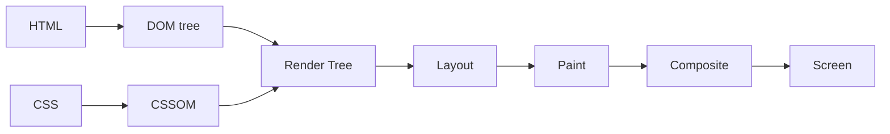
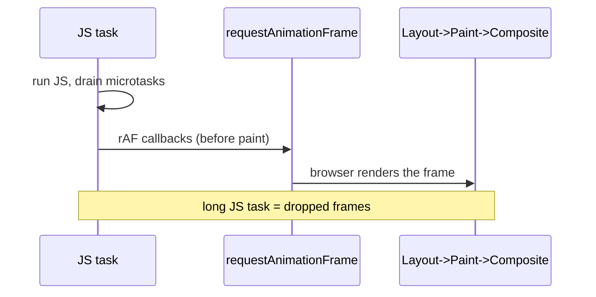

## The Problem

Every time you change an element, the browser has to figure out what it looks like, where it sits, and how to draw it. But one change affects the next — change an element's width and its position shifts, pushing siblings, changing the parent's size. The browser breaks this into stages, like an assembly line. And since there's only one main thread handling your JavaScript, any heavy work there means no frames get painted.

## The One Insight

**The later in the pipeline you make changes, the cheaper it is.** Changing geometry (width, top) restarts at Layout — the most expensive stage. Changing colors restarts at Paint — medium cost. Changing `transform` or `opacity` only touches Composite — the cheapest, GPU-accelerated stage.

Performance isn't about doing less. It's about doing work at the right stage.



## What Each Change Re-Triggers

```
change width / top / font-size / add-remove DOM
        └─> LAYOUT -> PAINT -> COMPOSITE        (reflow, most expensive)

change color / background / box-shadow / visibility
        └─> PAINT -> COMPOSITE                 (repaint, medium)

change transform / opacity (on its own layer)
        └─> COMPOSITE only                    (cheapest, GPU)
```

This is the whole chapter. Animate `transform: translateX()` not `left`. Animate `opacity` not `visibility`. The smooth versus janky difference is which stage you restart.

## Layout Thrashing

The trap: reading and writing DOM properties in a loop forces layout to run repeatedly within one frame.

```js
// thrashing: each read forces a synchronous layout
for (const box of boxes) {
  const w = box.offsetWidth;       // READ -> forces layout
  box.style.width = w + 10 + "px"; // WRITE -> invalidates layout
}
```

When you read a layout property like `offsetWidth`, the browser must flush all pending invalidations to give a correct answer. Each read after a write forces synchronous layout. With N elements, you trigger N layout passes in one frame.

Fix: batch all reads, then all writes.

```js
const widths = boxes.map(b => b.offsetWidth);  // all reads (one layout)
boxes.forEach((b, i) => b.style.width = widths[i] + 10 + "px"); // all writes
```

Layout-forcing properties: `offsetTop`, `offsetWidth`, `offsetHeight`, `getBoundingClientRect()`, `scrollTop`, `getComputedStyle()`.

## Frame Budget

At 60fps, the browser must produce one frame every 16.67ms. Within each frame: run JS tasks and microtasks, fire requestAnimationFrame callbacks, then run the rendering pipeline (style → layout → paint → composite).

A 40ms JS task blows the frame budget by 2x. The browser cannot paint. The frame is dropped. The user sees a stutter.



## Real World: Scroll-Triggered Animations

```js
function onScroll() {
  const cards = document.querySelectorAll(".product-card");
  for (const card of cards) {
    const rect = card.getBoundingClientRect();  // READ (forces layout)
    card.style.transform = `translateY(${rect.top * 0.3}px)`; // WRITE
    card.style.opacity = Math.max(0, 1 - rect.top / 500);     // WRITE
  }
}
```

Each scroll event: `getBoundingClientRect()` forces synchronous layout, then writes invalidate layout for the next scroll event. Cascade of forced layouts per scroll tick.

Fix: batch reads first, then writes. Or use IntersectionObserver to avoid scroll handlers entirely.

```js
function onScroll() {
  const rects = cards.map(c => c.getBoundingClientRect());  // one layout
  cards.forEach((card, i) => {
    card.style.transform = `translateY(${rects[i].top * 0.3}px)`;
    card.style.opacity = Math.max(0, 1 - rects[i].top / 500);
  });
}
```

## `will-change` and Layers

`will-change` tells the browser a property will change. The browser promotes the element to its own compositor layer, moving paint work off the main thread. But too many layers cost GPU memory. Use sparingly for elements you animate continuously.

`requestAnimationFrame` fires right before the browser paints, aligned with the frame cycle. Use it for visual updates. `setTimeout(fn, 16)` may fire mid-frame or after paint, causing double layout or missed frames.

## Common Mistakes

- **Animating `width`/`height`/`top`/`margin`** for smooth motion. Use `transform` or `opacity`.
- **Reading layout props inside a write loop.** This causes thrashing.
- **Overusing `will-change`.** Too many GPU layers cost memory.
- **Blaming React for jank that is layout/paint or a long task.** Profile first.

## Mental Trigger

**Pipeline order is cost order. Later is cheaper. Transform skips layout and paint.**

## Q&A

**Q: For each change, which pipeline stages re-run: width, color, transform?**
Width change: Layout → Paint → Composite (all three, most expensive). Color change: Paint → Composite (two stages, medium). Transform change: Composite only (cheapest, GPU-accelerated).

**Q: Write thrashing code, then fix it.**
Thrashing: `for (const box of boxes) { const w = box.offsetWidth; box.style.width = w + 10 + "px"; }` — each read forces a synchronous layout, each write invalidates it. N elements = N layouts. Fix: `const widths = boxes.map(b => b.offsetWidth); boxes.forEach((b, i) => b.style.width = widths[i] + 10 + "px");` — one layout for all reads, writes don't trigger layout until next frame.

**Q: Why is `transform` GPU-composited and `top` not?**
`top` changes geometry — the element's position in the layout flow. Browser must recalculate where it sits relative to siblings. Requires Layout on the main thread. `transform` modifies how a pre-rasterized texture is positioned on the GPU. The compositor thread applies it without touching Layout or Paint.

**Q: Where does requestAnimationFrame fire relative to paint?**
After all JS tasks and microtasks drain, but *before* the rendering pipeline (style → layout → paint → composite). This is the ideal moment for visual updates: after the latest data is available but before the browser paints.
