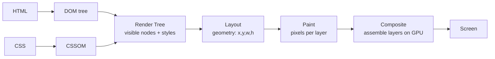
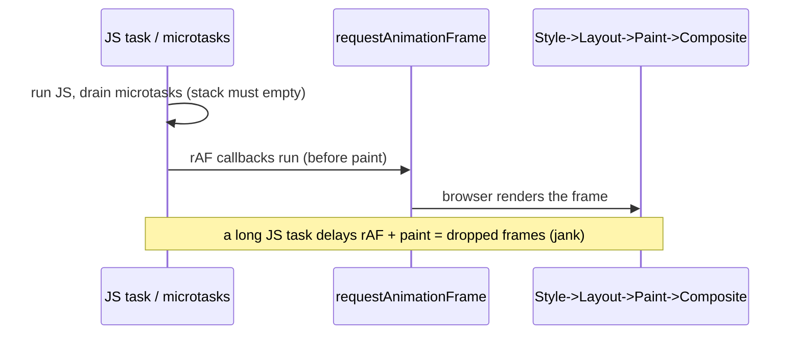

## Problem

The browser must answer for every element: what are you, what CSS applies, how big are you, where do you go, what color, who is on top? It cannot do that in one pass. Size depends on CSS. Position depends on siblings. Painting depends on position. Stacking depends on paint. So the work is staged.

And because there is one main thread (Ch 02), this work competes with your JS. A long task means no frame gets painted. The page freezes.

## Why Existing Solution Failed

Before modern compositing pipelines, browsers redrew everything from scratch on each frame. Every visual change, even a simple color shift, could trigger a full repaint of the affected region. There was no GPU acceleration for CSS animations. Developers learned by trial that `transform` animations were smoother than `top` animations, but could not explain why. They blamed the browser or the framework.

Modern browsers added compositing layers and GPU acceleration. But the pipeline is still sequential and mostly single-threaded. Developers still cause layout thrashing by interleaving DOM reads and writes. They still animate expensive properties because they do not understand the pipeline stages.

## Mental Model

The browser turns your DOM plus CSS into pixels through a fixed pipeline:

DOM + CSSOM to Render Tree to Layout (where and how big) to Paint (fill in pixels) to Composite (stack layers on GPU).

The golden rule: the later in the pipeline a change starts, the cheaper it is. Changing geometry (width, top) restarts at Layout, which is expensive. Changing colors restarts at Paint, which is medium. Changing `transform` or `opacity` only re-composites on the GPU, which is the cheapest.

Key ideas:
- Pipeline order is cost order. Restart at Layout (worst), then Paint (medium), then Composite (best).
- Reflow (layout) recomputes geometry for the changed node and often its neighbors and parents.
- `transform` and `opacity` are handled by the compositor. They skip layout and paint.
- Layout is synchronous on the main thread. Reading a layout property forces it to run now.

## Visualization



Each stage depends on the previous one. You cannot paint without layout. You cannot layout without the render tree.



A long JS task pushes everything past the frame budget. No paint happens until JS yields.

## Engine Simulation

**What each change re-triggers.**

```
change a node's width / top / font-size / add-remove DOM
        └─> LAYOUT -> PAINT -> COMPOSITE        (reflow, most expensive)

change a node's color / background / box-shadow / visibility
        └─> PAINT -> COMPOSITE                 (repaint, medium)

change a node's transform / opacity (on its own layer)
        └─> COMPOSITE only                    (cheapest, GPU)
```

This table is the whole chapter. Animate `transform: translateX()` not `left`. Animate `opacity` not `visibility` or `display`. The smooth versus janky difference is which stage you restart.

**Layout thrashing.**

The trap: interleaving DOM reads and writes forces layout to run repeatedly within one frame.

```js
// thrashing: each read forces a synchronous layout because the previous write invalidated it
for (const box of boxes) {
  const w = box.offsetWidth;       // READ -> forces layout (flush pending writes)
  box.style.width = w + 10 + "px"; // WRITE -> invalidates layout
}                                  // next iteration forces layout AGAIN -> N layouts
```

What happens internally: The browser tracks dirty styles and layout. It defers recomputation until the next layout pass. But when you read a layout property like `offsetWidth`, it must flush all pending invalidations to give you a correct answer. So each `offsetWidth` read after a `style.width` write forces synchronous layout. With N elements, you trigger N layout passes in one frame. This is jank.

```
write -> invalidate -> READ forces layout -> write -> invalidate -> READ forces layout -> ...
   (N elements means ~N synchronous layouts in one frame)
```

Fix: batch all reads, then all writes (read phase, then write phase).

```js
// one layout: read everything first, then write everything
const widths = boxes.map(b => b.offsetWidth);   // reads (one layout)
boxes.forEach((b, i) => b.style.width = widths[i] + 10 + "px"); // writes (one layout next frame)
```

Layout-forcing properties: `offsetTop`, `offsetWidth`, `offsetHeight`, `getBoundingClientRect()`, `scrollTop`, `getComputedStyle()`. Reading any of these flushes pending style and layout work synchronously. That is why reading them in a loop after writing causes thrashing.

## Internal Implementation

**The render tree.** The browser builds the render tree from the DOM and CSSOM. It includes only visible nodes: `display:none` nodes are excluded, `visibility:hidden` nodes are included but marked invisible. Each render tree node has computed styles.

**Layout (reflow).** The browser computes geometry: position (x, y) and size (width, height) for each render tree node. This is a recursive walk. Changing one node's width can cascade to siblings, children, and parent. Layout is expensive because it recalculates the box model for affected subtrees.

**Paint.** The browser fills in pixels for each render tree node: text, colors, images, borders, shadows. Paint is typically done per layer. Chrome uses Skia for rasterization. Layers are painted independently.

**Composite.** The browser takes all painted layers and composites them on the GPU. This is the only stage that runs on the compositor thread, not the main thread. Compositing is cheap because it just blends pre-rasterized textures.

**Layer promotion with `will-change`.** The `will-change` CSS property tells the browser a property will change. The browser promotes the element to its own compositor layer. This moves paint work off the main thread. But too many layers costs GPU memory. Use sparingly for elements you animate continuously.

**`requestAnimationFrame`.** Runs callbacks right before the browser paints. It fires after all JS tasks and microtasks have drained. The callback receives a high-resolution timestamp. Use it for visual updates to align with the frame cycle. A 50ms JS task blows the ~16.7ms frame budget at 60fps. That means dropped frames.

## Real World Example

**Product page with scroll-triggered animations.** You have a product listing page. Each product card has a hover animation. As the user scrolls, you read `scrollTop` and set `transform` values to create parallax effects.

```js
function onScroll() {
  const cards = document.querySelectorAll(".product-card");
  for (const card of cards) {
    const rect = card.getBoundingClientRect();  // READ (forces layout)
    card.style.transform = `translateY(${rect.top * 0.3}px)`; // WRITE (invalidates layout)
    card.style.opacity = Math.max(0, 1 - rect.top / 500);     // WRITE (composite only)
  }
}
```

What happens internally: Each scroll event fires the handler. `getBoundingClientRect()` forces synchronous layout. Then `style.transform` is a composite-only change, but the layout flush already happened. The next scroll event fires before the frame completes, causing another forced layout. This creates a cascade of forced layouts per scroll tick.

Fix: batch reads first, then writes. Or better, use IntersectionObserver (Ch 17) to avoid scroll handlers entirely.

```js
function onScroll() {
  const rects = cards.map(c => c.getBoundingClientRect());  // all reads (one forced layout)
  cards.forEach((card, i) => {
    card.style.transform = `translateY(${rects[i].top * 0.3}px)`;
    card.style.opacity = Math.max(0, 1 - rects[i].top / 500);
  });
}
```

Now one forced layout per scroll tick instead of N.

## Tradeoffs

**`transform` vs `top`/`left` for animation.** `top` and `left` change geometry. They restart at Layout every frame, then paint, then composite. This is expensive and janky. `transform` is handled by the compositor on the GPU. It skips layout and paint. It only re-composites. The visual move is the same but far cheaper.

**`opacity` vs `visibility`/`display` for show/hide.** `opacity: 0` only triggers composite (if on its own layer). `visibility: hidden` triggers paint (the element still occupies layout space). `display: none` triggers layout (removes from flow). For smooth transitions, use `opacity`.

**`will-change` cost.** Promoting an element to its own compositor layer costs GPU memory. Each layer is a texture. Too many layers exceeds GPU memory, especially on mobile. Use `will-change` only on elements you animate continuously, and only for the properties you animate. Remove it when the animation stops.

**Layout thrashing vs batching.** The thrashing fix costs time: you must collect all reads before writes. This may mean two loops instead of one. But the layout cost saved is far larger than the extra loop. Always batch.

**RAF vs `setTimeout` for visual updates.** `requestAnimationFrame` fires before paint, aligned with the frame cycle. `setTimeout(fn, 16)` may fire mid-frame or after paint, causing double layout or missed frames. Always use RAF for visual updates.

## Common Mistakes

- **Animating `width`/`height`/`top`/`margin`** for smooth motion. Use `transform` or `opacity` instead.
- **Reading layout props inside a write loop.** This causes thrashing.
- **Overusing `will-change` or layer promotion.** Too many GPU layers costs memory. Use sparingly.
- **Blaming React for jank that is actually layout/paint or a long task.** Profile first.
- **Thinking `display:none` to `block` is cheap.** It is a reflow (and remounts in React subtrees).

## SDE-2 Interview Answer (Mid-level + Senior + Engineering Lead variants)

**Mid-level (SDE-1 / junior SDE-2):**

Question: "Why animate with `transform` instead of `top`/`left`?"

"`top` and `left` change geometry. They restart at Layout every frame (then paint, then composite). This is expensive and janky. `transform` is handled by the compositor on the GPU. It skips layout and paint. It just re-composites. The visual move is the same but far cheaper."

**Senior (SDE-2 / SDE-3):**

Question: "What is layout thrashing and how do you fix it?"

"Forcing synchronous layout repeatedly by interleaving reads and writes in a loop. Each read like `offsetWidth` flushes pending layout invalidations. The previous write invalidated layout, so the next read forces layout again. With N elements, you get N layout passes in one frame. Fix: batch all reads first, then all writes. This gives one layout pass."

**Engineering Lead (Staff / Principal):**

Question: "Your product page has janky scroll animations. How do you diagnose and fix it?"

"First, capture a Performance panel recording. Look for purple (layout) and green (paint) bars repeating in a single scroll frame. That is layout thrashing. Identify which properties trigger layout: typically `scrollTop`, `getBoundingClientRect`, or reading layout in a scroll handler. Fix: batch reads before writes. Better: move visual updates to `requestAnimationFrame` to align with the frame cycle. Best: replace scroll handlers with IntersectionObserver for visibility-based effects. For the animation itself, use `transform` and `opacity` only. If the animation needs to read geometry, do that in a separate RAF callback before the write RAF. Train the team on the pipeline cost order so future code avoids these mistakes by design."

## Follow-up Questions (5, progressively harder)

1. For each change, which pipeline stages re-run: width change, color change, `transform` change?
   _(Tests basic pipeline knowledge.)_

2. Write thrashing code, then fix it. Explain why the fix is one layout.
   _(Tests understanding of the read/write flush mechanism.)_

3. What is the frame budget at 60fps, and what happens to paint during a 40ms task?
   _(Connects to Ch 02 event loop. Tests understanding of main thread blocking.)_

4. Why is `transform` GPU-composited and `top` not?
   _(Tests understanding of compositor thread and layout-triggering properties.)_

5. Where does `requestAnimationFrame` fire relative to paint? Why use it for visual updates instead of `setTimeout`?
   _(Tests understanding of the frame cycle and paint timing.)_

## Mental Trigger

**Pipeline order is cost order. Later is cheaper. Transform skips layout and paint.**

## One Page Revision

- Pixels come from DOM + CSSOM to Render Tree to Layout to Paint to Composite.
- Pipeline order is cost order. Restarting earlier in the pipeline is more expensive.
- Geometry changes (width, top, font-size) reflow Layout. Most expensive.
- Color changes (background, box-shadow) repaint Paint. Medium.
- `transform` and `opacity` only composite on GPU. Cheapest.
- Layout thrashing: interleaving DOM reads and writes forces repeated synchronous layout.
- Fix thrashing: batch all reads, then all writes.
- Layout-forcing reads: `offsetTop/Width/Height`, `getBoundingClientRect()`, `scrollTop`, `getComputedStyle()`.
- `requestAnimationFrame` fires before paint. Use it for visual updates.
- Long JS tasks (Ch 02) block paint. Frame budget at 60fps is ~16.7ms.
- `will-change` promotes to compositor layer. Costs GPU memory. Use sparingly.
- `transform` is composited on the GPU. It skips layout and paint entirely.
