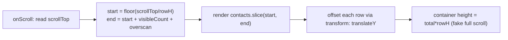

> Builds on Ch 02 (long tasks block the one thread), Ch 03/04 (render, commit, paint), Ch 06
> (keys), Ch 07 (layout vs composite). This is the chapter where Interviewer's contacts-table question
> lives. See the interview guide.

---

## The one mental model

> **Performance is one question asked at three layers: "how do I do LESS work?" You either
> (1) do less work now: render fewer things (virtualization), skip wasted renders (memo),
> ship less JS (code-splitting); (2) do it later: defer, chunk, or lazy load so the main thread stays
> free for paint and input; or (3) do it elsewhere: off the main thread (Web Workers) or
> ahead of time (build or server). And you NEVER guess. You measure first, because the
> bottleneck is rarely where you think.**

Everything below is an instance of less, later, or elsewhere. You will not memorize a checklist of tricks. You will classify any perf problem into one of those three and pick the matching tool.

---

## Learning Objectives

1. Classify any perf fix as do-less, do-later, or do-elsewhere. Measure before acting.
2. Explain **virtualization** from first principles and recite its real tradeoffs (including a11y).
3. Explain when `memo`/`useMemo`/`useCallback` actually pay off, and when they are noise.
4. Explain code-splitting and the Core Web Vitals that grade real-user experience.

---

## Key Mental Models

- **The main thread is the scarce resource** (Ch 02). Anything hogging it costs you paint and input.
- **Render only what is visible.** A list of 500k rows should mount about 20 DOM nodes, not 500k.
- **Memo trades compare-cost for skipped-render-cost.** It is only a win when the skip is bigger.
- **Measure, then fix, then re-measure.** Use Profiler or Performance panel, not guesses.

---

## Introduction

At SDE-2 the perf conversation is never "name optimizations." It is "here is a heavy page, reason about where the time goes and what you would change." The interviewer version is a contacts table up to **5 lakh rows** with real-time updates. The whole thing is solvable from "do less work, measure first." We build that reflex.

---

## Problem

Naively rendering a big list:

```jsx
{contacts.map(c => <Row key={c.id} contact={c} />)}   // 500,000 <Row>s
```

This creates 500k Fibers and 500k DOM nodes. The render phase (Ch 04) is a giant task. The tab freezes (Ch 02). The commit inserts hundreds of thousands of nodes. Layout and paint choke (Ch 07). Memory balloons. But the screen only shows about 20 rows. **499,980 rows are pure waste.** The problem is doing work proportional to the *data* instead of proportional to the *viewport*.

---

## Mental Model: virtualization (windowing)

Render only the rows in or near the viewport. As the user scrolls, recycle the same handful of DOM nodes to show different data. A tall empty spacer fakes the full scroll height.

```
   full list = 500,000 rows           rendered DOM = ~visible + overscan
   ┌───────────────┐  scrollTop        ┌───────────────┐
   │   (spacer top)│ ───────────────▶  │ Row 7000      │ ◀ startIndex = scrollTop / rowHeight
   │               │                   │ Row 7001      │
   │  [ viewport ]  │  only these       │ ...           │
   │               │  exist in DOM     │ Row 7020      │ ◀ endIndex
   │ (spacer below)│                   └───────────────┘
   └───────────────┘                   positioned with transform: translateY(7000*rowHeight)
```



Core math: `startIndex = Math.floor(scrollTop / rowHeight)`. Render `visibleCount + overscan` rows. Position the window with `transform: translateY(startIndex * rowHeight)`. Use `@tanstack/react-virtual` in real life. Know the math for interviews.

### Why `transform`, not `top` or absolute (Ch 07 payoff)
Positioning rows with `top` or `left` triggers **layout + paint** every scroll frame (expensive). `transform: translateY()` is **composited on the GPU**. It skips layout and paint entirely. On a list updating every scroll frame, this is the difference between smooth and janky.

### Virtualization tradeoffs (recite these: they ask explicitly)
- **Ctrl-F or native find breaks.** Off-screen rows are not in the DOM.
- **Accessibility.** Screen readers need `aria-rowcount` and `aria-setsize`. Focus on an unmounted row is lost.
- **Variable or unknown row heights.** You need measurement or estimates. Wrong heights cause scroll jump.
- **Sticky headers, "scroll to row N", scroll restoration.** All need explicit handling.
- **SEO.** Virtualized content is not crawlable (not an issue for an authed app).

---

## Engine Simulation: wasted renders and memo

```jsx
function Table({ rows, onRowClick }) {
  return rows.map(r => <Row key={r.id} row={r} onClick={onRowClick} />);
}
```

One row's status updates. The `rows` array changes. `Table` re-renders. **Every** `<Row>` re-runs (Ch 03 top-down). For 20 visible rows this is fine. The cost appears when a row is expensive or updates fire constantly. Two derived fixes:

1. **`React.memo(Row)`** skips a row whose props did not change (`Object.is` shallow compare). But it only works if props are referentially stable. So `onClick` must be stable:
2. **`useCallback(onRowClick, [])`** stabilizes the function identity (Ch 01: a new function each render means a new address, so memo sees "changed"). Now unchanged rows skip re-render.

```
without memo:  1 status event → 20 Row renders
with memo + stable props:  1 status event → 1 Row render (the changed one)
```

**The trap (straight from Interviewer, see interview guide):** do NOT `memo` everything. `memo` stores previous props and runs a compare every render. For cheap components that is slower than just rendering. And it silently does nothing when props are inline objects or functions. The *structural* fix often beats memo: push state down, or pass expensive subtrees as `children` so their element identity is stable across the parent's state changes. **Memo measured hot spots. Prefer composition.**

---

## Do-later and do-elsewhere

- **Code-splitting (ship less now):** `const Settings = lazy(() => import('./Settings'))` + `<Suspense>`. Route-level splitting means the contacts page does not ship the settings bundle. Vite and Rollup tree-shake unused exports (Ch 20).
- **Defer non-urgent renders (do later):** `startTransition` or `useDeferredValue` (Ch 04) keep typing responsive while an expensive filtered list renders at low priority.
- **Off the main thread (do elsewhere):** heavy parsing or sorting of a big dataset goes in a **Web Worker** (Ch 17). The 200ms compute does not freeze scroll or paint (Ch 02).
- **Debounce or throttle input:** a search box hitting the server on every keystroke should debounce (do less, later). Throttle scroll handlers.

---

## Measure first: the tools

- **React DevTools Profiler:** flame graph of what rendered and why ("Why did this render?"). Find wasted renders before adding memo.
- **Chrome Performance panel:** long tasks (Ch 02), layout and paint (Ch 07), main-thread time.
- **Core Web Vitals (real-user grades):**
  - **LCP** (Largest Contentful Paint) measures load: largest element painted. Image and bundle work.
  - **INP** (Interaction to Next Paint) measures responsiveness: how fast UI reacts to input. Long tasks and heavy renders hurt it. This is the whole reason for transitions and workers.
  - **CLS** (Cumulative Layout Shift) measures stability: content jumping. Reserve space for async content.

---

## Interview Discussion (reason first)

**Q1. "500k-row table: how do you make it not die?"**
> "Render proportional to the viewport, not the data: **virtualize**. Mount about 20 rows with overscan. Recycle on scroll. Position with `transform`. Use a spacer for scroll height. Fetch pages on demand with cursor-based pagination. Do not hold 500k in memory. Cache with TanStack (Ch 10). Server-side search, filter, and sort. Then measure with the Profiler and only memoize rows that prove costly."

**Q2. "Should you memo every component?"**
> "No. Memo costs a prop compare and storage. For cheap components that is a net loss. It also does nothing when props are not stable. I memo measured hot spots and prefer structural fixes (state colocation, `children` as props). Most re-renders are harmless." *(Do not fall into the 'so your app does tons of unnecessary renders' trap. Say they are cheap and you fix measured ones.)*

**Q3. "Downside of virtualization?"**
> Ctrl-F breaks, a11y needs extra ARIA, variable heights cause jumps, sticky and scroll-to-row need handling. The `top` vs `transform` reflow point (Ch 07).

*Scoring:* full answer includes viewport-not-data, transform reasoning, measure-first, memo restraint.

---

## Common Mistakes

- **Rendering the whole dataset** and hoping CSS `overflow:auto` saves you. It does not. The nodes still exist.
- **`memo`/`useCallback`/`useMemo` everywhere** "to be safe." Adds cost and complexity. Often does nothing. Measure.
- **Positioning virtual rows with `top` or `margin`.** This causes reflow every frame. Use `transform`.
- **Optimizing before measuring.** The bottleneck is usually elsewhere (often network or a layout thrash, not React).
- **Debouncing the wrong thing** (debouncing the render instead of the server call).

---

## Interview Questions

1. Derive the virtualization index math and explain the spacer + `transform` positioning.
2. Give 3 disadvantages of virtualization beyond "it is complex."
3. When does `React.memo` do nothing despite being added? (unstable props.)
4. Classify these as less/later/elsewhere: code-split, Web Worker, virtualization, useDeferredValue.
5. Which CWV does a long render hurt most, and what fixes it?

---

## Homework

1. Build a 50k-row list naively (watch it choke), then add `@tanstack/react-virtual`. Compare in the Performance panel. Switch row positioning from `top` to `transform` and compare paint cost.
2. Add `React.memo` + `useCallback` to rows. Use the Profiler to prove fewer rows render on a single-row update. Then remove memo and try the `children`-as-prop structural fix instead.
3. In `NOTES.md`: write the contacts-table answer as 5 bullets you can say in 90 seconds.

---

## Summary

- **Perf = do LESS, LATER, or ELSEWHERE, and MEASURE first.** Every tool is one of those.
- **Virtualization:** render proportional to the viewport (about 20 rows). Recycle on scroll. Use `transform` (composited, Ch 07), not `top` (reflow). Tradeoffs: find, a11y, variable-height.
- **Memo family** trades compare-cost for skipped renders. Worth it only for measured hot spots with stable props. Prefer composition. Never blanket-apply (Interviewer's trap).
- **Code-splitting, transitions, and workers** are do-later or do-elsewhere. **CWV (LCP/INP/CLS)** grade the real-user result. The **Profiler and Performance panel** tell you where to look.

## Go deeper
The contacts-table full walkthrough (including real-time-mid-scroll UX) is in the interview guide §2. Ch 10 covers the data and cache layer behind the windowed fetch. Ch 17 covers Observers and Workers.
