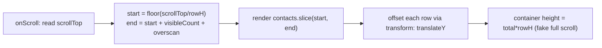

## Problem

Naively rendering a big list:

```jsx
{contacts.map(c => <Row key={c.id} contact={c} />)}   // 500,000 <Row>s
```

This creates 500k Fibers and 500k DOM nodes. The render phase (Ch 04) is a giant task. The tab freezes (Ch 02). The commit inserts hundreds of thousands of nodes. Layout and paint choke (Ch 07). Memory balloons. But the screen only shows about 20 rows. 499,980 rows are pure waste.

The problem is doing work proportional to the data instead of proportional to the viewport.

## Why Existing Solution Failed

Before systematic performance thinking, developers optimized by instinct. They added `React.memo` to every component "to be safe." They shipped entire bundles without code-splitting. They rendered full datasets and blamed React when it was slow. They never measured first, so they optimized the wrong thing.

There was no framework for thinking about performance. Just a checklist of tricks. Developers memorized "use `transform` not `top`" but could not explain why virtualizing a list is do-less, code-splitting is do-later, and Web Workers are do-elsewhere. Core Web Vitals did not exist to grade real-user experience. Teams shipped without knowing if their app was actually fast.

## Mental Model

Performance is one question asked at three layers: "how do I do LESS work?"

You either:
1. Do less work now: render fewer things (virtualization), skip wasted renders (memo), ship less JS (code-splitting).
2. Do it later: defer, chunk, or lazy load so the main thread stays free for paint and input.
3. Do it elsewhere: off the main thread (Web Workers) or ahead of time (build or server).

And you NEVER guess. You measure first, because the bottleneck is rarely where you think.

Key ideas:
- The main thread is the scarce resource (Ch 02). Anything hogging it costs you paint and input.
- Render only what is visible. A list of 500k rows should mount about 20 DOM nodes, not 500k.
- Memo trades compare-cost for skipped-render-cost. It is only a win when the skip is bigger.
- Measure, then fix, then re-measure. Use Profiler or Performance panel, not guesses.

## Visualization



Virtualization math: `startIndex = Math.floor(scrollTop / rowHeight)`. Render `visibleCount + overscan` rows. Position the window with `transform: translateY(startIndex * rowHeight)`.

```
   full list = 500,000 rows           rendered DOM = ~visible + overscan
   ┌───────────────┐  scrollTop        ┌───────────────┐
   │   (spacer top)│ ─────────────>>  │ Row 7000      │ ◀ startIndex = scrollTop / rowHeight
   │               │                   │ Row 7001      │
   │  [ viewport ]  │  only these       │ ...           │
   │               │  exist in DOM     │ Row 7020      │ ◀ endIndex
   │ (spacer below)│                   └───────────────┘
   │               │                   positioned with transform: translateY(7000*rowHeight)
   └───────────────┘
```

## Engine Simulation

**Wasted renders and memo.**

```jsx
function Table({ rows, onRowClick }) {
  return rows.map(r => <Row key={r.id} row={r} onClick={onRowClick} />);
}
```

One row's status updates. The `rows` array changes. `Table` re-renders. Every `<Row>` re-runs (Ch 03 top-down). For 20 visible rows this is fine. The cost appears when a row is expensive or updates fire constantly.

Two derived fixes:

1. `React.memo(Row)` skips a row whose props did not change (shallow compare). But it only works if props are referentially stable. So `onClick` must be stable.
2. `useCallback(onRowClick, [])` stabilizes the function identity (Ch 01: a new function each render means a new address, so memo sees "changed"). Now unchanged rows skip re-render.

```
without memo:  1 status event -> 20 Row renders
with memo + stable props:  1 status event -> 1 Row render (the changed one)
```

What happens internally: `React.memo` wraps the component in a pure render guard. On each render, it compares `prevProps` vs `nextProps` using `Object.is` on each key. If all equal, it returns the cached result from the previous render. The Fiber is reused without calling the component function. `useCallback` stores a function reference in its hook slot and only creates a new function when deps change.

The trap: do NOT `memo` everything. `memo` stores previous props and runs a compare every render. For cheap components that is slower than just rendering. It silently does nothing when props are inline objects or functions. The structural fix often beats memo: push state down, or pass expensive subtrees as `children` so their element identity is stable across the parent's state changes. Memo measured hot spots. Prefer composition.

## Internal Implementation

**React DevTools Profiler.** Shows a flame graph of what rendered and why. The "Why did this render?" feature shows which prop changed. Use it to find wasted renders before adding memo. Record a profile, look for components that re-render with the same props.

**Chrome Performance panel.** Shows long tasks (Ch 02), layout and paint (Ch 07), main-thread time. Record while scrolling or interacting. Look for frames that exceed 16.7ms. Identify the culprit: long JS tasks, layout thrashing, or excessive paint.

**Core Web Vitals (real-user grades).**
- LCP (Largest Contentful Paint) measures load: the largest element painted. Affected by image size, bundle size, and render-blocking resources.
- INP (Interaction to Next Paint) measures responsiveness: how fast UI reacts to input. Long tasks and heavy renders hurt it. This is the whole reason for transitions and workers.
- CLS (Cumulative Layout Shift) measures stability: content jumping. Reserve space for async content, images, and ads.

**Code-splitting.** `const Settings = lazy(() => import('./Settings'))` plus `<Suspense>`. Route-level splitting means the contacts page does not ship the settings bundle. Vite and Rollup tree-shake unused exports (Ch 20). The bundler creates a separate chunk. The browser downloads it only when the route renders.

**Transitions.** `startTransition` and `useDeferredValue` (Ch 04) mark state updates as non-urgent. React renders them at low priority. Urgent updates like typing stay responsive. The deferred render can be interrupted by the next urgent update.

**Web Workers.** Heavy parsing or sorting of a big dataset goes in a Worker (Ch 17). The 200ms compute does not freeze scroll or paint. The Worker posts the result back to the main thread.

## Real World Example

**Contacts table with 500k rows and real-time updates.**

A sales dashboard shows all contacts. Data arrives via WebSocket every few seconds. New contacts appear. Statuses change. The user scrolls, searches, and sorts.

Naive approach: render all 500k rows. Each WebSocket update triggers a full re-render. The tab freezes. Search is unusable. The page crashes from memory pressure.

Step-by-step solution:

1. **Virtualize.** Use `@tanstack/react-virtual`. Mount ~20 rows plus overscan. Recycle on scroll. Position with `transform: translateY`. This solves the initial mount and scroll performance.

2. **Stable keys.** Each contact has a stable `contactId`. This prevents state leakage on reorder.

3. **Memoized rows.** Wrap `<Row>` in `React.memo`. Stabilize callbacks with `useCallback`. Only changed rows re-render on updates.

4. **Worker for search.** Send the full dataset to a Web Worker. The worker filters and sorts. It posts back only the indices of visible contacts. The main thread never blocks on search.

5. **Cursor-based pagination for fetch.** Do not load 500k contacts at once. Fetch in pages. Cache with TanStack Query (Ch 10). Server-side search, filter, and sort.

6. **Measure after each step.** Use Profiler to confirm fewer renders. Use Performance panel to confirm no long tasks. Check CLS to ensure no layout shift during scroll.

## Tradeoffs

**Virtualization tradeoffs.**
- Ctrl-F or native find breaks. Off-screen rows are not in the DOM.
- Accessibility. Screen readers need `aria-rowcount` and `aria-setsize`. Focus on an unmounted row is lost.
- Variable or unknown row heights. You need measurement or estimates. Wrong heights cause scroll jump.
- Sticky headers, "scroll to row N", scroll restoration. All need explicit handling.
- SEO. Virtualized content is not crawlable (not an issue for authed apps).

**Memo everywhere vs measured hot spots.**
- Memo adds cost: compares every prop every render. For cheap components, that cost exceeds the render cost.
- Memo silently does nothing when props are not stable. Inline objects and functions create new references each render, so memo always re-renders.
- Prefer structural fixes: colocate state, pass children as props, split components.
- Memo only after profiling shows it matters.

**Code-splitting vs bundle size overhead.**
- Each split adds a network request. Too many splits hurt load time from request overhead.
- Route-level splitting is the sweet spot. Component-level splitting is usually overkill.
- Preload critical routes. Lazy load non-critical ones.

**Transitions vs synchronous renders.**
- `startTransition` defers the render. The user sees the old UI until the transition completes.
- For search, the user may see stale results briefly. Use `useDeferredValue` with a loading indicator.
- Transitions can be interrupted by urgent updates. This keeps the UI responsive but may delay the deferred update indefinitely if updates keep arriving.

## Common Mistakes

- **Rendering the whole dataset** and hoping CSS `overflow:auto` saves you. It does not. The nodes still exist.
- **`memo`/`useCallback`/`useMemo` everywhere** "to be safe." Adds cost and complexity. Often does nothing. Measure.
- **Positioning virtual rows with `top` or `margin`.** This causes reflow every frame. Use `transform`.
- **Optimizing before measuring.** The bottleneck is usually elsewhere (network or layout thrash, not React).
- **Debouncing the wrong thing.** Debouncing the render instead of the server call.

## SDE-2 Interview Answer (Mid-level + Senior + Engineering Lead variants)

**Mid-level (SDE-1 / junior SDE-2):**

Question: "How do you make a 500k-row table not die?"

"Render proportional to the viewport, not the data. Virtualize: mount about 20 rows with overscan, recycle on scroll. Position with `transform`. Use a spacer for scroll height. Then measure with the Profiler. Only memoize rows that prove costly. Fetch pages on demand with cursor-based pagination. Do not hold 500k in memory at once."

**Senior (SDE-2 / SDE-3):**

Question: "Should you memo every component?"

"No. Memo costs a prop compare and storage. For cheap components that is a net loss. It also does nothing when props are not stable. I memo measured hot spots and prefer structural fixes like state colocation and passing components as `children`. Most re-renders are harmless. The real perf wins are virtualization, code-splitting, and moving work off the main thread."

**Engineering Lead (Staff / Principal):**

Question: "How do you build a culture of performance on your team?"

"Start with measurement. Add performance budgets to CI. Track LCP, INP, and CLS in production with RUM data. When a regression hits, the CI fails. Second, establish patterns: every list over 100 items gets virtualized. Every route gets code-split. Every data mutation goes through TanStack Query with caching. Third, educate the team on the do-less, later, elsewhere framework. When someone proposes an optimization, ask: 'Which of the three is this? Did you measure?' Fourth, review profiles in code review. If a component re-renders unnecessarily, flag it. If someone adds memo without profiling, ask why. Performance is a habit, not a hero fix."

## Follow-up Questions (5, progressively harder)

1. Derive the virtualization index math. Explain the spacer and `transform` positioning.
   _(Tests understanding of the core virtualization mechanism.)_

2. Give 3 disadvantages of virtualization beyond "it is complex."
   _(Tests awareness of real-world tradeoffs: Ctrl-F, a11y, variable heights.)_

3. When does `React.memo` do nothing despite being added?
   _(Tests understanding of referential stability and the props comparison.)_

4. Classify these as less/later/elsewhere: code-split, Web Worker, virtualization, useDeferredValue.
   _(Tests classification framework understanding.)_

5. Which Core Web Vital does a long render hurt most? What fixes it?
   _(Connects performance to user-facing metrics. Tests understanding of INP.)_

## Mental Trigger

**Do less, do later, do elsewhere. Measure first, then fix, then re-measure.**

## One Page Revision

- Performance = do LESS work now (virtualization, memo, code-split), do it LATER (transitions, lazy), or do it ELSEWHERE (Web Workers, build-time). Measure first.
- Virtualization: render proportional to viewport. ~20 rows plus overscan. Recycle on scroll. Position with `transform`. Spacer for full scroll height.
- Virtualization tradeoffs: Ctrl-F breaks, a11y needs ARIA, variable heights cause jumps, scroll-to-row needs handling, not SEO-friendly.
- Memo trades compare-cost for skipped-render. Only worth it on measured hot spots with stable props. Prefer composition (state colocation, children prop).
- `useCallback` and `useMemo` stabilize references. They only help when downstream depends on referential stability (memo, effect deps).
- Code-splitting: route-level `lazy` + `Suspense`. Ship less JS upfront.
- Transitions (`startTransition`, `useDeferredValue`): mark non-urgent renders as interruptible.
- Web Workers: move heavy computation off main thread.
- Core Web Vitals: LCP (load), INP (responsiveness), CLS (stability).
- Measuring tools: React DevTools Profiler (why did this render), Chrome Performance panel (long tasks, layout).
- Most common mistake: optimizing before measuring. Bottleneck is rarely where you think.
