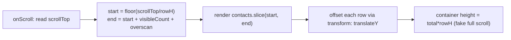

## Problem

Here's something you've probably seen — maybe even shipped yourself:

```jsx
{contacts.map(c => <Row key={c.id} contact={c} />)}   // 500,000 <Row>s
```

Looks innocent, right? Just a map over an array. But that line creates 500k React Fibers and 500k DOM nodes. The render phase (Ch 04) turns into a massive, single-threaded job. Your tab freezes (Ch 02). The commit phase tries to insert hundreds of thousands of nodes into the DOM. Layout and paint choke (Ch 07). Memory balloons. And here's the kicker — your screen can only show about 20 rows at a time. The other 499,980? Pure waste.

The real problem? You're doing work proportional to your **data** when you should be doing work proportional to your **viewport**.

Think of it like a restaurant. You have 500,000 customers in a reservation list, but only 20 seats. A bad restaurant preps 500,000 meals. A smart restaurant preps 20, and recycles the station when someone leaves.

## Why Existing Solution Failed

Before anyone had a systematic way to think about performance, developers just winged it. They'd slap `React.memo` on every component "just in case." They'd ship entire apps without code-splitting. They'd render massive datasets and then blame React for being slow. And the worst part? They never measured first. So they'd spend hours optimizing the wrong bottleneck.

There was no mental framework — just a scattered list of tips. Developers memorized "use `transform` instead of `top`" but couldn't explain *why* virtualizing a list saves work, or *why* code-splitting is a "do it later" strategy, or *why* Web Workers are "do it elsewhere." Core Web Vitals didn't even exist yet, so teams had no way to grade the actual user experience. They shipped features without knowing if the app was even fast.

It was like trying to lose weight by randomly cutting food groups instead of measuring calories. Sometimes it worked. Usually it didn't. And you had no idea why.

## Mental Model

Here's the one insight that unlocks everything:

**Performance is just one question asked at three layers: "How do I do LESS work?"**

That's it. Every performance technique maps to one of three answers:

1. **Do less work now.** Render fewer things (virtualization). Skip wasted renders (memo). Ship less JS (code-splitting). You're reducing the total amount of work on the main thread right this second.

2. **Do it later.** Defer, chunk, or lazy load so the main thread stays free for paint and input. Transitions, `useDeferredValue`, lazy imports — all "later" strategies.

3. **Do it elsewhere.** Move heavy work off the main thread entirely (Web Workers) or do it ahead of time (build-time optimization, server-side rendering).

And here's the most important rule: **You NEVER guess. You measure first.** Because the bottleneck is almost never where you think it is.

Key ideas to internalize:
- The main thread is the scarce resource (Ch 02). Anything hogging it costs you paint and input responsiveness.
- Render only what is visible. A list of 500k rows should mount about 20 DOM nodes, not 500k. Paint only what's on screen — like an artist only painting what the viewer can see.
- Memo trades compare-cost for skipped-render-cost. It's only a win when the skip is bigger than the compare.
- Measure, then fix, then re-measure. Use the Profiler or Performance panel, not guesses.

## Visualization



The virtualization math is straightforward: `startIndex = Math.floor(scrollTop / rowHeight)`. You render `visibleCount + overscan` rows. Then you position the visible window using `transform: translateY(startIndex * rowHeight)`.

```
   full list = 500,000 rows           rendered DOM = ~visible + overscan
   ┌───────────────┐  scrollTop        ┌───────────────┐
   │   (spacer top)│ ─────────────>>  │ Row 7000      │ ◀ startIndex = scrollTop / rowHeight
   │               │                   │ Row 7001      │
   │  [ viewport ]  │  only these       │ ...           │
   │               │  exist in DOM     │ Row 7020      │ ◀ endIndex
   │ (spacer below)│                   └───────────────┘
   │               │                   positioned with transform: translateY(7000*rowHeight)
   └───────────────┘
```

The spacer is the trick. It's an empty div sized to the full list height, so the browser's scrollbar works naturally. The actual rendered rows are a tiny slice, positioned into place with `transform`. You get native scroll behavior with a fraction of the DOM.

## Engine Simulation

**Wasted renders and memo.**

```jsx
function Table({ rows, onRowClick }) {
  return rows.map(r => <Row key={r.id} row={r} onClick={onRowClick} />);
}
```

Say one row's status updates. The `rows` array changes. `Table` re-renders. Every `<Row>` re-runs (Ch 03 top-down rendering). For 20 visible rows, this is fine — who cares. But the cost shows up when rows are expensive to render or updates fire constantly (like WebSocket updates every few seconds).

Two fixes emerge naturally:

1. `React.memo(Row)` skips a row whose props did not change (shallow compare). But it only works if props are *referentially stable*. So `onClick` must not be a new function every render.

2. `useCallback(onRowClick, [])` stabilizes the function identity (Ch 01: a new function each render means a new memory address, so memo sees "changed"). Now unchanged rows skip re-render.

```
without memo:  1 status event -> 20 Row renders
with memo + stable props:  1 status event -> 1 Row render (the changed one)
```

Here's what happens under the hood: `React.memo` wraps the component in a pure render guard. On each render, it compares `prevProps` vs `nextProps` using `Object.is` on each key. If all equal, it returns the cached result from the previous render. The Fiber gets reused without calling the component function at all. `useCallback` stores a function reference in its hook slot and only creates a new function when deps change.

Now, the trap: **do NOT `memo` everything.** `memo` stores previous props and runs a compare every render. For cheap components, that compare is slower than just re-rendering. It also silently does nothing when props are inline objects or functions (new references every time). The structural fix often beats memo: push state down closer to where it's used, or pass expensive subtrees as `children` so their element identity is stable across the parent's state changes. Memo the measured hot spots. Prefer composition.

## Internal Implementation

**React DevTools Profiler.** Shows a flame graph of what rendered and why. The "Why did this render?" feature shows exactly which prop changed. Use it to find wasted renders *before* adding memo. Record a profile, look for components that re-render with the same props.

**Chrome Performance panel.** Shows long tasks (Ch 02), layout and paint (Ch 07), main-thread time. Record while scrolling or interacting. Look for frames that exceed 16.7ms. Identify the culprit: long JS tasks, layout thrashing, or excessive paint.

**Core Web Vitals (real-user grades).**
- LCP (Largest Contentful Paint) measures load: the largest element painted. Affected by image size, bundle size, and render-blocking resources.
- INP (Interaction to Next Paint) measures responsiveness: how fast UI reacts to input. Long tasks and heavy renders hurt it. This is the whole reason for transitions and workers.
- CLS (Cumulative Layout Shift) measures stability: content jumping around. Reserve space for async content, images, and ads.

**Code-splitting.** `const Settings = lazy(() => import('./Settings'))` plus `<Suspense>`. Route-level splitting means the contacts page doesn't ship the settings bundle. Vite and Rollup tree-shake unused exports (Ch 20). The bundler creates a separate chunk. The browser downloads it only when the route renders.

**Transitions.** `startTransition` and `useDeferredValue` (Ch 04) mark state updates as non-urgent. React renders them at low priority. Urgent updates like typing stay responsive. The deferred render can be interrupted by the next urgent update.

**Web Workers.** Heavy parsing or sorting of a big dataset goes in a Worker (Ch 17). The 200ms compute doesn't freeze scroll or paint. The Worker posts the result back to the main thread.

## Real World Example

**Contacts table with 500k rows and real-time updates.**

A sales dashboard shows all contacts. Data arrives via WebSocket every few seconds. New contacts appear. Statuses change. The user scrolls, searches, and sorts.

Naive approach: render all 500k rows. Each WebSocket update triggers a full re-render. The tab freezes. Search is unusable. The page crashes from memory pressure.

Here's how you fix it, step by step:

1. **Virtualize.** Use `@tanstack/react-virtual`. Mount ~20 rows plus overscan. Recycle on scroll. Position with `transform: translateY`. This solves the initial mount and scroll performance.

2. **Stable keys.** Each contact has a stable `contactId`. This prevents state leakage on reorder.

3. **Memoized rows.** Wrap `<Row>` in `React.memo`. Stabilize callbacks with `useCallback`. Only changed rows re-render on updates.

4. **Worker for search.** Send the full dataset to a Web Worker. The worker filters and sorts. It posts back only the indices of visible contacts. The main thread never blocks on search.

5. **Cursor-based pagination for fetch.** Don't load 500k contacts at once. Fetch in pages. Cache with TanStack Query (Ch 10). Server-side search, filter, and sort whenever possible.

6. **Measure after each step.** Use Profiler to confirm fewer renders. Use Performance panel to confirm no long tasks. Check CLS to ensure no layout shift during scroll.

## Tradeoffs

**Virtualization tradeoffs.**
- Ctrl-F or native find breaks. Off-screen rows aren't in the DOM, so the browser can't search them.
- Accessibility. Screen readers need `aria-rowcount` and `aria-setsize`. Focus on an unmounted row is lost.
- Variable or unknown row heights. You need measurement or estimates. Wrong heights cause scroll jumps.
- Sticky headers, "scroll to row N", scroll restoration. All need explicit handling.
- SEO. Virtualized content isn't crawlable (not an issue for authed apps, but worth knowing).

**Memo everywhere vs measured hot spots.**
- Memo adds cost: compares every prop every render. For cheap components, that cost exceeds the render cost.
- Memo silently does nothing when props aren't stable. Inline objects and functions create new references each render, so memo always re-renders anyway.
- Prefer structural fixes: colocate state, pass children as props, split components.
- Memo only after profiling shows it matters.

**Code-splitting vs bundle size overhead.**
- Each split adds a network request. Too many splits hurt load time from request overhead.
- Route-level splitting is the sweet spot. Component-level splitting is usually overkill.
- Preload critical routes. Lazy load non-critical ones.

**Transitions vs synchronous renders.**
- `startTransition` defers the render. The user sees the old UI until the transition completes.
- For search, the user may see stale results briefly. Use `useDeferredValue` with a loading indicator.
- Transitions can be interrupted by urgent updates. This keeps the UI responsive but may delay the deferred update indefinitely if updates keep arriving.

## Common Mistakes

- **Rendering the whole dataset** and hoping CSS `overflow:auto` saves you. It doesn't. The nodes still exist in the DOM and React's tree.
- **`memo`/`useCallback`/`useMemo` everywhere** "to be safe." Adds cost and complexity. Often does nothing. Measure first.
- **Positioning virtual rows with `top` or `margin`.** This causes reflow every frame. Use `transform` — it's composited and doesn't trigger layout.
- **Optimizing before measuring.** The bottleneck is usually elsewhere (network or layout thrash, not React).
- **Debouncing the wrong thing.** Debouncing the render instead of the server call.

## SDE-2 Interview Answer (Mid-level + Senior + Engineering Lead variants)

**Mid-level (SDE-1 / junior SDE-2):**

Question: "How do you make a 500k-row table not die?"

"Render proportional to the viewport, not the data. Virtualize: mount about 20 rows with overscan, recycle on scroll. Position with `transform`. Use a spacer for scroll height. Then measure with the Profiler. Only memoize rows that prove costly. Fetch pages on demand with cursor-based pagination. Don't hold 500k in memory at once."

**Senior (SDE-2 / SDE-3):**

Question: "Should you memo every component?"

"No. Memo costs a prop compare and storage on every render. For cheap components that's a net loss. It also does nothing when props aren't stable — inline objects and functions create new references. I memo measured hot spots and prefer structural fixes like state colocation and passing components as `children`. Most re-renders are harmless. The real perf wins are virtualization, code-splitting, and moving work off the main thread."

**Engineering Lead (Staff / Principal):**

Question: "How do you build a culture of performance on your team?"

"Start with measurement. Add performance budgets to CI. Track LCP, INP, and CLS in production with RUM data. When a regression hits, the CI fails. Second, establish patterns: every list over 100 items gets virtualized. Every route gets code-split. Every data mutation goes through TanStack Query with caching. Third, educate the team on the do-less, later, elsewhere framework. When someone proposes an optimization, ask: 'Which of the three is this? Did you measure?' Fourth, review profiles in code review. If a component re-renders unnecessarily, flag it. If someone adds memo without profiling, ask why. Performance is a habit, not a hero fix."

## Follow-up Questions (5, progressively harder)

**Q1: Derive the virtualization index math. Explain the spacer and `transform` positioning.**

The core math: given a scroll container with `scrollTop`, a fixed `rowHeight`, and a `visibleCount` (how many rows fit in the viewport), the visible range is:

```
startIndex = Math.floor(scrollTop / rowHeight)
endIndex = startIndex + visibleCount + overscan
```

The `overscan` (typically 3-5 rows) renders a few extra rows above and below the viewport so the user does not see blank space during fast scrolling. You then render only `contacts.slice(startIndex, endIndex)` — typically 20-25 rows instead of 500k.

The spacer is an empty `<div>` whose height equals `totalRows * rowHeight`. This makes the browser's scrollbar behave as if all rows are rendered. Without the spacer, the scroll container would collapse to the height of the 20 rendered rows. The rendered rows are positioned using `transform: translateY(startIndex * rowHeight)`. This uses the GPU compositor (Ch 07) so positioning does not trigger layout. As the user scrolls, you recalculate `startIndex`, slice the array, and reposition via transform. The DOM always contains only ~20 row nodes. See Ch 07 for why `transform` is the cheapest positioning method.

**Q2: Give 3 disadvantages of virtualization beyond "it is complex."**

**1. Native browser search (Ctrl-F) breaks.** Off-screen rows do not exist in the DOM. The browser's find-in-page feature searches DOM text nodes, so it cannot locate text in rows that are not mounted. You must implement a custom search or highlight feature that scrolls to the matched row and temporarily renders it.

**2. Accessibility suffers.** Screen readers navigate the DOM. If a row is not in the DOM, the screen reader cannot announce it. You need `aria-rowcount` on the container and `aria-rowindex` on each visible row to communicate the full list size. Focus management becomes tricky: if the user focuses a row that scrolls out of view, focus is lost because the DOM node is removed. You must track focus in state and restore it when the row scrolls back in.

**3. Variable or unknown row heights cause scroll jumps.** The math assumes uniform `rowHeight`. If rows have different heights (text wrapping, images), the spacer height is wrong and the scroll position shifts when rows are recycled. You need height estimation or measurement (e.g., `ResizeObserver` per row, or a cached height map). This adds significant implementation complexity and can still cause visual jumps if estimates are wrong. See Ch 17 for how `ResizeObserver` can measure row heights.

**Q3: When does `React.memo` do nothing despite being added?**

`React.memo` does a shallow comparison of `prevProps` vs `nextProps` using `Object.is` on each key. It fails to prevent re-renders in these cases:

**Inline objects or arrays as props.** If the parent passes `style={{ color: 'red' }}` or `items={[1, 2, 3]}`, a new object is created every render. `Object.is({}, {})` is `false`. Memo sees "changed" and re-renders anyway. The fix: define the object outside the component or use `useMemo`.

**Inline functions as props.** If the parent passes `onClick={() => doSomething(id)}`, a new function is created every render (Ch 01 — new function = new heap address). Memo compares function references, not bodies. It sees a new reference and re-renders. The fix: wrap the callback in `useCallback` with stable deps, or restructure to avoid passing callbacks.

**Props that actually change every render.** If the parent recalculates a derived value on every render (e.g., `filteredItems={items.filter(...)}`), the filtered array is a new reference each time. Memo sees "changed" and re-renders. The fix: memoize the derived value with `useMemo` in the parent, or move the filtering into the child.

The pattern: `React.memo` only works when **all** props are referentially stable across renders. If even one prop creates a new reference, memo is defeated for that render. See Ch 04 for how the fiber reconciler uses `Object.is` for bailout decisions.

**Q4: Classify these as less/later/elsewhere: code-split, Web Worker, virtualization, useDeferredValue.**

**Do less work now:**
- **Virtualization** — you render 20 rows instead of 500k. Fewer fibers, fewer DOM nodes, less layout and paint. The total work on the main thread is directly reduced.
- **Code-splitting** — you ship only the JS needed for the current route. Less code to parse, compile, and execute. The browser downloads and processes less upfront.

**Do it later:**
- **`useDeferredValue`** — you defer a non-urgent render (like filtering a list while typing) to a lower priority. The expensive render is not eliminated — it is scheduled after the urgent input update. The user sees the old UI briefly, then the updated UI. Work is deferred, not reduced.

**Do it elsewhere:**
- **Web Worker** — you move heavy computation (parsing, sorting, filtering large datasets) to a separate thread. The main thread stays free for paint and input. The work still happens, but it does not block the UI. The worker posts results back via `postMessage`, which is a macrotask (Ch 02). See Ch 17 for Web Worker communication patterns.

The framework is: "less" reduces total work, "later" shifts work in time, "elsewhere" shifts work in space (different thread). All three improve perceived performance, but through different mechanisms.

**Q5: Which Core Web Vital does a long render hurt most? What fixes it?**

A long render hurts **INP (Interaction to Next Paint)** the most. INP measures the latency from user interaction (click, tap, keypress) to the next paint frame. When React's render phase takes too long (e.g., reconciling a large tree), it blocks the main thread. The browser cannot process the interaction event, run rAF callbacks, or paint the response. The user clicks and waits. INP captures this delay.

LCP (Largest Contentful Paint) is affected during initial load — a long render of the above-the-fold content delays the largest paint. But INP captures ongoing responsiveness throughout the page lifetime, which is where long renders hurt most in production.

Fixes:
- **Transitions** (`startTransition`, `useDeferredValue`) mark expensive renders as non-urgent. The interaction update (keystroke, click) gets SyncLane priority and commits immediately. The expensive render runs in the background at TransitionLane priority. See Ch 04 for lane-based preemption.
- **Virtualization** reduces the render tree size so reconciliation finishes within the frame budget. See Ch 04 for how Fiber's work loop yields between units.
- **Memoization** skips unchanged subtrees, reducing the number of component functions that execute. Only effective when props are referentially stable (see Q3 above).
- **Code-splitting** reduces initial parse/compile time, which improves first interaction latency.
- **Web Workers** move computation off the main thread entirely, so no render is blocked.

The best fix depends on the measurement: profile with React DevTools to find the expensive components, then apply the appropriate strategy. See Ch 02 for why the frame budget is 16.7ms at 60fps.

## Mental Trigger

**Do less, do later, do elsewhere. Measure first, then fix, then re-measure.**

## One Page Revision

- Performance = do LESS work now (virtualization, memo, code-split), do it LATER (transitions, lazy), or do it ELSEWHERE (Web Workers, build-time). Measure first.
- Virtualization: render proportional to viewport. ~20 rows plus overscan. Recycle on scroll. Position with `transform`. Spacer for full scroll height.
- Virtualization tradeoffs: Ctrl-F breaks, a11y needs ARIA, variable heights cause jumps, scroll-to-row needs handling, not SEO-friendly.
- Memo trades compare-cost for skipped-render. Only worth it on measured hot spots with stable props. Prefer composition (state colocation, children prop).
- `useCallback` and `useMemo` stabilize references. They only help when downstream depends on referential stability (memo, effect deps).
- Code-splitting: route-level `lazy` + `Suspense`. Ship less JS upfront.
- Transitions (`startTransition`, `useDeferredValue`): mark non-urgent renders as interruptible.
- Web Workers: move heavy computation off main thread.
- Core Web Vitals: LCP (load), INP (responsiveness), CLS (stability).
- Measuring tools: React DevTools Profiler (why did this render), Chrome Performance panel (long tasks, layout).
- Most common mistake: optimizing before measuring. Bottleneck is rarely where you think.
