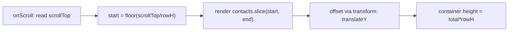

## The Problem

```jsx
{contacts.map(c => <Row key={c.id} contact={c} />)}   // 500,000 <Row>s
```

That line creates 500k React Fibers and 500k DOM nodes. Your tab freezes. The commit phase tries to insert hundreds of thousands of nodes. Layout and paint choke. And your screen can only show about 20 rows at a time. The other 499,980? Pure waste.

You're doing work proportional to your **data** when you should be doing work proportional to your **viewport**.

Think of it like a restaurant. You have 500,000 customers in a reservation list, but only 20 seats. A bad restaurant preps 500,000 meals. A smart restaurant preps 20, and recycles the station when someone leaves.

## The One Insight

**Performance is one question asked at three layers: "How do I do LESS work?"**

1. **Do less work now.** Render fewer things (virtualization). Skip wasted renders (memo). Ship less JS (code-splitting).
2. **Do it later.** Defer, chunk, or lazy load so the main thread stays free. Transitions, `useDeferredValue`, lazy imports.
3. **Do it elsewhere.** Move heavy work off the main thread (Web Workers) or do it ahead of time (build-time optimization, SSR).

And the most important rule: **You NEVER guess. You measure first.**

## Virtualization

The math: `startIndex = Math.floor(scrollTop / rowHeight)`. Render `visibleCount + overscan` rows. Position with `transform: translateY`.



```
   full list = 500,000 rows           rendered DOM = ~20 rows
   ┌───────────────┐  scrollTop        ┌───────────────┐
   │   (spacer top)│ ─────────────>>  │ Row 7000      │
   │               │                   │ Row 7001      │
   │  [ viewport ]  │  only these       │ ...           │
   │               │  exist in DOM     │ Row 7020      │
   │ (spacer below)│                   └───────────────┘
   └───────────────┘                   positioned with transform
```

The spacer is an empty div sized to the full list height, so the scrollbar works naturally. Actual rendered rows are a tiny slice, positioned with `transform`.

**Tradeoffs:** Ctrl-F breaks (off-screen rows aren't in the DOM). Accessibility needs ARIA attributes. Variable row heights cause scroll jumps. Sticky headers and scroll-to-row need explicit handling.

## Memo: When It Works, When It Doesn't

```jsx
function Table({ rows, onRowClick }) {
  return rows.map(r => <Row key={r.id} row={r} onClick={onRowClick} />);
}
```

One row's status updates. `Table` re-renders. Every `<Row>` re-runs. With 20 visible rows, fine. But the cost shows up when rows are expensive or updates fire constantly.

Two fixes:
1. `React.memo(Row)` — skips a row whose props didn't change (shallow compare).
2. `useCallback(onRowClick, [])` — stabilizes function identity so memo sees "unchanged."

```
without memo:  1 status event -> 20 Row renders
with memo + stable props:  1 status event -> 1 Row render
```

**The trap:** `React.memo` does nothing when props are inline objects or functions (new references every render). For cheap components, the compare cost exceeds the render cost. Prefer structural fixes: push state down, pass `children` as props, split components. Memo the measured hot spots.

## Code Splitting

```js
const Settings = lazy(() => import('./Settings'))
```

Route-level splitting: the contacts page doesn't ship the settings bundle. Vite and Rollup tree-shake unused exports. The browser downloads the chunk only when the route renders. Each split adds a network request — route-level is the sweet spot.

## Transitions

`startTransition` and `useDeferredValue` mark state updates as non-urgent. React renders them at low priority. Urgent updates like typing stay responsive. The deferred render can be interrupted by the next urgent update. Total CPU work may be equal or more — the benefit is perceived responsiveness.

## Web Workers

Heavy parsing or sorting of a big dataset goes in a Worker. The 200ms compute doesn't freeze scroll or paint. The Worker posts the result back via `postMessage` (a macrotask).

## Core Web Vitals

- **LCP** (Largest Contentful Paint): load speed. Affected by image size, bundle size, render-blocking resources.
- **INP** (Interaction to Next Paint): responsiveness. Long tasks and heavy renders hurt it. This is the whole reason for transitions and workers.
- **CLS** (Cumulative Layout Shift): stability. Content jumping. Reserve space for async content.

## Real World: Contacts Table with 500k Rows

1. **Virtualize.** Mount ~20 rows plus overscan. Recycle on scroll. Position with `transform`.
2. **Stable keys.** Each contact has `contactId`. Prevents state leakage.
3. **Memoized rows.** `React.memo(Row)`. Stabilize callbacks with `useCallback`.
4. **Worker for search.** Full dataset in a Worker. Worker filters/sorts, posts back indices.
5. **Cursor-based pagination.** Don't load 500k at once. Fetch pages. Cache with TanStack Query.
6. **Measure after each step.** Profiler for render count. Performance panel for long tasks.

## Common Mistakes

- **Rendering the whole dataset** and hoping CSS `overflow:auto` saves you. Nodes still exist in React's tree.
- **Memo everywhere "to be safe."** Adds cost, often does nothing. Measure first.
- **Positioning virtual rows with `top` or `margin`.** Causes reflow every frame. Use `transform`.
- **Optimizing before measuring.** Bottleneck is usually elsewhere.

## Mental Trigger

**Do less, do later, do elsewhere. Measure first, then fix, then re-measure.**

## Q&A

**Q: Give 3 disadvantages of virtualization beyond "it is complex."**
(1) Ctrl-F breaks — off-screen rows aren't in the DOM. (2) Accessibility suffers — screen readers need ARIA attributes, focus management is tricky. (3) Variable row heights cause scroll jumps — the math assumes uniform height.

**Q: When does React.memo do nothing despite being added?**
When props are inline objects (`style={{ color: 'red' }}`), inline functions (`onClick={() => doSomething(id)}`), or derived values that change every render (`items.filter(...)`). New references every render defeat the shallow compare.

**Q: Which Core Web Vital does a long render hurt most?**
INP (Interaction to Next Paint). It measures latency from user interaction to next paint. A long render blocks the main thread — the browser can't process the interaction or paint the response. Fixes: transitions, virtualization, memoization, code-splitting, Web Workers.

**Q: Classify as less/later/elsewhere: code-split, Web Worker, virtualization, useDeferredValue.**
Do less: virtualization (fewer DOM nodes), code-splitting (less JS to parse). Do it later: useDeferredValue (defer non-urgent render). Do it elsewhere: Web Worker (separate thread).
