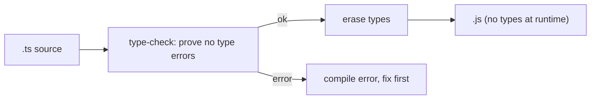

## Problem

JavaScript has no compile-time guarantees. `user.adress` (typo) or `"5" - 1` blow up at runtime. The problem for TypeScript's designers: add a checker that proves whole classes of bugs are gone before running, without changing the runtime behavior.

The solution adds a structural type layer over JS values, fully erased at compile time. "Structural" means a value fits a type if its shape matches (it has the right members), not by name or declaration. But this type system has its own complexity: generics, mapped types, conditional types, and a learning curve that makes many developers reach for `any` instead of learning the model.

## Why Existing Solution Failed

Before TypeScript, JavaScript had no compile-time type checking. Teams used JSDoc comments as documentation, but no tool enforced them. PropTypes added runtime checking for React components, but only in development mode. Flow was Facebook's answer, but it never gained mainstream adoption.

TypeScript won because it added a structural type system that integrates well with JS ecosystems and provides excellent editor tooling. But its type system is complex. Developers often use `any` to bypass the checker, losing all safety. They model state with optional fields that allow contradictions. They write over-generic code that adds noise without adding safety. The existing informal solutions (JSDoc, PropTypes) failed because they were not enforced at compile time.

## Mental Model

A type is a SET of possible values. `string` is the set of all strings. `42` is a set with one element. `"a" | "b"` is a two-element set. `boolean` is `true | false`. Assignability is the subset question: is A's set a subset of B's set?

Generics are FUNCTIONS at the type level. They take types in and return types out. The whole type system is set theory plus functions over sets, checked at compile time and erased at runtime.

Key ideas:
- Type = set of values. Assignable = subset.
- Union `A | B` = set union (wider, fewer guarantees). Intersection `A & B` = must be both (narrower, more guarantees).
- `unknown` = the universal set (everything, but you must narrow before use). `never` = empty set (nothing, the impossible or exhaustiveness type). `any` = opt out of the system.
- Generics = functions from types to types. `Array<T>` is a type-level function call.
- Types are erased at runtime. No type info exists in the running JS.

## Visualization



TypeScript compiles to JavaScript. Types are checked and then removed. No runtime overhead. No runtime type information.

The lattice of types:

```
             unknown   (universal set, everything is assignable TO it, nothing FROM it without narrowing)
            /   |   \
         string number boolean ...        each a subset of unknown
            \   |   /
              never     (empty set, assignable to EVERYTHING, nothing assignable to it)

   any  =  escape hatch: assignable both ways, turns checking OFF (avoid)
```

## Engine Simulation

**Sets, narrowing, and the lattice.**

```ts
type Status = "idle" | "loading" | "error" | "success";  // a 4-element set
let s: Status = "loading";  // ok: "loading" is a subset of Status
// s = "done";              // wrong: "done" is not in the set

function f(x: string | number) {
  // here x is in (string ∪ number); .toUpperCase() needs string only
  if (typeof x === "string") {
    // NARROWED: in this branch x's set is reduced to string -> string methods allowed
    return x.toUpperCase();
  }
  return x.toFixed(2);  // here x narrowed to number
}
```

What happens internally: TypeScript tracks the type of `x` through control flow. Before the `if`, `x` is `string | number`. Inside the `if` branch, TypeScript narrows `x` to `string` using the `typeof` check. This is called type narrowing. TypeScript understands `typeof`, `instanceof`, `in`, discriminated union checks, and custom type guards. Each narrowing reduces the set of possible values.

**`never` as exhaustiveness check.**

```ts
function render(s: Status) {
  switch (s) {
    case "idle": case "loading": case "error": case "success": return /* ... */;
    default: const _exhaustive: never = s;  // if a new Status is added, this errors
  }
}
```

What happens internally: The `default` branch should never execute if all cases are handled. By assigning `s` to a `never` variable, TypeScript checks that `s` has been narrowed to `never` (the empty set). If you add a new status like `"paused"` and forget to handle it, `s` in the default branch would be `"paused"`, which is not assignable to `never`. The compiler errors. This is an exhaustiveness check.

**Discriminated unions: make illegal states impossible.**

```ts
// Bad: allows nonsense like loading:true with data present, or error with data
type Bad = { loading: boolean; data?: Contact[]; error?: Error };

// Good: a tagged union, each variant carries exactly its valid fields
type State =
  | { status: "loading" }
  | { status: "error"; error: Error }
  | { status: "success"; data: Contact[] };
```

What happens internally: `State` is a union of three object types. Each has a `status` field with a literal type. The literal `"loading"`, `"error"`, `"success"` are each a set of one string value. TypeScript knows they are disjoint. When you check `state.status === "success"`, TypeScript narrows the union to only the `{ status: "success"; data: Contact[] }` variant. Inside that branch, `state.data` is typed as `Contact[]` and `state.error` is a compile error. Illegal combinations cannot be constructed.

**Generics as type-level functions.**

```ts
function first<T>(arr: T[]): T | undefined { return arr[0]; }
first([1, 2, 3]);      // T inferred as number -> returns number | undefined
first(["a"]);          // T inferred as string

// constraints = restrict the input set
function pluck<T, K extends keyof T>(obj: T, key: K): T[K] { return obj[key]; }
pluck({ name: "Ada", age: 36 }, "age");  // K is a subset of ("name"|"age"); returns number
```

What happens internally: `T` is a type parameter. When you call `first([1,2,3])`, TypeScript infers `T = number`. It substitutes `number` for `T` in the return type, giving `number | undefined`. `extends` constrains which types are allowed. `K extends keyof T` means K must be a subset of the keys of T. TypeScript checks the argument against this constraint at the call site.

Typing a generic React component:

```ts
type Column<T> = { key: keyof T; header: string; render?: (row: T) => ReactNode };
function Table<T>({ rows, columns }: { rows: T[]; columns: Column<T>[] }) { /* ... */ }
// <Table rows={contacts} columns={...}/> -- T inferred as Contact, keys checked
```

## Internal Implementation

**Structural typing.** TypeScript checks types by shape, not by name. Two interfaces with the same members are compatible even if they have different names. This is different from nominal type systems (Java, C#) where the name matters. Structural typing means a value fits a type if it has the right members, regardless of what it was declared as.

**Type erasure.** TypeScript compiles to JavaScript by removing all type annotations. No generics, no interfaces, no type aliases exist at runtime. `Array<number>` becomes `Array`. `type Foo = { bar: string }` becomes nothing. This means you cannot check types at runtime. If you need runtime validation, use a schema library like zod (Ch 18) at the data boundary.

**Compiler phases.** TypeScript compiles in phases:
1. Scanner: tokenizes source code.
2. Parser: builds AST.
3. Binder: creates symbols and scopes.
4. Checker: type-checks using the set model.
5. Emitter: generates JS output (with types erased).

The checker phase uses control flow analysis for narrowing, type inference for generics, and the structural type system for assignability.

**Utility types are derived, not memorized.** They are just mapped and conditional types (functions over the members of a type):

```ts
type Partial<T>  = { [K in keyof T]?: T[K] };        // map each key to optional
type Required<T> = { [K in keyof T]-?: T[K] };        // remove optional
type Readonly<T> = { readonly [K in keyof T]: T[K] };
type Pick<T, K extends keyof T> = { [P in K]: T[P] }; // keep only keys in K
type Record<K extends keyof any, V> = { [P in K]: V };
type ReturnType<F> = F extends (...a: any[]) => infer R ? R : never;  // conditional + infer
```

Read `ReturnType` as: "if F is a function type, capture its return as R and return it. Otherwise return `never`." `infer` binds a type variable inside a conditional. Once you can read these, you never memorize the utility list. You reconstruct it.

## Real World Example

**Data fetching hook with discriminated union.**

A typical component needs to handle loading, error, and success states. Using optional fields allows contradictions.

```ts
// Bad pattern: allows impossible states
function useContacts() {
  const [state, setState] = useState<{
    data?: Contact[];
    error?: Error;
    loading: boolean;
  }>({ loading: true });

  // Bug: setState({ loading: false, data: [] })  -- forgot to clear error
  // Bug: setState({ loading: true, error: new Error() })  -- loading with error

  return state;
}
```

What happens internally: TypeScript allows these calls because every field is optional (except `loading`). It cannot know that `loading: true` should exclude `data`, or that `error` and `data` should be mutually exclusive.

Fix with a discriminated union:

```ts
type State =
  | { status: "loading" }
  | { status: "error"; error: Error }
  | { status: "success"; data: Contact[] }
  | { status: "idle" };

function useContacts() {
  const [state, setState] = useState<State>({ status: "idle" });

  // TypeScript now prevents contradictory states
  // setState({ status: "loading", data: [] })  // compile error: data does not exist on loading
  // setState({ status: "success" })            // compile error: data is required

  return state;
}
```

What happens internally: Each variant is a separate type in the union. TypeScript checks that you provide exactly the fields for that variant. The compiler enforces that you cannot construct an illegal state. When you consume `state`, you must check `status` first to narrow to the correct variant.

```ts
function ContactsList() {
  const state = useContacts();

  if (state.status === "loading") return <Spinner />;
  if (state.status === "error") return <Error msg={state.error.message} />;
  if (state.status === "success") return <Table data={state.data} />;
  return null; // idle
}
```

What happens internally: Each `if` check narrows `state` to one variant. Inside the `"success"` branch, `state.data` is typed as `Contact[]`. Inside `"error"`, `state.error` is typed as `Error`. The compiler guarantees you cannot access properties that do not exist on the narrowed type.

## Tradeoffs

**`any` vs `unknown` vs `never`.** `any` opts out of the type system entirely. It is assignable both ways, so it disables checking and lets runtime bugs through. `unknown` is the universal set. You can assign anything to it, but you must narrow it before use. Safety is preserved. `never` is the empty set. Nothing is assignable to it except `never` itself. Use it for exhaustiveness checks. Prefer `unknown` over `any` in almost all cases.

**Discriminated unions vs optional fields.** Optional fields allow contradictory states. Discriminated unions enforce mutual exclusion. The cost is more boilerplate: you need a discriminant field and separate variants. The benefit is compile-time safety. Always prefer discriminated unions for state that has distinct phases.

**Structural vs nominal typing.** Structural typing is flexible and works well with JS patterns like duck typing. Nominal typing catches more accidental type matches (e.g., two types with same shape but different semantics). TypeScript uses structural typing. If you need nominal behavior, use brands: `type Brand<T, B> = T & { __brand: B }`.

**Generics vs `any`.** Generics preserve type relationships between parameters and return values. `any` breaks them. Use generics when types relate. Add constraints with `extends` to limit what types are accepted. Avoid generics that have no relationship between parameters; they add noise without safety.

**Type safety vs runtime validation.** Types are erased at runtime. A type check at compile time does not guarantee runtime correctness for data coming from outside the program (API responses, user input, localStorage). Always validate external data with a runtime schema (zod, Ch 18) at the boundary.

## Common Mistakes

- **Reaching for `any`** to silence errors. Use `unknown` with narrowing, or fix the type.
- **Optional-field state** that allows contradictions instead of a discriminated union.
- **Over-generic code.** Generics with no relationship between params just add noise. Only generalize when types actually relate.
- **Confusing type-space and value-space.** `typeof` and `keyof` are type-level. They are erased at runtime.
- **Trusting types at runtime.** Types are erased. Validate external data with a runtime schema (zod, Ch 18) at the boundary.

## SDE-2 Interview Answer (Mid-level + Senior + Engineering Lead variants)

**Mid-level (SDE-1 / junior SDE-2):**

Question: "Why is `any` bad but `unknown` fine?"

"`any` opts out of the type system. It is assignable both directions, so it disables checking and lets runtime bugs through. `unknown` is the universal set. You can assign anything to it, but you must narrow it before use. Safety is preserved. `unknown` is the safe top type. `any` is a hole."

**Senior (SDE-2 / SDE-3):**

Question: "How do you model a fetch state so impossible combinations cannot exist?"

"Use a discriminated union on a `status` tag. Each variant carries exactly the fields valid for that state. Checking the tag narrows the union to one variant. Fields only exist where valid. This eliminates nonsense like `loading && error && data` coexisting. The compiler enforces that you handle every state. This is the single most useful TypeScript pattern for React."

**Engineering Lead (Staff / Principal):**

Question: "How do you introduce TypeScript to a team that has been using plain JS for years?"

"Start with the set model: types are sets, assignability is the subset question. This one insight makes the type system predictable instead of magical. Introduce discriminated unions first, because they solve the most common React state bugs. Then generics, because they make reusable components safe. Teach narrow-before-use as a reflex. Establish conventions: no `any` in shared code, discriminated unions for fetch state, `unknown` for third-party data with runtime validation at the boundary. Set up strict mode in tsconfig from day one. Lint against `any` and `as` casts. Build a small library of shared types and utility types the team can reference. Pair on the first few generic components. Once the team internalizes the set model, they stop fighting the type system and start letting it catch bugs."

## Follow-up Questions (5, progressively harder)

1. Explain assignability for `"a" | "b"` vs `string`. Which way does it go and why?
   _(Tests basic subset understanding. `"a"|"b"` is a subset of `string`, so assignable to `string` but not the reverse.)_

2. Place `any`, `unknown`, `never` in the lattice. Give a real use for `never`.
   _(Tests understanding of the type hierarchy. `never` for exhaustiveness checks.)_

3. Model a contacts-fetch state as a discriminated union. Show narrowing.
   _(Tests ability to apply discriminated unions to a concrete React pattern.)_

4. Write `pluck<T, K extends keyof T>` and explain the constraint. Why does `extends` matter?
   _(Tests understanding of generic constraints and type-level functions.)_

5. Implement `ReturnType<F>` from scratch. Read it aloud explaining `infer`.
   _(Tests ability to derive utility types from conditional and mapped types.)_

## Mental Trigger

**Types are sets. Assignability is the subset question. Generics are type-level functions.**

## One Page Revision

- Types are sets of values. Assignability is the subset question.
- Union `A | B` = wider (fewer guarantees). Intersection `A & B` = narrower (more guarantees).
- `unknown` = universal set (assign anything to it, narrow before use).
- `never` = empty set (exhaustiveness checks, nothing is assignable to it except `never`).
- `any` = opt-out. Avoid it. Use `unknown` instead.
- Discriminated unions use a literal tag field. Checking the tag narrows to one variant. Illegal states cannot be represented.
- Generics = type-level functions. `extends` constrains the input set.
- Utility types (`Partial`, `Pick`, `Record`, `ReturnType`) are mapped and conditional types. Derive them, do not memorize them.
- Structural typing: shape matters, not name.
- Types are erased at runtime. Validate external data with zod (Ch 18) at the boundary.
- `infer` binds a type variable inside a conditional type.
- Control flow narrowing: `typeof`, `instanceof`, `in`, discriminated union checks all narrow types.
