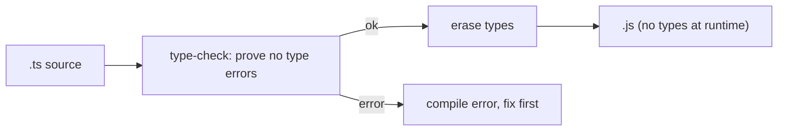

## Why This Matters

You find a production bug: `Cannot read property 'name' of undefined`. A typo — `user.adress` instead of `user.address`. JavaScript didn't catch it because it doesn't check types until runtime. By then, users have already seen the crash.

TypeScript catches these bugs before your code ever runs. But its type system has its own complexity. Understanding the mental model underneath — not memorizing syntax — is what separates useful TypeScript from noisy TypeScript.

## The Core Idea

**Types are sets of values. Assignability is the subset question.**

`string` is the set of all strings. `42` is a set with one element. `"a" | "b"` is a two-element set. When TypeScript asks "can A be assigned to B?", it's really asking: "Is A's set a subset of B's set?"

Everything else — generics, utility types, conditional types — is just functions operating on these sets.



TypeScript compiles to JavaScript. Types are checked and removed. Zero runtime overhead.

## Narrowing: Reducing the Set

When you have a union like `string | number`, TypeScript tracks the type through control flow. Each check shrinks the set:

```ts
function process(x: string | number) {
  if (typeof x === "string") {
    // narrowed: x is string here
    return x.toUpperCase();
  }
  return x.toFixed(2);  // narrowed: x is number here
}
```

The `typeof` check tells TypeScript to remove everything that isn't `string` from the set inside that branch.

## Discriminated Unions: Making Illegal States Impossible

Optional fields let you represent contradictions — `loading: true` with `data` present, or `error` set alongside `success`. Discriminated unions prevent this:

```ts
// Bad: allows impossible combinations
type Bad = { loading: boolean; data?: Contact[]; error?: Error };

// Good: each variant carries exactly its valid fields
type State =
  | { status: "loading" }
  | { status: "error"; error: Error }
  | { status: "success"; data: Contact[] };
```

When you check `state.status === "success"`, TypeScript narrows to the `success` variant. Accessing `state.error` becomes a compile error. Illegal combinations simply cannot be constructed.

```ts
function render(state: State) {
  if (state.status === "loading") return <Spinner />;
  if (state.status === "error") return <Error msg={state.error.message} />;
  if (state.status === "success") return <Table data={state.data} />;
}
```

## Generics: Functions at the Type Level

Generics take types in and return types out — like functions, but for the type system:

```ts
function first<T>(arr: T[]): T | undefined {
  return arr[0];
}

first([1, 2, 3]);  // T inferred as number → returns number | undefined
first(["a"]);      // T inferred as string
```

The `extends` keyword constrains the input set:

```ts
function pluck<T, K extends keyof T>(obj: T, key: K): T[K] {
  return obj[key];
}

pluck({ name: "Ada", age: 36 }, "age");  // K is "age", returns number
// pluck({ name: "Ada" }, "email");     // compile error: "email" not in keyof
```

`K extends keyof T` means K must be a subset of T's keys. The constraint makes the function safe.

## Utility Types: Derived, Not Memorized

Every utility type is just a mapped or conditional type. Read them as functions:

```ts
type Partial<T>  = { [K in keyof T]?: T[K] };           // make all keys optional
type Pick<T, K extends keyof T> = { [P in K]: T[P] };    // keep only keys in K
type ReturnType<F> = F extends (...args: any[]) => infer R ? R : never;
```

Read `ReturnType` aloud: "If F is a function, capture its return type as R and return it. Otherwise return `never`." The `infer` keyword binds a type variable inside a conditional. Once you can read these, you reconstruct any utility type on demand.

## never: The Empty Set

`never` is the empty set — nothing is assignable to it. Use it for exhaustiveness checks:

```ts
type Status = "idle" | "loading" | "error" | "success";

function handle(s: Status) {
  switch (s) {
    case "idle": return "waiting";
    case "loading": return "pending";
    case "error": return "failed";
    case "success": return "done";
    default: const _exhaustive: never = s;
    // Add "paused" to Status? This line errors — reminding you to handle it.
  }
}
```

## The Type Lattice

```
             unknown   (assign anything TO it, narrow before using)
            /   |   \
         string number boolean ...   subsets of unknown
            \   |   /
              never     (assignable to EVERYTHING, nothing to it)

   any  =  escape hatch: turns checking off (avoid it)
```

Prefer `unknown` over `any` in almost all cases. `unknown` preserves safety — you must narrow before use. `any` lets anything through.

## Types Are Erased at Runtime

`Array<number>` becomes `Array` in the output. Interfaces disappear. This means TypeScript types cannot protect you at runtime. For external data — API responses, user input, localStorage — use a runtime schema validator like zod at the boundary.

## Q&A

**1. Why is `any` bad but `unknown` fine?**

`any` turns off the type checker entirely — bugs slip through at runtime. `unknown` is the safe top type: anything can be assigned to it, but you must narrow it before use. The compiler still protects you.

**2. When should I use a discriminated union over optional fields?**

When state has distinct phases with different data. Optional fields allow contradictions you'll only find at runtime. Discriminated unions enforce mutual exclusion at compile time.

**3. What does `infer` do in a conditional type?**

It binds a type variable inside a type-level pattern match. TypeScript tries to match the input against the pattern, and if it succeeds, captures the matched portion as a new type you can use.

**4. Why do types disappear at runtime?**

TypeScript is a compile-time overlay on JavaScript. It checks your code, then strips all type annotations and outputs plain JavaScript. This means you can't do `if (typeof x === 'Contact')` at runtime — types don't exist there.

## Mental Trigger

**Types are sets. Assignability is the subset question. Generics are type-level functions.**
