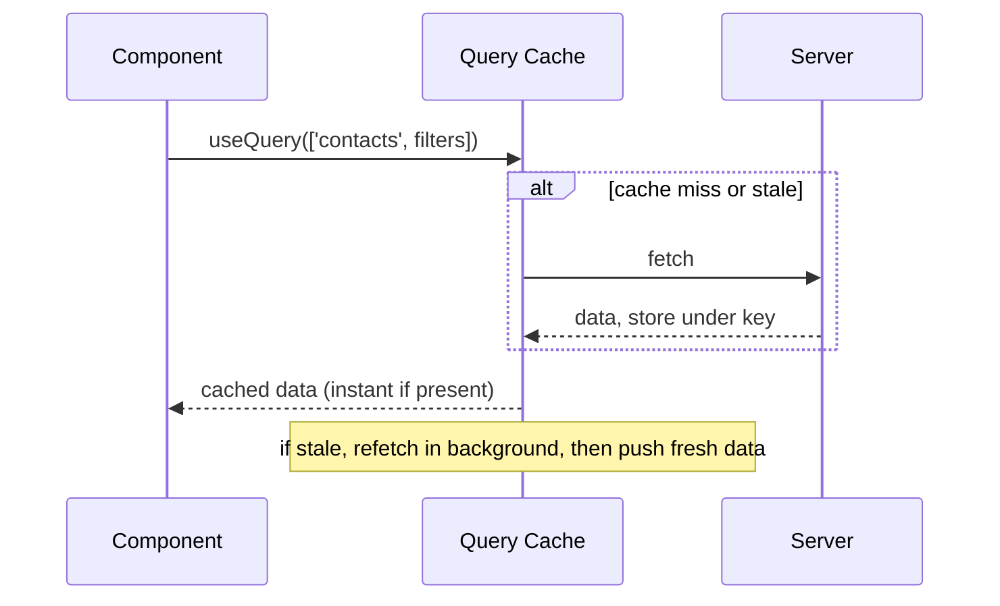
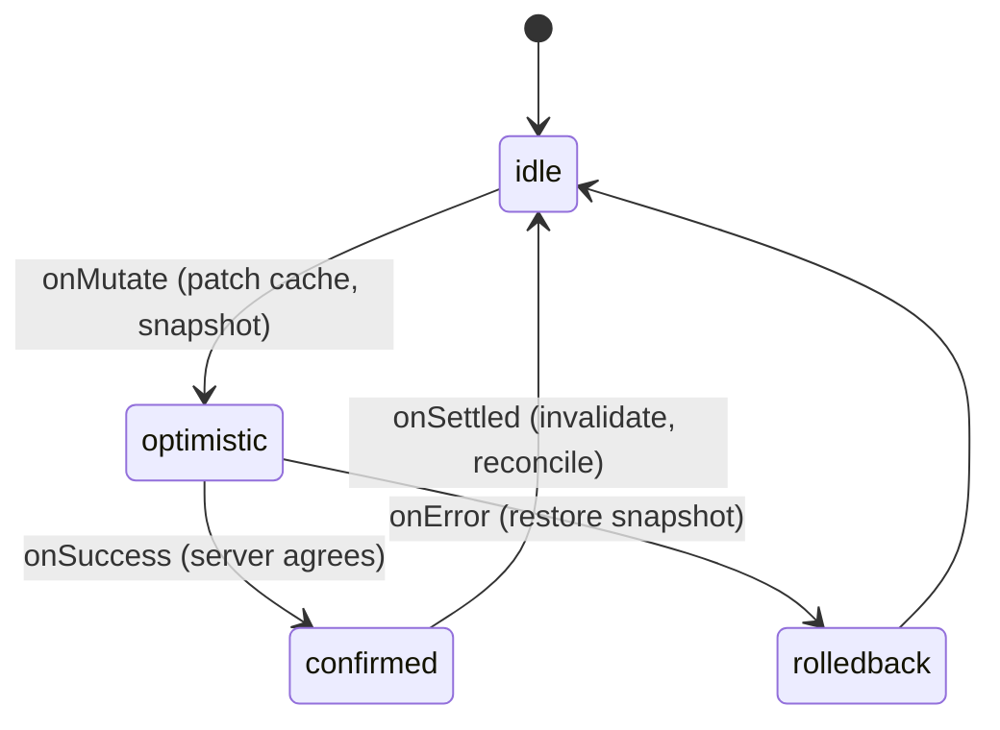

> Prerequisites: async/await, Promise execution, event loop; `useState` and re-render mechanics; `useEffect` lifecycle and stale closures. JD-critical: this company lists TanStack Query twice. It is the data layer behind Interviewer's contacts table.

## The Problem

Every component that fetches data repeats the same pattern. `useEffect` with `fetch` inside. Three `useState` calls for data, loading, error. No sharing between components. Two components mounted at the same time fire two identical requests. Remount after navigation fires another request. No cache. No retry. No background refresh. The code is repetitive, bug-prone, and wasteful.

Sound familiar? You've probably built this at least once:

```jsx
const [data, setData] = useState(null);
const [loading, setLoading] = useState(true);
const [error, setError] = useState(null);

useEffect(() => {
  fetchContacts(filters, page)
    .then(setData)
    .catch(setError)
    .finally(() => setLoading(false));
}, [filters, page]);
```

This works until it doesn't. The moment you have two components needing the same data, or the user navigates away and comes back, or you want to refresh in the background — you're in trouble.

## Why Existing Solution Failed

The `useState` + `useEffect` pattern treats server data as if it's local state. It's not. Server data is remote, shared across components, asynchronous by nature, and can go stale at any moment.

Local state belongs to one component. Server data belongs to the entire application. When you hand-roll this, you're essentially reimplementing a cache badly in every single component. You get no deduplication, no garbage collection for unused entries, no way to invalidate across components, and stale-closure bugs when the effect captures outdated variables.

Think of it like this: if three components all need the same user profile, with hand-rolled fetch you'll make three network requests, each storing their own copy, each going stale independently, and none of them knowing the others exist.

## Mental Model

Here's the one thing to remember: **server state is a cache, not local state.**

That's it. That's the insight that justifies the entire library. Server data lives on someone else's machine. It can go stale at any moment. You don't own it — you're just holding a copy. So you don't store it in `useState`. You cache it, keyed by what you asked for (the query key). You adopt a policy: show the cached copy instantly, and revalidate in the background.

This is called **stale-while-revalidate**. And TanStack Query is that cache plus that policy engine. Every feature (staleTime, gcTime, refetch, invalidation, optimistic updates) is just a knob on "how fresh must this cached copy be, and when do I re-ask?"

Key terms:
- **Query key = cache key.** Same key means same cached entry, deduped across components. If Component A and Component B both use `['contacts']`, they share one cache entry and one fetch.
- **stale-while-revalidate:** serve cache now, refetch in background, swap when fresh arrives. The user sees stale data instantly, then fresh data when it's ready.
- **staleTime** = how long data stays fresh (no refetch). **gcTime** = how long an unused entry stays in memory before garbage collection. These are different axes — one controls freshness, the other controls memory.

## Visualization



Think of the query cache like a browser cache, but for your app's data. When a component asks for data, the cache checks: "Do I have this? Is it fresh?" If yes, instant return. If stale or missing, fetch in background while still showing what we have.

Mutation lifecycle with optimistic update:



## Engine Simulation

Track what happens with this code:

```jsx
const { data, isLoading, isFetching } = useQuery({
  queryKey: ['contacts', { filters, page }],
  queryFn: () => api.getContacts(filters, page),
  staleTime: 30_000,
  gcTime: 5 * 60_000,
});
```

Execution trace:

**Mount #1:** Key `['contacts',{...}]` not in cache. TanStack calls queryFn. Fetch fires. Response arrives. Stored under key with status 'success'. isLoading flips true to false. data renders.

**Remount within 30 seconds:** Key present and fresh (within staleTime). Serve cache instantly. No fetch. Component renders immediately.

**Remount after 30 seconds:** Key present but stale. Serve cache instantly for instant render. Then refetch in background. isFetching is true during background fetch. data stays visible. When fresh data arrives, swap in. isFetching goes false.

**Component unmounts:** Entry becomes inactive. gcTime timer starts. 5 minutes pass with no observers. Entry garbage collected.

Two timers explained:
- **staleTime** controls refetching. High staleTime means fewer network requests. Think of it as "how old is too old?"
- **gcTime** controls memory. It determines how long an unused entry survives so a remount can be instant. Think of it as "how long do we keep this around?"

**isLoading vs isFetching:** isLoading is true only on first load when no data exists yet. isFetching is true during any fetch in flight, including background revalidation while showing stale data. Show a subtle spinner on isFetching but keep content on data. This is the stale-while-revalidate UX — the user never sees a loading spinner for data they've already seen.

## Internal Implementation

TanStack Query maintains a JavaScript object acting as a map of query keys to cache entries. Each entry holds the data, status, and metadata (staleTime, gcTime, subscribers). When useQuery mounts, it subscribes to the cache entry for its key. If the entry exists and is fresh, it returns the data immediately. If it is stale or missing, it schedules a fetch.

The fetch internally calls the queryFn, awaits the response, and stores the result in the cache entry. All subscribers (components using that key) receive the new data and re-render. This is a publish-subscribe pattern. The cache entry tracks subscriber count. When count hits zero (all components unmounted), the gcTime timer starts. When it fires, the entry is removed from the map.

Invalidation sets the entry's stale flag. Next subscriber check sees the stale flag and triggers a refetch. Optimistic updates directly call setQueryData on the entry, which pushes the patched data to all subscribers.

## Real World Example

Interviewer's contacts table shows a list of contacts fetched from the server. The user can edit a contact's status inline. With 500,000 rows, refetching on every status change is too expensive.

The solution uses two strategies. For simple cases, call invalidateQueries after the mutation. This marks the contacts cache stale. Next time a component reads it, it refetches. For instant UX, use an optimistic update (see Ch 33 for the full code example with cancelQueries, snapshot, setQueryData, rollback, and onSettled).

For the infinite scrolling contacts list, useInfiniteQuery holds fetched pages in the cache. A virtualizer (react-virtual or similar) renders only visible rows in the DOM. The query cache is the data layer. The virtualizer is the view layer. Real-time status events call setQueryData to patch a single row. If visible, it re-renders in place. If off-screen, it is correct when scrolled to.

## Tradeoffs

TanStack Query adds bundle size (roughly 10KB gzipped). For a simple app with one or two fetch calls, it might be overkill. You can use plain fetch plus useEffect. But as the app grows, the hand-rolled approach costs more in bugs and maintenance than the library overhead.

staleTime and gcTime need tuning. Too short staleTime means too many requests. Too long staleTime means stale data. gcTime that is too short means frequent refetches on remount. gcTime that is too long wastes memory for data no one views.

Optimistic updates add complexity. You need cancelQueries, snapshot, rollback, and reconcile. For simple mutations, invalidate alone is simpler and safer.

## Common Mistakes

- Putting server data in Redux or useState. You reimplement TanStack badly.
- Confusing staleTime and gcTime. staleTime controls freshness (refetching). gcTime controls memory (how long unused entries survive).
- Unstable query keys. New object identity that represents the same query causes cache misses. Missing a variable the query depends on causes stale data.
- Optimistic update without cancelQueries. An in-flight refetch overwrites your patch.
- Forgetting rollback on error. The UI then shows incorrect data.

## SDE-2 Interview Answer

**Mid-level variant:**
"Server data is different from client data because it is shared, async, and can go stale. useState and useEffect hand-rolling means no caching, no dedup, and stale-closure bugs. TanStack Query wraps fetch in a cache keyed by the query key. It serves cached data instantly and refetches in the background when stale. staleTime controls how long data is fresh. gcTime controls how long unused data stays in memory."

**Senior variant:**
"I frame server state as a cache, not local state. The query key is the cache identity. Two identical keys in different components share one cache entry and one fetch. staleTime and gcTime are orthogonal controls: one for request frequency, one for memory. For mutations, I use invalidation for simple cases and optimistic updates for instant UX on large lists. The optimistic pattern requires four steps: cancelQueries to stop races, snapshot for rollback, setQueryData for the patch, and onSettled invalidate for reconciliation. I pair useInfiniteQuery with virtualization for large lists, giving clean separation between data layer and view layer."

**Engineering Lead variant:**
"At the team level, I establish a pattern: server state always goes through TanStack Query, never into Redux or useState. The team uses consistent staleTime and gcTime defaults based on data freshness requirements. Optimistic updates are documented with a template showing cancel, snapshot, patch, and rollback. Code review catches unstable query keys. The architecture separates data fetching (TanStack Query) from state management (Zustand for client state) from UI components, keeping each layer replaceable. I also ensure the team understands the cache lifecycle so they debug cache issues instead of working around them."

## Follow-up Questions

1. Why is server state different from client state? Give three properties.

Server state has three properties that make it fundamentally different from client state. First, it is **remote** — the data lives on someone else's server, not in your browser. You're holding a copy that can become stale the moment after you fetch it. Second, it is **shared** — multiple components across your app (and even multiple users) read and write the same data. When Component A updates a contact's status, Component B must reflect that change. Local state belongs to one component; server state belongs to the whole application. Third, it is **asynchronous** — you can't read it synchronously like a variable. Every access requires a network round trip with latency, potential failure, and race conditions. These three properties are why `useState` + `useEffect` breaks down: it doesn't deduplicate, doesn't share across components, and doesn't handle staleness or background refetching.

2. Walk the cache lifecycle of a query across mount, remount-fresh, remount-stale, and unmount.

**Mount (cache miss):** Component mounts, calls `useQuery(['contacts'])`. Key not found in cache. TanStack Query fires the `queryFn`. While fetching, `isLoading` is true and `data` is undefined. Response arrives, stored under the key with status `success`. `isLoading` flips false, `data` renders. **Remount-fresh (within staleTime):** Key is present and fresh. Cache serves data instantly. No network request. `isLoading` is false immediately. The user sees data with zero delay. **Remount-stale (past staleTime):** Key is present but stale. Cache serves the stale data instantly for the initial render. Simultaneously, a background refetch fires. `isFetching` is true during this background fetch. When fresh data arrives, it replaces the stale data and all subscribers re-render. `isFetching` goes false. The user never sees a loading spinner — just a seamless update. **Unmount:** All subscribers detach. `gcTime` timer starts (default 5 minutes). If no component re-mounts and subscribes within that window, the entry is garbage collected from the map. If a component re-mounts before gcTime fires, the stale data is still there for instant rendering.

3. Implement an optimistic status toggle with rollback. Why must you call cancelQueries first?

```ts
useMutation({
  mutationFn: (newStatus) => api.updateContactStatus(contactId, newStatus),
  onMutate: async (newStatus) => {
    await queryClient.cancelQueries({ queryKey: ['contacts'] });
    const previous = queryClient.getQueryData(['contacts']);
    queryClient.setQueryData(['contacts'], (old) =>
      old.map(c => c.id === contactId ? { ...c, status: newStatus } : c)
    );
    return { previous };
  },
  onError: (err, newStatus, context) => {
    queryClient.setQueryData(['contacts'], context.previous);
  },
  onSettled: () => {
    queryClient.invalidateQueries({ queryKey: ['contacts'] });
  },
});
```

You must call `cancelQueries` first because a background refetch might be in flight. If you patch the cache while a refetch is pending, when the refetch response arrives it overwrites your optimistic patch with stale server data — the UI flickers back to the old status. Cancelling ensures no in-flight request can race against your cache mutation. The pattern is: cancel races, snapshot for rollback, patch the cache, rollback on error, reconcile on settle.

4. How do query cache and virtualization split responsibilities in the contacts list?

The query cache owns the **data layer** — fetching, storing, deduplicating, caching, and invalidating contacts data. It answers the question: "What contacts exist, and are they fresh?" Virtualization owns the **view layer** — deciding which rows to render in the DOM based on scroll position. With 500,000 contacts, the cache holds all fetched pages in memory as a JavaScript object, but the DOM only contains the ~20 rows visible on screen. When the user scrolls, the virtualizer requests rows from the cache by index. The cache doesn't know about scrolling; the virtualizer doesn't know about network requests. This separation means you can swap the data source (REST to GraphQL) without changing the virtualizer, or swap the virtualizer (react-virtual to react-window) without touching the query logic. Real-time updates patch the cache via `setQueryData` — only visible rows re-render.

5. isLoading versus isFetching. When does each fire, and how do you use them in the UI?

`isLoading` is true only on the **first load** when no cached data exists yet. It means "we have never had data for this query." Use it to show a full skeleton or loading spinner — the user has nothing to look at yet. `isFetching` is true during **any fetch in flight**, including background revalidation of stale data. It means "a request is happening." Use it for a subtle progress indicator — a thin bar at the top of the page, a pulsing dot, or nothing at all if the stale data is acceptable. The key UX insight: show a loading skeleton only when `isLoading` is true (first load). When `isFetching` is true but data exists, keep the old data visible with a subtle indicator. This is the stale-while-revalidate UX — the user never stares at a spinner for data they've already seen. Mixing them up either causes unnecessary spinners (using `isFetching` for the skeleton) or hides refreshes entirely (ignoring `isFetching`).

## Mental Trigger

Server state is a cache, not local state.

## One Page Revision

- Server state is a cache of remote data, not local state. This frame justifies the whole library.
- Query key = cache identity. Same key means dedup and sharing across components.
- stale-while-revalidate: serve cached data, refetch in background.
- staleTime controls freshness and refetching. gcTime controls how long unused cache survives in memory. They are orthogonal.
- Mutations: invalidateQueries for simple cases. Optimistic update with cancelQueries, snapshot, patch, rollback, reconcile for instant UX.
- Pair useInfiniteQuery (data layer) with virtualization (view layer) for clean separation.
- isLoading = first load, no data yet. isFetching = any fetch in flight including background revalidation.
